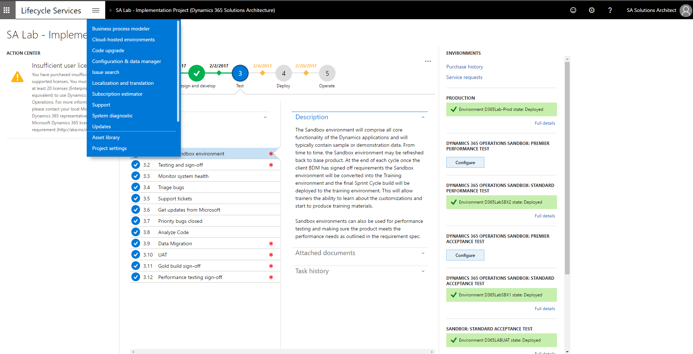
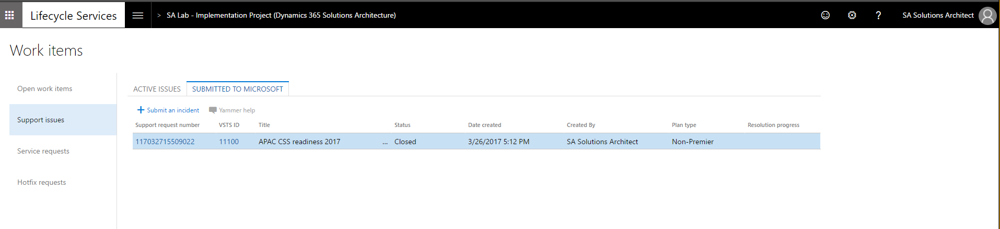
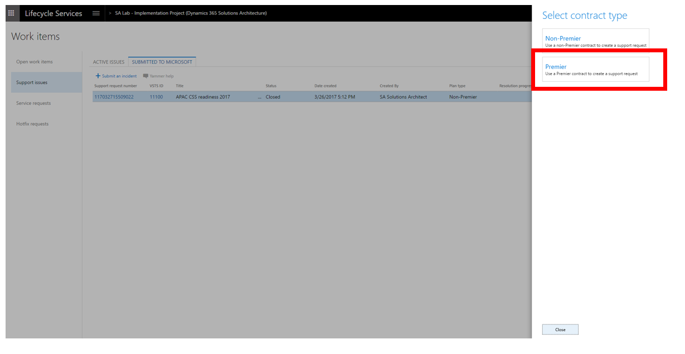
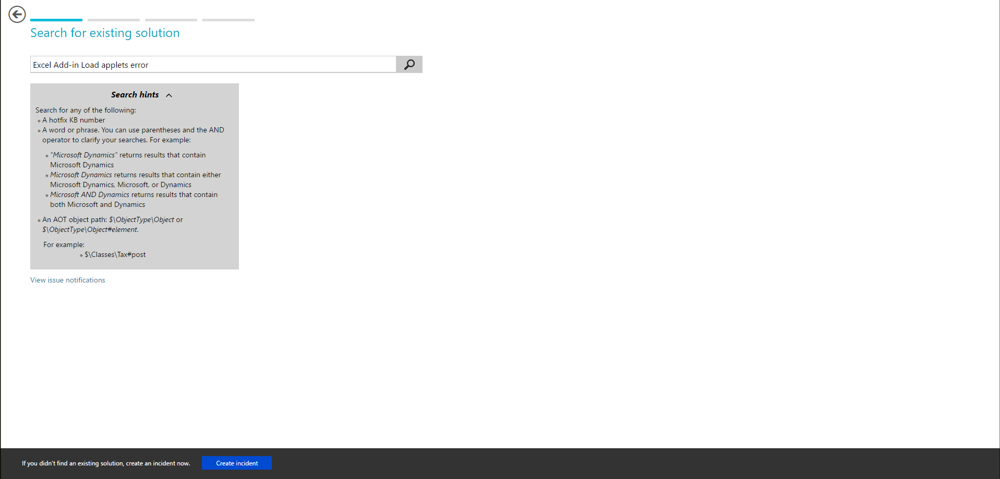
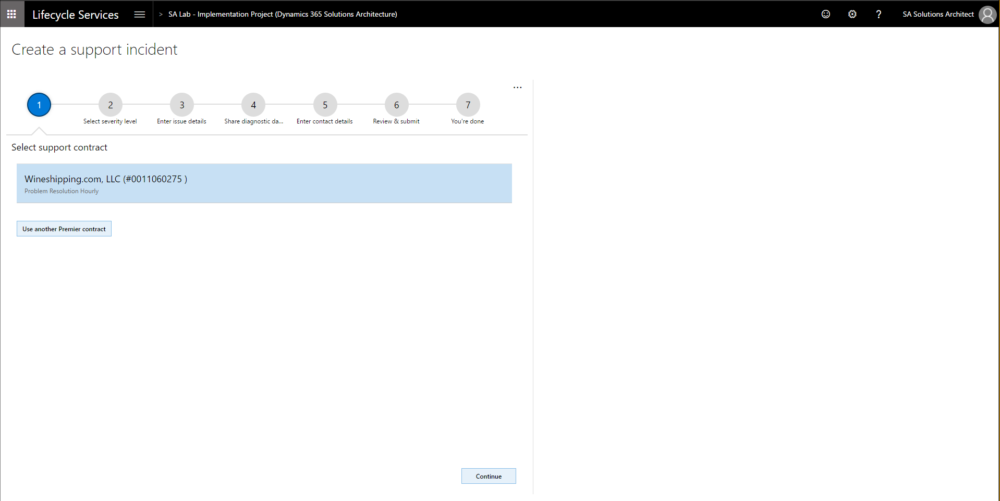
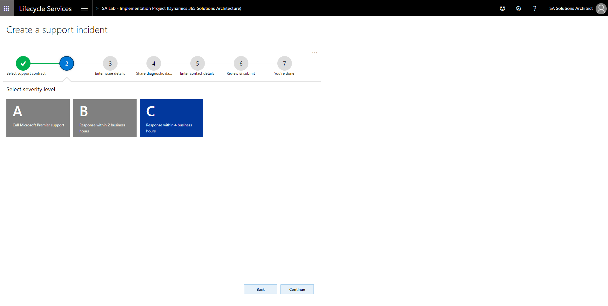
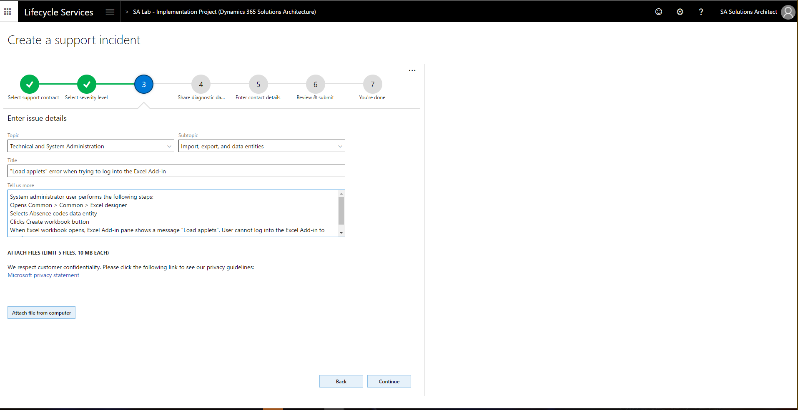
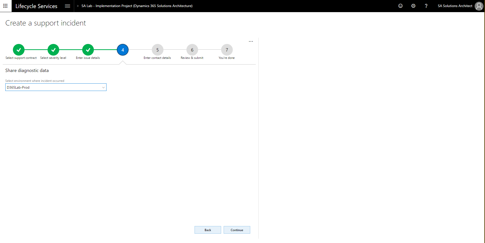
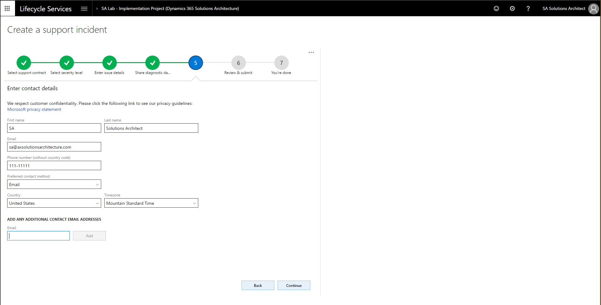
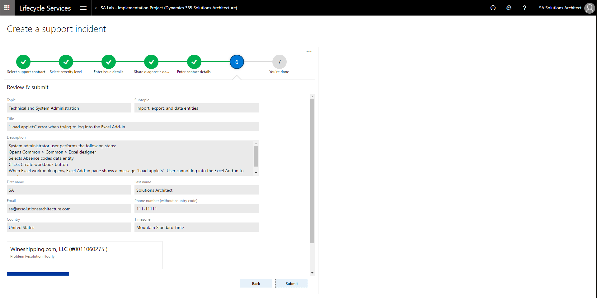

---
# required metadata

title: Log premier support tickets using Microsoft Dynamics Lifecycle Services
description: This topic shows how Microsoft Premier customers can submit a support incident for Microsoft Dynamics 365 for Operations by using Microsoft Dynamics Lifecycle Services (LCS).
author: kfend
manager: AnnBe
ms.date: 04/21/2017
ms.topic: article
ms.prod: 
ms.service: Dynamics365Operations
ms.technology: 

# optional metadata

# ms.search.form: 
# ROBOTS: 
audience: Developer, IT Pro
# ms.devlang: 
ms.reviewer: annbe
ms.search.scope: AX 7.0.0, Operations
# ms.tgt_pltfrm: 
ms.custom: 29531
ms.assetid: 2d342965-f297-42a2-b538-2f7ab77a0071
ms.search.region: Global
# ms.search.industry: 
ms.author: sigitac
ms.search.validFrom: 2016-02-28
ms.dyn365.ops.version: AX 7.0.0

---

# Log premier support tickets using Microsoft Dynamics Lifecycle Services

[!include[banner](../includes/banner.md)]

This topic shows how Microsoft Premier customers can submit a support incident for Microsoft Dynamics 365 for Operations by using Microsoft Dynamics Lifecycle Services (LCS).

1.  In LCS, use the **Support** tile to manage support incidents. To submit issues directly to Microsoft, go to the **Support** tile in your LCS project.

2. On the **Support issues** tab, select **Submitted to Microsoft**.

3. To create a new incident, click the **Submit an incident** button.

4. Select the contract type. If you select Premier, this will require an access code and password, which is provided by your contact on the Premier support team.

5. Before you submit an incident, use the Issue Search tool to search for the issue and ensure that it is not reported yet. Enter a description of the issue and click **Search**.

6. If the issue that you experience is not listed in the Issue search tool, click **Create incident** to create a new incident.

7. In the **Select support contract** window, select your support contract. Click **Continue**.

8. In the Select severity window, select the issue severity level. Selecting **Severity level A** will redirect you to a page that has the Premier support phone number, which you will need to call Support to report the issue. Severity issues B and C can be reported by continuing with this wizard.

9. In the **Enter issue details** window, describe the issue in detail. In the **Tell us more** field provide detailed repro steps of the issue, the result that you’re getting, and what result you expect to get. It’s also a good idea to attach screenshots that illustrate the problem, to do this, use **Attach file from computer**.

10. In the **Share diagnostic data** window, select the environment where the issue is occurring. 

11. In the **Enter contact details** window, enter your contact details. These contact details will be used by Support to contact you about the case.

12.	Review the incident details, and then click **Submit** to create an incident. 

