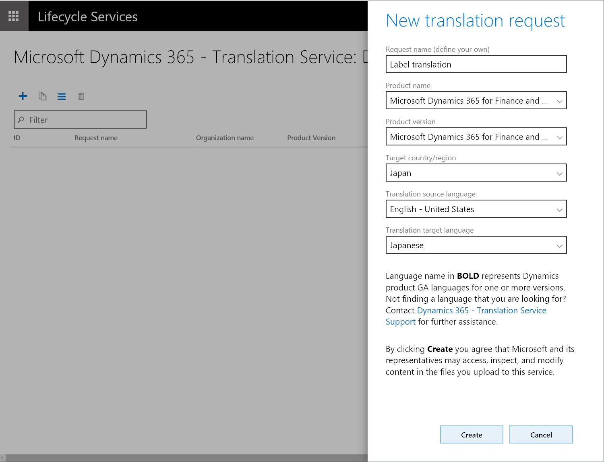

---
# required metadata

title: Microsoft Dynamics 365 Translation Service user guide
description: This topic provides information about how to use the Translation service for Microsoft Dynamics 365 products.
author: kfend
manager: AnnBe
ms.date: 09/29/2017
ms.topic: article
ms.prod: 
ms.service: dynamics-ax-platform
ms.technology: 

# optional metadata

# ms.search.form: 
# ROBOTS: 
audience: Developer, IT Pro
# ms.devlang: 
ms.reviewer: kfend
ms.search.scope: AX 7.0.0, Operations, UnifiedOperations
# ms.tgt_pltfrm: 
ms.custom: 6154
ms.assetid: 
ms.search.region: Global
# ms.search.industry: 
ms.author: ejchoGIT
ms.search.validFrom: 2016-02-28
ms.dyn365.ops.version: AX 7.0.0

---

# Microsoft Dynamics 365 Translation Service user guide 

[!include[banner](../includes/banner.md)]

## Accessing the Dynamics 365 Translation Service
There are two ways to access the Dynamics 365 Translation Service (DTS) in Lifecycle Services (LCS).  
1. From the LCS home page
2. Within an LCS project

### From the LCS jome page
Sign in to LCS, scroll to the right side of the screen. Expand the tiles waffle, and then click the **Translation service** tile to access the DTS dashboard space.  

  

### Within an LCS project
Create a new project, or open an existing one. In the project, in the **More tools ** section, click the **Translation service** tile.  

### Acessing DTS from the LCS home page vs. an LCS project
When you access DTS from the LCS home page and create a translation service request, you can select the product to use for the request. You can continue to add more requests with different products by switching the product choice without having to exit the service and access a different translation project. This is convenient when you are working on multiple product translation projects. However, because you have accessed the service outside of an LCS project, no other users can view your requests in the translation service dashboard. This option provides you with your own dashboard which shows all of the translation requests you have made across all LCS projects and from the LCS home page. The following is an example dashboard view when accessing from LCS home page.  

  

Because an LCS project is always tied to a product, any translation service request that you submit from a project will carry the product type and version information automatically from the project. You are not allowed to select a different product for the Translation service request. In an LCS project, the project owner and the users will have permission to access the Translation service dashboard and the service requests that are submitted from that project. This is useful when you work on one product translation project with a group of people in LCS. The following is an example of the dashboard view.  

## Alignment
If you have previously translated files, you can create a XLIFF TM to recycle the translated files for a newer version of source files.
The Align tool can be accessed by clicking the **Align** icon on the DTS project dashboard.  

  

When you are on the **Align** page, select the source and target languages and the files to be aligned. Click the **Align** button to complete the alignment. When the alignment is complete, a dialog box will appear. Note that you may need to explicitly allow popups in your browser.  

  

To create the best XLIFF TM, ensure that: 
- Both source and target files have the same number of resources.
- The resources are in the same order in both source and target files.
- There are no empty strings. The screenshots below show examples of empty strings from source and target. 

  

These empty strings are inherited into the XLIFF TM. **Rebate** with empty target string is likely to be translated to empty string if this XLIFF TM is used.  

  

The Align tool is smart enough to alleviate some of these issues, but it is easier to prevent them before you see the unexpected results in the output.

Review the aligned XLIFF before using it as a TM. Reviewed TUs should be marked as _Final_ or _Signed off_ so that they are not confused with unreviewed translations.  

## Creating a translation request
1. On the Translation service dashboard, click the **Add** icon to create a new translation request.  

  

2. Enter the necessary information for the request. When you select the languages, you will notice that some language names are in **bold**. Microsoft ships those languages commercially for the supported products (General Availability languages or GA languages), hence there are Microsoft trained MT systems available in those languages (trained on Dynamics terminology). For non-GA languages the MT system falls back to the general domain training.  
Please note that you will have to select **English – United States** for either source or target language to take advantage of Microsoft trained MT system on Dynamics linguistic assets.  

For example:

Source language |	Target language |	MT system to be used
--- | --- | ---
English – United States |	Japanese	| Microsoft trained MT system
Japanese |	English – United States	| Microsoft trained MT system
German	| Japanese	| Generic MT system*

*Unless the user provides XLIFF TM with more than 10,000 TUs.  

 
Click **Create**.  

## Upload the files
Click the **Plus** icon to open the **File upload** pane. You can upload a single zip file for each of two file types, Source zip file and XLIF TM zip file.  

### Source zip file
As the name implies, the source zip file is the zip file that contains all of the source files that you want to translate in the request. Different file types can be included as long as they are the supported file types for the product. For more information about supported file types, see [Supported products](./translation-service-overview.md#supported-products).  

  

### XLIFF TM zip file (Optional)
If you have XLIFF files from a previous DTS request, or you used the **Align** tool to create a XLIFF TM, you can zip the XLIFF files and then upload them. Strings that match are recycled into the new source files so that you remain consistent between product versions. Details about the XLIFF can be found in the [XLIFF TM](./use-translation-service.md#xliff-tm) section of this topic.  

  

In addition to the recycling process, DTS will use the XLIFF TM to create a customized MT system based on the following rules:

  + Either the source or the target language is Microsoft’s GA language, and the other language is **English- United States**.
  +	Either the source or the target language is not Microsoft’s GA language, AND XLIFF TM contains more than 10,000 translation units(TUs).

DTS will use general domain MT system after the recycling if either source or target language is not Microsoft’s GA language, AND XLIFF TM contains less than 10,000 translation units(TUs). This is because of the requirements set by MT Hub.
  
After the necessary files are uploaded, click **Submit** to start the translation process.

  

Note that the processing time depends on the number of requests that are in the DTS queue and the wordcount volume of the submitted files.

  +	Requests without XLIFF TM can complete in a few minutes, based on the file size.

  +	Request with XLIFF TM:
     + Creating a custom MT system takes two to three days
     + Using generic MT system can complete in a few minutes based on the file size.

## Translation complete
When the translation process is complete, you will receive an email notification. The result is available in the **Request output** section of DTS. 

 

After the translation process is done, two types of output files are availabled:  

  + Multilingual files in XLIFF format for translation review  
    Download the XLIFF file to review and edit, when necessary, the translations in this file which shows the side-by-side source and target languages.  

  + Translated file in native format (the same format to the source files)  
    Download this file if you have no intention of reviewing or editing the translations.

We recommend that you post-edit the translations in the provided XLIFF file by using the free Multilingual Editor provided or any XLIFF editor. At a minimum, you should review the translations to verify that the translation output is up to your product’s quality standard. 

## Editing the translation in XLIFF
When opened in the Multilingual editor, the XLIFF file will look similar to the following graphic.  
 
 

Note that there are red and yellow circles towards the beginning of each line indicating the state of the translation. Depending on where the translation came from, these states are automatically assigned by DTS.

+	Red circle: Text is machine translated. DTS assigns the state as _Needs Review_*

+	Yellow, Green/Yellow, Green circle: Text is recycled. DTS inherited the state from the XLIFF TM used in the request.

*Note that the state value shown may be slightly different depending on the XLIFF editor you are using.

You can apply the filter and only display the _Needs Review_ strings to verify the translation.  

  
 
Reviewed strings should be marked as _Translated_, _Final_, or _Signed off_ so that they can be used for recycling. Any translations that are marked as _Needs Review_ will not be included for recycling.

## Regenerate output files
When you are done reviewing and editing the translation files, you will need to regenerate the output files based on the changes you made in the XLIFF files.  

  

Click **Regenerate** to open the **Regenerate** pane where you can upload the edited XLIFF files. Make sure to zip the edited XLIFF files before uploading.

  

After you click **Upload**, DTS will ask you to confirm. DTS will regenerate the new output immediately after the confirmation.

  

You can repeat this regenerate process as many times as necessary.

## XLIFF TM
DTS uses a bi-lingual XLIFF format to store source and target language pairs. The XLIFF format is based on XML, therefore, you can open it with any text editor. However, we recommend using XLIFF editors that are specifically designed to work with this format. You can use Microsoft free Multilingual Editor available in the [Multilingual App Toolkit (MAT)](https://developer.microsoft.com/en-us/windows/develop/multilingual-app-toolkit).

In DTS, you can obtain a XLIFF TM in two different ways.

  +	Run the Align tool  
  When you have previously translated files and corresponding source files, you can use the Align tool to create a XLIFF TM. For more details, see the [Alignment](./use-translation-service.md#alignment) section in this topic.

  +	Complete the translation request  
  When a translation request is completed, DTS will provide you with XLIFF TMs as well as the translated files in the source format.

XLIFF files contain a series of translation units (TUs) that are extracted from the source files. The following graphic is an example of a translation unit.

  

The same translation unit looks like this in the Multilingual editor (blue highlighted). 
 
  

## State
Each translation in the XLIFF file is associated with a state value. DTS assigns these values to each translation depending on how the string is translated.
When XLIFF TM is created with the Align tool, all translations are marked as _Translated_. This is because the aligned TUs are produced from known good translations, for example a previous product version.

However, when the XLIFF files are generated as a results of a translation request, there are two types of states that may be used:

  +	_Needs Review_: The string has been machine translated.
  +	_Translated, Final_, or _Signed off_: The string has been recycled. The states were inherited from the XLIFF TM.

This helps to immediately identify the _Needs Review_ strings during the post-editing process. Post-reviewed strings should be marked as _Translated_, _Final_, or _Signed off_ so that they can be used for recycling. Translations that are marked as _Needs Review_ will not be included for recycling.

Inherited state values for recycled strings are also helpful as you will never have to review the same string (with identical ID) again. 

## Glossary

Term | Description
--- | ---
*XLIFF* | XLIFF is an XML-based format created to standardize the way localizable data are passed between tools during a localization process and a common format for CAT tool files.
*Microsoft’s GA languages* | GA means General availability of theMicrosoft produced languages depend on the product.
*TU* | Translation unit. The translation unit typically contains source string, translation, state, state qualifier, and note.

