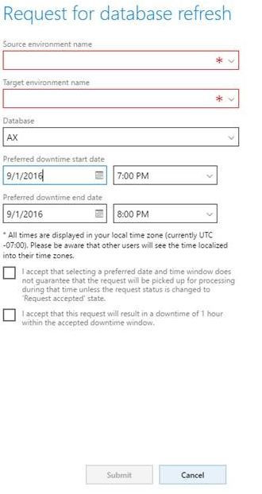
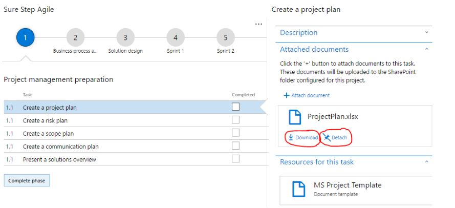
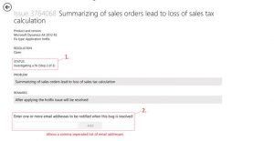
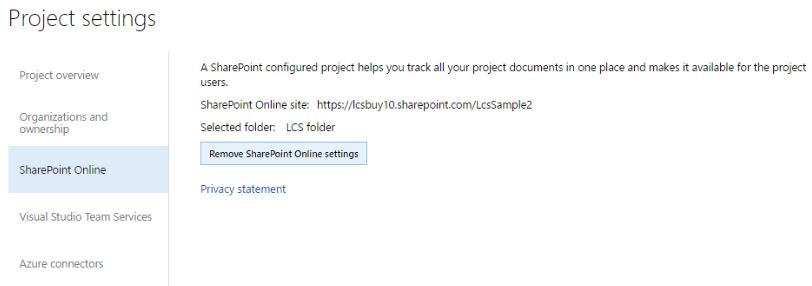

---
# required metadata

title: What's new in Lifecycle Services
description: 
author: kfend
manager: AnnBe
ms.date: 04/04/2017
ms.topic: article
ms.prod: 
ms.service: 
ms.technology: 

# optional metadata

# ms.search.form: 
# ROBOTS: 
audience: Developer, IT Pro
# ms.devlang: 
# ms.reviewer: 51
ms.search.scope: AX 7.0.0, Operations
# ms.tgt_pltfrm: 
ms.custom: 13321
ms.assetid: f9706e52-7d17-408d-9c1f-9033a50862b2
ms.search.region: Global
# ms.search.industry: 
ms.author: kfend
ms.search.validFrom: 2016-02-28
ms.dyn365.ops.version: AX 7.0.0

---

# What's new in Lifecycle Services

[!include[banner](../includes/banner.md)]

Microsoft Dynamics Lifecycle Services provides a cloud-based collaborative workspace that customers and their partners can use to manage Microsoft Dynamics AX projects from pre-sales to implementation and operations. Based on the phase of your project and the industry that you are working in, the site provides checklists and tools that help you manage the project. The site also provides a dashboard, so that you have a single location from which you can obtain up-to-date project information. Go to the Lifecycle Services [site](https://lcs.dynamics.com/en/). Read the documentation: [Lifecycle Services for Microsoft Dynamics User Guide (LCS)](lcs-user-guide.md) For more detailed information about Lifecycle Services releases, see the release posts on Lifecycle Services [blog](http://blogs.msdn.com/b/lcs/).

## September 2016
The Microsoft Dynamics Lifecycle Services team is happy to announce the immediate availability of the September release of Lifecycle Services. **NEW FEATURES** **Combined packages flow through LCS** In the September LCS release, you can now combine a maximum of 3 deployable packages into a single package that can then be deployed on the environment of your choice. This change significantly reduce the downtime resulting from the application of these packages. The following steps provide information about how to deploy the packages.

1.  Select the packages to include in the combined package, and the click **Merge**.
    -   Note: There are restrictions on the packages that can be included as part of a combined package.
        -   Only one package of each type can be selected. For example, you can only select one binary package, 1 application package, and 1 Retail package.
        -   Any packages selected for the combined package must be valid.
        -   A combined package cannot contain a combined package.

2.  In the slider that opens, enter a name and description for the new package, and then click **Confirm**. Before you can use your combined package, LCS must complete the process of merging the packages you selected into a new package. After the combined package is ready, the **Additional details** pane will show information about the package.Specifically, you can view information about:
    -   The packages used to create the combined package
    -   The service models and modules included in the combined package
    -   The validation status

    When the combined package is ready, it can be applied to an environment.
3.  On the **Environment details** page, click **Maintain** &gt; **Apply updates**.
4.  When the **Select the change type** slider opens, click **Merged package**. The **Select the Merged package to apply** slider will open. This slider shows all of the combined packages in the project that are ready to be used.
5.  Select the package that you want applied to the environment, and then click **Apply**. **Note:** Even when the child packages for a combined package have been applied on an environment, the combined package will still need to be applied on a sandbox environment. This is so that the combined package can be marked as a Release candidate and the request to apply the package on the Production environment can be made.

**Process Data Packages** When you are consuming process data packages, for example applying data packages associated with business processes, (i.e. applying data packages associated with business processes) to a Dynamics AX environment, you can select multiple packages and apply them concurrently to the destination environment. **Cloud-powered support is now Support** The **Cloud-powered support** tile has been renamed **Support**. This change has been applied to all instances of **Cloud-powered support** in LCS. This change is applicable to LCS projects for all supported Dynamics AX product versions. **Subfolders support for SharePoint Online library organization** In the September LCS release, you can now browse, upload, and download documents from subfolders in a SharePoint document library.

1.  To browse folders, from the **SharePoint Online Library** page, click on the folder name. The subfolders and documents within that folder will be shown.
2.  To download a document, click on the document name.
3.  To upload a document to a subfolder, navigate to the subfolder by clicking the name of the parent folder. 

4.  Click **Upload** to add a document to the folder. 

You can also select subfolders while attaching documents to a methodology or task.

1.  From the project dashboard, click **Attach document**. 

2.  Browse to or select folders from the list on the slider, and then click Next to upload a document to the selected folder. 

 

The document will be uploaded to the folder that you selected and attached to the methodology task item on the dashboard.

## August 2016
The Microsoft Dynamics Lifecycle Services team is happy to announce the immediate availability of the August release of Lifecycle Services. **NEW FEATURES** **Database refresh request** Starting today, when you are working in an implementation project, you can request that sandbox environments to be refreshed with DB backups directly from LCS.

1.  To submit the request, under the **Environments** heading, click **Site reliability work items**. 

2.  Click **+ Add**. 

3.  Click **Database refresh request**.
4.  Select the source environment, target environment, data, and time, and then click **Submit**. 

 

You can find the most recent status under **Service request status**.

5.  To communicate with the service engineering team, click the work item, add a comment, and then click **Submit**. 

**Methodology and SharePoint integration** In Microsoft Dynamics AX LCS projects, you can now attach documents to a methodology task. To upload a document, after you complete the SharePoint setup, select the task to which you want to upload the document and then click **Attach document**. Browse to the document and then upload it. 
 
Project team members can click **Download** to download the document. If the document is no longer relevant to the step, click **Detach** to remove the link between the document and the step. 
 
**Issue search** With the August release of LCS, the following updates to Issue search have been added:

-   View additional status details for active bugs: See when a bug is **Active**, **Investigating a fix**, or in a **Quality Assurance** step.
-   Subscribe to email notifications: Receive a notification when an issue is resolved . Enter a comma separated list of emails in the box and click **Add** to be notified when the bug is resolved. 

 

Additionally, improvements to the View changes page allows for viewable changes of Microsoft Dynamics AX fixes. Specifically, now that the changes enabled, you will see detailed information about the line number that the change was made at. If you click the method name \#linenumber, you will drill directly to that change in the method or object. 

## July 2016
The Microsoft Dynamics Lifecycle Services team is happy to announce the immediate availability of the July release of Lifecycle Services. **NEW FEATURES** **SharePoint integration improvements in LCS (Preview)** With the July release, we have made significant improvements to simplify the LCS SharePoint integration for AX7 projects. The new framework uses user OAuth for performing operations in SharePoint. **Set up SharePoint in an LCS project**

1.  To set up a SharePoint site in an LCS project, go to your LCS AX7 Project, scroll to the right, and click the **Project Settings** tile.
2.  On the **Project settings** page, click the **SharePoint Online** tab.
3.  Enter your SharePoint site URL and then click **Next**. Make sure the account you are using has access to the SharePoint that you are trying to setup.

4.  Select the folder you want to use for the project. If you don’t have a folder, go to SharePoint and create a new folder. Then select that project from the project selection drop-down and click **Save**. 
 
After the setup is successfully complete, you will see a screen similar to the following: 

5.  When you go to the SharePoint Online library in the project, you can see the list of documents in the folder. 

6.  Add additional project documents by clicking +. 
 
LCS project team members who have access to SharePoint folder can directly download files from LCS and update new project documents. In SharePoint, you can see the document in the SharePoint folder. 

**LCS solution improvements** 

If you are an ISV who is working on an AX solution, you can now add the Power BI report model to the solution from solution management. 

 

Customers looking for ISV solutions on Dynamics AX, can now find them at [Microsoft AppSource](https://appsource.microsoft.com/en-us/). Learn more about AppSource [here](https://www.youtube.com/watch?v=2wVJWfVVwlI). 

 

If you are interested in publishing your Dynamics AX solution to Microsoft AppSource, find more information about the listing process [here](https://appsource.microsoft.com/en-us/partners).

## June 2016
The Microsoft Dynamics Lifecycle Services team is happy to announce the immediate availability of the June release of Lifecycle Services. 

**NEW FEATURES** 

**LCS language selection** 
LCS now includes a translated version of the May APQC BPM library and the Getting Started library. To use LCS with a translated UI, click your account name in the upper right corner, click **Preferences**, and choose your language. 

 

**Ability to deploy Dev and Build/test environments** 
Starting today in the implementation project for AX 7, you can chose to deploy a Development environment or a Build and test environment. 
 **Methodology improvements** 
In the Implementation project, you can now **append your existing methodology** with the methodology that is shipped by Microsoft.

1.  To append a methodology click on **…** in your Implementation project methodology section and then select **Append methodology**.

2. Select the methodology from the list of available methodologies, and then click **Confirm**.

Before:
   
After:
 
Now, you can customize the locked methodology by **adding phase and tasks** to the implementation methodology that is shipped by Microsoft for the new Dynamics AX. 
 

**Subscription estimator improvements** 

Starting today, you must complete the Microsoft Excel **Usage profile** and upload the profile to LCS to complete the subscription estimate for your implementation project. You can download the **Sample usage profile** from the **Subscription estimator** page. Click **New estimate** to upload the completed **Usage profile**.   
 
   

You can download a completed usage profile from LCS at any time, make changes, and then upload the updated usage profile by clicking **Edit**. 

   

**Note:** We have added additional questions and improved the validation experience in the **Usage profile**, to help us better estimate your needs. **Monitoring and Diagnostic feature updates** Starting in June 2016, Monitoring and Diagnostics features in LCS will be publically available to all environments that are deployed through LCS. 
**Note:** Only Production environments that are deployed through LCS in **Microsoft Managed Subscription** will be actively monitored by the Microsoft Service Engineering team. All other environments do not have the monitoring features turned on. In addition to the user activity troubleshooting feature (**Activity Tab** on the **Environment monitoring** page), we have added additional features specifically for SQL Troubleshooting, which can be accessed by clicking the **Environment Monitoring** link in the **Monitoring** section on the **Environment Details** page. 

**SQL Insights -** This feature gives customers/partners the opportunity to troubleshoot SQL issues by looking at an aggregated view of the most expensive queries that were executed on the environment based on duration, logical IO, CPU, execution count and contention. This feature also provides an advanced troubleshooting experience by showing a trend of the selected query. Detailed metrics for the selected query are shown, along with the query statement and an option to download the query execution plan for diagnostics.

   
   
  

**Just in time SQL Troubleshooting –** This feature gives the customers/partners the opportunity to troubleshoot SQL issues in real time by locating the queries that are blocked and the queries are blocking. This feature also provides a view of aggregated lock information for the tables that currently hold locks on them.

You can ciew this by clicking on the **SQL Now** tab on the **Environment monitoring page**. 
   

**BPM and Task guides** 

The list of task guides that were made available with the February 2016 release of Dynamics AX has been published, and can be found here, [New task guides available (February 2016)](../get-started/new-task-guides-available-february-2016.md). **BPM Integration with VSTS (Public preview)**

1.  On the LCS portal, select the **Preview feature management** tile and turn on the feature named **VSO WorkItem Mapping**. This will enable you to preview the new BPM functionality.
2.  After you have configured Visual Studio Team Services (VSTS) from the LCS project settings, go to your BPM library and on the left-pane, under **Implementation views**, click **Review processes**.
3.  Click **Sync with VSTS**.

This will synchronize the BPM library hierarchy into your VSTS project, as a hierarchy of work items (Epics, Features, …etc.). This is a one-way sync from LCS to VSTS that will keep your VSTS work items updated with any changes that are made in the LCS BPM library. 

 

The VSTS work item types associated with LCS items can be configured from the **VSTS** tab in your LCS project’s **Project settings**. Work item type mapping (VSTS work item type) must be configured before a connection to a VSTS project is established. 

   

**Add requirements to a business process** 

As part of the fit/gap analysis stage of your project, in the **Review processes** view, you can select a business process line and add a requirement that is associated with the selected business process. This requirement will be stored as a requirement work item in VSTS. The **Process details** page will list all requirements in VSTS that are associated with the current business process line. It also allows you to add a new requirement. 

   

When you add a requirement,  enter a title and adescription, and assess whether it is a fit or a gap. 

 

**Configuration and data manager: Apply more than one data package at a time** 
**Configuration and data manager** is a tool that enables you to apply data packages to Dynamics AX cloud environment by using the AX data management framework. With this release, you can select more than one data package and apply them at once to a specific AX instance. When you select more than one package and click **Apply**, you can choose whether you want to apply the packages sequentially or concurrently. 
 

You should apply sequentially if the selected data packages depend on each other. If you select **Apply sequentially**, you will first be prompted to select the order in which the packages are applied. Use the sequence number drop down menus to define the order. 

 

You can also enter a tag. A tag can be used as a keyword that will appear on the history page to indicate that these packages have been applied as part of the same job.

## May 2016
The Microsoft Dynamics Lifecycle Services team is happy to announce the immediate availability of the May release of Lifecycle Services. **NEW FEATURES** **Microsoft Dynamics AX May 2016 Update is now available** Starting today, you can deploy the Microsoft Dynamics AX May 2016 Update from LCS When you select a topology for deployment in the partner project workspace or in Cloud hosted environment in customer implementation project, you can select either RTW or the May Update (Update 1). For more information about what’s new in the May Update, see the [What’s new or changed](../get-started/whats-new-changed.md) topic. 

When you click **Configure** in the **customer implementation project**,  you will be provided with an option to choose from RTW or the May Update (Update 1). 

 

If you want to deploy the Dynamics AX May Update, select **Dynamics AX – Develop (Update 1)**.   

 

This will load the May Update-specific deployment configuration screen for you.   

   

If you want to change back to RTW, click **Supported version** &gt; **Change selected topology**.  

   

**Asset library improvements** 
The Binary hotfix in the Asset library has a new home.

1.  To locate the Binary hotfix, in the **Asset type** pane, click **Software deployable package**.
2.  In the pane that opens, in the **Package type** field, select **Binary hotfix**.

 

You can now make a **copy** of an asset directly from asset library. You no longer need to download and then  re-upload the file to LCS to make a copy.  To make a copy, select the file and then click **Copy**.

A new **Usage profile** Excel worksheet is included in the **Subscription estimator** for the new Dynamics AX. The new worksheet includes an updated questionnaire and improved validations. When you deploy a new environment in the implementation project for the new AX,  you can specify users who need to be emailed about environment specific **notifications**, including planed downtimes. 

## April 2016
The Microsoft Dynamics Lifecycle Services team is happy to announce the immediate availability of the April release of Lifecycle Services. **NEW FEATURES** **Asset library** You can now ship a new version of any file in the asset library and provide release  notes when you publish an asset. This is useful when you have assets that are published with your organization users. Organization users can now get additional versions of the same file and check what has changed with each version from the release notes, before they download a specific version.

1.  Select the published file for which are publishing a newer version and then click **Upload**, as shown below.

 

2. Click **Browse** to navigate to the location where you have stored the new version of the file, and then click **Upload**. 

 

3. Click **Yes** to add release notes. 
  

4. Click **Browse** to navigate to your release notes file, and then click **Upload**. 
 

Note that the **Version** column shows the latest version number of the asset that is in the asset library. 
   

Users can download a specific version by clicking on that version and download the related release notes. 

  

This is also useful when you have shared or imported these assets into a customer’s project. When you ship incremental versions, the customer will be able to download the files and release notes from their project. **LCS Solution improvements** When you create a process data package, you can use the **Select all** button to add all assets in your asset library to the process data package.

  

**Solution edit** You can edit your solution and provide the updated version of your solution  to your customers. This task must be completed by a solution approver.

1.  On the Published solutions  page, click **Edit**.

  

Editing the solution is similar to how you created a solution in a project. 2. Select a project from the list of available projects. We recommend that when you edit a project solution, that you create a new solution creation project. Note that a solution can be opened for edit only once until it is published. If you would to like to collaborate on the editing process, the editing user needs to invite you to the Project. 

   

When you click **Edit**, the solution will open in edit mode in the project that you selected. 

   

Similar to how you created the solution, you can add and delete assets from the solution and you can also add release notes. After you have made the required changes, you can publish the solution. 

 

After you publish a new version of solution, all of your customers can access the newest version and the associated release notes from the asset library. 

 

A customer project will have a specific version as you can see below. Now the customer can review your release notes and, if they want, they can get the latest version of the solution. 

 

Now, the version in the project is the latest version of the solution. All of the most recent versions of the solution assets will be imported into the project. 

  

**Business Process Modeler (BPM)** 
**Create and build a new BPM library from scratch** 
With this release, you will be able to create and build new BPM libraries from scratch, without the need to import existing APQC libraries. These new libraries will not have the APQC logo.

1.  Go to the **Business process libraries** main page.

 

2. Right-click on any library tile. 
3. Select **Create** in the toolbar at the bottom of the page. 

  

After you enter a new library name, the new library will appear under **My libraries**. 4. Open the new created library and on the left pane under **Core Views**, click **Author and edit**. 

From this page, you have access to the familiar BPM functionality:

-   Add a new business processes –  Drag and drop the **New Business Process** tile.
-   Import existing business process from other BPM libraries – Click **Import**, and then drag and drop a business process from a library into your new library.
-   Edit business process details.

Note that your new library will enable you to associate keywords, industries and countries/regions metadata with a business process. **Business process steps** In this release, we have improved the rendering and accuracy of process steps associated with task recordings that are stored in LCS. These updates include:

-   Correcting errors in the chronological order of steps.
-   Rendering of sub-steps in a hierarchical fashion.
-   Not showing hidden steps.

You can also now edit process steps and define sub-steps. For example, to render the following process steps: 

1.  Right click on the flowchart, and then select **Edit**.
2.  In the **Process steps** text box, enter the information shown in the following graphic.

**Note:** The “=” sign indicates the hierarchy level of a sub step. 

**Import BPM localizations** 
You can now import the localizations (translations) of a Dynamics AX 2012 BPM library. Previously, this functionality was only available for the newest version Dynamics AX. This is now available for Dynamics AX 2012 projects as well. 

**Methodology improvements** 
You can move a task from one phase to another in a methodology. You no longer need to recreate the task under another phase.

1.  On the **Project methodology** page, in the **Tasks** pane, select the task that you want to move and click the icon as shown below.

   

2. In the **Move task** slide-out pane, select the phase to which you are moving the task and then click **Confirm**. 

**Methodology operations in bulk** 
When you are editing a methodology, you can complete selected operations in bulk. 

       

**Login information** 
You can now view the login that you used to gain access to LCS. This can be useful if you have multiple profiles in LCS, for example a Microsoft account or an O365 account. 

 

**New Dynamics AX presales project improvements** 
Additional services are now available in the presales project workspace. As a partner, you can use the pre-sales workspace for all prospective presales scenarios. Note that only partners can provision a new Dynamics AX cloud environment. 

   

**Premier customers: Create an incident for a project** 
Premier customers can now create Dynamics AX support tickets from Lifecycle Services (LCS). This functionality is available in LCS as a preview for the Dynamics AX 2012 and the newest version of Dynamics AX. The entry point to file the support incident for AX 2012 varies slightly with new Dynamics AX. See the differences in step 1 below.

**For AX 2012:**
1.  In LCS, click the **Cloud-powered support** tile, click on the **Premier** tab, and then click **New Premier incident**.

   

**For the new Dynamics AX:**
1.  In LCS, click the **Cloud-powered support** tile, click the **Submitted to Microsoft** tab, and then click **Submit an incident**.

 

2. Select the contract type, 
**Premier (Preview)** as shown in the screenshot below. 

  

For the remainder of the procedure, all steps are valid for both AX 2012 and the new version of Dynamics AX. 

3. If you have never associated your Access ID with your LCS login credentials, you will be asked to provide the Access ID and password of your Premier support contract. Enter the Access ID and password, and then click **Add contract**. 

You will be redirected to Issue Search to search for an existing solution. 
4. If an existing solution is not found, click **Create incident**. 

 

5. Selects a premier support contract. If needed add another premier contract by clicking 

**Use another premier contract**. 
 

6. Select the severity level of the issue. 
 

7. Enter any additional details about the issue. 

 

8. Review the submission and then click **Submit**. 

## March 2016
The Microsoft Dynamics Lifecycle Services team is happy to announce the immediate availability of the March release of Lifecycle Services. 

**NEW FEATURES** 
**Asset library improvements** 
This is the first wave of updates where we will be enabling multi-select support for a set of operations in the Asset library. At this time, we support multi-select for most of the operations in asset library including Delete, Save to my library, and Mark as release candidate.   

 

Starting with this update, you can provide descriptions for all the assets in the Asset library and the descriptions will be available to all users in LCS who are using the asset you upload.   

**Performance improvements** 
With the March update, we have made significant performance improvements to the LCS.   

**Business Process Modeler (BPM) Localization** 
**Export a BPM library for localization** 
Functionality now enables the localization (translation) of business process lines and task guide steps associated with business process lines.

1.  You can access this functionality by clicking on the **Localization** button in the **Author and Edit** view of you BPM library.

   
  
  This will open the **Localization Center.** 
  
   
  
  From there you can export your BPM library. After the export process is complete, and the status shows as **Completed,** you can download and extract the .zip file containing the localizable resources. 
  
   
  
  The extracted .zip file contains one folder for every locale. If this is the first localization export of this library, you will start with one locale, en-us. 
  
     
  
  The locale folder will have one folder for every business process (BP) line in your library which is represented by a numerical identifier. Within  the BP line folder you will find the localizable resource files line.xml and recording\_resources.xml.   
  
  

-   Line.xml contains the BP line localizable strings.
-   Recording.xml contains the task recording text.
-   Recording\_resources.xml contains the localizable strings of a task recording associated with the current BP line.

  In order to navigate more easily to the desired folder in the BPM library, open the **hiearchymap.html** file in a web browser.   **Import BPM localizations** When you complete your localization activities:

1.  Update the localization.xml file with a new &lt;localization&gt; entry for every language you added.
2.  Zip the localization folder and import it back into LCS using the import button in the **Localization Center**.

If you have edited the title or description of your line after your last export, the import process will show a conflict in the import report and the conflicting lines will not be imported. You can override this behavior and force an import by modifying the &lt;ModifiedDate&gt; of the line in the \_manifest.xml file to a future date. **Work in progress ** After importing BPM localizations, a Dynamics AX client connected to your LCS project will be able to render task guides in the Dynamics AX user interface language. However, the LCS BPM portal does not have this functionality yet. Import functionality is still not available for AX2012 projects. **Solution creation** Solution creation partners can now create a process data package directly from the Asset library. To start solution creation, click **+**, enter the name and description, and then click confirm. 

 

You can now consume a process data package directly from the Asset library. To start the consume process, click **Consume**. 

 

**Methodology improvements** 
You can clone, or create copies of, an existing phase and the related tasks. 

 

Select the phase that you want to clone and click **Clone selected phase**. 

 

This will create a copy of the selected phase and it’s associated tasks. 

**Content release** 
We have shipped 2 new **BPM libraries** for the new Dynamics AX.

-   (February 2016) Getting started
-   (Feb 2016) APQC Unified Library for Microsoft Dynamics AX

The **(February 2016) Getting started** library is for key Dynamics AX trial getting started scenarios and includes task guides that provide guidance with getting started. The **(February 2016) APQC Unified Library for Microsoft Dynamics AX** , is the new cross-industry library that includes over 500 business process task guides. 

**New GER files** 
Microsoft-owned configurations have been added under the **GER configuration** asset type in the Shared asset library. They replaced the GER configurations released in January for the Dynamics AX CTP8 release. GER provides one common way, through LCS Asset library, for Microsoft and partners to distribute electronic document configurations to other partners and customers. GER also makes it easier for partners and customers to customize, upgrade, and distribute electronic document formats for their specific business requirements. **New data packages** New industry-specific  data packages are also available in this release. To import these data packages to the project, in your LCS project go to **Asset library**, select **Process data package**, and then click **Import.** 

 

Select the process data packages for your industry from the list and import them into the project. 

 

During import, the status will be shown as **Publishing**. After import has completed successfully, the status will update to **Published**. After the data packages have published successfully, you will see all of the data packages under **Data package** in the Asset library.

## February 2016
The Microsoft Dynamics Lifecycle Services team is happy to announce the immediate availability of the February release of Lifecycle Services. 

**NEW FEATURES ** 
**Dynamics AX project workspace** 
With this release, customers signing up for the new Dynamics AX by using CSP or VL, will get the new implementation project workspace. This implementation project workspace is created when a customer signs up for Dynamics AX offer and provides the following:

-   Every customer gets One implementation project workspace which is automatically created during signup.
-   Based on the offer selected by the customer, features in this project workspace will be enabled.
-   Environments included in the offer will be deployed and managed by Microsoft.
-   The Action center will help guide you through the required actions that must be completed.
-   A new methodology experience includes locked tasks as you progress through the implementation.
-   A more complete trail specifying who completed each methodology phase and tasks.
-   Milestones that can be used to track critical project dates.

   

**** 

**Partners creating projects**
As a partner, you can now create 2 types of project:

1.  **Prospective presales:** Use this project workspace to work with new Dynamics AX prospects to help them understand the business processes available in Dynamics AX and evaluate their subscription needs.
2.  **Migrate, create solutions, and learn Dynamics AX**: You can use this option to create a Dynamics AX 2012 project workspace, a project for upgrading from Dynamics AX 2012 to the new AX, to learn the new Dynamics AX, or to create LCS solutions.

**Subscription estimator** Use can use the subscription estimator to evaluate your subscription needs for the new Dynamics AX. To use the Subscription estimator,  download the Usage profile Excel workbook and complete the following sheets:

-   Deployment details
-   Instance Characteristics
-   Retail & Commerce

 

After you have completed the worksheets, enter the data from the summary sheet into the Subscription estimator as shown below by clicking on **+ New estimate**.
 

You must also make one estimate the Active estimate. Please make sure the estimate you mark as **Active** is same as the offer you bought through the VL or CSP channel. 

**New Online service agreement** 
With this release of LCS, the LCS online service agreement has been updated. You can find the latest online service agreement [here](https://lcs.dynamics.com/Logon/Legal). You need to accept the new online service agreement to continue using LCS. 

**Issue search** 
Issue search will now show a download button for new Dynamics AX online issues.  The hotfix package is directly available for download from the **Issue search** page. You no longer need to navigate through the **Update** tile to obtain the hotfix package. 

**Business process modeler (BPM)** 
You can now rename a BPM library. To edit a library name or its description:

1.  Right-click the library and then click **Edit**.
2.  Enter the new library name and description and then click **OK**.

**New business process library for new Dynamics AX** 
We have shipped 2 new BPM libraries for the new Dynamics AX.

1.  The **Getting started** library is for key Dynamics AX trial getting started scenarios.
2.  The New **APQC unified library** is the new cross industry library.

**45+ solutions are now available for the new Dynamics AX** 
45+ industry-specific Dynamics AX ISV solutions are available on Azure Marketplace and consumable through LCS. You can browse these solutions [here](https://azure.microsoft.com/en-us/marketplace/dynamics/). Dynamics AX customers and prospects can now discover these solutions in Azure marketplace and request the ISV’s for a trial of these solutions. 

**New deployment experience:** 
Deployment services for Microsoft Dynamics AX are now available for both Partner functions and Customer Subscription offers. The new Dynamics AX SQL Azure deployments can now have encryption at rest, Premium storage support is enabled for all Dynamics AX demo VMs. 

## January 2016
The Microsoft Dynamics Lifecycle Services team is happy to announce the immediate availability of the January release of Lifecycle Services. 

**NEW FEATURES** 
**Cloud hosted environments** now supports the deployment of Dynamics AX 2012 CU10 for non-demo topologies. 

 
LCS is now available in 40 languages. Please refer to the December release notes under **Language preferences** on how to use this new functionality. 

**Configuration manager and Data deployment templates for Dynamics AX 2012** 
A new Configuration section has been added to the **Environment** page. In your LCS project, when you open a Dynamics AX environment page, you can use the **Configuration** tab to deploy data templates on that environment. 
 

Deployment templates are a collection of data processing groups. Data processing groups are defined on a Dynamics AX environment and can be pulled into LCS and then grouped into a deployment template. These deployment templates are stored in the asset library of your LCS project. From the **Configuration** tab on the environment’s page, you can: Deploy an existing template on the current environment. -or- Create a new deployment template by pulling processing groups from the current Dynamics AX environment, and store the template in the **Asset Library**. This new functionality is intended to replace the existing preview version of **Configuration manager** which will be removed. By using deployment templates instead of the configurations used by the **Configuration manager**:

1.  You can control the order in which data entities and data processing groups are applied.
2.  You can edit the content of data templates directly from LCS.

## **GER configuration** 
Microsoft owned configurations for CTP8 were added under the **GER configuration** asset type in the Shared asset library. GER provides one common way (through the LCS Asset library) for Microsoft and partners to distribute electronic document configurations to other partners and customers. GER also makes it easier for partners and customers to customize, upgrade, and distribute electronic document formats for their specific business requirements. 

 

**LCS Administrators** 
With January release of LCS, all existing Office 365 administrators of your Microsoft Dynamics AX tenant will also be LCS administrators. Previously, one specific user was assigned the role of LCS administrator. 

**Business process modeler** 
We have addressed the issue with **Business process modeler** (BPM) search indexing. If you have experienced issues with help content delivery in the newest version of Dynamics AX, this fix helps resolve the issues you have seen. If you have seen the following message in your BPM library, it means that the indexing of the library is pending. 

 

Below is a library that has been successfully indexed. 

 

**Process data package** 
We have made significant performance improvements to the process data package creation experience. New Dynamics AX solutions creators can now add database backups to a solution package. 

See also
--------

[What’s new or changed](../get-started/whats-new-changed.md)

