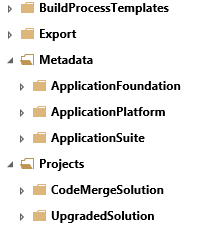

---
# required metadata

title: Configure Visual Studio Team Services mapping during code migration
description: This tutorial shows how to map your development box to the Visual Studio Team Services (VSTS) project after a code upgrade. 
author: MargoC
manager: AnnBe
ms.date: 2015-12-12 23 - 28 - 47
ms.topic: article
ms.prod: 
ms.service: Dynamics365Operations
ms.technology: 

# optional metadata

# ms.search.form: 
# ROBOTS: 
audience: Developer
# ms.devlang: 
ms.reviewer: annbe
ms.search.scope: AX 7.0.0, Operations
# ms.tgt_pltfrm: 
ms.custom: 25951
ms.assetid: 4c67e613-363b-474f-9224-9cbb5c19ec07
ms.search.region: Global
# ms.search.industry: 
ms.author: margoc
ms.dyn365.intro: Feb-16
ms.dyn365.version: AX 7.0.0

---

# Configure Visual Studio Team Services mapping during code migration

This tutorial shows how to map your development box to the Visual Studio Team Services (VSTS) project after a code upgrade. 

The migration service automatically checks your upgraded code into Visual Studio Team Services (VSTS) (formerly called Visual Studio Online). You will then need to map your development box to the upgrade folder/branch in your VSTS project (The name of the upgrade folder/branch depends on the version you migrated to). Within your upgraded folder, you will find three folders:

-   Export
-   Metadata
-   Projects

## Key concepts
-   **Export** is the project that contains the XML files after exporting from Microsoft Dynamics AX 2012. This is your metadata in XML format before it is upgraded. This is only relevant if you are upgrading from Dynamics AX 2012.
-   **Metadata** is your upgraded code (metadata XML file) on the latest version of Microsoft Dynamics 365 for Operations.
-   **Projects** are two solutions that you can use during upgrade. One solution, CodeMergeSolution, is the solution that contains projects with the elements that have conflicts and need to be resolved. The other solution, UpgradedSolution, contains a collection of projects, one for each upgraded model. For example, in VSTS, you should see something like the following structure. 

## Map VSTS to your development box
1.  In Visual Studio, connect to your account by going to **Team explorer &gt; Select Team Projects &gt; Servers &gt; Add.**
2.  Enter the URL to your team project. Click **Close**.
3.  Make sure the VSTS account shows up. On the right, choose the project that you want to work on. Click **Connect**.
4.  Now you need to map your workspace to the VSTS folders. Go to the **Source Code Explorer** and do this mapping:
    1.  Projects &gt; C:\\Users\\&lt;username&gt;\\Documents\\Visual Studio 2015\\Projects
    2.  Metadata &gt; C:\\AOSService\\PackagesLocalDirectory
        -   On cloud VMs, this folder is located on the I:\\ or J:\\ drive
        -   On earlier versions, this folder is C:\\packages

 Once you have mapped these folders, you can synchronize the code to your local box. Right-click on Metadata and select **Get latest**. Similarly synchronize the Projects folder. After synchronizing the metadata folder, refresh your models in Visual Studio from **Dynamics 365 for Operations** &gt; **Model Management** &gt; **Refresh Models**.  You are now ready to open your projects, resolve conflicts, build, test and complete your code migration.

