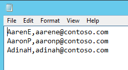

---
# required metadata

title: Data upgrade from AX 2012 to Dynamics 365 for Operations – Pre-upgrade checklist in AX 2012
description: This topic describes each task in the Microsoft Dynamics AX 2012 checklist that is associated with data upgrade to Microsoft Dynamics 365 for Operations.
author: tariqbell
manager: AnnBe
ms.date: 05/30/2017
ms.topic: article
ms.prod: 
ms.service: dynamics-ax-platform
ms.technology: 

# optional metadata

# ms.search.form: 
# ROBOTS: 
audience: Developer
# ms.devlang: 
ms.reviewer: margoc
ms.search.scope: Operations, Platform, AX Platform
# ms.tgt_pltfrm: 
ms.custom: 106163
ms.assetid: 
ms.search.region: Global
# ms.search.industry: 
ms.author: tabell
ms.search.validFrom: 2017-05-31
ms.dyn365.ops.version: Platform update 8

---

# Data upgrade from AX 2012 to Dynamics 365 for Operations – Pre-upgrade checklist in AX 2012

[!include[banner](../includes/banner.md)]

This topic describes each task in the Microsoft Dynamics AX 2012 checklist that is associated with data upgrade to Microsoft Dynamics 365 for Operations.

> [!NOTE]
> This topic applies to Microsoft Dynamics AX 2012 R3.

## Installation

TODO – add link to hotfix when it is released

For private preview, import the XPO file that is supplied.

## Prepare model metadata

During data upgrade, one goal is to maintain element IDs between the existing AX 2012 environment and the upgraded Dynamics 365 for Operations environment. To accomplish this goal, you must bring a copy of the element IDs from the AX 2012 environment into the Dynamics 365 for Operations environment. AX 2012 stores element IDs in a table that is named ModelElement. This table is in the model database, which is a separate database from the AX 2012 business data database. During an upgrade to Dynamics 365 for Operations, you must copy the AX 2012 database to Microsoft Azure. This process can be time-consuming. 

To avoid copying the whole model database to Azure SQL Database, use the following procedure to replicate the ModelElement table in the business data database. Later, during data upgrade runs, the database synchronization process will retrieve the required information from this replicated table and make sure that element IDs are maintained in the upgraded Dynamics 365 for Operations environment.

1. In the Dynamics 365 for Operations data upgrade checklist, click **Prepare model metadata**.
2. When you’re prompted, click **Yes**.
3. Wait for the copy process to be completed.

If the process is successful, the task is marked as completed.

## Prepare security role metadata

Another goal during data upgrade is to preserve security role assignments. This task resembles the previous “Prepare model metadata” task. Security role information that is stored in the AX 2012 model database must be copied to the AX 2012 business data database, so that the information is preserved in the Dynamics 365 for Operations environment after upgrade. During data upgrade runs, the same security role will be restored in the upgraded Dynamics 365 for Operations environment.

1. In the Dynamics 365 for Operations data upgrade checklist, click **Prepare security role metadata**.
1. When you’re prompted, click **Yes**.
1. Wait for the copy process to be completed.

If the process is successful, the task is marked as completed.

## Setup user mapping

In AX 2012, users are authenticated against an on-premises Active Directory server. However, in Dynamics 365 for Operations, users are authenticated against Azure Active Directory (Azure AD). This task provides a form where you can map existing AX 2012 users to equivalent Azure AD users. The AX 2012 users will then be able to access Dynamics 365 for Operations.

1. In the Dynamics 365 for Operations data upgrade checklist, click **Setup user mapping**.
1. The **User info email mapping** form appears. Follow one of these steps to fill in the grid:

    - Import users from AX 2012, and then manually fill in the Azure AD email address:

        1. Click **Import from AX**. The grid is filled with existing users.
        1. For each user, enter the corresponding Azure AD email address, as shown in the following illustration.

            

    - Import users from a file. This option is faster. We recommend that you use this option when many users must be updated.

        1. In a comma-separated values (CSV) file, create the mapping between AX 2012 users and Azure AD email addresses. Your IT department can export a similar mapping from your on-premises Active Directory Domain Services.

            

        1. After the file is ready, click **Import from file**, browse to the file, and import it.

        The grid should be filled with the mappings that you specified in the file.

If the imported file contains an entry that isn’t valid, an error file is generated.

TODO add details on where error will be.

## Validate baseline version

Run this task to validate that the current version can be upgraded.

- In the Dynamics 365 for Operations data upgrade checklist, click **Validate baseline version**.

If the baseline version is one of the supported baseline versions, the task is marked as completed.

TODO, do users get an error message if version doesn’t match?

## Archive retail salt data

This task is used to migrate the registry key that RetailSaltUtility uses. This tool is used for some deployments where the customer wants to inject a specific random value into the hash that is used to authenticate channel users.

- In the Dynamics 365 for Operations data upgrade checklist, click **Archive retail salt data**.

If the process is successful, the task is marked as completed.
