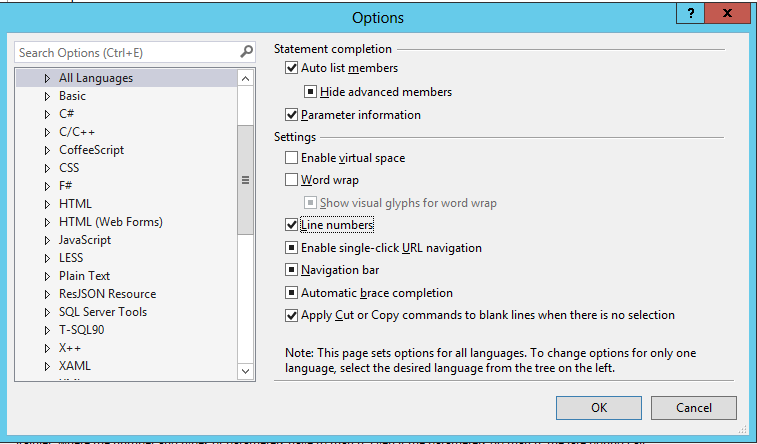
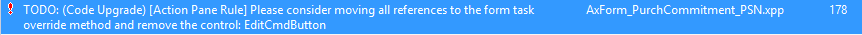
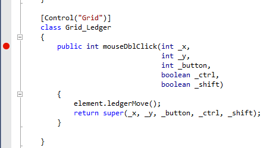

---
# required metadata

title: Prepare to migrate to Dynamics 365 for Operations
description: In this tutorial, we will use the LCS migration service and Visual Studio to migrate you code and metadata from Dynamics AX 2012 R3 to Microsoft Dynamics 365 for Operations. 
author: RobinARH
manager: AnnBe
ms.date: 2015-12-12 23 - 29 - 02
ms.topic: article
ms.prod: 
ms.service: Dynamics365Operations
ms.technology: 

# optional metadata

# ms.search.form: 
# ROBOTS: 
audience: Developer
# ms.devlang: 
# ms.reviewer: 61
ms.search.scope: AX 7.0.0, Operations
# ms.tgt_pltfrm: 
ms.custom: 25971
ms.assetid: bfa530a5-17f1-4212-898d-9624b7b94306
ms.search.region: Global
# ms.search.industry: 
ms.author: robadawy
ms.dyn365.intro: Feb-16
ms.dyn365.version: AX 7.0.0

---

# Prepare to migrate to Dynamics 365 for Operations

In this tutorial, we will use the LCS migration service and Visual Studio to migrate you code and metadata from Dynamics AX 2012 R3 to Microsoft Dynamics 365 for Operations. 

Prerequisites
-------------

You will need access to the environment using Remote Desktop, and be provisioned as an administrator on the instance.

## Tutorial goals
-   Describe the steps needed to move a Dynamics AX 2012 R3 solution to Dynamics 365 for Operations.
-   Migrate Microsoft Application Suite examples manually.
-   Define the requirements to complete migration.

## Overview
### Model split

The application is split into three packages, or assemblies:

-   Application Platform

<!-- -->

-   Application Foundation

<!-- -->

-   Application Suite

ISV AX 2012 R3 solutions will be re-baselined into the correct model.

### Auto-migration using LCS Upgrade Service

A migration service that takes a model store as input, can complete the following tasks:

-   Convert metadata into the format.

<!-- -->

-   Re-baselines metadata, by moving and merging, into the right model.

<!-- -->

-   Provides an estimation to understand the effort required to upgrade the solution.

<!-- -->

-   Runs migration rules that auto-migrate parts of a solution.

<!-- -->

-   Runs migration rules that inform developers what to manually fix by using TODOs.

<!-- -->

-   Provides a one-box migration-ready VHD with your solution that is deployed into the Microsoft Dynamics 365 for Operations format.

<!-- -->

-   Optional: Automatically checks-in the upgraded solution into TFS online.

<!-- -->

-   Optional: Automatically sets up nightly builds for the TFS online solution.

### Manual migration

After developers have a one-box migration deployment ready, the application can be compiled by fixing the compilation errors in this order:

1.  Application platform
    -   Manually fix merge conflicts.
    -   Manually fix model split conflicts.
    -   Manually fix compilation errors.

2.  Application foundation
    -   Manually fix merge conflicts.
    -   Manually fix model split conflicts.
    -   Manually fix compilation errors.

3.  Application suite
    -   Manually fix merge conflicts.
    -   Manually fix model split conflicts.
    -   Manually fix compilation errors.

4.  ISV model
    -   Manually fix merge conflicts.
    -   Manually fix model split conflicts.
    -   Manually fix compilation errors.

After you have resolved all of the compilation errors, all assemblies will compile. Next, ISVs must complete the following tasks:

1.  Address guided code upgrade TODOs and code upgrade-specific best practice warnings.
2.  Replace deprecated controls, for example, ActiveX or find an alternative.
3.  Apply form patterns and sub patterns to all forms.
4.  Create data entities.
5.  Validate that all scenarios work in multiple browsers with different sizes for custom patterns.
6.  Write/run migration tests.
7.  Upload the solution to LCS for certification.
8.  Deploy to customers.

## Key concepts
### Lifecycle Service Migration Service

Lifecycle Services (LCS) is the application lifecycle service to manage deployments. For more info about Lifecycle Services, see [http://lcs.dynamics.com](http://lcs.dynamics.com/en/).

### Application Platform, Application Foundation, and Application Suite

Microsoft Dynamics 365 for Operations is split into 3 main models: the Application Platform, the Application Foundation, and the Application Suite. Each of these models compile into its own assembly. This graphic shows a visual breakdown of the application.  The models concepts are as follows.

Property

Value

Field

CustomerDriverLicense This is the foreign key field on the FMRentalEntity.

Related Field

DriverLicense This is the unique key on the FMCustomerEntity.

### Package, models, namespaces, overlayering, referencing, extensions, and workloads

A model can contain the following:

-   New elements and extensions from an underlying model.
-   Overlayered elements from an underlying model.

One or more models are compiled into an assembly. An assembly, its non-code metadata, and its compiled artifacts form a package. A package is an independent deployable unit. For example, the Application suite module and the Application foundation module are separate assemblies. A model that contains only new elements, or extensions, or both, should be compiled into its own package. For example, the ISV.dll contains new tables, forms, and classes that the ISV added. A model that contains overlayered elements must be compiled into the same package as the base model. A model can’t contain overlayered elements from 2 different packages, meaning a model can be compiled into one and only one package **Note**: If you are not overlayering, you are developing in your own module. For example, GLS layer overlaying sys must be compiled every time the sys layer or the code is changed. Models have implicit layering. Overlayered artifacts are stored as diffs with individual field level granularity, except for code, at higher layers. For code, string diffs are stored at higher layers. Code within a module can “reference” only “publicized” contracts in other modules. Publicized contracts should be kept backward compatible. Example:

-   JJISV code in a separate module can refer to only publicized contracts in Microsoft namespaces.
-   Microsoft patches don’t break publicized contracts. JJISV does need not to be compiled when Microsoft module is patched.

### A collection of packages forms a workload

Diagram 

## Machine setup
This tutorial will walk you through configuring your one-box developer deployment and provide information about important migration settings. In the Best Practice framework, there is a subset of Best Practice warnings that need to be resolved to complete migration.

1.  In Visual Studio, click **Dynamics 365 &gt; Options &gt; Best Practices**.
2.  In the **Model** drop-down menu, select **Application Suite**.

During the migration phase, these rules should be set to “ON” when migrating your ISV solution. The setting is driven by an XML file in the AxRuleSet folder. For example, see the Application Suite xml file, BPRules.xml, located under C:\\Packages\\ApplicationSuite\\Foundation\\AxRuleSet.  The LCS upgrade service will automatically add this XML file to your model. To complete the migration, you need to fix all migration-specific Best Practice rules. The errors will show up in the error list as warnings. In the error list, you will see compiler warnings and best practice errors. Best Practice errors are prefixed with the text **BP**. For example, **BPErrorFormControlPatternUnspecified**. **Important:** After migration, remove this file as all Best Practice rules should be run during regular development. **Running BP rules per model** Running BP rules per model is an important migration scenario, which means you should understand all required migration BPs for your model. To only run the Best Practice tool, run it from the command line. Both xppc.exe and xppbp.exe are in the C:\\Packages\\bin directory. The command to run BP rules on a model, for example the Application Suite, is: C:\\Packages\\bin\\xppbp.exe –m=C:\\Packages –me=Foundation –mu=ApplicationSuite -all.

## Project setup
1.  Start Visual Studio, and on the toolbar, click **Microsoft Dynamics** &gt; **Options**.
2.  Expand the **Microsoft Dynamics** node, and then click **Projects**.
3.  Verify that the **Organize projects by element type** check box is selected, and click **OK**.
4.  To view the line numbers in your code editor, select **Tools** &gt; **Options** &gt; **Text** **Editor** &gt; **All Languages**.
5.  Select the **Line numbers** check box.
6.  Create a **Microsoft Dynamics Project** template project, and name it **Migration**.
7.  Click **OK**.
8.  Verify that the project is in the **Application Suite**.
9.  Right-click the project, and select **Properties**.
10. In the **Model** property, select **Application Suite**.
11. Set the **Company** property to **USMF**. Your settings should resemble the following screenshot.
12. Click **OK**.

## Debugging
By default, Dynamics 365 for Operations optimizes the debugging experience for the files that you are working on. As a result, when you step into a file (F11) that is not in your project, the PDBs are not loaded and you can’t debug the code. To work around this, change the project debugging setting by clicking **Dynamics 365 **&gt; **Options** &gt; **Debugging**. Verify that the **Load symbols only for items in the solution** check box is not selected. Another debugging setting that you may want to turn off is Intellitrace. Intellitrace collects the complete execution history of an application. It creates a lot of noise in the IDE when debugging. To turn off Intellitrace, click **Options** &gt; **IntelliTrace** &gt; **Enable IntelliTrace**, clear the check box, and then click **OK**. Note that Intellitrace is only available in the Ultimate version of Visual Studio. 

## Address code migration tasks
When metadata is migrated to Dynamics 365 for Operations, multiple auto-upgrade scripts are run. In the case where developers need to complete manual migration tasks, TO DOs and Best Practices (BP) have been added.

-   TO DOs are prefixed with */\* TODO: (Code Upgrade)*, and need to be be fixed as a part of code migration.
-   BP migration specific rules also need to be fixed as part of code migration.

This tutorial uses the **PurchCommitment\_PSN** form to walk you through the migration task of fixing navigation. Specifically, you will see examples of duplicate buttons and Action Pane TODOs.

### Setup

1.  In Visual Studio, open **Application Explorer**, and search for the form, PurchCommitment\_PSN.
2.  Click **OK**.
3.  Right-click the project and select **Properties**.
4.  In the Model property, select **Application Suite**.
5.  In the Company property, select FRSI.
6.  Note: The form is located in the French demo data company FRSI.
7.  Press **Ctrl+F5 to** see the form.

While the form looks complete, there are still code migration tasks necessary to be migration-complete. 

### Navigation migration tasks

1.  In Visual Studio, build the project, and then on the toolbar, click **View** &gt; **Task List**.
2.  Click the **Comments** drop-down list to view the TO DO: (Code Upgrade) tasks.
3.  In the list, find the ActionPane TODOs.

### Code upgrade rule - Action Pane

In Dynamics 365 for Operations, the following core actions are provided as system-defined buttons:

-   New
-   Delete
-   Edit
-   Export

As part of the auto-migration, the Action Pane rule is run to identify redundant buttons. To complete this part of migration, you need to manually:

-   Remove or move the code.
-   Delete redundant controls in the application code.

**Note**: In this tutorial, we will provide examples of how to migrate and modify the code on modeled buttons that replicate system-defined buttons. However, in practice, before making changes similar to those made in this tutorial, the code must first be evaluated with respect to the scenario to determine if it is still needed. First, fix the TODO for the DeleteCmdButton, which duplicates the system-defined Delete button.

1.  In Visual Studio, find the TODO shown below, and then double-click the TODO.
2.  Replace the TODO and the line of code as shown below.
    -   The state of the system-defined **Delete** button is controlled by the AllowDelete property on the firstmaster datasource. By setting AllowDelete to false, the delete task is kept from executing when the keyboard shortcut is used.

            // Delete button
            /* TODO: (Code Upgrade) [Action Pane Rule] Please consider moving all references to the form task override method and remove the control: DeleteCmdButton */
            deleteCmdButton.enabled(purchCommitmentHeader && purchCommitmentHeader.canDelete());
            PurchCommitmentHeader_DS.allowDelete(purchCommitmentHeader && purchCommitmentHeader.canDelete());

3.  In the editor, find and remove DeleteCmdButton from the form design. 
4.  Press **Ctrl+S to** save the form.
    -   Next, we will focus on the EditCmdButton that duplicates the system Edit button, handing the two TODOs associated with this button as well as removing this button.

5.  In Visual Studio, find the TODO shown below, and then double-clickthe TODO.
6.  Because the visibility of the **Edit** button is controlled by the View/Edit mode of the form, you will need to modify this code so it sets that property. Replace the TODO and the line of code as shown in the following graphic.

        /* TODO: (Code Upgrade) [Action Pane Rule] Please consider moving all references to the form task override method and remove the control: EditCmdButton */
        editCmdButton.enabled(purchCommitmentHeader && isInDraftOrUnderRevisionStatus && !isInWorkFlowReviewState && !isLineReferenced);

        if(purchCommitmentHeader && isInDraftOrUnderRevisionStatus && !isInWorkFlowReviewState && !isLineReferenced)
        {
            element.design().ViewEditMode(ViewEditMode::Auto);
        }
        else
        {
            element.design().ViewEditMode(ViewEditMode::View);

        }

7.   Double-click the other TODO for this button.
8.  Inspect the code on the modeled **Edit** button. This logic will need to be moved to the form’s task() method.

        [Control("CommandButton")]
        class EditCmdButton
        {
            /* TODO: (Code Upgrade) [Action Pane Rule] Please consider moving this button code to the task override method and remove the control EditCmdButton. */
            void clicked()
            {
                if (purchCommitmentHeader.WorkflowApprovalState ==     
                    PurchCommitmentWorkflowApprovalState_PSN::Approved)
                {
                    if (Box::yesNo(strFmt("@SPS2140", purchCommitmentHeader.CommitmentNumber), 
                        DialogButton::No) == DialogButton::Yes)
                    {
                        super();

                        PurchCommitmentHeader_PSN::setWorkflowState(purchCommitmentHeader.RecId, 
                          PurchCommitmentWorkflowApprovalState_PSN::NotSubmitted);
                    }
                }
                else
                {
                    super();
                }
            }
        }

9.  On the left side of the Visual Studio designer, right-click **Methods** &gt; **Override**, and select **Task**, to add an override for the form’s Task method.
10. Update the task method as shown below so that the code from above is triggered when the system-defined **Edit** button is clicked.

        /// 
            ///
            /// 
            /// 
            /// 
            public int task(int _taskId)
            {
                #Task
                int ret;

                switch (_taskId)
                {
                    case #taskEditRecord:

                        if (purchCommitmentHeader.WorkflowApprovalState == PurchCommitmentWorkflowApprovalState_PSN::Approved)
                        {
                            if (Box::yesNo(strFmt("@SPS2140", purchCommitmentHeader.CommitmentNumber), DialogButton::No) == DialogButton::Yes)
                            {
                                ret = super(_taskId);

                                PurchCommitmentHeader_PSN::setWorkflowState(purchCommitmentHeader.RecId, PurchCommitmentWorkflowApprovalState_PSN::NotSubmitted);
                            }
                        }
                        else
                        {
                            ret = super(_taskId);
                        }

                        break;
                    
                    default:
                        ret = super(_taskId);
                        break;
                }
            
                return ret;
            }

11. In the Editor, find and remove the **EditCmdButton** from the form design. 
12. Press **Ctrl+S** to save the form.
13. Press **Ctrl+F5** to view the form. Notice the **Delete** and **Edit** buttons in the **Commitment** tab have been removed.

### Best Practice migration warnings

1.  In **Application Explorer**, search for **CosLineTree**.
2.  Add the **CosLineTree** form and **CosLineTree** display menu item to the project.
3.  Right-click the display menu item, and select **Set as Startup Object**.
4.  Rebuild the project.
5.  Go to the Error List to view the warnings.
6.  In the BP filter, enter the word, *mouse*, to view the mouse related BP warnings.
7.  Double-click the warning to open the code editor.
8.  Press **Ctrl+F5** to start the form.
9.  Set a **breakpoint** on the **mouseDblClick** method.
10. In Visual Studio, attach to the client process by clicking **Debug** &gt; **Attach to Process**. Locate **w3wp.exe**.
    -   Verify that you have selected the **Show process from all users** check box, or you might not see the w3wp.exe process.
    -   Verify that you only have **Managed (v4.5, v4.0)** selected in the **Attach to** field.

11. Click **Attach**, and then double-click the form grid.
    -   Notice the breakpoint is **not** hit (as mouseDblClick is no longer supported).

12. Close the client.
    -   In this case, we need to add a button to the form and add the code to the click() method on the button.

13. Go to the form designer and find the tab page, **TabPage\_Ledger.**
    1.  Right-click the **Tabpage** to add a new Action Pane. Verify that this is above the grid.
    2.  Right-click the Action Pane to add a new ButtonGroup.
    3.  Right-click othe **ButtonGroup** and add a new button. The metadata should look like the following example. 

14. Select **FormButtonControl1 (Button)**, and then press **F4** to open the button properties. Change the property text to **Ledger Move**.
15. Select **FormButtonControl1 (Button)**, right-click the **Methods** node, and add a Clicked() method.
16. Select **FormButtonControl1 (Button)**, right-click the **Methods** node, and select **View Code**.
17. Verify that the double-click code is migrated to the method.

            [Control("Button")]
            class FormButtonControl1
            {
                /// 
                ///
                /// 
                public void clicked()
                {
                    element.ledgerMove();
                    super();
                }

            }

18. When you run the form, the code is now migrated.

**Note:** As part of migration, you should delete the mouseDblClick code because it has been migrated. In this example the form is not migrated, so there are still runtime issues.

## Resolve casting exceptions
In Dynamics 365 for Operations, X++ is completely IL based and therefore has a stricter runtime type behavior than the interpreted Dynamics AX2 012. This stricter runtime type behavior can generate exceptions in migrated Dynamics AX 2012 R3 metadata. It is likely you will encounter these exceptions during your migration. The casting exceptions can be raised in different runtime scenarios, such as down-casting, casting runtime to design time objects, and side-casting. In this tutorial, we will walk through an example where a form, CosJournalName, is generating controls at runtime, and has a type mismatch which causes a .NET exception because it is strongly typed.

### Example: Side-casting exception

1.  In Visual Studio, select and right-click **Project Properties**, and verify that USMF is the default company.
2.  Add the display menu item CosJournalName to your project, and set the menu item as your StartUp object.
3.  Add the CosJournalName form to your project.
4.  Add the cosDimCheckBoxController class to your project.
5.  Rebuild your project.
6.  Press **Ctrl+F5** to run the form.
7.  Note that you will get an exception, similar to the following, when running the form.
8.  Right-click the class, cosDimCheckBoxController, and then select **View Code**.
9.  Set a breakpoint on the cosDimCheckBoxController::getBuildControl().
10. Press **F5**.
    -   The breakpoint will be hit. This is where the casting error occurs. The reason for the casting error is because we are trying to return a control of type: FormBuildCheckboxControl and the object is expecting FormBuildStringControl.

11. Hover over the buildcontrol to see the type and notice the differences.
12. Press **F10** to hit the exception.
13. Stop debugging.
14. To fix the exception, change the method declaration from FormBuildStringControl to FormBuildCheckBoxControl.

        protected FormBuildStringControl getBuildControl()
        protected FormBuildCheckBoxControl getBuildControl()

15. Rebuild the project, and press **Ctrl+F5**. The form should open successfully because the casting error is resolved.

  

## Context menu (advanced tutorial)
In Dynamics AX 2012, right-click context menus were modified by using the PopupMenu class. This class relied on Windows APIs that were not available on the web. In Dynamics 365 for Operations, the ContextMenu APIs have been created as replacements to provide similar functionality. The context() and showContextMenu() method overrides were the previous entry points to modifying context menus for specific controls, and these overrides traditionally contained code for adding options to a context menu as well as processing the user’s selection using a wait model. In Dynamics 365 for Operations, these overrides are being removed and the wait model eliminated. The result is that your will need to create two overrides: getContextMenuOptions() to add options to the context menu, and selectedMenuOption() to process the user’s selection. Migrating context menus in Dynamics 365 for Operations is a manual effort. Steps for context menu migration:

1.  Add macros for each menu option added to the context menu.
2.  Build the new context menu using the new *getContextMenuOptions()* override and the ContextMenu APIs.
3.  Process the user’s selection using the new *selectedMenuOption()* override.

### Form: SysDateLookup

In this example we will walk through the steps to migrate the context menu on a date control in the SysDateLookup form. The old context menu code currently has no effect in Dynamics 365 for Operations. To see the current context menu:

1.  Add the SysDateLookup form to a project and set it as the startup object.
2.  Start without debugging (**Ctrl+F5**).
3.  Right-click the date field.

 This context menu is meant to contain options for switching to the previous month and the next month. To start the migration process, first inspect the existing code for adding options to the context menu and for processing the user’s selection.

-   Open the **SysDateLookup** form.
-   Search for the **MontViewer** control on the design node and expand the **Methods** node.
-   Right-click the context override and click **View code**. We will be migrating this code as well as the code in **monthViewerContextCommon** (which you can view by right-clicking the method name and clicking **Go To Definition**).

        void context()
        {
        PopupMenu popupMenu = new PopupMenu(this.hWnd());

        element.monthViewerContextCommon(popupMenu);
        }

-   Go back to the designer for **SysDateLookup**. Right-click **Methods** under the **MontViewer** control and add an override for *getContextMenuOptions()*. This is where the context menu will be constructed. We will modify the code in this override later.
-   Move to the *monthViewerContextCommon()* method. This function adds two options to the context menu and then processes the user’s selection.
-   Find the menu options that are added to the context menu (choicePrev and choiceNext in this case), and add macros for each of these options at the top of the form.
-   Add a method just under *monthViewerContextCommon()* called *monthViewerGetContextMenuOptions().* This will contain the migrated code from *monthViewerContextCommon()* for adding the two context menu options.
-   Add these two options to the context menu using the new APIs in the *monthViewerGetContextMenuOptions()* method.
-   The portion of *monthViewerContextCommon()* that needs to be migrated into *monthViewerGetContextMenuOptions()* is shown below.

        void monthViewerContextCommon(PopupMenu popupMenu)
        {
        int    choicePrev,choiceNext,
        choice;

                choicePrev = popupMenu.insertItem("@SYS16527");
                choiceNext = popupMenu.insertItem("@SYS10078");
        ...

-   The migration of adding these two context menu options is shown below.
-   Modify *getContextMenuOptions()* as shown. Because system context menus in Dynamics 365 for Operationsonly include commands specific to a control, there is no need (or ability) to suppress the system context menu.

        str monthViewerGetContextMenuOptions()
        {
        ContextMenu menu = new ContextMenu(); 
        List options = new List(types::Class);

        ContextMenuOption choicePrev = ContextMenuOption::Create("@SYS16527", #choicePrev); 
        options.addEnd(choicePrev);
                
        ContextMenuOption choiceNext = ContextMenuOption::Create("@SYS10078", #choiceNext);         
        options.addEnd(choiceNext); 

        menu.ContextMenuOptions(options); 

        return menu.Serialize(); 
        }

        public str getContextMenuOptions()
        {
        str ret;
                
               ret = super();

            ret = element.monthViewerGetContextMenuOptions();        

               return ret;
        }

-   Go back to the designer for **SysDateLookup**. Right-click **Methods** under the **MontViewer** control and add an override for *selectedMenuOption()*. This is where the user’s selection will be processed. We will add code to this override later in the tutorial.
-   Add a method just under *monthViewerGetContextMenuOptions()* called *monthViewerSelectedOption().* This will contain the migrated code from *monthViewerContextCommon()* for processing the user’s selection.
-   Move code to the *monthViewerSelectedOption()* override (generally the switch statement after the old call to draw()). Be sure to modify the variables to match your macro definitions.

           void monthViewerSelectedOption(int selectedOption)
            {
                switch (selectedOption)
                {
                    case #choicePrev:
                        monthShown = calendarConverter.prevmth(monthShown);
                        element.drawMonth();
                        element.updateTable(daysTable);
                        if (arabicCalendar)
                            element.updateTable(hiddenDaysTable);
                        break;
                    case #choiceNext:
                        monthShown = calendarConverter.nextmth(monthShown);
                        element.drawMonth();
                        element.updateTable(daysTable);
                        if (arabicCalendar)
                            element.updateTable(hiddenDaysTable);
                        break;
                }
            }

-   Modify *selectedMenuOption()* as shown below.

        public void selectedMenuOption(int selectedOption)
        {
        super(selectedOption);

        element.monthViewerSelectedOption(selectedOption); 
        }

-   Delete the context() override from the MontViewer control.
-   Typically you would be able to delete the *monthViewerContextCommon()* method. However, on this form there is another control **arabicMontViewer** with a context menu override (that we did not migrate in this tutorial) that calls this method. You can either leave the method, or migrate the context menu code on that button and then delete the method.
-   Click **Ctrl+F5** to start the form without debugging. Notice the new options added to the bottom of the context menu. 

 

