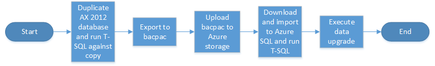

---
# required metadata

title: Data upgrade in a sandbox environment from AX 2012 to Dynamics 365 for Finance and Operations
description: Describes how to perform a data upgrade in a sandbox environment. 
author: tariqbell
manager: AnnBe
ms.date: 06/16/2017
ms.topic: article
ms.prod: 
ms.service: dynamics-ax-platform
ms.technology: 

# optional metadata

# ms.search.form: 
audience: Developer;IT Pro
# ms.devlang: 
ms.reviewer: margoc
ms.search.scope: Operations Platform
# ms.tgt_pltfrm: 
# ms.custom: 
ms.search.region: Global
# ms.search.industry: 
ms.author: tabell
ms.search.validFrom: 2017-06-16
ms.dyn365.ops.version: Platform update 8
---

# Data upgrade in a sandbox environment

[!include[banner](../includes/banner.md)]

The output of this task is an upgraded database to use in a sandbox environment – where business users and functionaltTeam members can validate application functionality including customisations and the data brought forward from Microsoft Dynamics AX 2012.

We strongly recommend that you run the data upgrade process in a development environment before running it in a shared sandbox environment because this will reduce the overall time to a successful data upgrade. For details, see the topic [Data upgrade in a development environment](prepare-data-upgrade.md).

## Overview of the sandbox data upgrade process

When you start upgrading data in a sandbox environment, you will have already upgraded data in a development environment (as explained in the article Data upgrade in a development environment). The process is very similar: the key difference is that a sandbox environment uses Azure SQL Database for data storage while a development environment uses SQL Server. This technical difference in the database layer means that we need to modify the data upgrade procedure slightly because a backup from the AX 2012 database instance cannot simply be restored to Azure SQL Database. Aside from this difference the process is the same as data upgrade in a development environment.

The high level steps are as follows:
1.	Create a copy of the AX 2012 database. We strongly recommend that you use a copy, because you will need to delete some objects in the copy or export.
2.	Export the copied database to a bacpac file using a free SQL Server tool called SQLPackage.exe. This provides a special type of backup of the database which can be imported into Azure SQL Database.
3.	Upload the bacpac file to Azure storage. 
4.	Download the bacpac file to the AOS machine in the sandbox environment, and then import it using sqlpackage.exe. You will then execute a script against the imported database to reset the SQL database users.
5.	Run the MajorVersionDataUpgrade.zip package to run the data upgrade against the imported database.

## Create a copy of the AX 2012 database

It is necessary to create a copy of the AX 2012 database that you are upgrading, because you will need to delete some objects from the database – including any Windows authentication users. These changes make the modified database unusable for AX 2012. In this step we’ll create a copy of the database and perform these object deletions.

This task is to be performed by the database administrator (DBA) or a person with similar knowledge and experience.

To create a database copy, take a backup of the original database and restore it with a new name. Ensure that enough space is available for both databases. It is fine to create the copy on a different server. The version of the SQL instance running the database is not important to completion of the process.

Example code to create a copy – you will need to modify this to suit your particular database names:
	BACKUP DATABASE [AxDB] TO  DISK = N'D:\Backups\axdb_copyForUpgrade.bak' WITH NOFORMAT, NOINIT,  
	NAME = N'AxDB_copyForUpgrade-Full Database Backup', SKIP, NOREWIND, NOUNLOAD, COMPRESSION,  STATS = 10
	GO

	RESTORE DATABASE [AxDB_copyForUpgrade] FROM  DISK = N'D:\Backups\axdb_copyForUpgrade.bak' 	WITH  FILE = 1,  
	MOVE N'AXDBBuild_Data' TO N'F:\MSSQL_DATA\AxDB_copyForUpgrade.mdf',  
	MOVE N'AXDBBuild_Log' TO N'G:\MSSQL_LOGS\AxDB_CopyForUpgrade.ldf',  
	NOUNLOAD,  STATS = 5

Once the copy is created, execute the following TSQL script against it:
	TODO 

### Export the copied database to bacpac

Export the copied database to a bacpac file using the SQL Package.exe tool. This task should be performed by the DBA, or a team member with equivalent knowledge. 

It is very important to install the latest version of SQL Server Management Studio  before starting this task. SQLPackage exists in earlier versions but it will not work correctly for this task unless you install the latest management studio first.

Performance of this process will be important to you – as this export will need to happen again during downtime before go-live, the tips for performance are:
-	The bacpac process is very IO and CPU intensive. Execute the export on a high powered machine.
-	SQLPackage should be running locally on the machine hosting the database: do not run sqlpackage on your local laptop connecting to the database machine, becausae this process is also network intensive.

Next open a command prompt as Administrator and execute the following commands:

	cd C:\Program Files (x86)\Microsoft SQL Server\130\DAC\bin\

	SqlPackage.exe /a:export /ssn:localhost /sdn:<database to export> /tf:D:\Exportedbacpac\my.bacpac /p:CommandTimeout=1200 /p:VerifyFullTextDocumentTypesSupported=false

Explanation of the parameters:
-	**ssn** source server name. The name of the SQL server to export from. For these purposes this should always be localhost
-	**sdn** source database name. The name of the database to export
-	**tf** target file. The path and name of the file to export to. The folder should already exist; the file will be created by the process.
-	**/p:CommandTimeout** The per-query timeout value. This allows larger tables to be exported without hitting a timeout.

### Upload the bacpac to Azure storage

Upload your bacpac file to Azure storage. See UsingStorageExplorer.docx TODO 

### Import the bacpac to Azure SQL Database

In this step you will import the exported bacpac file to the Azure SQL Database instance your sandbox environment is using. This will involve installing the latest SQL Server Management Studio on your sandbox AOS machine and then importing the file using sqlpackage.exe.

You will perform these steps directly on the AOS machine in your sandbox environment. The reason for this is that there are firewall rules restricting access to the Azure SQL Database instance, using the AOS machine will give you access.

As with the export, you must have the latest version of SQL Server Management Studio before starting the import – older versions will not be successful.

We recommend placing the bacpac file on the D: drive on the AOS machine for performance reasons – the D: drive on Azure virtual machines is a physical disk with higher performance generally than other available disks.

Open a command prompt as Administrator and execute the commands below:

	cd C:\Program Files (x86)\Microsoft SQL Server\130\DAC\bin\

	SqlPackage.exe /a:import /sf:D:\Exportedbacpac\my.bacpac /tsn:<azure sql database server name>.database.windows.net /tu:sqladmin /tp:<password from LCS> /tdn:<New database name> /p:CommandTimeout=1200 /p:DatabaseEdition=Premium /p:DatabaseServiceObjective=P1

Explanation of the parameters:
-	**tsn** target server name. The name of the SQL Azure server to import to. The name can be found in LCS, suffix it with “.database.windows.net”.
-	** Tdn** target database name. The name of the database to import to. The database should not already exist; the import process will create it.
-	**sf** source file. The path and filename to import from.
-	**tp** target password. SQL password for target Azure SQL Database instance.
-	**tu** target user. The SQL user name for the target Azure SQL Database instance – we advise that you use “sqladmin”. You can retrieve the password for this user from your LCS project.
-	**/p:CommandTimeout** The per-query timeout value. This allows larger tables to be exported without hitting a timeout.
-	**/p:DatabaseServiceObjective** The service tier level of the created database. You can check the value for the existing database using SQL Server Management Studio, by right-clicking the Database, selecting Properties, and using that value.

After you run the commands, the following warning will be displayed; this can be safely ignored:

 
### Run the MajorVersionDataUpgrade.zip package

Execute the data upgrade deployable package as described in the topic [Upgrade data in development, demo, or sandbox environments](upgrade-data-to-latest-update.md).

### Upgrade a copy of the database in a development environment
It is useful to upgrade the same database on a development environment – having a copy of the database available for development environments will make investigating bugs found in the upgraded sandbox much easier.  