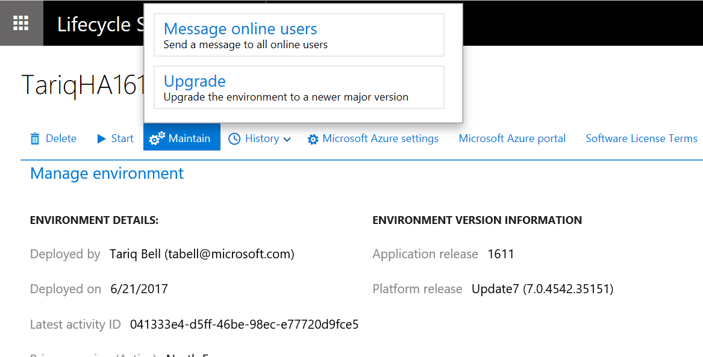

---
# required metadata

title: Overview of moving to the latest update of Finance and Operations
description: This topic describes the process for upgrading to the latest update for Microsoft Dynamics 365 for Finance and Operations. This topic is intended to describe the overall process and supported scenarios, not to provide detailed instructions for every step of the process.
author: MargoC
manager: AnnBe
ms.date: 05/23/2017
ms.topic: article
ms.prod: 
ms.service: dynamics-ax-platform
ms.technology: 

# optional metadata

# ms.search.form: 
# ROBOTS: 
audience: Developer
# ms.devlang: 
# ms.reviewer: 11
ms.search.scope: Operations, Platform, AX Platform
# ms.tgt_pltfrm: 
ms.custom: 102343
ms.assetid: e48d7424-371a-49ee-882c-07b7ceb00183
ms.search.region: Global
# ms.search.industry: 
ms.author: tabell
ms.search.validFrom: 2016-05-31
ms.dyn365.ops.version: Platform update 1

---

# Overview of moving to the latest update of Finance and Operations

[!include[banner](../includes/banner.md)]

This topic describes the process for upgrading to the latest update for Microsoft Dynamics 365 for Finance and Operations. This topic is intended to describe the overall process and supported scenarios, not to provide detailed instructions for every step of the process.

Overview
--------

This topic describes the overall process and the supported scenarios that are related to an upgrade from earlier releases to the current update for Finance and Operations. It isn't intended to provide detailed instructions for every step of the process. For details of the contents of each available upgrade see [What's new or changed](../get-started/whats-new-changed.md).

## Definitions
Finance and Operations platform updates consist mainly of the following components: Application Object Server (AOS), analytics and reporting, Microsoft Office integration, data management, integration services, the web client, and other binaries. It also includes the following Application Object Tree (AOT) models:

-   Application Platform
-   Application Foundation
-   Directory and Test Essentials

All other components are referred to as the Finance and Operations application.

## Introduction to scenarios
### Scenario 1: Update to a specific application hotfix

Use this scenario when one (or a small number of) hotfix is required for a specific issue and business factors, such as time or cost prohibit taking an entire major application update at that moment.

### Scenario 2: Upgrade your custom code

This process is required before embarking on scenario 3 and is to be completed by a developer before other activities can begin.

### Scenario 3: Upgrade to the most current application update
Use this scenario when business factors such as time or cost permit taking the complete latest application update. Some examples of application updates are Release 1611 (also known as 7.1) and the July 2017 release (also known as 7.2). When installing a platform-only update use scenario 4 below. Some examples of platform updates are August 2016 release, or platform update 6 or platform update 7. If you're in any doubt what your update contains contact Microsoft Support for confirmation.

### Scenario 4: Upgrade to the most current platform only

Use this scenario to update to the latest release of the platform, when no application updates are required at that time. Note that platform updates are always cumulative. Some examples of platform updates are August 2016 release, or platform update 6 or platform update 7. 

- Platform update 1 and platform update 2 allowed overlayering of platform X++ code. If you are upgrading from one of these versions your developers will need to refactor the overlayering as extensions before you can upgrade.
- Platform update 3 and above, platform X++ code is locked for overlayering. If you are upgrading from any platform version 3 and higher to any other higher platform version - you can do so without refactoring your X++ code.

## Scenario 1: Update to a specific application hotfix
Use this scenario when one hotfix (or a small number of hotfixes) is required for a specific issue, and when business factors such as time or cost prohibit taking an entire major application update at that moment. It is not necessary to perform a complete upgrade of your application to uptake new features of the application. All features in the current update of the  **application** are available individually on Microsoft Dynamics Lifecycle Services (LCS). For more information about how to download hotfixes from LCS, see [Download hotfixes from Lifecycle Services](..\migration-upgrade\download-hotfix-lcs.md).

## Scenario 2: Upgrade your custom code
This scenario describes the process for upgrading code from an earlier release to the current release. This process is required before you can perform Scenario 3 and is to be completed by a developer before other activities can begin. Code upgrade is needed when you deploy new environments as part of the process of upgrading your application to a new major or cumulative release.

| Source environment                                   | Target environment                                           | Do I need the code upgrade service? |
|-----------------------------------------------------|--------------------------------------------------------------|-------------------------------------|
| Microsoft Dynamics AX 2012                          | Finance and Operations                                  | Yes                                 |
| February 2016                                              | May 2016 (Platform update 1, Application 7.0.1)              | Yes                                 |
| February 2016                                              | August 2016 (Platform update 2, Application 7.0.1)           | Yes                                 |
| May 2016 (Platform update 1, Application 7.0.1)     | August 2016 (Platform update 2, Application 7.0.1)           | No                                  |
| February 2016                                              | Release 1611 (Platform update 3 or newer, Application 7.1.0) | Yes                                 |
| May 2016 (Platform update 1, Application 7.0.1)     | Release 1611 (Platform update 3 or newer, Application 7.1.0) | Yes                                 |
| August 2016 (Platform update 2, Application 7.0.1)  | Release 1611 (Platform update 3 or newer, Application 7.1.0) | Yes                                 |
| Release 1611 (Platform update 3, Application 7.1.0) | Newer version of the platform, like platform update 4        | No                                  |
| Application 7.0.1 or Application 7.1.0  | July 2017 Release (Application 7.2.0) | Yes                                 |

Regardless of whether you're a live customer or you're still in the implementation phase of your project, follow these steps to upgrade your code to the latest platform and application updates.

1.  Use the Code upgrade service on Lifecycle Services to upgrade your code, see [Configure the code upgrade service in Lifecycle services](https://docs.microsoft.com/en-us/dynamics365/unified-operations/dev-itpro/lifecycle-services/configure-execute-code-upgrade)
    -   This step is not required if you have no custom code, but you will still need to remove any existing standard Microsoft X++ hotfixes which you have checked into your VSTS, those hotfixes will be included in the new version and you'll have conflicts if you don't remove the old ones.

2.  You will need to deploy a brand new development environment which is running the new version which you are upgrading to. You will use this environment to complete code merging and refactoring of your custom code. Submit a request for a new Dev/Test environment that is running the latest update.
    -   You might have to delete your existing Dev/Test environment if your subscription doesn't allow for a new one.
    -   Depending on your project type, these are the other options to deploy a developer VM:
        -   **Option 1:** Download a Dev VHD.
        -   **Option 2:** If you're running in your own Microsoft Azure subscription, deploy a new developer topology.

3.  Complete the code migration steps.
    1.  Connect your development virtual machine (VM) to Microsoft Visual Studio Team Services (VSTS), and map your local metadata folder to the VSTS branch that contains your upgraded code\*.
    2.  Synchronize, resolve conflicts (when applicable), build, and test.
    3.  Merge the VSTS branch that contains your upgraded code with your main development branch. For more information, see [Merge folders and files](https://www.visualstudio.com/en-us/docs/tfvc/merge-folders-files).
    4.  Build and test.
    5.  Create deployable packages of your code.

4.  Install any hotfixes that apply to the environment.
5.  Upload deployable packages to the LCS Asset library of your project.

For more details on code migration steps, see [Code Migration](..\dev-tools\developer-home-page.md#code-migration). After code migration is complete, continue to Scenario 3.

## Scenario 3: Upgrade to the most current platform and application update
These steps apply to customers who are live on an earlier release and want to perform a full upgrade to the most recent platform and application versions. Customers who have already deployed and configured a production environment might also fall into this category, even if they haven't gone live yet. If you are not upgrading your application, but want to upgrade your platform to the latest bits, use Scenario 4 below, especially if you have no customizations of the platform models.

### Upgrade your code

First, upgrade your code as described in Scenario 2. This is a developer task and will happen on a developer environment.

### Upgrade your data

Execute the data upgrade process on a copy of your target database – if already live in production then this would mean a copy of production, prior to go-live it would be your most current database. This is a validation process performed by a developer to ensure the data upgrade completes successfully with the specific set of customizations within this environment – and will drive success in the sandbox and production environments later. To copy your database back to a developer environment follow the steps in [Copy a Microsoft Dynamics 365 for Finance and Operations database from Azure SQL Database to a SQL Server environment](..\database\copy-database-from-azure-sql-to-sql-server.md) To execute the data upgrade process follow the steps in [Process for data upgrade for development or demo environments](upgrade-data-to-latest-update.md).

### Upgrade your sandbox environment

1.  Use LCS to submit an Upgrade request to DSE. Go to the environment details page for the environment you wish to upgrade, click on the "Maintain" button and select the "Upgrade" option. A fly out will appear for you to enter the Upgrade request.

- You must submit the request 48 hours before the downtime is due to start. The time is required for a new environment to be deployed in the background. When downtime starts this new environment will be swapped with the existing environment. You will not be able to see the new environment, it's a background mechanism.
- You must allow at least 4 hours between the downtime start and downtime end times. This time is required to perform the swap in of the new environment and the data upgrade process.
- In the case of an error which causes the upgrade process to stop, DSE will rollback the environment to its original state.

2.  Validate. The updated environment will have the same URL, same environment name, same machine names as the former environment.
3.  When validation is completed successfully, notify the DSE via the LCS ticket and the DSE will retire your old environment.

### Upgrade your production environment

1.  Use LCS to submit an Upgrade request to update the production environment in exactly the same way as you did for the sandbox environment in the previous step.
2.  Validate.
3.  When validation is completed successfully, notify the DSE via the LCS ticket and the DSE will retire your old environment.

## Scenario 4: Upgrade to the most current platform only
If you're running an environment that doesn't contain any customization of the platform AOT models (Application Platform, Application Foundation, Directory and Test Essentials), you can do an in-place update of your platform, without upgrading to a new environment. For more information about this process, see: [Upgrade Finance and Operations to the latest platform update](upgrade-latest-platform-update.md). If you only upgrade your platform, there is no need to do code upgrade (Scenario 2 above) or run data upgrade scripts.

