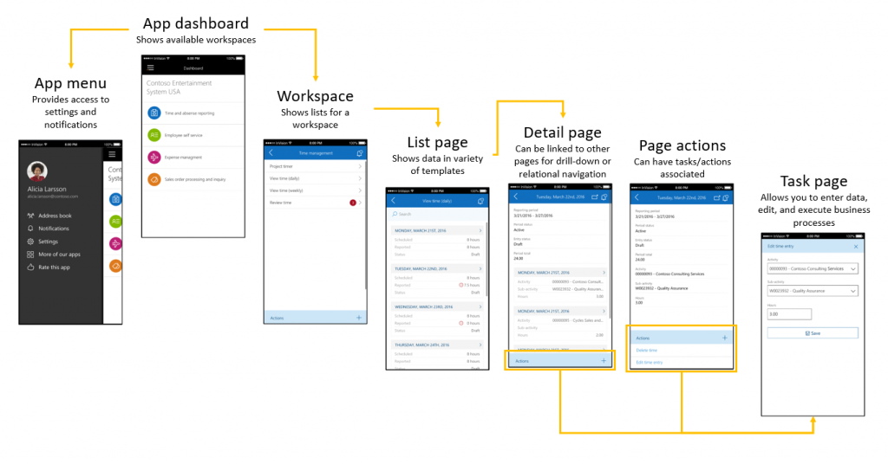
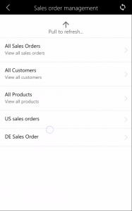

---
# required metadata

title: Mobile platform for Dynamics 365 for Operations
description: Microsoft Dynamics 365 for Operations includes support for a mobile phone app. The mobile approach lets you reuse business logic and modeling from the product. It also enables rich offline and mobile interactions, and an easy-to-use designer experience. Developers can create simplified forms in Microsoft Visual Studio and then design mobile pages that expose this functionality. This mobile solution makes it easy to change the forms and mobile app definitions to include customizations that are made to the product. 
author: RobinARH
manager: AnnBe
ms.date: 04/04/2017
ms.topic: article
ms.prod: 
ms.service: Dynamics365Operations
ms.technology: 

# optional metadata

# ms.search.form: 
# ROBOTS: 
audience: Developer, IT Pro
# ms.devlang: 
ms.reviewer: annbe
ms.search.scope: Operations, Platform
# ms.tgt_pltfrm: 
ms.custom: 255544
ms.assetid: f5aa0c60-25cc-4453-8df9-efab19b7e272
ms.search.region: Global
# ms.search.industry: 
ms.author: shshabazz
ms.search.validFrom: 2016-11-30
ms.dyn365.ops.version: Platform update 3

---

# Mobile platform for Dynamics 365 for Operations

Microsoft Dynamics 365 for Operations includes support for a mobile phone app. The mobile approach lets you reuse business logic and modeling from the product. It also enables rich offline and mobile interactions, and an easy-to-use designer experience. Developers can create simplified forms in Microsoft Visual Studio and then design mobile pages that expose this functionality. This mobile solution makes it easy to change the forms and mobile app definitions to include customizations that are made to the product. 

In addition to this topic, there is a video series on create a mobile app:

[Tutorial 1: Building the sales order page](https://youtu.be/PdegfBxifl8)

[Tutorial 2: Building the sales order details page](https://youtu.be/mF-vlbnRte0)

[Tutorial 3: Building the create new sales order action](https://youtu.be/VYw9oTv9t3o)

[Tutorial 4: Adding a lookup to the create new sales order action](https://youtu.be/eNJKd0IYmZk)

[Tutorial 5: Adding a lookup and hiding pages using mobile business logic](https://youtu.be/kIJKk9J8FvI)

# Getting started with the mobile app

After you acquire a development environment, complete the following procedures to get started with development.

### Get the Fleet Management mobile forms

We have created new, purpose-built forms in the **Fleet Management** module. These forms are used specifically for the mobile app and aren't meant to be used through the web client.

1.  [Download the file that contains the Fleet Management project](https://github.com/Microsoft/Dynamics365-for-Operations-mobile-FleetManagementSamples) (.axpp file).
2.  Extract the contents of the zip file to a temporary location on the development computer.
3.  Import the project (.axpp) file by using Microsoft Visual Studio (click **Dynamics 365 for Operations** &gt; **Import Project**).
4.  After you've imported the project file, build the project or module.

### Get the sample workspace

We provide a sample workspace for Reservation management. This workspace is based on the **Fleet Management** module.

1.  [Download the file that contains the sample workspace](https://github.com/Microsoft/Dynamics365-for-Operations-mobile-FleetManagementSamples) (.xml file).
2.  Sign in to your non-production client. (You must sign in as a Microsoft Dynamics 365 for Operations administrator.)
3.  In the address bar, add **&mode=mobile** to the end of the URL, and then press Enter.
4.  In the client, go to **Settings** &gt; **Mobile app**. The mobile app designer will appear docked next to the Dynamics 365 for Operations client.
5.  Click the **Overflow** button (**…**), and then click **Import**.
6.  Click the **Browse** button that appears at the bottom of the page.
7.  In the file selection dialog box that appears, select one of the XML files that you previously extracted from the zip file.
8.  After the app has been loaded into the mobile app designer, click **Done** at the bottom of the page.
9.  Click **Publish workspace**.

### Get the mobile app

The mobile app is being made available for the most popular mobile operating systems. You must have a Dynamics 365 for Operations instance and valid user credentials in order to log in to the app.

-   Android (available now) - [Dynamics 365 for Operations on the Google Play Store](https://play.google.com/store/apps/details?id=com.microsoft.dynamics365.operations.mobile)
-   iPhone (available now) - [Dynamics 365 for Operations on the iTunes apps store](https://itunes.apple.com/us/app/dynamics-365-for-operations/id1180836730?mt=8)

## Understanding navigation in the mobile app
Navigation in the mobile app consists of four simple concepts: the dashboard, workspaces, pages, and actions. 

-   When you start the app, you land on the **dashboard**. On the **dashboard**, you can see a list of **workspaces** that are published in your Dynamics 365 for Operations environment.
-   In each **workspace**, you can see a list of **pages** that are available for that workspace.
-   On a **page**, you can view data that is collected from one or more Dynamics 365 for Operations forms.
-   From a **page**, you can navigate to other **pages** for related data, such as an entity details or lines.
-   On a **page**, you can see a list of **actions** that are available for that page.
-   **Actions** let you create or edit existing data.

### Notes

At any time, you can pull-to-refresh in the mobile app to make the mobile app update its data or metadata. After you edit an existing workspace or publish a workspace, be sure to pull-to-refresh in the mobile app, in either the list of workspaces (if you added a workspace or business logic) or the list of pages (if you modified a page or an action). Workspaces that have been published to Dynamics 365 for Operations are visible to all users. In Microsoft Dynamics 365 for Operations platform update 3, menu item security automatically hides pages that the user doesn’t have access to. If a user doesn’t have access to any pages in a workspace, the workspace itself is hidden.

## Using the mobile app designer
The mobile app designer lets you select the specific data fields from forms that should appear in the mobile app. 

1.  Open the Dynamics 365 for Operations client. Include the **&mode=mobile** parameter in the URL to enable the designer.
2.  Go to **Settings** &gt; **Mobile app**.
3.  Create a new workspace, or select an existing workspace to edit.
4.  Specify the name of the workspace, an icon, and a color.
5.  Add pages to the workspace, or edit an existing page.
6.  Specify the name of the page.
7.  Click **Select Fields** to select the data fields to add to the page.
8.  Open the forms that have the data fields that you want to add, and then click the yellow plus sign (+) that appears next to the fields. The fields are added in the order that you select them in. You can add fields from multiple forms, in any order.
9.  When you've finished selecting fields, click **Done**.
10. If you've added a field list to the page, you will see that the **List** type is specified for one of the items in the field list. You can optionally add a details page for items in that list by following these steps:
    1.  Select the list by clicking on it in the designer.
    2.  Click **Add details page**.
    3.  Repeat steps 6 through 10 as you require.

### Refreshing the app after you make changes

| Type of change                                                                            | Description                                                                                                                                                                                                                                                                                                          |
|-------------------------------------------------------------------------------------------|----------------------------------------------------------------------------------------------------------------------------------------------------------------------------------------------------------------------------------------------------------------------------------------------------------------------|
| New workspaces, deleted workspaces, or changes to the name, color, or icon of a workspace | Pull-to-refresh from the main landing page (dashboard) of the app, where you see the list of workspaces.  |
| All other changes (new or changed pages or actions, or changes to business logic)         | Pull-to-refresh from the workspace that has the edited pages or actions.                                              |

## Design considerations for the mobile app platform
The mobile app platform doesn't assume connectivity to Dynamics 365 for Operations. Activities such as navigation, data view, and data entry don't require server connectivity after data has been cached.

## Architecture
The mobile app communicates with Application Object Server (AOS) to get the metadata for the mobile workspaces (and the pages and the fields that appear on the page), and to get the data for the fields on the pages. Each time that the mobile app requests data for a page, AOS creates a new session that uses the context of the user who is using the mobile app. AOS then uses the user's context to open the corresponding forms (by using the corresponding menu items). AOS can open multiple forms in quick succession and perform actions on those forms (for example, filtering, opening FactBoxes, changing tab pages, and clicking buttons). Any business logic on the forms is also run as usual. Through that process, AOS collects the data values from the requested fields and then sends that data back to the mobile app. 

## Page design guidelines
Before you begin to use the designer to build pages and actions, it’s important that you plan the overall design of the mobile workspace that you want to build. We recommend that you orient your design around the entities that you plan to use in the mobile workspace. Don't begin by thinking about the forms that you want to use. From the perspective of the mobile app, the forms are just a mechanism for retrieving data, and the run-time UI behavior of a form isn't applicable to the mobile app. Therefore, you should first identify your entities and the relationships between them. For each entity, the following questions will help you decide how you should design your forms and pages.

### How do I create a list view for an entity in the mobile app?

1.  Identify or create a form in Dynamics 365 for Operations that contains a grid for the entity.
2.  Make sure that the grid is bound to the table that represents the entity.
3.  Make sure that the form has a menu item that is root-navigable.
4.  Make sure that the form can be opened directly via a URL that includes the menu item parameter.
5.  Make sure that the filter pane enables the grid to be filtered based on the desired fields.
6.  In the designer, create a page for the entity.
7.  In the designer, put only a list on the page.
8.  In the designer, put the desired fields in the list on the page.

### What if I don’t want a list view for this entity?

If you want just a details view for an entity, it's likely that the entity is a singleton for a given context (such as a given user or a given company). This pattern applies, for example, to a details view for an employee’s own profile in a self-service workspace or a details view for the company context that is used for the current session. See the guidelines for creating a page for a details view.

### How do I create a details view for an entity in the mobile app?

1.  Identify or create a form in Dynamics 365 for Operations that contains the details view for this entity.
2.  Make sure that the Master Root Data Source on the form is bound to the table that represents the entity.
3.  Make sure that the form has a menu item that is root-navigable.
4.  Make sure that the form can be opened directly via a URL that includes the menu item parameter.
5.  In the designer, create a page for the entity.
6.  In the designer, put the desired fields on the page.

### How do I create list-to-details navigation for an entity in the mobile app?

1.  Make sure that you've created both a list view page and a details view page for the entity by using the designer.
2.  Make sure that the entity for the list view is the same as the entity for the details view. In other words, the table that is bound to the grid on the form that is used for the list view must be the same table that is the Master Root Data Source on the form that is used for the details view.
3.  Make sure that the form that is used for the details view can be filtered on a unique key field by using the filter pane.
4.  In the designer, make sure that the list view page is linked to the details view page. Click the list, open the properties, and then set the details view page by using the lookup. 

### How do I add a reference field that enables navigation to a related entity?

1.  Make sure that either a list view page or a details view page exists for the entity that contains the reference.
2.  Make sure that the page contains the reference field from the entity that is being referenced.
3.  Make sure that the referenced field is bound to the referenced entity’s data source, and that the referenced entity is *outer joined* (1-0..1) or *inner joined* (1-1) to the data source for the entity that contains the reference. For example, in the following illustration, FMRental is the entity that contains the reference, and FMVehicle is the referenced entity.

4.  Make sure that you've created a separate details view page for the entity that is being referenced.
5.  Make sure that the reference field has been added to the page.
6.  In the designer, make sure that the reference field has been linked to the details view for the referenced entity. For example, in the following illustration, Vehicle-details is the details view page for the referenced entity.

### How do I add a list that contains items from a related entity to a details view page?

###### How do I make the list show up in-line in the details view?

1.  Identify or create a form in Dynamics 365 for Operations that contains the details view for the entity, and make sure that the form adheres to the guidelines in the "How do I create a details view for an entity in the mobile app" section.
2.  Make sure that the form contains a grid that is bound to the table that represents the related entity.
3.  Make sure that the table for the related entity is *active joined* to the table for the entity that contains the reference.
4.  Create a details view page that contains the desired fields for the entity, and that also contains a list that has the desired fields from the related entity.

###### How do I make the list accessible from a link in the details view (instead of in-line)?

1.  Identify or create a form in Dynamics 365 for Operations that contains the details view for the entity, and make sure that the form adheres to the guidelines in the "How do I create a details view for an entity in the mobile app" section.
2.  Make sure that the form contains a grid that is bound to the table that represents the related entity.
3.  Make sure that the table for the related entity is *active joined* to the table for the entity that contains the reference.
4.  Use the form to create a details view page that contains the desired fields for the entity.
5.  Use the same form to create a separate list view page that contains only a list that has the desired fields from the related entity.
6.  On the details view page, add a PageLinkControl that links to the list view page. Currently, you must use business logic to add the PageLinkControl. The following example show the code that Fleet Management uses.

        function main(metadataService, dataService, cacheService, $q) { 
            return { 
                appInit: function (appMetadata) { 
                    metadataService.addLink( 
                        'Customer-details', // the Page to add the link to 
                        'Customer-rentals', // the Page the link goes to 
                        'cust-rentals-nav-control', // unique name for the control 
                        'Rentals', // text to display for the link in the UI 
                        true, // show/hide the count for items on the linked page 
                        ); 
                }, 
            }; 
        }

###### How do I read data from a hidden page?

1.  Identify or create a page that contains the controls with the data that you want.
2.  Refer to the following code example, which hides the page from the navigation menus, and accesses data on the page using the provided APIs. Note that 'My-Hidden-Page' and 'My-Field-Id' are the names of the page and control, respectively, and can be found when viewing the corresponding page in the designer.

        function main(metadataService, dataService, cacheService, $q) {
            myField1Value = ''; // This variable will be populated in appInit, and can then be used elsewhere in the business logic. 
            return { 
                appInit: function (appMetadata) { 
                    var myHiddenPage = metadataService.findPage('My-Hidden-Page');
                    if(myHiddenPage) {
                        var dataPromise = dataService.getPageData(myHiddenPage.Id,'','',0);
                        dataPromise.then(function (result) {
                            var myField1Id = metadataService.findControl(myHiddenPage, 'My-Field-1').Id;
                            myField1Value = result.data[myField1Id];
                        }
                    }
            }; 
        }

## Action design guidelines
Actions let users create, update, or delete data, and also run business processes on that data (such as *submit*, *confirm*, and *post*). A user who completes an action first supplies the data for the action (if the action accepts data input). When the user has finished supplying the data, the action is put into a queue of similar actions (which are sometimes referred to as *data sync operations*). If the device is connected/online, the queue is processed immediately. Otherwise, it's processed the next time that the device is connected. The queue is processed asynchronously and doesn’t require the user’s attention unless there is an error during data synchronization. Errors of this type can occur because of server-side data validation. Actions are powered by a server-side mechanism that resembles Task recordings. This mechanism extracts the user’s input from the action and then automatically runs the business process steps on the server by using the input values that the user supplied. The mechanism automatically opens forms, clicks buttons on the forms, and enters the user's input into controls on the forms. This process of playing back the action against the forms on the server occurs asynchronously, against “headless” forms. The mobile app informs the user when the process is completed, and shows the user any info, warning, or error messages that the forms logged. When you design an action, it’s important that you first consider what entity the action is related to. In the current framework, an action must operate on only one entity. An action should not update multiple entities at the same time. For example, an action to create a new sales order should create only the header for the order. It should not also try to create lines, because the lines are separate entities. When you decide to design the action, consider the following questions to determine how to proceed.

### How do I design an action that enables an entity to be created?

1.  Identify or create a list view page for the entity.
2.  Make sure that the form that is used for the list view page includes a **New** button that can be used to add new records to the list.
3.  Use the designer to create a new action for the page. While you're designing the action, be careful not to perform any unnecessary actions. Enter data only in those fields that should be available to the user, and click only those buttons that are required (for example the **New** button and the **Save** button).

### How do I design an action that enables an entity to be edited?

1.  Identify or create a details view page for the entity.
2.  Make sure that the form that is used for the details view page includes an **Edit** button that can be used to edit the visible record.
3.  Make sure that the form that is used for the details view page lets users open a specific record by applying filters in the filter pane.
4.  Use the designer to create a new action for the page. While you're designing the action, be careful not to perform any unnecessary actions. Enter data only in those fields that should be available to the user, and click only those buttons that are required (for example, the **Edit** button and the **Save** button).

### How do I design an action that enables an entity to be deleted?

1.  Identify or create a details view page for the entity.
2.  Make sure that the form that is used for the details view page includes a **Delete** button that can be used to delete the visible record.
3.  Make sure that the form that is used for the details view page lets users open a specific record by applying filters in the filter pane.
4.  Use the designer to create a new action for the page, and just click **Delete** as a part of the process of designing the action.

### How do I design an action that enables a business action to be performed on an entity?

1.  Identify or create a details view page for the entity.
2.  Make sure that the form that is used for the details view page includes a **Delete** button that can be used to delete the visible record.
3.  Make sure that the form that is used for the details view page lets users open a specific record by applying filters in the filter pane.
4.  Use the designer to create a new action for the page, and just perform the steps that are required in the business action. You don't necessarily have to enter data in fields as part of the action. For an action such as *submit*, you just have to click the **Submit** button (and acknowledge any confirmations that appear).

### How do I design an action that enables a field value to be set via a rich lookup?

Lookups for fields in the mobile app don't have a correlation to the advanced lookup behaviors in Dynamics 365 for Operations. Regardless of whether you have a custom lookup in Dynamics 365 for Operations or an automatic lookup that uses a simple query, the mobile app doesn't run existing lookup code when it must determine which UI to show the user. (Remember that the user might be offline while he or she is using the app, and server-side code isn’t run until the action is synchronized.) However, lookup/control overrides such as *modified* are run when the value is set by the mobile back end as it synchronizes the data from the action. When the mobile app detects that a field on an action was selected from a lookup field on a form, it shows a device-native combo box/list picker control, and populates the items by directly querying the backing table of that lookup field. The items in the list show the user data from the TitleField for records in that table. Follow these steps to add the rich lookup experience to your action. This lookup experience includes a full-page multi-column lookup selector that has offline search.

1.  Identify or create a list view page for the entity behind the lookup. You can reuse existing list view pages that you've already created.
2.  After you've finished designing the action, select the field to add rich lookup functionality to, and then click **Properties**.
3.  In the **Control properties** dialog box, select the list view page that you identified or created in step 1, and set the other related properties. 

4.  Save and publish your changes to the action.

If you don't see the property for the existing list view page or can't access the **Control properties** dialog box when you're designing your action, you might be using an older build of Dynamics 365 for Operations. In this case, you can still add rich lookup functionality by using a business logic file.

    function main(metadataService, dataService, cacheService, $q) { 
        return { 
            appInit: function (appMetadata) { 
                metadataService.configureLookup(
                    // specify the name of the Action to add the lookup to
                    'Add-Reservation',                      
                    // specify the name of the Action’s field to add the lookup to
                    'FMRental_Customer',                    
                    { 
                        // specify the name of the Page for the Entity for the lookup
                        lookupPage: 'All-Customers',          
                        // specify the Page’s field which contains the value to set on the lookup
                     // this value should be the same value you can type into the field on the Form
                        valueField: 'FMCustomer_RecId',        
                        // specify the Page’s field which contains the value to display to the user
                        // this value is only used for display. The value field is passed to the Form
                        displayField: 'FMCustomer_FullName',  
                        // set this to true to enable the rich lookup
                        showLookupPage: true                  
                    }
                );
            }, 
        }; 
    }

### How do I prevent an action from appearing in the list of actions for a page?

To prevent an action from appearing in the list of actions for any page, call the following code from the **appInit()** section of your business logic. In this code, **action-name** is the name of your action (as specified in the **Action name** field in the designer).

    function main(metadataService, dataService, cacheService, $q) { 
        return { 
            appInit: function (appMetadata) { 
                metadataService.configureAction('action-name', { visible: false });
            }, 
        }; 
    }

## Form design requirements
This section provides valuable guidelines for building Dynamics 365 for Operations forms that work well with the mobile app.

-   Each form must have an associated Display Menu Item.
    -   The Display Menu Item's **Allow Root Navigation** property must be set to **Yes**. This setting enables the mobile framework to open the form that is referenced by the menu item.
-   Each form must be directly accessible via its Display Menu Item.
    -   To verify accessibility, open the menu item via a URL. Just append **&mi=** to the URL, where the value is the Application Object Tree (AOT) name of your menu item.
    -   If the form doesn't open or show data when you access it in this way, the form won't work with the mobile app.
-   Each form that shows data must have one Master Root Data Source.
    -   This data source must be the first data source on the form (top-most in the designer).
    -   This data source must not be joined to any other data sources.
-   Each form must work with the data source filters.
    -   After you open the form in the web client, open the filter pane by using the **Show filters** button. 
    
         
        
        Then click **Add a filter field**, and verify that the Master Root Data Source appears as the table for fields in the list of available fields. Other tables can also appear, but the Master Root Data Source **must** appear in this list. Otherwise, the mobile app won't enable searches and navigation that uses context.
    -   Searching: The mobile app does online searches against Dynamics 365 for Operations data by using the Filters framework behind the scenes.
    -   Navigation that uses context: The mobile app enables list-to-details navigation (and other context-aware navigation) by first opening the target form via the menu item and then using the Filters framework to show only the specified record context.
    -   List-to-details navigation: The table that the grid is bound to on form A (the list form) must be the Master Root Data Source on the details form (form B). When a user selects a record in the list on form A, the mobile framework navigates with record context by applying filters on form B that uniquely identify the record.

### Design considerations

#### Using data methods

You can use display methods to show data on pages (both list type pages and detail type pages). However, there are two key points to remember when you use display methods:

-   **Searching** – When a user performs an “online” search (that is, a search that is run against data in Dynamics 365 for Operations instead of locally cached data), the search won't match against display methods, because the Filtering framework in Dynamics 365 for Operations doesn't support searches against data methods. However, when a user does a search against locally cached data, the search will match against display methods, provided that the records have been cached on the device.
-   **Offline** – If a user creates or updates data while his or her device isn’t connected to the Dynamics 365 for Operations server, temporary records are created in the local cache. Because these temporary records haven't yet been processed in Dynamics 365 for Operations, if the records have any fields that are automatically populated or defaults by server-side business logic, these fields will remain empty until the records have been synced with Dynamics 365 for Operations. Display methods fall into this category of fields that will be empty for a temporary record.

#### Designing for offline

Unlike the Dynamics 365 for Operations web client, which is highly connected to the Dynamics 365 for Operations server and maintains an open user session that has open forms on the server, the mobile app creates user sessions (and opens forms) only in short bursts while the app is being synced with the server (via data read for pages, or via data write/update for actions). If there are no actions to sync with the server, and if the local data cache is up to date, the mobile app won't communicate with the Dynamics 365 for Operations server as a user navigates around the app (unless the user triggers an explicit pull-to-refresh). It's important that you keep this data flow pattern in mind while you design pages and actions in the mobile app. You should not expect Dynamics 365 for Operations form logic to run every time that a page is loaded or an action is started. You should also never expect form logic to run while a user is completing an action. Form logic is run only when the action is being synced with the Dynamics 365 for Operations server. The following list describes the only times when you should expect Form logic to run. **Dynamics 365 for Operations form logic runs right before a page is opened on the mobile app for the first time.**

1.  When a user first opens a page, the mobile app reaches out to Dynamics 365 for Operations and opens the associated forms. *During this process, logic such as form init and data source init is all run in the usual manner.*
2.  The mobile app framework reads the required data directly from the controls on the forms and sends the data back to the mobile app.
3.  The mobile app caches the data and shows it in the page on the mobile app.
4.  Future attempts to open the page will load the cached data. *These attempts won't run the form logic again, unless the user explicitly refreshes the page or the cache expires. (Currently, the cache set to expire after 30 minutes.)*

**Processing an action that has been submitted to the server from the mobile app**

1.  When a user opens an action and fills in the data in that action, *no form logic is run*. A user can complete an action while he or she is either offline or online. The system behaves the same way in both cases.
2.  After the user clicks **Done**/**Save** on the action, the mobile app queues a data synchronization operation. This operation will be synced with the server when the mobile app is connected to the Internet.
3.  When an Internet connection is detected (which can happen immediately after the action is completed) the mobile app sends the data synchronization operation to the Dynamics 365 for Operations server for processing.
4.  While the operation is processed on the server, the framework opens the associated forms and enters the data from the action by passing values into the form controls. *During this process, Dynamics 365 for Operations form logic is run in the usual manner (init, modified, clicked, and so on, are all run).* However, the mobile user might have moved to a different part of the app while this processing is occurring. *Any form logic that shows/hides controls will have no effect on the UI that is seen in the mobile app.* Therefore, to minimize synchronization times, it's best not to include any UI logic on the form.

#### Building mobile versions of existing forms

If you decide to modify existing forms so that they work with the mobile framework, instead of building new mobile-specific forms, you might have to conditionally change the form's behavior for mobile-specific scenarios. You can use the following static X++ application programming interfaces (APIs) in your X++ code to determine whether the code is being accessed during a session where a web client user is designing pages/actions or during a session that the mobile framework back end created to load pages/actions for a mobile user. **When a form is being used with the mobile designer**

    SysTaskRecorderController::isDesigningApp()

**When a form is being used by the mobile framework back end to load pages and run actions**

    SysTaskRecorderController::isExecutingApp()

#### Dynamics 365 for Operations form control support

The Dynamics 365 for Operations form controls for the various base data types (strings, dates, and numbers) and grids are supported. However, a few common controls have limited support. **Reference groups** Fields from within Reference groups controls are compatible when you design pages. However, they aren't compatible when you design Actions. Although you might be able to select these fields without experience any issue, Reference groups have a fundamental incompatibility with the mobile framework. We recommend that you not use Reference groups. Instead, add a control directly to the form, and then bind the control directly to the surrogate foreign key (SFK) by using the property sheet.
