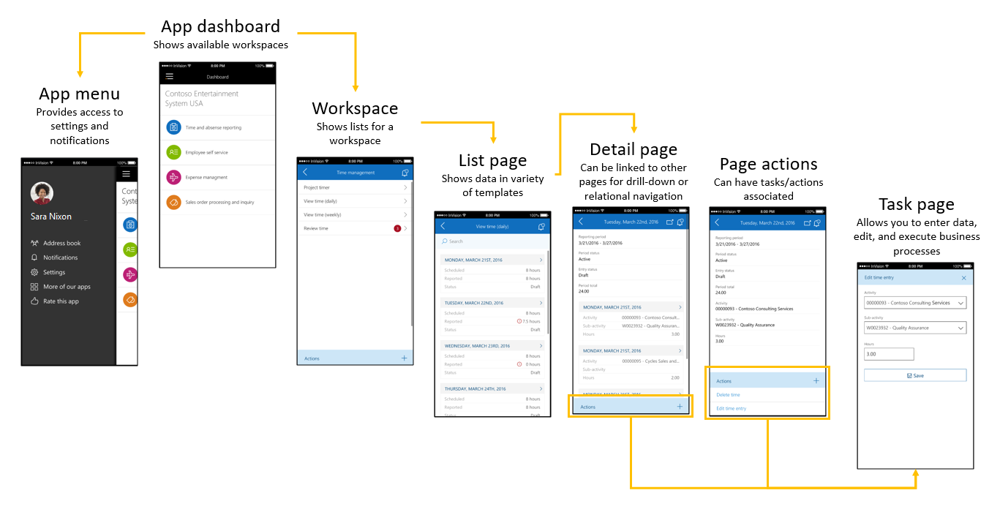

---
# required metadata

title: Mobile platform for Finance and Operations
description: Microsoft Dynamics 365 for Finance and Operations includes support for a mobile phone app that enables rich offline and mobile interactions, and an easy-to-use designer experience.
author: RobinARH
manager: AnnBe
ms.date: 06/20/2017
ms.topic: article
ms.prod: 
ms.service: dynamics-ax-platform
ms.technology: 

# optional metadata

# ms.search.form: 
# ROBOTS: 
audience: Developer, IT Pro
# ms.devlang: 
ms.reviewer: annbe
ms.search.scope: Operations, Platform, UnifiedOperations
# ms.tgt_pltfrm: 
ms.custom: 255544
ms.assetid: f5aa0c60-25cc-4453-8df9-efab19b7e272
ms.search.region: Global
# ms.search.industry: 
ms.author: shshabazz
ms.search.validFrom: 2016-11-30
ms.dyn365.ops.version: Platform update 3

---

# Mobile platform for Finance and Operations

Microsoft Dynamics 365 for Finance and Operations includes support for a mobile phone app. The mobile approach lets you reuse business logic and modeling from the product. It also enables rich offline and mobile interactions, and an easy-to-use designer experience. Developers can create simplified forms in Microsoft Visual Studio and then design mobile pages that expose this functionality. This mobile solution makes it easy to change the forms and mobile app definitions to include customizations that are made to the product. 

In addition to this topic, there is a video series on create a mobile app:

[Tutorial 1: Building the sales order page](https://youtu.be/PdegfBxifl8)

[Tutorial 2: Building the sales order details page](https://youtu.be/mF-vlbnRte0)

[Tutorial 3: Building the create new sales order action](https://youtu.be/VYw9oTv9t3o)

[Tutorial 4: Adding a lookup to the create new sales order action](https://youtu.be/eNJKd0IYmZk)

[Tutorial 5: Adding a lookup and hiding pages using mobile business logic](https://youtu.be/kIJKk9J8FvI)

# Getting started with the mobile app

After you acquire a development environment, complete the following procedures to get started with development.

### Get the Fleet Management mobile forms

We have created new, purpose-built forms in the **Fleet Management** module. These forms are used specifically for the mobile app and aren't meant to be used through the web client.

1.  [Download the file that contains the Fleet Management project](https://github.com/Microsoft/Dynamics365-for-Operations-mobile-FleetManagementSamples) (.axpp file).
2.  Extract the contents of the zip file to a temporary location on the development computer.
3.  Import the project (.axpp) file by using Microsoft Visual Studio (click **Finance and Operations** &gt; **Import Project**).
4.  After you've imported the project file, build the project or module.

### Get the sample workspace

We provide a sample workspace for Reservation management. This workspace is based on the **Fleet Management** module.

1.  [Download the file that contains the sample workspace](https://github.com/Microsoft/Dynamics365-for-Operations-mobile-FleetManagementSamples) (.xml file).
2.  Sign in to your non-production client. (You must sign in as a Microsoft Dynamics 365 for Finance and Operations administrator.)
3.  In the address bar, add **&mode=mobile** to the end of the URL, and then press Enter.
4.  In the client, go to **Settings** &gt; **Mobile app**. The mobile app designer will appear docked next to the Finance and Operations client.
5.  Click the **Overflow** button (**…**), and then click **Import**.
6.  Click the **Browse** button that appears at the bottom of the page.
7.  In the file selection dialog box that appears, select one of the XML files that you previously extracted from the zip file.
8.  After the app has been loaded into the mobile app designer, click **Done** at the bottom of the page.
9.  Click **Publish workspace**.

### Get the mobile app

The mobile app is being made available for the most popular mobile operating systems. You must have a Finance and Operations instance and valid user credentials in order to log in to the app.

-   Android (available now) - [Finance and Operations on the Google Play Store](https://play.google.com/store/apps/details?id=com.microsoft.dynamics365.operations.mobile)
-   iPhone (available now) - [Finance and Operations on the iTunes apps store](https://itunes.apple.com/us/app/dynamics-365-for-operations/id1180836730?mt=8)

## Understanding navigation in the mobile app
Navigation in the mobile app consists of four simple concepts: the dashboard, workspaces, pages, and actions. 

-   When you start the app, you land on the **dashboard**. On the **dashboard**, you can see a list of **workspaces** that are published in your Finance and Operations environment.
-   In each **workspace**, you can see a list of **pages** that are available for that workspace.
-   On a **page**, you can view data that is collected from one or more Finance and Operations forms.
-   From a **page**, you can navigate to other **pages** for related data, such as an entity details or lines.
-   On a **page**, you can see a list of **actions** that are available for that page.
-   **Actions** let you create or edit existing data.

### Notes

At any time, you can pull-to-refresh in the mobile app to make the mobile app update its data or metadata. After you edit an existing workspace or publish a workspace, be sure to pull-to-refresh in the mobile app, in either the list of workspaces (if you added a workspace or business logic) or the list of pages (if you modified a page or an action). Workspaces that have been published to Finance and Operations are visible to all users. In Microsoft Dynamics 365 for Finance and Operations platform update 3, menu item security automatically hides pages that the user doesn’t have access to. If a user doesn’t have access to any pages in a workspace, the workspace itself is hidden.

## Using the mobile app designer
The mobile app designer lets you select the specific data fields from forms that should appear in the mobile app. 

1.  Open the Finance and Operations client. Include the **&mode=mobile** parameter in the URL to enable the designer.
2.  Go to **Settings** &gt; **Mobile app**.
3.  Create a new workspace, or select an existing workspace to edit.
4.  Specify the name of the workspace, an icon, and a color.
5.  Add pages to the workspace, or edit an existing page.
6.  Specify the name of the page.
7.  Click **Select Fields** to select the data fields to add to the page.
8.  Open the forms that have the data fields that you want to add, and then click the yellow plus sign (+) that appears next to the fields. The fields are added in the order that you select them in. You can add fields from multiple forms, in any order.
9.  When you've finished selecting fields, click **Done**.
10. If you've added a field list to the page, you will see that the **List** type is specified for one of the items in the field list. You can optionally add a details page for items in that list by following these steps:
    1.  Select the list by clicking on it in the designer.
    2.  Click **Add details page**.
    3.  Repeat steps 6 through 10 as you require.

### Refreshing the app after you make changes

| Type of change     | Description                      |
|-------|----------------------------------------------|
| New workspaces, deleted workspaces, or changes to the name, color, or icon of a workspace | Pull-to-refresh from the main landing page (dashboard) of the app, where you see the list of workspaces.  |
| All other changes (new or changed pages or actions, or changes to business logic)         | Pull-to-refresh from the workspace that has the edited pages or actions. ![Pull-to-refresh from a workspace)(media/refreshpages.png)                                             |
