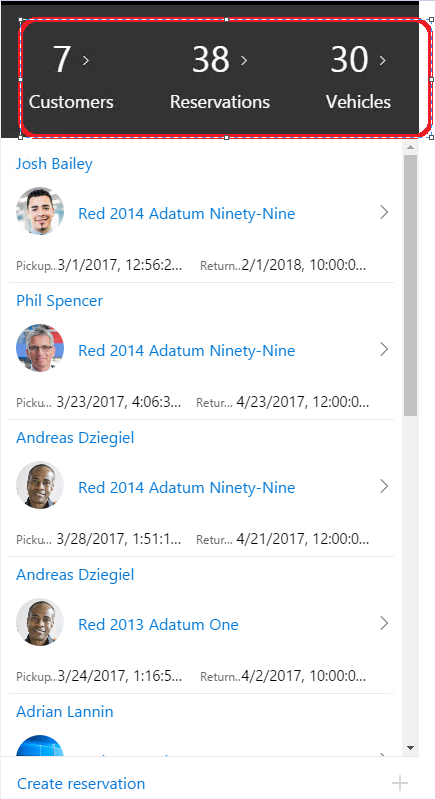

---
# required metadata

title: Use regular fields to display counts or totals
description: This topic explains how to calculate a count that is correct and that displays quickly. 
author: makhabaz
manager: AnnBe
ms.date: 07/01/2017
ms.topic: article
ms.prod: 
ms.service: Dynamics365Operations
ms.technology: 

# optional metadata

# ms.search.form: 
# ROBOTS: 
audience: Developer, IT Pro
# ms.devlang: 
ms.reviewer: robinr
ms.search.scope: Operations, Platform
# ms.tgt_pltfrm: 
ms.custom: 255544
ms.assetid: 
ms.search.region: Global
# ms.search.industry: 
ms.author: makhabaz
ms.search.validFrom: 2017-07-20
ms.dyn365.ops.version: Platform update 3

---

# Use regular fields to display counts

Using the **pageLink** control for displaying counts (totals) can be slow, because it loads the target page and then counts the number of rows. Also, the count calculated can be incorrect, because there is a limit on the number of rows that are retreived.

To make mobile workspaces work more quickly, the recommended approach is to use a regular field to display the count and then model the field as a **pageLink control** in the mobile client. 

The following example uses the Fleet Management app. In the Fleet Management app, the workspace shows the total number of customers, reservations, and vehicles. Previously these counts were coming from a **pageLink** control that had "AllCustomers", "AllReservations" and "AllVehicles" as their targets respectively and the pageLink control was loading the rows and doing the count. (This is not the recommended approach.) 

Below are the steps to configure the workspace page to use the recommended approach.

1. Create a new form on the server to contain fields that are also on the server. (You can also use an existing form and add these new fields). In the following image, a new form **FMMobSummary** with three fields is created.

    
	
2. Create a page using the mobile app designer for the form **FMMobSummary**.

    
	
3. Update the business logic to transform the fields into a **pageLink** control. Use the **configureControl** method to add a navigation target to the fields. Doing that will configure the fields as **pageLink** controls. The arguments for **configureControl** are page name, control name and an object of properties to be updated.
	
4. Update the workspace design. Embed the summary page as a **part** in the workspace page. Reference the fields that are are now configured as **pageLink** controls. Provide a style and set the property **showCount:true** so that the count is shown on the **pageLink** control.

    

By using this approach you will also get the localized labels for **pageLink** controls. The result is a much faster experience when loading workspaces.

