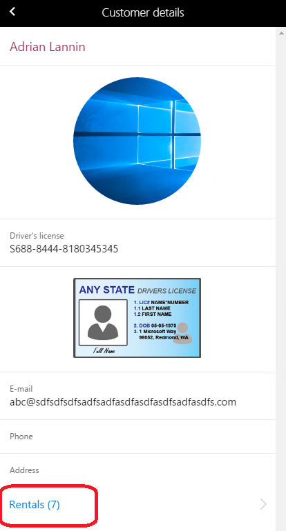
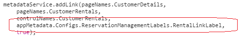
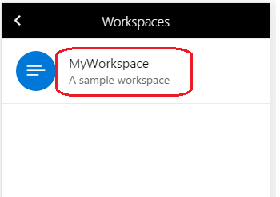

---
# required metadata

title: Localize workspaces on the server
description: Workspace classes can be used in multiple ways to provide localization support to workspaces.
author: makhabaz
manager: AnnBe
ms.date: 07/01/2017
ms.topic: article
ms.prod: 
ms.service: Dynamics365Operations
ms.technology: 

# optional metadata

# ms.search.form: 
# ROBOTS: 
audience: Developer, IT Pro
# ms.devlang: 
ms.reviewer: robinr
ms.search.scope: Operations, Platform
# ms.tgt_pltfrm: 
ms.custom: 255544
ms.assetid: 
ms.search.region: Global
# ms.search.industry: 
ms.author: makhabaz
ms.search.validFrom: 2017-07-20
ms.dyn365.ops.version: Platform update 3

---

# Localize workspaces on server
Workspace classes can be used in multiple ways to provide localization support to workspaces.

## Use config objects to pass localized labels
A config object can be added to the workspace metadata when it is requested by the mobile app. The config object can later be used to provide localization support. Suppose you have the following scenario where a workspace requires localized labels for the **pageLink** control that you added via the business logic.

 

The business logic for the app contains a call to the **addLink** method to add a link to Rentals page for the current customer. In this case, the label is "Rentals". The problem is that there isn't a localized label for the link and it will always show up as "Rentals".

To use a config object to provide localized labels:

1. Create a config class that contains the fields for the labels. One field, **rentalLinkLabel**, is added to the class that will contain the label for the **pageLink** control. The config class needs to be a data contract class.

    

2. The config class is used by a workspace class for the workspace. The workspace class requires the appId of the workspace. The appId is listed on the App designer, as shown in the following image.

    

3. The following image shows the workspace class looks like with the appId set on the attribute. The class also contains a method, **addConfig**, to set a config object that contains value for the label.

    

4. The following image shows the config object in appInit call in the mobile app.

    

5. The config object can now be used and passed to the addLink method instead of the hard-coded label.

    

## Use a workspace class to update workspace title and description
A workspace class can be used to provide localized strings for the workspace title and description. If you do not localize the title and description, the fields will be in the language you implemented them in. In this example, we will localize a workspace where "MyWorkspace" and "A sample workspace" are the title and description, respectively.

 

1. If you don't have a workspace class for your workspace, create one.
1. Override the **getWorkspaceMetadata** method to get the workspace metadata. You will need the workspace metadata in order to provide labels for workspace title and description fields.
1. Use the **workspaceTitle** and **workspaceDescription**  properties to set the workspace title and description from a label. In the following image, placeholders are assigned to the **workspaceTitle** and **workspaceDescription**  properties.

    

1. Build the workspace class.
1. Refresh the app list on the mobile client.
1. The followign image shows the title and description on a phone using English and Danish.

    

