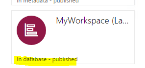

---
# required metadata

title: Configure a workspace by using the SysAppWorkspace class
description: You can use the **SysAppWorkspace** class to configure and publish workspaces on the server. 
author: makhabaz
manager: AnnBe
ms.date: 07/01/2017
ms.topic: article
ms.prod: 
ms.service: Dynamics365Operations
ms.technology: 

# optional metadata

# ms.search.form: 
# ROBOTS: 
audience: Developer, IT Pro
# ms.devlang: 
ms.reviewer: robinr
ms.search.scope: Operations, Platform
# ms.tgt_pltfrm: 
ms.custom: 255544
ms.assetid: 
ms.search.region: Global
# ms.search.industry: 
ms.author: makhabaz
ms.search.validFrom: 2017-07-20
ms.dyn365.ops.version: Platform update 3

---

# Configure a workspace by using the SysAppWorkspace class
You can use the **SysAppWorkspace** class to configure and publish workspaces on the server.

## Create a new workspace class
To use the **SysAppWorkspace** class for your worksapce, you need to create a new class for your workspace by extending the **SysAppWorkspace** class. The new class can then be used to modify workspace metadata along with providing hooks for mobile app life cycle management.

Follow the steps below to create  a new workspace class for your workspace.

1. Create a new class for your workspace and extend it from the **SysAppWorkspace** class.

    

2. Add the **SysAppWorkspaceAttribute** attribute to your class and provide the AppID of your workspace. You can find the AppId for your app from the Summary page in the mobile app designer.

    
    
    

3. (Optional) If your workspace is an AOT resource, then provide the AOT resource name as the second parameter to the **SysAppWorkspaceAttribute** constructor.

    

## Workspace life cycle methods
The workspace class provides the following methods that can be overridden.

### getWorkspaceMetadata
This method is called to retrieve workspace metadata. You can override this method to update the workspace metadata. For more information, see the "Workspace metadata classes" section below. Some ways you can use the metadata are:

+ Update the workspace, page, action and control metadata.
+ Provide custom configs.
+ Hide pages, actions and controls in a workspace.
+ Mark fields as mandatory.

### isWorkspaceHidden
This method can be overridden to hide or show the workspace on the mobile client. You can use custom parameters to determine if the workspace needs to be hidden for a particular user. For more information, see [Secure a mobile app workspace](secure-mobile-workspace.md).

### onBeginJob
This method is called before a job request is executed on the server. You can override this method to change the request parameters. You have access to the page or action name that the job request is for. Using **onBeginJob**, you can:

+ Change the filter context for the job. For example, if there is a scenario that requires that one record be sent, you can change the filter context to it.
+ You can change the job values. Job values are sent for a job that is initiated by actions on the mobile client. You can change or inspect values that are being sent to start a job on the server.

### onEndJob
This method is called after a job has been executed on the server. You can override this method to change the result that is sent back to mobile client. You have access to the page or action name that the job result is for. Using **onEndJob**, you can:

+ Change the job result. For example, you can change the values or add new set of values.
+ You can ignore the values that are being returned from server and instead send some other values back.

## Use the workspace class for publishing workspaces from AOT resources
Workspaces can live in the database as well as in AOT as resources. In order to provide visibility to workspaces stored in AOT resources you need to create a workspace class and point it to the AOT resource name that contains the workspace. Workspaces that are stored as AOT resource cannot be edited or deleted using the mobile app designer, they can only be exported.

To publish a workspace that resides in an AOT resource:

1. When you are developing a workspace that is stored in database, you must export it from the mobile app designer so that it can be stored as an AOT resource. The workspace will be exported as an xml file.

    

2. Delete the workspace from the mobile app designer.It will be loaded from an AOT resource later.

    

3. Create a new AOT resource and select the exported workspace for the resource.

    

4. Create a new class for your workspace that extends **SysAppWorkspace**. Apply the **SysAppWorkspaceAttribute** attribute to the class and provide the AppId and the AOT resource name which contains the resource.

    

5. Build the class and reopen the mobile app designer.

6. The workspace is now published. The workspace shows up in designer but cannot be edited or deleted. Note that the workspace is loaded from metadata.

    

## Updating workspaces that have already been published
If you have your workspace as part of AOT resource, you are not able to edit it from designer. If you would like to keep on working with this workspace follow the following steps.

For this scenario we are considering a workspace called "MyWorkspace" that exist in AOT and also have a backing class called "WorkspaceInAOT"

|   | |
|--|--|

1. Export the workspace using the app designer. (This will automatically create a new appID for workspaces that are stored in AOT)

2. Import the newly exported workspace using the app designer.
    a. (Optional) Change the name so that the newly added workspace can be differentiated.
    b. Copy the appID of the newly created workspace.

|   | |
|--|--|

3. Create a new class that extends from your backing class and apply the SysAppWorkspaceAttribute with the new appID.

    

Now you can keep on working with your new workspace and the backing class. Once you are done with the changes you can merge them with the AOT based workspace.

## Delete workspaces that are in AOT resource
When mobile workspaces are stored as AOT resource, they cannot be deleted via SysAppDesigner.
Follow the following steps to delete a workspace that exist as an AOT resource.

1. Delete the AOT resource that contains the workspace.

    

2. Delete the workspace class that was created for the workspace.

    

3. Do a full model build that contained the AOT resource and the class. For my demo I will do a full build of "Application Foundation" model as my AOT resource and workspace class resided in "Application Foundation"
Un-check everything from Options tab to speed up the full build.

    |||
    |--|--|

4. Once the build completed, reopen SysAppDesigner, the deleted workspace will no longer exist there.

## Workspace metadata classes
These classes can be used to inspect and update metadata related to D365 for Operations mobile workspace.

###  SysAppWorkspaceMetadata
This class represents the entire mobile workspace metadata. This class can be used for

1. Update workspace title
2. Update workspace description.
3. Get pages an actions that belong to the workspace
4. Adding custom config objects that will be passed to the mobile workspace.

### SysAppPageMetadata
This class represents a page metadata for a  mobile workspace. This class can be used for

1. Update page title
2. Update page description.
3. Order a page. Set the position of the page w.r.t. other pages that are shown on the workspace.
4. Hide the page from the workspace
5. Get control metadata for controls in the page.

### SysAppActionMetadata
This class represents an action metadata for a  mobile workspace. This class can be used for

1. Update action title
2. Update action description.
3. Order an action. Set the position of the action wrt. other actions that are shown on the workspace and on pages.
4. Hide the action
5. Get control metadata for controls in the action.

### SysAppControlMetadata
This class represents control metadata for controls on a page or action. This class can be used for

1. Update control label
2. Order a control. Set the position of the control relative to other controls in a page or action
3. Hide a control
4. Mark a control as mandatory.
