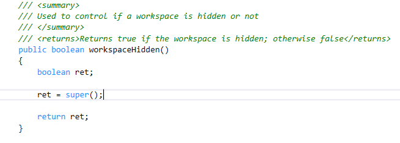

---
# required metadata

title: Secure workspaces using workspace class
description: 
author: makhabaz
manager: AnnBe
ms.date: 07/01/2017
ms.topic: article
ms.prod: 
ms.service: Dynamics365Operations
ms.technology: 

# optional metadata

# ms.search.form: 
# ROBOTS: 
audience: Developer, IT Pro
# ms.devlang: 
ms.reviewer: robinr
ms.search.scope: Operations, Platform
# ms.tgt_pltfrm: 
ms.custom: 255544
ms.assetid: 
ms.search.region: Global
# ms.search.industry: 
ms.author: makhabaz
ms.search.validFrom: 2017-07-20
ms.dyn365.ops.version: Platform update 3

---

# Securing workspaces using workspace class
Workspace class can be used to secure workspaces. Below are the ways workspaces can be secured.

## Assigning a menu item to workspace
Workspaces can be tied to an operations menu item. Users who do not have access to the menu item will not be able to use the workspace. In this way the workspace is only shown to users who have rights to the menu item. 

If a menu item is not assigned to a workspace than the workspace is always shown to the user.

Follow the steps below to secure your workspaces by assigning a menu item.

1. Add "SysAppWorkspaceSecurityAttribute" to the workspace class providing a menu item name that you would like to assign to the workspace.
2. Build and then test by logging in to mobile app with a user that don’t have access to the menu item 

 

## Overriding the workspaceHidden method
We have also added a hook point where the maker can decide if the workspace needs to be hidden/shown based on any parameters and so can override the decision made by the base workspace api.

By overriding the workspaceHidden method, you are in control of hiding or showing the workspace.

 

## Combining the above 2 methods
You can mix both options i.e. assign a menu item to do the additional security check and then can use the workspaceHidden to do any additional checks and return true or false
