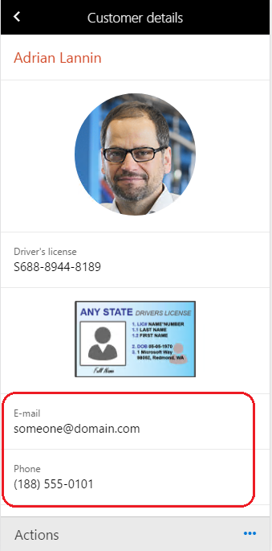

---
# required metadata

title: Customize the display of a field
description: Fields shown on mobile app pages can be customized to be shown as an email, a phone number, or a URL.
author: makhabaz
manager: AnnBe
ms.date: 07/01/2017
ms.topic: article
ms.prod: 
ms.service: Dynamics365Operations
ms.technology: 

# optional metadata

# ms.search.form: 
# ROBOTS: 
audience: Developer, IT Pro
# ms.devlang: 
ms.reviewer: robinr
ms.search.scope: Operations, Platform
# ms.tgt_pltfrm: 
ms.custom: 255544
ms.assetid: 
ms.search.region: Global
# ms.search.industry: 
ms.author: makhabaz
ms.search.validFrom: 2017-07-20
ms.dyn365.ops.version: Platform update 3

---

# Customize the display of a field

Fields shown on mobile app pages can be customized to be shown as an email, a phone number, or a URL.

## Email field
If you mark a field as email using business logic, clicking on the field will open the mobile default email app with the field value shown as email address in the app.

## Phone field
If you mark a field as phone number using business logic, clicking on the field will open the mobile dialer app with the field value shown as phone number in the app. 

> [!NOTE]
> On iOS, if the phone number is not valid it might not trigger the mobile dialer app.

## URL field
If you mark a field as URL using business logic, clicking on the field will open the url in the mobile default browser with the field value shown in the address bar.

> [!NOTE]
> On iOS, you need to provide the complete URL (starting from a protocol like http) in order for it to open the browser. A URL like www.microsoft.com will not work. The URL needs to be http:\/\/www.microsoft.com.

## Example
This example shows how to configure the customer email and phone fields so that they can clicked and opened in the appropriate iOS apps.

Before the field is customized, the fields are not clickable, as shown in the following image.

 

To specify that the field is a link:

1. Add the following lines to the **appInit** method. You can call **configureControl** and pass in the page name and control name and then supplying in the LinkType for the control. **Telephone**, **Email**, and **Url** are supported.

    

2. Upload the updated business logic file using the mobile app designer.

3. Refresh the workspace metadata in the mobile client.

4. The fields are shown as links.

    

