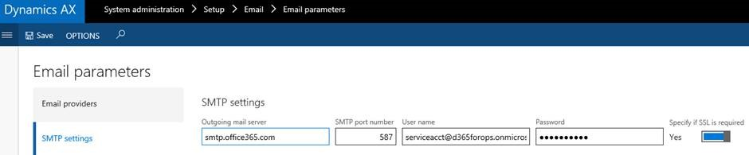

---
# required metadata

title: Office integration troubleshooting | Microsoft Docs
description: This article provides answers to questions, tips, and troubleshooting information for the Microsoft Dynamics 365 for Operations Office integration capabilities. The questions and issues discussed range across user, administration, and development scenarios.
author: ChrisGarty
manager: AnnBe
ms.date: 2016-03-29 20:37:22
ms.topic: article
ms.prod: 
ms.service: Dynamics365Operations
ms.technology: 

# optional metadata

keywords: OfficeAppParameters
# ROBOTS: 
audience: Developer, IT Pro
# ms.devlang: 
ms.reviewer: annbe
ms.suite: Released- Dynamics AX 7.0.0
# ms.tgt_pltfrm: 
ms.custom: 72263
ms.assetid: d17f8f57-fd20-4c01-93ab-962d7b11c069
ms.region: Global
# ms.industry: 
ms.author: cgarty

---

# Office integration troubleshooting

This article provides answers to questions, tips, and troubleshooting information for the Microsoft Dynamics 365 for Operations Office integration capabilities. The questions and issues discussed range across user, administration, and development scenarios.

Frequently asked questions
--------------------------

### What platforms are supported for the Office Add-ins?

The Excel Add-in and Word Add-in are built using the Office Web/JavaScript Add-in framework that was initially released for Office 2013, but received significant updates in Office 2016. If needed, read details about [Office Add-in host and platform availability](http://dev.office.com/add-in-availability). The Excel Add-in requires the ExcelAPI 1.2, so use the [Office Add-in host and platform availability](http://dev.office.com/add-in-availability) matrix to view which platforms it is supported on. For many users, the phrase "Excel 2016 with the latest updates" is sufficient.

### Is Office for Mac supported for the Excel Add-in?

Yes. The Excel Add-in requires the ExcelAPI 1.2, so use the [Office Add-in host and platform availability](http://dev.office.com/add-in-availability) matrix to view which platforms it is supported on.

### What version of Office is needed to allow the Excel Add-in to support ADFS?

Read more about that in the troubleshooting section below.

### How can Office be forced into updating?

If your Office build does not update then it might be because you are on the deferred track ([a "Microsoft Office 365 ProPlus" update channel option](https://technet.microsoft.com/en-us/library/mt455210.aspx)), in which case you could [use the "Office Deployment Tool" to move to the Current channel ](https://technet.microsoft.com/en-us/library/jj219422.aspx?f=255&MSPPError=-2147217396)or sign up for the [Office Insider program](https://products.office.com/en-us/office-insider)to ensure you have the latest updates. The easiest path is using the Office Deployment Tool to switch to the Current channel which will cause the latest updates to install immediately.

### Why can't you tell me what version of Office/Excel a particular issue is fixed in?

Office has a large number of different releases which receive updates at different times and have different version numbers that don't correspond. Some of the more common Office versions and update methods are Click to Run (C2R) Current channel, C2R Deferred, C2R First Update Deferred, Office Insider Fast, Office Insider Slow, and MSI/MSO (install from DVD). The [Office 365 client update channel releases](https://technet.microsoft.com/en-us/office/mt465751?f=255&MSPPError=-2147217396) page has more information about Office versions.

### Why am I having trouble signing into the Excel Add-in?

The Excel Add-in runs inside an Internet Explorer (IE) window. The Excel Add-in will pick up stored credentials from IE by default, and IE will provide the current Windows credentials if there are no stored credentials. The most common problem people have when signing-in is IE using the wrong credentials. Ensure you are trying to sign in with the correct credentials. In the Excel Add-in, explicitly sign out and then sign in to ensure that the desired credentials are in use.

## Troubleshooting Issues
### \[Fixed\] Issue: During Excel Add-in sign-in, an error appears "AADSTS65001: The user or administrator has not consented to use the application with ID XYZ"

**Issue:** During Excel Add-in sign-in, an error appears "AADSTS65001: The user or administrator has not consented to use the application with ID XYZ". **Explanation:** This is usually caused when AAD cannot find the AAD application representing the Excel Add-in because during [PowerBI configuration](https://docs.microsoft.com/en-us/dynamics365/operations/dev-itpro/analytics-bi-reporting/configuring-powerbi-integration) an AAD application was added that has the App ID URI set to the environment URL. **Fix:** Ensure that there are no AAD App ID URI's set to the environment URI. App ID URI's should be a made up unique URI like https://contosoAXPowerBI.

### \[Fixed\] Issue: During Excel Add-in sign-in, an error appears "AADSTS50001: The application named ABC was not found in the tenant named XYZ"

**Issue:** During Excel Add-in sign-in, an error appears "AADSTS50001: The application named ABC was not found in the tenant named XYZ". **Explanation:** This is likely a failure in the deployment system that caused the environment to get a URL that was not added in the configured list of Service Principals for the tenant. **Fix:** File a support issue for your environment so the problem can be investigated further and the configuration can be adjusted.

### \[Fixed\] Issue: After the Excel Add-in opens and is refreshing data, an error appears "An error occurred while writing to the data cache"

**Issue:** After the Excel Add-in opens and is refreshing data, an error appears "An error occurred while writing to the data cache" with details of "The argument is invalid or missing or has an incorrect format". **Explanation:** This error will appear if the Dynamics 365 for Operations Client is open in Internet Explorer (IE) and after doing an "Open in Excel" option the user clicks "Open" immediately. The way IE handles Temporary Internet Files then causes an issue inside Excel which causes some API calls to fail. **Workaround:** For IE, when opening a workbook... click Save first, then click Open. The file will then open from your Downloads folder. Alternately, Edge and Chrome will both not showcase this problem since they save files to a Downloads folder automatically. **Long term fix:** We are helping the Office team understand and reproduce this issue so it can be fixed in Excel.

### Issue: The server response was: 5.7.60 SMTP; Client does not have permissions to send as this sender

**Issue:** When sending email using SMTP you may see the error: The server response was: 5.7.60 SMTP; Client does not have permissions to send as this sender or Something went wrong while generating the report **Explanation:** This is usually caused by incorrect setup of the Send as permissions setup for the email account **Fix:** Send As permissions can be configured on the Office 365 admin center (portal.office.com/Admin) &gt; Users &gt; Active users &gt; User &gt; Edit mailbox permissions &gt; Send email from this mailbox ([Office 365 Help on Send email from another user’s mailbox](https://support.office.com/en-us/article/Enable-sending-email-from-another-user-s-mailbox-in-Office-365-2B828C5F-41AB-4904-97B9-3B63D8129C4E)).SMTP setup Example: Below you see the Email parameters form where you need to provide the Outgoing mail server, port, User name, Password, and SSL requirements.    Permissions SMTP User account is serviceacct@d365forops.onmicrosoft.com Important: All Users like the example Test User below will need to allow the SMTP account to have SEND AS permissions on their email setup in O365. This is done in the Mailbox permissions in Exchange or in the Office 365 Admin portal. The screen shot below shows the setup for the test user account with the STMP service account added in the Send As section   

### \[Fixed\] Issue: The Dynamics 365 for Operations Office Add-ins don't yet support ADFS

**Affected Microsoft Dynamics 365 for Operations versions:** CTP8 and the February 2016 releases. **Issue:** When users from a Microsoft Azure Active Directory (Azure AD) tenant that uses Active Directory Federation Services (AD FS) try to sign in to the Microsoft Dynamics 365 for Operations Office Add-ins (that is, when the users enter their account, and then press tab or click to enter their password), a separate browser window opens. This browser window usually has a URL that starts with **https://az689774.vo.msecnd.net/dynamicsofficeapp/v1.2.1.0/App/DynamicsApp.html\#id\_token=**. Nothing that the users do lets them sign in. **Explanation:** The issue that the Microsoft Office add-ins (both Microsoft Excel and Microsoft Word) have with ADFS is that a redirect to the ADFS site for the tenant occurs during sign-in. However, that site is an unknown (and therefore disallowed) application domain (AppDomain). **Long-term fix:** The long-term fix for this issue was put in place 5/10/2016. The long-term fix was for the Dynamics 365 for Operations Office Add-ins to use a new Dialog API that the Office team just added. **To take advantage of the Add-in updates that support ADFS, all Office installations should be updated** via File &gt; Account &gt; Updates (for click to run installations) or via Windows Update (for MSI installations) . The ADFS Dialog API was definitely in the May Update [16.0.6868.2060](http://answers.microsoft.com/en-us/office/forum/office_2016-office_install/may-update-16068682060-for-office-2016-on-windows/ea082237-7ec3-4b06-895b-83490980e6d2?auth=1). The [Office 365 client update channel releases](https://technet.microsoft.com/en-us/office/mt465751?f=255&MSPPError=-2147217396) page provides information about updates. If your Office build does not update then it might be because you are on the deferred track ([a "Microsoft Office 365 ProPlus" update channel option](https://technet.microsoft.com/en-us/library/mt455210.aspx)), in which case you could [use the "Office Deployment Tool" to move to the Current channel ](https://technet.microsoft.com/en-us/library/jj219422.aspx?f=255&MSPPError=-2147217396)or sign up for the [Office Insider program](https://products.office.com/en-us/office-insider)to ensure you have the latest updates. See also: [Install the latest version of Office 2016](https://dev.office.com/docs/add-ins/develop/install-latest-office-version) and [Office 2016 Deployment Guides for Admins](https://technet.microsoft.com/en-us/library/cc303401(v=office.16).aspx). If Office updates cannot be installed then there is a workaround that can unblock users.

#### Workaround: Use Internet Explorer to sign in to the Dynamics 365 for Operations client before you use the Office add-ins

This workaround requires user knowledge and extra steps. After users have been educated about this workaround, it should be straightforward for them. **User steps:** Before users open Excel (or Word), they should first sign in to the Dynamics 365 for Operations client by using Internet Explorer. **Explanation:** The sign-in context will be used by the Excel (or Word) add-in, and no redirect will be required. The earlier sign-in must occur in Internet Explorer, because the Office add-ins run inside an Internet Explorer window in Excel and Word. The sign-in context lasts 6 to 24 hours, depending on policies. Therefore, a new sign-in through Internet Explorer is required only occasionally. Steps:

1.  Close Internet Explorer and Excel
2.  Open Internet Explorer and sign into the Dynamics 365 for Operations
3.  Test the Excel add-in using an Open in Excel experience. (For example, click **Fleet Management** &gt; **Customers** &gt; **Customer** &gt; **Open in Microsoft Office** &gt; **Open in Excel** &gt; **Fleet Management Customers**.)

See also
--------

[Office Integration](https://docs.microsoft.com/en-us/dynamics365/operations/dev-itpro/office-integration/office-integration-in-dynamics-ax-7)

[Office Integration lab and walkthroughs](https://docs.microsoft.com/en-us/dynamics365/operations/dev-itpro/office-integration/office-integration)

[Configuring PowerBI Integration](https://docs.microsoft.com/en-us/dynamics365/operations/dev-itpro/analytics-bi-reporting/configuring-powerbi-integration)

