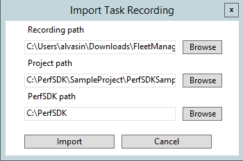

---
# required metadata

title: PerfSDK and multiuser testing with Visual Studio Online
description: Take a tour of Performance SDK and multiuser testing with Visual Studio Online and learn how convert a scenario recorded with Task Recorder into a single user test and then a multiuser test.
author: RobinARH
manager: AnnBe
ms.date: 2017-04-04
ms.topic: article
ms.prod: 
ms.service: Dynamics365Operations
ms.technology: 

# optional metadata

# ms.search.form: 
# ROBOTS: 
audience: Developer
# ms.devlang: 
# ms.reviewer: 2051
ms.search.scope: AX 7.0.0, Operations
# ms.tgt_pltfrm: 
ms.custom: 9954
ms.assetid: 7b605810-e4da-4eb8-9a26-5389f99befcf
ms.search.region: Global
# ms.search.industry: 
ms.author: chwolf
ms.search.validFrom: 2016-02-28
ms.dyn365.ops.version: AX 7.0.0

---

# PerfSDK and multiuser testing with Visual Studio Online

Take a tour of Performance SDK and multiuser testing with Visual Studio Online and learn how convert a scenario recorded with Task Recorder into a single user test and then a multiuser test.

*Time:* 30 minutes In this lab, you will take a tour of Performance SDK and multi user testing with Visual Studio Online. You will see how to convert a scenario recorded with Task Recorder and convert it to a single user test and then a multi user test. **Note:** This lab requires that you access the environment as an administrator. For more information, refer to the document named [Access Microsoft Dynamics 365 for Operations Instances](..\dev-tools\access-instances.md). **Prerequisites**

-   Visual Studio 2015 Enterprise
-   Deployment with Volume Data
-   PerfSDK (look for a folder with that name in the C: or F: drive, depending on your environment)

## Steps to create a single user C\# test from an XML recording
A video about how to create a single user test can be found here: [https://mix.office.com/watch/qtdlasy2rcf3](https://mix.office.com/watch/qtdlasy2rcf3)

1.  Create a recording of a scenario that you want to test with Task Recorder.
2.  Run Visual Studio as Administrator. Build the PerfSDKSample project, which is in the PerfSDK folder. If you have already done this, skip this step.
3.  Open **Dynamics 365** &gt; **Addins** &gt; **C\#** perf test generator add-in from Visual Studio. Go to **Dynamics 365 **&gt; **Addins** &gt; **Create C\# perf test from recording**.
4.  You should see the following dialog. Fill in the required details and click **Import**.

    
    
5.  You should see generated C\# test in Generated folder in the project that you’ve selected.

## Steps to run single user performance test with Perf SDK:
-   Check that testroot environment variable is set to Perf SDK folder. Go to **Control Panel** &gt; **System and Security** &gt; **System** &gt; **Advanced System Settings**. 

    
    
-   Download *selenium-dotnet-strongnamed-2.42.0.zip* and *IEDriverServer\_Win32\_2.42.0.zip* from [*http://selenium-release.storage.googleapis.com/index.html?path=2.42/*](http://selenium-release.storage.googleapis.com/index.html?path=2.42/).

<!-- -->

-   Make sure to copy download dll's to the following folder and add a reference to WebDriver.dll to your project

    
    
-   Generate certificate and install it. To generate a certificate file, run the following commands: 

    
    
    When prompted for private key password, select **None.** You should see the following files: 
    
    **Notable pieces:**
-   -n “CN=TestAuthCert” is giving a human-readable name to the cert, feel free to tweak for your scenario.
-   -eku 1.3.6.1.5.5.7.3.2 is certificate purpose. This is a client authentication cert, as opposed to code signing, encryption or something else. Next, install \*.pfx file (make sure to select Local Machine when you install it)  and copy this certificate file to PerfSDK folder.

Open powershell window as Administator and run the following command to get a thumbprint of installed certificate: 

Put this thumbprint value in **CloudEnvironment.Config** file: 

 

The next step is to update **wif.config** to make AOS trust this certificate. To do that, open IIS and find Dynamics 365 for Operations in the list of sites. Click **Explore** to open and find a file **wif.config**. 

 

Update this file by putting your certificate and authority name: 

 

And restart IIS. Open Sample project in Visual Studio and edit the file PurchaseReq.cs, which is a sample single user test. Comment the following lines in this file: 

 

Modify your CloudEnvironment.Config file by entering your admin username. The following code is a example. **Note:** The ConfigName must be DEVFABRIC. 

 

Enter your endpoint in CloudEnvironment.Config. **Note**: If you have an ARR-enabled environment, i.e. you have 2 endpoints like this:

-   apr-arr8aos**soap**.axcloud.test.dynamics.com
-   apr-arr8aos.axcloud.test.dynamics.com

You would need to enter both endpoints in CloudEnvironment.Config: 

 

Go to **Test** &gt; **Test settings** &gt; **Default processor architecture** and set it to x64. Build the solution. Go to **Test** &gt; **Windows** &gt; **Test Explorer** **Note:** Sometimes Visual Studio may not update the list of tests. In this case, restart Visual Studio and re-open the test Explorer. **Note:** Your newly created test will be named TestMethod. If you change the method name of TestMethod your test will get an individual name. Now you can run the test. You should see Internet Explorer starting and replaying the scenario that you've recorded.

## Steps to create a multiuser test from a singleuser test
To convert a single-user test generated in the previous section to multi-user test, add MS.Dynamics.TestTools.UIHelpers.Core; to your test script and replace the following line in TestSetup method.

    Client = DispatchedClient.DefaultInstance;
    With
    DispatchedClientHelper helper = new DispatchedClientHelper();
    Client = helper.GetClient();

Make sure the values that you have entered during task recording are randomized. You may need to use the Data Expansion Tool first to generate test data.

## Setup Visual Studio Online for multiuser testing
For this example ProcureToPay.cs will be used. You need to go to log in to [Visual Studio Online portal](https://app.vssps.visualstudio.com/profile/view) and launch Visual Studio from there. Note: you need to do this only once. Once you have logged in in VSO, those settings are saved. 

 

Open PerfSDK sample project. Make sure to update UserFormat entry in CloudEnvironment.Config file to reflect admin user url. Example: for [admin@example.com]() use [TST\_{0}@example.com]() as user format. Also make sure to change the UserCount to the amount of users you want to have in your performance test. 

 

Run this command in PerfSDK folder: **MS.Dynamics.Performance.CreateUsers.exe** to create test users for your environment. You may create as many users as you want to, for this example 150 is used. *Example: **MS.Dynamics.Performance.CreateUsers.exe 150 USMF** will create 150 test users for company USMF.* Make sure that users were created in the system. Login to your endpoint as admin user and check.

### Testing sandbox

This step assumes you have a developer topology. Please follow the instructions from previous paragraph. There is one additional step you need to do in order to establish trust between your developer topology and/or Visual Studio Online test agent to communicate to sandbox machines: You would need to remote desktop to your AOS machine, copy over .cer file, install it by double-clicking on the file. When prompted for certificate store select **Personal:**

 

And update file **wif.config**. To update file **wif.config**, open IIS, find AOSService among websites and click Explore 

 

This action would open Explorer, you should be able to find **wif.config** in the opened folder. Update this file by putting certificate thumbprint and CN values (use the values from certificate you've generated on previous steps): 

 

And restart IIS. Now you can run performance tests against this topology. **Note:** if your topology has multiple AOS machines, you need to install certificate and update wif.config on each of those machines.

## Run performance test
Open ProcureToPay.cs in Visual Studio editor and append the following lines in TestSetup method:

    var testroot = System.Environment.GetEnvironmentVariable("DeploymentDir"); 
    if (string.IsNullOrEmpty(testroot)) 
    {
        testroot = System.IO.Directory.GetCurrentDirectory(); 
    } 
    Environment.SetEnvironmentVariable("testroot", testroot);

Double click on file vsonline.testsettings in your solution files, use the following settings (your PerfSDK folder may be different): 

 

In **Setup and Cleanup Scripts** select setup.cmd located in %testroot%Visual Studio Onlinesetup.cmd. **Notable pieces:** you may need to update your deployment configuration to reflect your certificate name (for this demo **CsuClient.pfx **is used) and password. Make sure add \*.pfx file you've generated previously and update the following files:

-   **setup.cmd** with %DeploymentDirectory%CloudCtuFakeACSInstall.cmd %DeploymentDirectory%**YourCertificate.pfx**
-   **CloudCtuFakeACSInstall.cmd** with the password of your cert (that should be an empty string)

In **Additional Settings** select **Run tests in 64 bit process on 64 bit machine.** To run the test, open the **SampleLoadTest.loadtest** file and select **Run Load Test**. 

 

When the test finishes, you should see a summary with transaction results. 

 

You can switch to **Graphs view** to view different indicators for the test controller and test scenario. **Note:** Information about your System under Test is not available in this view. To access this information you would have to use LCS to monitor your AOS CPU and memory usage, or set up perfmon directly on the AOS and set up the SQL/Windows Azure portal to monitor SQL DTU usage. 

## Troubleshooting
If you see an error message like this: *System.TypeInitializationException: System.TypeInitializationException: The type initializer for 'MS.Dynamics.TestTools.CloudCommonTestUtilities.Authentication.UserManagement' threw an exception. ---&gt; System.ServiceModel.CommunicationException: An error occurred while making the HTTP request to https://sandbox.ax.dynamics.com/Services/AxUserManagement/Service.svc/ws2007FedHttp. **This could be due to the fact that the server certificate is not configured properly with HTTP.SYS in the HTTPS case. This could also be caused by a mismatch of the security binding between the client and the server.** ---&gt; System.Net.WebException: The underlying connection was closed: An unexpected error occurred on a send. ---&gt; System.IO.IOException: Unable to read data from the transport connection: An existing connection was forcibly closed by the remote host. ---&gt; System.Net.Sockets.SocketException: An existing connection was forcibly closed by the remote host.* you would need to run the following powershell script on your **development machine**:

    Set-ItemProperty HKLM:SOFTWAREMicrosoft.NETFrameworkv4.0.30319 -Name SchUseStrongCrypto -Value 1 -Type dword -Force -Confirm:$false
    if ((Test-Path HKLM:SOFTWAREWow6432NodeMicrosoft.NETFrameworkv4.0.30319)) 
    { 
        Set-ItemProperty HKLM:SOFTWAREWow6432NodeMicrosoft.NETFrameworkv4.0.30319 -Name SchUseStrongCrypto -Value 1 -Type dword -Force -Confirm:$false 
    }

