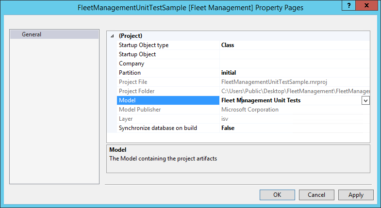
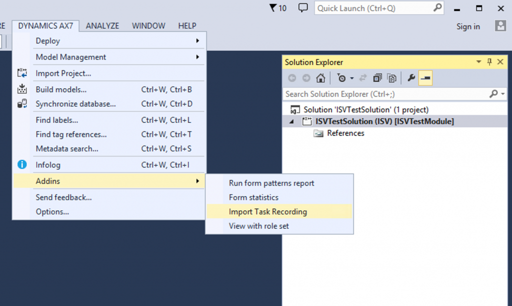
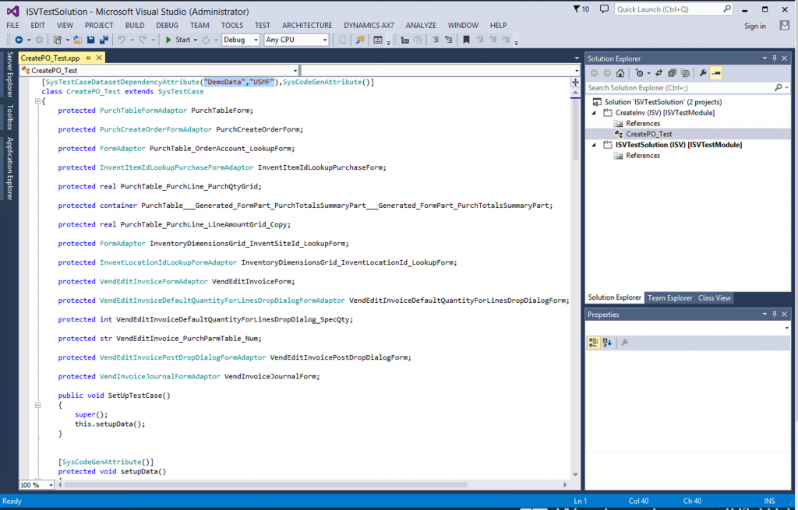
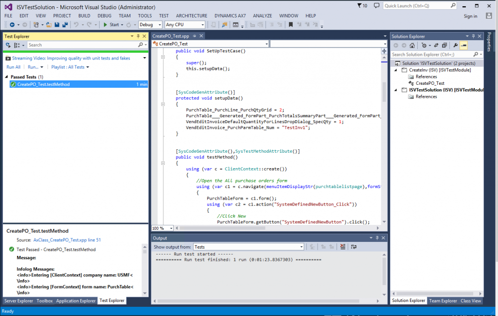

---
# required metadata

title: Testing and validations
description: This tutorial shows you how to create and run test cases.
author: RobinARH
manager: AnnBe
ms.date: 04/04/2017
ms.topic: article
ms.prod: 
ms.service: dynamics-ax-platform
ms.technology: 

# optional metadata

# ms.search.form: 
# ROBOTS: 
audience: Developer
# ms.devlang: 
ms.reviewer: RobinARH
ms.search.scope: AX 7.0.0, Operations
# ms.tgt_pltfrm: 
ms.custom: 24231
ms.assetid: 41dcbbda-e377-45a8-b180-5daa0e63c4a9
ms.search.region: Global
# ms.search.industry: 
ms.author: shailesn
ms.search.validFrom: 2016-02-28
ms.dyn365.ops.version: AX 7.0.0

---

# Testing and validations

[!include[banner](../includes/banner.md)]

This tutorial shows you how to create and run test cases.

Prerequisites
-------------

You will need to deploy Developer Topology with Developer and Build VM.

## Key concepts
-   Use SysTest Framework to author unit/component test code.
-   Test module creation to manage test code and FormAdaptors.
-   Import Task Recorder recordings into Visual Studio to generate test code.
-   Integrate a Test module with a build machine.

  

## Use SysTest Framework to author unit/component test code
You can create new test cases to test the functionality in an application.

1.  Open Visual Studio as an administrator.
1.  On the **File** menu, click **Open** &gt; **Project/Solution**, and then select **FleetManagement** **solution** from the desktop folder. If the solution file is not on your computer, the steps to create it are listed in [Tutorial: Create a Fleet Management solution file out of the Fleet Management models in the AOT](https://community.dynamics.com/ax/b/newdynamicsax/archive/2016/05/19/tutorial-create-a-fleet-management-solution-file-out-of-the-fleet-management-models-in-the-aot).
1.  In **Solution Explorer**, right-click the **Fleet Management** solution, point to **Add**, and then click **New Project**.
1.  Choose **Dynamics 365 for Operations **as the project type to create.
1.  Name this new project *FleetManagementUnitTestSample*, specify the FleetManagement folder on the desktop (C:UsersPublicDesktopFleetManagement) as the location, and then click **OK**. 
        
    
        
1.  In **Solution Explorer**, right-click the new project, and then click **Properties**.
1.  Set the **Model** property to **FleetManagementUnitTests**, and then click **OK**. 

    
        
1.  Right-click the FleetManagementUnitTestSample project, point to **Add**, and then click **New Item**.
1.  In the **Add New Item** window, select **Class** as the type of element to add. Name the new class FMUnitTestSample, and then click **Add**. 

    

1. In the first line of the code for the new class, indicate that the class extends the SysTestCase class.
1. Add the following code to define the methods for the class. These methods define two additional tests.

        class FMUnitTestSample extends SysTestCase
        {
            public void setup()
            {
                // Reset the test data to be sure things are clean
                FMDataHelper::main(null);
            }

            [SysTestMethodAttribute]
            public void testFMTotalsEngine()
            {
                FMRental rental;
                FMTotalsEngine fmTotals;
                FMRentalTotal fmRentalTotal;
                FMRentalCharge rentalCharge;
                FMRentalTotal expectedtotal;
                str rentalID = '000022';

                // Find a known rental
                rental = FMRental::find(rentalID);
                
                // Get the rental charges associated with the rental
                // Data is seeded randomly, so this will change for each run
                select sum(ExtendedAmount) from rentalCharge
                        where rentalCharge.RentalId == rental.RentalId;

                fmTotals = FMTotalsEngine::construct();
                fmTotals.calculateRentalVehicleRate(rental);
                
                // Get the totals from the engine
                fmRentalTotal = fmTotals.totals(rental);

                // Set the expected amount
                expectedTotal = rental.VehicleRateTotal + rentalCharge.ExtendedAmount;
                
                this.assertEquals(expectedTotal,fmRentalTotal);
            }
            
            [SysTestMethodAttribute]
            public void testFMCarValidateField()
            {
                FMCarClass fmCar;
                
                fmCar.NumberOfDoors = -1;
                this.assertFalse(fmCar.validateField(Fieldnum("FMCarClass", "NumberOfDoors")));
                
                fmCar.NumberOfDoors = 4;
                this.assertTrue(fmCar.validateField(Fieldnum("FMCarClass", "NumberOfDoors")));
            }
        }

1. Save the new class. After the save is complete, you will see the additional two test cases in **Test Explorer**. Right-click on the FleetManagementUnitTestSample project in **Solution Explorer**, and then click **Build.**
1.  On the **View** menu, open **Test Explorer**. 

    
        
1. Click **Run selected test** to execute specific test case.
1. Test Explorer will show the results of test after it is complete. 

    

## Test module creation to manage test code and FormAdaptors
Creating a test specific module helps to keep test code together and manageable.

1. Open **Visual Studio** and go to **Dynamics 365 for Operations** &gt; **Model Management** &gt; **Create model**.

    
        
1. Enter the model name, select the layer, and then enter any additional details. **Note: **It's a good idea that you include the word **Test** in the name of the test module. The default build definition is configured to discover all test modules that contain the word **Test**. 

    
        
1. Because this model holds forms from the Application Platform/Foundation, add references to models shown below.

    
        
After the base test module is in place, you can import a Task Recorder recording to generate test code. When you import a Task Recorder recording XML, test code is generated using FormAdaptors. Form adaptors are wrapper classes over forms which provide strongly typed API that can be used to test form functionality. In Dynamics 365 for Operations, we have included pre-generated FormAdapters for each package for built-in forms. In the test module, add a reference to the corresponding Form Adaptor for packages and Test Essentials, which has helper methods to execute test code.

## Import a Task Recorder recording into Visual Studio to generate test code
You can generate test code from Task Recorder recording to execute headless (non-UI) test.

1. Record a scenario in Dynamics 365 for Operations by using Task Recorder.
1. To import a Task Recording, in Visual Studio, click **Dynamics 365 for Operations** &gt; **Addins** &gt; **Import Task Recording**. 

    
        
1. In the **Import Task Recording** dialog, select the Test Module (ISVTestModule) under which you want to import task recording, and browse to recording xml file. 

    
        
1. The task recording import process generates test code that is based on the SysTestAdapter and FormAdaptor which can be viewed in Visual Studio IDE. We do not expect you to change any test source code that is generated as part of this step.

        
    
1. After the test code is generated, set up Visual Studio options for test discovery and execution:
    - If you have a 64-bit machine, you can run unit tests and capture code coverage information as a 64-bit process.
    - To configure this, select **Test** &gt; **Test Settings** &gt; **Default Processor Architecture**, and then select **X64**.
    - You might run into a situation in which the test execution engine opens and locks an assembly in your test project. When this happens, you can’t for example, save changes to the assembly. To fix this, select **Test** &gt; **Test Settings**, and then select **Keep Test Execution Engine Running**. 
    
    
    
    - Now that you have test code generated in Visual Studio IDE, it's time to discover the test and try executing them locally.

1. From menu options, select **Test** &gt; **Windows**, and then click **Test Explorer**. After the Test Explorer window is open, it will try to discover test from test code and list all the available tests as shown below.

    
        
1. Select the test and then click **Run** &gt; **Execute selected**. This will execute test against the locally deployed Dynamics 365 for Operations. 

    

## Integration of the test module with build process
After the test module is a part of source control, the build process template will discover all test modules, which contain the word **Test** in the name. The following illustration shows build and test execution as part of Visual Studio Online. 

