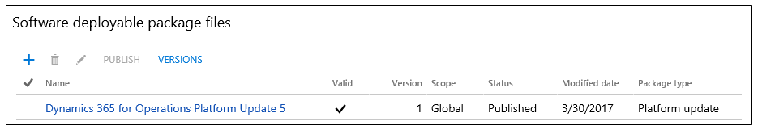

---
# required metadata

title: Dynamics 365 for Operations cloud platform monthly updates FAQ
description: This topic provides some key information about the monthly updates of the Microsoft Dynamics 365 for Operations cloud platform.
author: sericks
manager: AnnBe
ms.date: 04/21/2017
ms.topic: article
ms.prod: 
ms.service: Dynamics365Operations
ms.technology: 

# optional metadata

# ms.search.form: 
# ROBOTS: 
audience: IT Pro
# ms.devlang: 
ms.reviewer: annbe
ms.search.scope: Operations, Platform
# ms.tgt_pltfrm: 
ms.custom: 273383
ms.assetid: ac5c9f89-98a6-481f-a0d6-a9627e01030e
ms.search.region: Global
# ms.search.industry: 
ms.author: meeram
ms.dyn365.ops.intro: Platform update 5
ms.search.validFrom: 2017-03-31

---

# Dynamics 365 for Operations cloud platform monthly updates FAQ

[!include[banner](../includes/banner.md)]

"[!include[banner](../includes/banner.md)]"

This topic provides some key information about the monthly updates of the Microsoft Dynamics 365 for Operations cloud platform.

What's the rationale behind the cloud platform monthly updates?
---------------------------------------------------------------

The cloud platform is [locked](../get-started/whats-new-platform-update-3.md) as of Dynamics 365 for Operations platform update 3. Locking the platform enables rich customizations that use extensions while allowing you to make updates without costly code upgrades. Starting with platform update 4, the cloud platform releases monthly updates so that new and existing environments can stay up-to-date with the latest innovations with a click of a button. 

Monthly updates are backward compatible and non-breaking. An explicit opt-in option will be added for features that alter the behavior of existing features.

## How can I update my environment to the latest monthly update?
To install the latest monthly platform update on an existing environment, go to [Lifecycle Services (LCS)](https://lcs.dynamics.com/). In the Shared asset library, select the **Software deployable package** tab. You will find the latest platform update package that you can deploy. For example, the deployable package for platform update 5 is shown below. This package can be imported to the project's asset library and then can be applied to a specific environment through the update flows. For more details, see [Upgrade Dynamics 365 for Operations to the latest platform update](../migration-upgrade/upgrade-latest-platform-update.md).

  

New environments that are deployed will include the latest platform update.

## How do I know what's changed in the monthly platform update?
To see a list of the new or changed features in the latest monthly update, click [here](https://go.microsoft.com/fwlink/?linkid=845889).

## What should I test to approve the platform monthly update?
Monthly platform updates are backward compatible and non-breaking. We recommend that you run your main business process regressions tests, and then deploy into PROD.

## How long can I stay on a specific monthly update?
You can stay up to 12 months on a monthly platform update. However, any hotfix that you need will require you to take the latest monthly update available. Typically updates fix problems with or enable new features in Dynamics 365 for Operations, so you are highly encouraged to keep up to date. For more information, see [Microsoft Dynamics 365 for Operations versions and update policy](../migration-upgrade/versions-update-policy.md).

## Can I get a hotfix instead of the full monthly update?
No. All hotfixes are rolled into the cumulative monthly updates. Platform updates have been cumulative in the past too. You will need to apply the latest monthly platform update to get a fix available in any of the interim updates. For instance, if you are on update 3 and the hotfix that you need is in update 4 but the latest update available is update 7, you need to apply update 7 which will include all fixes in update 4.

## Will I need to update my customizations for a monthly update?
No. Monthly platform updates do not require you to upgrade your code customizations (Partner or ISV).

## How do I get application updates?
Application updates (X++ and binary) are available in the update tiles based on those applicable to a specific environment. Application updates can be searched for and applied as needed. All available application updates are applicable to the latest platform update. See the details for the release in the [Microsoft Dynamics 365 for Operations versions and update policy](../migration-upgrade/versions-update-policy.md). 

If you are already on platform update 4 or later, applying an application **binary** update will also update your Dynamics 365 for Operations platform to the latest release. 

## What is the guidance to customers who are going live?
The recommendation is that you sign off with testing the platform update that's no more than a month before go live. The expectation is that you will test all scenarios and sign off using the T - 1 month platform update. This ensures that you are on the latest platform update with all available fixes.

