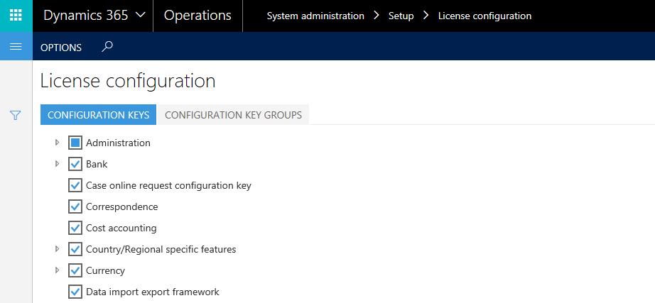

---
# required metadata

title: Maintenance mode
description: This article provides information about maintenance mode in Microsoft Dynamics 365 for Operations. Maintenance mode is a new system-wide setting that lets system administrators safely make system changes that might affect system functionality.
author: kfend
manager: AnnBe
ms.date: 04/04/2017
ms.topic: article
ms.prod: 
ms.service: dynamics-ax-platform
ms.technology: 

# optional metadata

ms.search.form: SysConfiguration
# ROBOTS: 
audience: IT Pro
# ms.devlang: 
# ms.reviewer: 51
ms.search.scope: AX 7.0.0, Operations, Core
# ms.tgt_pltfrm: 
ms.custom: 70292
ms.assetid: c11a35e8-40bb-4005-adf3-cfd998a418fc
ms.search.region: Global
# ms.search.industry: 
ms.author: manado
ms.search.validFrom: 2016-02-28
ms.dyn365.ops.version: AX 7.0.0

---

# Maintenance mode

[!include[banner](../includes/banner.md)]

This article provides information about maintenance mode in Microsoft Dynamics 365 for Operations. Maintenance mode is a new system-wide setting that lets system administrators safely make system changes that might affect system functionality.

Microsoft Dynamics 365 for Operations includes a new system-wide setting that is named maintenance mode. When maintenance mode is turned on, it provides a safe way for system administrators to make system changes that might affect system functionality. For example, configuration keys can be enabled or disabled. While maintenance mode is on, only system administrators and users who have the **Maintenance mode user** role can sign in to the system. By default, maintenance mode is turned off.

## Turning maintenance mode on and off
When maintenance mode is off, you can't edit the **License configuration** page.
You can turn on maintenance mode locally by running the following command. 

**Note:** On some virtual machines (VMs), the exact location of the Deployment.Setup.exe tool might differ. Check AosServiceWebRootbin.

    J:\AosService\PackagesLocalDirectory\Bin\Microsoft.Dynamics.AX.Deployment.Setup.exe --metadatadir J:\AosService\PackagesLocalDirectory --bindir J:\AosService\PackagesLocalDirectory\Bin --sqlserver . --sqldatabase axdb --sqluser axdbadmin --sqlpwd ********* --setupmode maintenancemode --isinmaintenancemode true

The following table describes the parameters that are used in this command.

| Parameter name              | Description                                                                                                       |
|-----------------------------|-------------------------------------------------------------------------------------------------------------------|
| --setupmode maintenancemode | Use this parameter to inform the setup tool that the system will be put into or taken out of maintenance mode.    |
| --metadatadir               | Use this parameter to specify the metadata directory. You should use the default packages directory.              |
| --bindir                    | Use this parameter to specify the binaries directory. You should use the default packages directory.              |
| --sqlserver                 | Use this parameter to specify the Microsoft SQL Server. For one-box environments, use a period (**.**).           |
| --sqluser                   | Use this parameter to specify the SQL Server user. You should use **AOSUser**.                                    |
| --sqlpwd                    | Use this parameter to specify the SQL Server password.                                                            |
| --isinmaintenancemode       | Use this parameter to turn configuration mode on or off. Use **true** to turn it on and **false** to turn it off. |

After the instance of Microsoft Dynamics 365 for Operations Application Object Server (AOS) is restarted, the system will be in maintenance mode. You can then enable configuration keys, as shown in the following screen shot. 

 

If you try to access Dynamics 365 for Operations while the system is in maintenance mode, but you aren't a system administrator or a user who has the **Maintenance mode user** role, you receive an error message. 

You can turn off maintenance mode by running the following command.

    J:\AosService\PackagesLocalDirectory\Bin\Microsoft.Dynamics.AX.Deployment.Setup.exe --metadatadir J:\AosService\PackagesLocalDirectory --bindir J:\AosService\PackagesLocalDirectory\Bin --sqlserver . --sqldatabase axdb --sqluser axdbadmin --sqlpwd ********* --setupmode maintenancemode --isinmaintenancemode false

## Maintenance mode in production environments
To turn on maintenance mode in a production environment, you must submit a request to the Dynamics Service Engineering (DSE) team by using the **Other request** form in LCS on the **Service requests** page. For more information about submitting a request through LCS, see , see [Submit a request to the Dynamics Service Engineering team](../lifecycle-services/submit-request-dynamics-service-engineering-team.md). 

The Dynamics Service Engineering team will move your system into maintenance mode and work with you to complete the configuration updates. After the team receives a confirmation from you that the updates are complete, they will remove your system from maintenance mode.

## Troubleshooting
Errors can be found in Event viewer.

