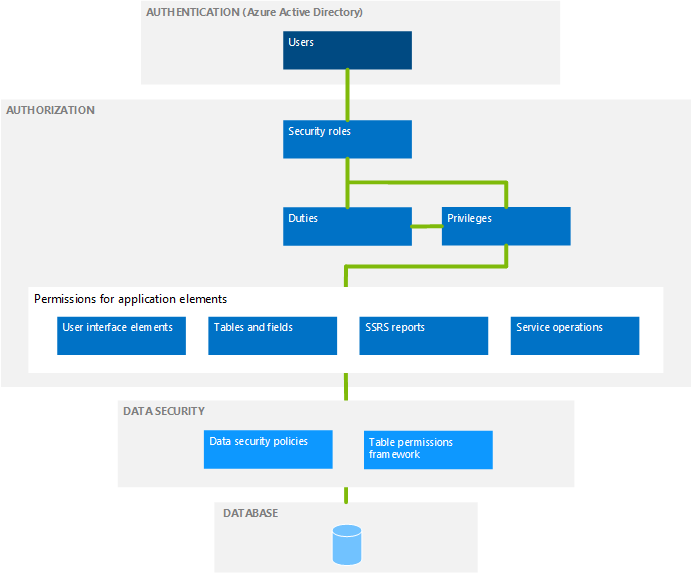

---
# required metadata

title: Security architecture | Microsoft Docs
description: This article provides an overview of the security architecture of Microsoft Dynamics 365 for Operations.
author: sericks007
manager: AnnBe
ms.date: 2015-12-03 20:18:50
ms.topic: article
ms.prod: 
ms.service: Dynamics365Operations
ms.technology: 

# optional metadata

# keywords: 
# ROBOTS: 
audience: IT Pro
# ms.devlang: 
ms.reviewer: 71
ms.suite: Released- Dynamics AX 7.0.0
# ms.tgt_pltfrm: 
ms.custom: 15441
ms.assetid: a1ad7c81-8e62-47cd-89e5-7f592ccca6b0
ms.region: Global
# ms.industry: 
ms.author: sericks

---

# Security architecture

This article provides an overview of the security architecture of Microsoft Dynamics 365 for Operations.

When you understand the security architecture of Microsoft Dynamics 365 for Operations, you can more easily customize security to fit the requirements of your business. The following diagram provides a high-level overview of the security architecture of Dynamics 365 for Operations. 

## Authentication
By default, only authenticated users who have user rights in Dynamics 365 for Operations can establish a connection. Dynamics 365 for Operations uses Microsoft Azure Active Directory (AAD) as a primary identity provider. To access the system, users must be provisioned into a Dynamics 365 for Operations instance and should have a valid AAD account in an authorized tenant.

## Authorization
Authorization is the control of access to the Dynamics 365 for Operations program. Security permissions are used to control access to individual elements of the program: menus, menu items, action and command buttons, reports, service operations, web URL menu items, web controls, and fields in the Dynamics 365 for Operations client. In Dynamics 365 for Operations, individual security permissions are combined into privileges, and privileges are combined into duties. The administrator grants security roles access to the program by assigning duties and privileges to those roles. Dynamics 365 for Operations uses context-based security to determine access to securable objects. When a privilege is associated with an entry point (such as a menu item or a service operation), a level of access, such as **Read** or **Delete**, is specified. The Dynamics 365 for Operations authorization subsystem detects the access at run time, when that entry point is accessed, and applies the specified level of access to the securable object that the entry point leads to. This functionality helps guarantee that there is no over-permissioning, and the developer gets the access that he or she intended. For more information about role-based security in Dynamics 365 for Operations, see [Role-based security](https://docs.microsoft.com/en-us/dynamics365/operations/dev-itpro/system-administration/role-based-security-in-microsoft-dynamics-ax).

## Data security
Authorization is used to grant access to elements of the program. By contrast, data security is used to deny access to tables, fields, and rows in the database. Use the extensible data security framework to control access to transactional data by assigning data security policies to security roles. Data security policies can restrict access to data, based on either the effective date or user data, such as the sales territory or organization. Record-level security, which was a mechanism for securing data in Dynamics AX 2012 and earlier versions, is now obsolete. Extensible data security is the recommended mechanism for securing or filtering data in the program. Additionally, the Table Permissions Framework helps protect some data. Data security for specific tables is enforced by Application Object Server (AOS).

