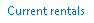
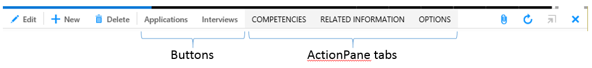

---
# required metadata

title: Action controls
description: Actions are an essential component of any enterprise resource planning (ERP) system, and are triggered by mouse click, keyboard, or touch.
author: jasongre
manager: AnnBe
ms.date: 2016-02-25 09 - 29 - 45
ms.topic: article
ms.prod: 
ms.service: Dynamics365Operations
ms.technology: 

# optional metadata

# ms.search.form: 
# ROBOTS: 
audience: Developer
# ms.devlang: 
# ms.reviewer: 2051
ms.search.scope: AX 7.0.0, Operations
# ms.tgt_pltfrm: 
ms.custom: 55521
ms.assetid: 93b61e0c-b9bc-48fc-a9b7-874a8b0aeebd
ms.search.region: Global
# ms.search.industry: 
ms.author: jasongre
ms.search.validFrom: 2016-02-28
ms.dyn365.ops.version: AX 7.0.0

---

# Action controls

Actions are an essential component of any enterprise resource planning (ERP) system, and are triggered by mouse click, keyboard, or touch.

Introduction
------------

Actions are an essential component of any enterprise resource planning (ERP) system. Actions can be accessed through various mechanisms:

-   Buttons on standard Action Panes
-   Buttons on Toolbars
-   Buttons directly on the form canvas
-   Right-click context menus
-   Keyboard shortcuts
-   The new Action search feature

Note that, in general, actions that are triggered by right-click context menus or keyboard shortcuts are meant to have a corresponding button available elsewhere in the user interface. Action controls can be triggered by using touch or a mouse click. Many system-provided actions can also be triggered by using the keyboard. In the future, we plan to provide functionality so that developers and end users can also define their own keyboard shortcuts.

## Buttons
Buttons are the foundation of action controls. They can be modeled inside of standard Action Panes or in Toolbars, which are discussed later in the article. They can also be added as stand-alone buttons on the page (for example, the **OK** and **Cancel** buttons at the bottom of a dialog box, or buttons for actions that are specific to an individual field). The following button types continue to be available:

-   A **button** is a basic button, for which the entire functionality must be implemented in code.
-   A **command button** specifies a command or task to run.
-   A **menu item button** specifies a menu item to navigate to or run.
-   A **drop dialog button** opens a flyout dialog box, the contents of which are retrieved via a menu item.
-   A **menu button** is a button container that opens a flyout that contains a list of other buttons.

In general, buttons continue to take advantage of the same properties as the buttons in previous versions. The following sections discuss a few properties that are related to button visualization, with particular focus on changes from previous versions.

### Button Display

The **Button Display** property controls what information (including the button label and/or image) appears on the button. The allowed values for this property depend on where the button is located (for example, inside an Action Pane). Here are some of the location restrictions on the **Button Display** property:

-   Buttons inside Menu Buttons must be set to **Text Only** or **Auto** (which is interpreted as **Text Only** in this case).
-   Buttons inside Action Pane tabs on Standard Action Panes must be set to **Text Only** or **Auto** (which is interpreted as **Text Only** in this case).
-   **Image Only** buttons should be used only for on-canvas buttons that are inline with a field.

For more details about how to use the **Button Display** property in various form locations, see the "Button image guidelines" section of the [General form guidelines](general-form-guidelines.md) article. The following table shows the values for the **Button Display** property.

| Button Display value  | Description                                                                                                                  |
|-----------------------|------------------------------------------------------------------------------------------------------------------------------|
| Auto                  | The button has the content (text and/or image) that is defined (but only content that is allowed for the button’s location). |
| Text Only             | Only text appears on the button.                                                                                             |
| Image Only            | Only an image appears on the button.                                                                                         |
| Text with Image Above | Both an image and text appear on the button. The text appears above the image.                                               |

Note that the other values of **Button Display** from Microsoft Dynamics AX 2012, such as **Background Image** and other relative positioning of text and image, are no longer supported.

### Button Images

In previous versions, images or icons were often shown on buttons to help users recognize those buttons. However, in Dynamics 365 for Operations, the number of images that are used for this purpose is reduced. Fewer images produce a cleaner, more modern user interface. Additionally, there was a desire to indicate processes and tasks by using more common symbols instead of multiple subtly different images. For more details about how images are used on buttons, see the "Button image guidelines" section of the [General form guidelines](general-form-guidelines.md) article. Two metadata properties are used to define an image for a button: **Image Location** and **Normal Image**. The allowed values for the **Normal Image** property depend on the value of the **Image Location** property. In previous versions, Embedded Resources (kernel resources) were heavily used to specify button images or icons. However, there has been a shift to the web, and this image format option is no longer available. Instead, a new image format (Symbol font) has been added, and the expectation is that all buttons that requires images will use this option (**Image Location** = **Symbol**). The primary reason for this change is that a symbol font is the best performing and most scalable image format. For a list of the full set of symbols that are supported, see [this document](http://ax.help.dynamics.com/en/?attachment_id=278612). The following table shows the recommended and preferred method for assigning images to buttons.

| Property       | Value                             |
|----------------|-----------------------------------|
| Image Location | Symbol                            |
| Normal Image   | The name of the symbol font glyph |

### Button Style

In general, the **Button Style** property defines how a button is shown in the user interface. The exceptions are buttons that are modeled inside an Action Pane or Toolbar, because the **Button** **Style** property is disregarded in those cases. Instead, those buttons are rendered by using the style that is specially designed for buttons in those types of containers. For buttons that are modeled directly on the form canvas (outside Action Panes), the following button styles are available.

| Style           | Example                                                                                                                                                      | Description                                                                          |
|-----------------|--------------------------------------------------------------------------------------------------------------------------------------------------------------|--------------------------------------------------------------------------------------|
| Standard (Auto) |  | The traditional button appearance                                                    |
| Command link    |  | A combination of a small square block or image on the left, and a label on the right |
| Link            |  | A button that has the appearance of a hyperlink                                      |

## Standard Action Panes
The standard Action Pane is the primary location for page-level actions. It consists of both system-defined actions (actions that aren't explicitly modeled but are automatically added by the framework) and developer-defined actions (actions that are explicitly modeled in either Action Pane tabs or Button Groups). Developers can promote the most frequently used actions directly to the standard Action Pane by modeling Button Groups directly under the Action Pane. However, Action Pane tabs can still be used to group actions and provide access via a flyout. The following illustration shows a standard Action Pane that includes system-defined buttons, two promoted developer-defined actions, and a set of Action Pane tabs.  The following illustration shows the flyout that appears to show additional commands when an Action Pane tab is clicked. 

### System-defined buttons

Several system-defined buttons are added automatically to pages. The following table shows the list of system-defined buttons that are added to the Action Pane. For more information about how these buttons behave and how to manage them, see the How to: System-defined buttons article.

| Button                                                                                                                                                              | Name                     | Comments                                                               |
|---------------------------------------------------------------------------------------------------------------------------------------------------------------------|--------------------------|------------------------------------------------------------------------|
|             | New                      | Create a new record for the first master data source.                  |
|    | Delete                   | Delete the currently selected record for the first master data source. |
|          | Edit                     | Switch to **Edit** mode.                                               |
|    | Show filters             | Open the **Filter** pane.                                              |
|          | Show list                | Toggle visibility of the navigation list on the details pages.         |
|    | Attach                   | Attach a document.                                                     |
|  | Refresh                  | Update all the data on the page.                                       |
|       | Close                    | Close the page (equivalent to clicking the browser's **Back** button). |
|    | Open in Microsoft Office | Open or export to Microsoft Excel. More Office integration is planned. |
|    | Popout                   | Pop out the current form into a new dynalinked window.                 |

## Toolbars
Toolbars (previously called Action Pane strips) are Actions Panes that have the **Style** property set to **Strip**. They are used for actions that have a specific context and aren't page-level actions. They are primarily used for actions that are specific to a FastTab, tab, or grid. The actions in a Strip-styled Action Pane are shown horizontally in a Toolbar. The following illustration shows a Toolbar that has two buttons for adding and removing lines from this **TransactionDetails** form. 

## Rightclick context menus
Some actions can also be accessed via shortcut menus (right-click context menus). Depending on the context of the right-click, you see either the browser's default context menu or the Dynamics 365 for Operations context menu, which shows both system-defined actions and developer-defined actions. Because browsers don't allow programmatic access to the system clipboard, the browser's context menu must allow the user to perform **Cut**, **Copy**, and **Paste** commands. Therefore, the browser's context menu appears if you right-click in an editable field, or if text is selected. Additionally, the browser's context menu appears if you right-click an image. Other right-clicks (for example, on a field label or on the value of a read-only control) should trigger the context menu. **Note:** Context menus are intended to provide an alternate route to a command, not the only way to run that command. Therefore, any action that is added to a control's context menu should have a corresponding action that is available outside the context menu. The programming model for modifying context menus  differs from the model in previous releases. In Dynamics AX 2012, the **PopupMenu** class was used. This class relies on Microsoft Windows application programming interfaces (APIs). However, because these APIs aren't available on the web, replacement APIs have been created to provide similar functionality. For more information, see the [Code migration: Context menus](code-migration-context-menus.md) article.

## Keyboard shortcuts
Keyboard shortcuts are another mechanism for triggering some actions. Many actions that had shortcuts in Dynamics AX 2012 continue to have shortcuts. However, because of browser restrictions, the specific key combination that is used to trigger an action might differ. The following table shows some important keyboard shortcuts that are available. For the full list of current keyboard shortcuts, see the [Shortcut keys](shortcut-keys.md) article. In the future, we plan to provide mechanisms so that developers and end users can define shortcuts for other actions.

| Key combination     | Action              | Comments                                                                                                                                                                                                                           |
|---------------------|---------------------|------------------------------------------------------------------------------------------------------------------------------------------------------------------------------------------------------------------------------------|
| Alt+N               | Create a new record | The keyboard shortcut for creating a new record (unlike the system-defined **New** button on the Action Pane) is contextual. It creates a new record that is based on the data source of the control that currently has the focus. |
| Alt+Del (or Alt+F9) | Delete record       | The keyboard shortcut for deleting a record (unlike the system-defined **Delete** button on the Action Pane) is contextual. It deletes based on the data source of the control that currently has the focus.                       |
| Alt+S (or Ctrl+S)   | Save a record       |                                                                                                                                                                                                                                    |
| F2                  | Toggle edit mode    | Switch the form between **View** mode and **Edit **mode.                                                                                                                                                                           |

## Action search
Dynamics AX 2012 included a Key Tips feature that let users run any command in an action pane by pressing Alt and then a series of letters. The action search feature is now implemented as the replacement for the old Key Tips feature. Action search can be accessed through a search field that is located in the standard action pane at the top of the form. Currently, it's represented by a magnifying glass icon in the action pane (note this is different from the navigation search feature in the navigation bar).  In the action search field, you can type the beginning of the name of the action that you want to perform in the field (typically, only two to four characters are required). This search mechanism then finds all buttons in visible action panes on the form that match the search string. You can then use click the button in the result list to run the command. For productivity, focus then returns to your last position in the form after the button has been triggered. You can also initiate action search by pressing Ctrl+/ or Alt+Q. Press the keyboard shortcut again will return focus to your last position in the form.

