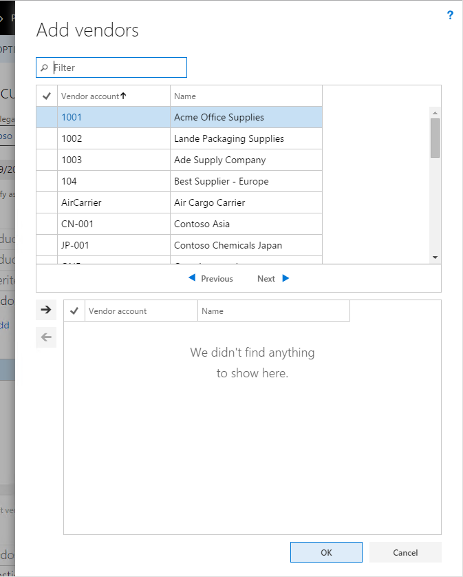

---
# required metadata

title: Advanced selection form pattern
description: This article provides information about the Advanced Selection form pattern. This Dialog form pattern lets users filter and select items from a large, wide list. Like the List Panel pattern, this pattern should be used when the primary user task is to select a set of items.
author: jasongre
manager: AnnBe
ms.date: 04/04/2017
ms.topic: article
ms.prod: 
ms.service: dynamics-ax-platform
ms.technology: 

# optional metadata

# ms.search.form: 
# ROBOTS: 
audience: Developer
# ms.devlang: 
ms.reviewer: annbe
ms.search.scope: AX 7.0.0, Operations
# ms.tgt_pltfrm: 
ms.custom: 29171
ms.assetid: c3c5eea7-f771-41ea-9976-8d0e1f3d3f25
ms.search.region: Global
# ms.search.industry: 
ms.author: jasongre
ms.search.validFrom: 2016-02-28
ms.dyn365.ops.version: AX 7.0.0

---

# Advanced selection form pattern

[!include[banner](../includes/banner.md)]

This article provides information about the Advanced Selection form pattern. This Dialog form pattern lets users filter and select items from a large, wide list. Like the List Panel pattern, this pattern should be used when the primary user task is to select a set of items.

Usage
-----

The Advanced Selection form pattern should be used when the primary user task is to select a set of items. This task is usually accomplished through a multi-select list. However, in many scenarios, users must select items that aren't contiguous and, at the same time, must see the set of items that they are selecting. This pattern resembles the List panel pattern, in that the user selects items in one list and adds them to another. However, this pattern allows for custom filters and a “wide” list on top, and uses most of the screen "real estate" of the page (typically, it's a Large dialog). Use this pattern when a user must be able to filter and select in a large, wide list.

## Wireframe

### Related patterns

-   [List Panel](list-panel-subpattern.md)
-   [Dialog](dialog-form-pattern.md)

## Pattern changes
This is a new pattern in Finance and Operations.

## UX guidelines
The verification checklist shows the steps for manually verifying that the form complies with UX guidelines. This checklist doesn’t include any guidelines that will be enforced automatically through the development environment. Open the form in the browser, and walk through these steps.

-   **Standard form guidelines:**
    -   Standard form guidelines have been consolidated into the [General Form Guidelines](general-form-guidelines.md)document.
-   **Advanced selection guidelines:**
    -   By default, the Quick filter should use the name or description column.
    -   The list can display up to 15 columns. **Note:** This guidelines has been relaxed since Microsoft Dynamics AX 2012.
    -   The main instruction should instruct users what they need to do.
    -   When there is no data, the grid should not automatically add a new record.

## Example
Form: **ProcCategoryAddVendor** (Click **Procurement and sourcing** &gt; **Procurement categories**. On the **Vendors** FastTab, click **Add**.) 

## Appendix
### Frequently asked questions

This section will have answers to frequently asked questions that are related to this guideline/pattern.

### Open issues

None at this time

