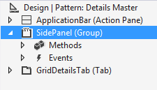
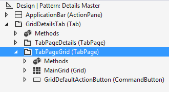

---
# required metadata

title: Build the Customer form
description: In this lab you’ll create a Master Details form and apply the appropriate form pattern and subpatterns. A Master Details form shows primary data that has many fields. For example, the form that you create will show customer information.
author: jasongre
manager: AnnBe
ms.date: 04/04/2017
ms.topic: article
ms.prod: 
ms.service: dynamics-ax-platform
ms.technology: 

# optional metadata

# ms.search.form: 
# ROBOTS: 
audience: Developer
# ms.devlang: 
ms.reviewer: annbe
ms.search.scope: AX 7.0.0, Operations
# ms.tgt_pltfrm: 
ms.custom: 20401
ms.assetid: 78199ae8-0631-4cf4-b206-b952f09b92a9
ms.search.region: Global
# ms.search.industry: 
ms.author: jasongre
ms.search.validFrom: 2016-02-28
ms.dyn365.ops.version: AX 7.0.0

---

# Build the Customer form

[!include[banner](../includes/banner.md)]

In this lab you’ll create a Master Details form and apply the appropriate form pattern and subpatterns. A Master Details form shows primary data that has many fields. For example, the form that you create will show customer information.

Prerequisites
-------------

For this tutorial, you will need to access the environment using Remote Desktop, and be provisioned as an administrator on the instance. For more information, see [Access Instances](..\dev-tools\access-instances.md).

## Overview
To create the form, you’ll start from the existing form, **FmtCustomer**. The form represents the old Master Details template. As a part of the tutorial, you’ll apply the Master Details pattern, which will enforce a consistent structure for this form type. The following illustration shows the **FmtCustomer** starting artifact. 

## Key concepts
-   Create a Master Details form.
-   Apply a form pattern to a form.
-   Use the Visual Studio pattern add-ins to get information about form/model pattern coverage.
-   Apply subpatterns to form controls.
-   View the form using Visual Studio and a browser.
-   Determine the amount of remaining patterns work in a model.

## Setup
### Import the tutorial project and transactional data

Use Visual Studio to import the tutorial project. The tutorial project includes the artifacts you will use to complete this tutorial. Use Visual Studio to open the FMTutorial project and load the data for the tutorial. You will use the FMTDataHelper class to load data for the Fleet Management tutorial. If this is the first tutorial you are working on, review [Access Instances](..\dev-tools\access-instances.md) and make sure you provision your administrator user if you’re working on a local VM.

1.  Download the Fleet Management sample from <https://github.com/Microsoft/FMLab>, save it to **C:**, and unzip it.
2.  On the desktop, double-click the Visual Studio shortcut to open the development environment.
3.  On the **Finance and Operations** menu, click **Import Project**.
4.  In the **Import Project** window, next to the **Filename** text box, click the ellipsis button.
5.  In the **Select the file to import** window, browse to **C: \\FMLab**, click FMTutorialDataModel.axpp, and then click **Open**.
6.  In the **Project file location** text box, enter **C:\\FMLab**.
7.  Select the **Overwrite Elements** option and the **Current solution** radio button. The following illustration shows the completed **Import Project** dialog box. 

    
    
8.  Click **OK**.
9.  In **Solution Explorer**, expand **Classes**, and under the **FMTutorial** project, right-click **FMTDataHelper**, and then click **Set as Startup Object**.
10. On the **Build** menu, click **Rebuild Solution**. You use the rebuild to make sure all files in the project are built regardless of timestamps. You can view the build progress in the Output window.
11. After the build completes, press **Ctrl+F5** to run the project. The browser will open and run the class that imports the data.

## Open the FMTutorial project
Use Visual Studio to open the FMTutorial project. If you have Visual Studio open and have already loaded the FMTutorial project, you can continue to the next section.

1.  If the development environment is not already open, on the Desktop, double-click the Visual Studio shortcut to open the development environment.
2.  On the **File** menu, click **Open** &gt; **Project/Solution**.
3.  In the **Open Project** dialog box, browse to C:FmLabFMTutorial, select the **FMTutorial** solution, and then click **Open**.
4.  The FMTutorial project appears in **Solution Explorer**.

## Use a template to create the form
Use Visual Studio to create the **FmtCustomer** form. You’ll use a template to create a new master details form. The data source for this tutorial is provided by the starter form. However, you’ll add fields to the grid and details view and apply the Master Details form pattern.

1.  In **Solution Explorer**, right-click the **FMTutorial** project, point to **Add**, and then click **Existing Item**.
2.  In the **Add Existing Item** window, browse to C:FmLab, select **AxForm\_FmtCustomer**, and then click **Add**. The **FmtCustomer** form appears at the bottom of the **FMTutorial** project in Solution Explorer.
3.  In Solution Explorer, double-click **FmtCustomer**. The form opens in the form designer.
4.  In the Form designer, click **Design**. In the **Properties** window, specify the following values.

    | **Property** | **Value**   |
    |--------------|-------------|
    | Data Source  | FmtCustomer |
    | Caption      | Customers   |

5.  In the Form designer, click **Design** &gt; **GridDetailsTab** &gt; **TabPageGrid** &gt; **MainGrid**, and then click **MainGrid**.
6.  In the **Properties** window, click **Data Source**, and then select **FmtCustomer** to bind the **FmtCustomer** table to the grid. You can now use the fields from the data source to add columns to the grid.
7.  Click **Data sources** &gt; **FmtCustomer** &gt; **Fields** to add fields to the grid.
    1.  Click **FirstName**, press and hold the **Ctrl** key, and then select the following additional fields in the order shown:
        -   LastName
        -   CellPhone
        -   DriverLicense
        -   Email

    2.  Drag the highlighted fields to **Design** &gt; **GridDetailsTab**&gt; **TabPageGrid** &gt; **MainGrid**. The following illustration shows the grid after expanding the grid node and adding the fields. 
    
             

8.  Click **Save**.
9.  Click **Design** &gt; **GridDetailsTab** &gt; **TabPageDetails** &gt; **TitleGroup** to add the record header to the details view.
10. Click **HeaderTitle**. In the **Properties** window, specify the following values.

    | **Property** | **Value**   |
    |--------------|-------------|
    | Data Source  | FmtCustomer |
    | Data Method  | titleFields |

11. Click **Design** &gt; **GridDetailsTab** &gt; **TabPageDetails** &gt; **DetailsBodyTab** &gt; **General** to add content to the details view.
    1.  Click **FmtCustomer** &gt; **Data sources** &gt; **FmtCustomer** &gt; **Fields**, press and hold the Ctrl key, and then select the following fields:
        -   FirstName
        -   LastName
        -   CellPhone
        -   DriverLicense
        -   Email

    2.  Drag the highlighted fields onto **General**, and then click **Save**.

## View the form
Run the form to verify that it loads correctly.

1.  In **Solution Explorer**, right-click **FmtCustomer**, and then click **Set as Startup Object**.
2.  Press **Ctrl+F5**. The grid view should render like the following illustration. 

    
    
3.  On the application bar, click **Open in Microsoft Office** &gt; **Export to Excel &gt; Customers** to send the information in the grid view to a Microsoft Excel spreadsheet. (If a dialog appears asking if you’re sure you want to leave the page, click “Leave this page”.) When asked, click **Open** to view the data in Excel.
4.  Close Excel.
5.  Click **Tony** to navigate to the details view for that record. 

    
    
6.  Click **Close**  (or the browser Back button) to go back to the grid view.

## Apply a pattern to the form
Use Visual Studio to apply the Master Details form pattern to the **Customer** form. Applying a form pattern ensures your form has the expected structure. It also simplifies the design experience by automatically setting the values of properties in the nodes that are part of the pattern.

1.  Right-click **Design**, point to **Apply pattern,** and then click **Details Master**.

    |                                                                                                                                                          |                                                                                                                                                          |
    |----------------------------------------------------------------------------------------------------------------------------------------------------------|----------------------------------------------------------------------------------------------------------------------------------------------------------|
    |  |  |

2.  Add the missing Navigation List group. The red highlighting in the Patterns Information Panel indicates that this control is missing.
    1.  Right-click **Design**, point to **New**, and then click **Group**.
    2.  In the **Properties** window, in the **Name** property, enter **SidePanel**.
    3.  Click **SidePanel**, and press **Alt+Up** to move this group above the **GridDetailsTab (Tab)**.

3.  Click **Design** again. The yellow highlighting around the **Navigation List** and the **Panel Tab** indicate that there are problems that need to be resolved under each of these nodes before the pattern can be successfully applied.

    | | |
    |---|---|
    |  |  |

4.  In the Patterns Information Panel, click **SidePanel**.

    |                                                                                                                                                             |                                                                                                                                                             |
    |-------------------------------------------------------------------------------------------------------------------------------------------------------------|-------------------------------------------------------------------------------------------------------------------------------------------------------------|
    |  |  |

5.  Add the missing controls.
    1.  Right-click **SidePanel**, point to **New**, and then click **QuickFilter**.
    2.  In the **Properties** window, specify the following values.
    
        |                |                                                                                                               |
        |----------------|---------------------------------------------------------------------------------------------------------------|
        | **Property**   | **Value**                                                                                                     |
        | Name           | SidePanelQuickFilter                                                                                          |
        | Target Control | MainGrid *This QuickFilter should have the same columns available for filtering as the main grid on the form* |

    3.  Right-click **SidePanel**, point to **New**, and then click **Grid.**
    
        | **Property** | **Value**      |
        |--------------|----------------|
        | Name         | NavigationList |
        | Datasource   | FmtCustomer    |

6.  Add identifying fields to the Navigation list. Right-click **NavigationList**, point to **New**, and then click **String**.
    1.  In the **Properties** window, specify the following values.
    
        | **Property** | **Value**             |
        |--------------|-----------------------|
        | DataSource   | FmtCustomer           |
        | DataMethod   | fullName              |
        | Name         | FmtCustomer\_FullName |

    2.  Expand **Data Sources** &gt; **FmtCustomer** &gt; **Fields** to add phone numbers to the Simple list.
    3.  Drag the **CellPhone** field onto the grid under **Design &gt; SidePanel &gt; NavigationList**.

7.  Click **SidePanel**. Notice the **Patterns Information Panel** is now indicating that the controls in this subtree are in full compliance with the pattern.

    |                                                                                                                                                             |                                                                                                                                                             |
    |-------------------------------------------------------------------------------------------------------------------------------------------------------------|-------------------------------------------------------------------------------------------------------------------------------------------------------------|
    |  |  |

8.  Click **Design** &gt; **GridDetailsTab**. The yellow highlighting around the subnodes indicates that there are problems that need to be resolved under both nodes before the form pattern can be successfully applied.

    |                                                                                                                                                             |                                                                                                                                                             |
    |-------------------------------------------------------------------------------------------------------------------------------------------------------------|-------------------------------------------------------------------------------------------------------------------------------------------------------------|
    |  |  |

9.  Notice that the pattern expects the **Grid Panel** to be after the **Details Panel.** Click **TabPageGrid** and press **Alt+Down** to move that tab below the **Details Panel**.
10. Click **GridDetailsTab**. The **TabPageDetails** tab page now adheres to the pattern. However, the **TabPageGrid** tab page needs additional attention.

    |                                                                                                                                                             |                                                                                                                                                             |
    |-------------------------------------------------------------------------------------------------------------------------------------------------------------|-------------------------------------------------------------------------------------------------------------------------------------------------------------|
    |  |  |

11. Click **TabPageGrid**. Focus in the designer is now on **TabPageGrid**, and the **Patterns Information Panel** has been updated.

    |                                                                                                                                                             |                                                                                                                                                             |
    |-------------------------------------------------------------------------------------------------------------------------------------------------------------|-------------------------------------------------------------------------------------------------------------------------------------------------------------|
    |  |  |

12. The **Patterns Information Panel** now indicates a missing Group control at the top of the **TabPageGrid** container.
    1.  Right-click **TabPageGrid**, point to **New**, and then click **Group**.
    2.  Press **Alt+Up** two times to position the group as the first control in the group.
    3.  In the **Properties** window, in the **Name** property, enter **GridCustomFilterGroup**. 

13. The pattern is looking for a subpattern to be applied to **GridCustomFilterGroup**. Right-click **GridCustomFilterGroup,** point to **Apply pattern**, and then click **Custom and Quick Filters**.

    |                                                                                                                                                             |                                                                                                                                                             |
    |-------------------------------------------------------------------------------------------------------------------------------------------------------------|-------------------------------------------------------------------------------------------------------------------------------------------------------------|
    |  |  |

14. The **Custom and Quick Filters** subpattern requires a QuickFilter control.
    1.  Right-click **GridCustomFilterGroup**, point to **New**, and then click **QuickFilter**.
    2.  In the **Properties** window, specify the following values.
    
        | **Property**   | **Value**           |
        |----------------|---------------------|
        | Name           | MainGridQuickFilter |
        | Target Control | MainGrid            |

15. Browse up the control tree to design and notice how the **Patterns Information Panel** now shows no issues under each of the controls.
16. Press **Ctrl+S** to save the form.

## View the details form
Run the form to see the Details view and the Grid view.

1.  Press **Ctrl+F5** to run the project. The following illustration shows how the grid view appears.

    

2.  Click **Phil** to go to the details view for that record. 

    
    
3.  Click the **Show list** button on the left side of the form to open the navigation list. 

    
    
4.  To go back to the grid view, click **Close** (or the browser Back button).
5.  Return to Visual Studio.

## Add subpatterns
1.  In Visual Studio, in the Form designer, right-click **FmtCustomer**, point to **Addins**, and then select **Form statistics**. 

     
    
    The **Form Statistics** add-in provides several useful data points about the state of the form. This includes:
    -   **Pattern=Unspecified count** – The number of nodes for which no form pattern or subpattern has been applied.
    -   **Pattern=Custom count** – The number of nodes for which a custom pattern was applied, meaning the structure did not fit with any existing pattern.
    -   **Pattern coverage** – The percentage of controls on the form that are covered by the form pattern or a subpattern. A value of 100% indicates a fully-covered form. 
    
        

2.  To complete pattern coverage for this form, the Pattern=Unspecified count should be zero. Use the Visual Studio form search to find all instances of “unspecified “in the form. 

    
    
3.  Because the **General** tab page contains only input controls and no custom layout is required for this FastTab, the Fields and Field Groups pattern should be applied to guarantee a responsive layout. Right-click **General**, point to **Apply pattern**, and then select **Fields and Field Groups**.
4.  On the far right of the screen, click **Clear search**. 

    
    
5.  Press **Ctrl+S** to save the form.
6.  Repeat step 1 to run the **Form Statistics** add-in a second time to verify the form is fully-covered by patterns. 

    
    
7.  Press **Ctrl+F5** to run the project and see the updated form.
8.  Click **Adrian** to go to the details view. The following illustration shows how the details view now appears after applying the Fields and Field Groups subpattern so that the fields lay out responsively. By changing the browser width, you’ll see how the field layout adjusts to better fill the width of the browser. 

    
    
9.  Return to Visual Studio

## Determine the amount of remaining patterns work in a model
1.  Click **Finance and Operations**, point to **Addins**, and then select **Run form patterns report**. 

     
    
    A notification dialog will be shown when the form patterns report has been generated. 
    
    
    
2.  Open the PatternsReport file in Excel.
3.  Filter the report to the Fleet Management Tutorial model.
    1.  Click **Data** &gt; **Filter**.
    2.  Filter the **Model** column to FleetMgmntTutorial. 
    
        
        

The report shows pattern-related information regarding the forms in this model including the top-level form pattern currently applied, and the percentage of controls on the form covered by patterns. This can be used to track the remaining patterns work in one or more models.  

