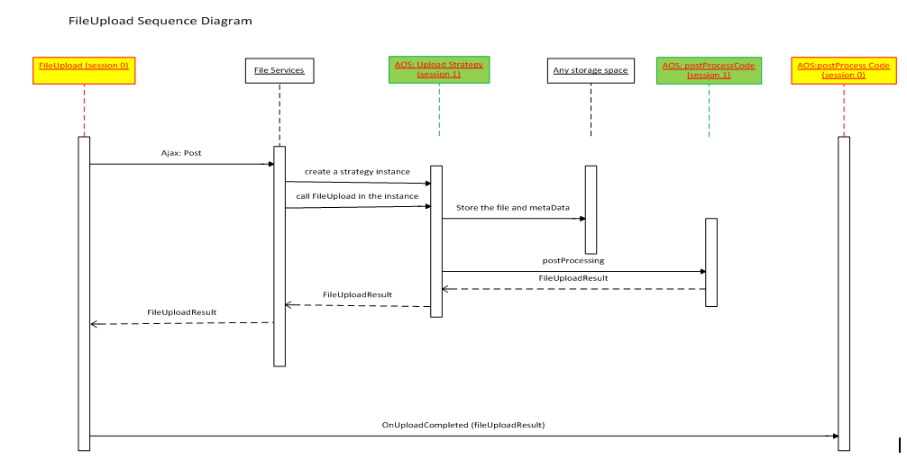

---
# required metadata

title: File upload control
description: This article provides information about the file upload control. This control lets users upload files to Microsoft Dynamics AX.
author: aneesmsft
manager: AnnBe
ms.date: 2016-02-24 17 - 32 - 07
ms.topic: article
ms.prod: 
ms.service: Dynamics365Operations
ms.technology: 

# optional metadata

# ms.search.form: 
# ROBOTS: 
audience: Developer
# ms.devlang: 
ms.reviewer: RobinARH
ms.search.scope: AX 7.0.0, Operations
# ms.tgt_pltfrm: 
ms.custom: 54311
ms.assetid: 1cb47ba5-0a8a-48ae-94d9-c23c7b3100fd
ms.search.region: Global
# ms.search.industry: 
ms.author: aneesa
ms.dyn365.intro: Feb-16
ms.dyn365.version: AX 7.0.0

---

# File upload control

This article provides information about the file upload control. This control lets users upload files to Microsoft Dynamics AX.

Overview
--------

The file upload control lets users upload a file to Microsoft Dynamics AX. It also lets developers control the upload process and manage the file that is uploaded, based on their requirements.  The file upload control can have three styles. You control the style by using the **Style** property.

-   The **Standard** style shows the file name field together with **Browse**, **Upload**, and **Cancel** buttons.
-   The **Minimal** style shows only the **Browse** button.
-   The **MinimalWithFileName** style shows the file name field and the **Browse** button.

The **FileTypesAccepted** property of the file upload control lets you limit the types of files that users can upload. The file types that users can upload are primarily controlled by the associated upload strategy. The **FileTypesAccepted** property on the file upload control should be used only if further restrictions are required. If the upload control tries to specify file types that are restricted by the upload strategy, the **Browse** button becomes unavailable.

| Allowed file types    | Allowed file types from the upload strategy | Final result                          |
|-----------------------|---------------------------------------------|---------------------------------------|
| ".jpg,.png"           | ".jpg,.png,.gif,.txt"                       | ".jpg,.png"                           |
| "image/png"           | "image/\*"                                  | "image/png"                           |
| "image/\*"            | "image/png"                                 | The **Browse** button is unavailable. |
| ".jpg,.png,.gif,.txt" | ".jpg,.png"                                 | The **Browse** button is unavailable. |

You can use the **OnBrowseButtonClicked**, **OnUploadAttemptStarted**, and **OnUploadCompleted** overrides to hook into the various stages of the file upload process. You can also create custom file upload strategies and associate them with a file upload control by using the **FileUpload Strategy Class** property.

## Design classes
There are two main types of classes that developers can work with for the file upload control:

-   **Upload strategy class** – This class lets developers control various parameters that should be enforced for uploaded files, such as the types of files that a user can upload and the maximum size of a file. It also lets developers determine where and how the uploaded file should be stored. All upload strategy classes must inherit from the abstract **FileUploadStrategyBase** class.
-   **Upload result class** – This class lets developers access the details of a file that was uploaded by a user, such as its name, content type, and upload status. It also lets developers open and delete the corresponding file. All upload result classes must inherit from the abstract **FileUploadResultBase** class.

The framework provides a default upload strategy class that is named **FileUploadTemporaryStorageStrategy** and a default upload result class that is named **FileUploadTemporaryStorageResult**. This upload result class stores uploaded files to the temporary blob storage and provides a download URL. Developers can also implement their own custom upload strategy and upload result classes as required. For the upload strategy, two abstract methods from the **FileUploadStrategyBase** class must be implemented: **uploadFile** and **getResultClassName**. The **uploadFile** method handles where and how the file is stored. The **getResultClassName** method retrieves the upload result class that is used in this strategy. The **FileUploadResultBase** class has fields for the file name, the upload status, the content type of the file, and the log message. This class can be extended as required. All new properties should be able to be serialized and deserialized. The **openResult** method opens the file as a stream, and the **deleteResult** method deletes the file from the corresponding data storage.

## Sequence diagram
The file upload control accepts the file and upload strategy in the client, and sends them to the file services. The file services start a new session, create an instance of a strategy class, and call the **uploadFile** method. When the **uploadFile** method has finished storing the file in the data source, a file upload result class returns to the file services. This class is sent back to the client, which might trigger the **OnUploadCompleted** event to deal with the post-process. 

