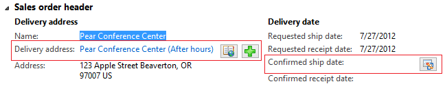

---
# required metadata

title: Horizontal Fields and Buttons Group subpattern
description: This article provides information about the Horizontal Fields and Buttons Group form subpattern. This subpattern is used when actions must be defined for an individual field on a form.
author: jasongre
manager: AnnBe
ms.date: 2017-04-04
ms.topic: article
ms.prod: 
ms.service: Dynamics365Operations
ms.technology: 

# optional metadata

# ms.search.form: 
# ROBOTS: 
audience: Developer
# ms.devlang: 
# ms.reviewer: 61
ms.search.scope: AX 7.0.0, Operations
# ms.tgt_pltfrm: 
ms.custom: 12464
ms.assetid: 56b16f26-d4d3-4052-9ebc-0878b09cc00d
ms.search.region: Global
# ms.search.industry: 
ms.author: jasongre
ms.search.validFrom: 2016-02-28
ms.dyn365.ops.version: AX 7.0.0

---

# Horizontal Fields and Buttons Group subpattern

This article provides information about the Horizontal Fields and Buttons Group form subpattern. This subpattern is used when actions must be defined for an individual field on a form.

Usage
-----

This subpattern is used when actions must be defined for an individual field on a form. The buttons are laid out just to the right of the field to visually associate the actions with the field. The buttons should display only an icon (no text). Actions that are associated with a section or an entire form should be placed in a Toolbar or ActionPane above that section or form.

### Typical contents

-   1–2 fields
-   1–3 buttons

## Wireframe

## Pattern changes
Here are the main changes to this pattern since Microsoft Dynamics AX 2012:

-   The layout of fields and buttons will use a single column, where **ArrangeMethod**=**HorizontalLeft**.

## Model
### High-level structure

Group (ArrangeMethod=HorizontalLeft)

Field

*Field (optional)*

Buttons (1–3 buttons)

### Core components

-   Apply the HorizontalFieldsButtonsGroup subpattern to the container control.
-   Address BP Warnings:
    -   There should be no more than three buttons.
    -   No additional BP checks are required beyond the AX6.3 BP checks that were carried forward.

### Related patterns

-   [Toolbar and Fields](toolbar-fields-subpattern.md)
-   Horizontal Fields

## UX guidelines
The verification checklist shows the steps for manually verifying that the form complies with UX guidelines. This checklist doesn't include any guidelines that will be enforced automatically through the development environment. Open the form in a browser, and walk through these steps.

-   **Standard form guidelines:**
    -   Standard form guidelines have been consolidated into the [General Form Guidelines](general-form-guidelines.md)document.
-   **Horizontal Fields and Buttons Group guidelines:**
    -   The width of the fields + buttons should not exceed the standard size of a column.
    -   Buttons should have a symbol image assigned.
    -   Buttons should have tooltips.
    -   There should be a maximum of three buttons. The last button can be a menu button.

## Examples
Form: **SalesTable (GroupHeaderAddressHeaderOverview)** 

## Resources
### Typically used by patterns

-   [Simple List and Details](simple-list-details-form-pattern.md)
-   [Table of Contents](table-of-contents-form-pattern.md)
-   [Details Master](details-master-form-pattern.md)
-   [Details Transaction](details-transaction-form-pattern.md)

## Appendix
### Frequently asked questions

This section will have answers to frequently asked questions that are related to this guideline/pattern.

### Open issues

-   None

### Dynamics AX 2012 content

**SalesTable** 

