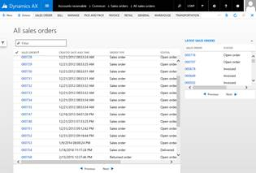
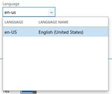
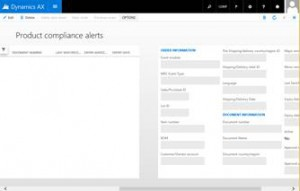
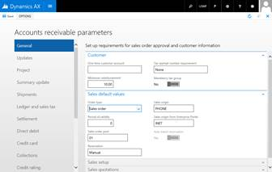

---
# required metadata

title: Select a form pattern
description: This article provides information that will help you select the best form pattern for the forms that you migrate. 
author: jasongre
manager: AnnBe
ms.date: 2017-04-04
ms.topic: article
ms.prod: 
ms.service: Dynamics365Operations
ms.technology: 

# optional metadata

# ms.search.form: 
# ROBOTS: 
audience: Developer
# ms.devlang: 
# ms.reviewer: 61
ms.search.scope: AX 7.0.0, Operations
# ms.tgt_pltfrm: 
ms.custom: 28681
ms.assetid: 09a51876-8c9d-41ed-ab81-b780894a4281
ms.search.region: Global
# ms.search.industry: 
ms.author: jasongre
ms.search.validFrom: 2016-02-28
ms.dyn365.ops.version: AX 7.0.0

---

# Select a form pattern

This article provides information that will help you select the best form pattern for the forms that you migrate. 

Introduction
------------

The selection of a form pattern is an important step in the process of migrating a form. A pattern that is a good fit for the target form reduces the amount of migration work that is required. By contrast, a pattern that isn't a good fit can cause wasted time and effort. Therefore, it's important that you do some investigation, so that you can select the best form pattern for the form that you're migrating. Here is some guidance and tips for determining the appropriate pattern for a form:

-   Investigate the form’s metadata in the form designer. Pay close attention to the following details:
    -   Form name
    -   **Form.Design.Style**
    -   Control names
    -   The way that the controls are organized
    -   The number and names of the data sources
-   Investigate the form’s visuals by running the form and looking at the way information is displayed.

## Selecting a form pattern via metadata
### Use Form.Design.Style for guidance

The **Form.Design.Style** property often contains the name of the pattern that was previously targeted for the form. If the **Style** property correctly matches the metadata, you can use the following table to find a pattern that is likely to be a good fit for the form.

| Form.Design.Style value                                                                          | Corresponding pattern                                                                                           |
|--------------------------------------------------------------------------------------------------|-----------------------------------------------------------------------------------------------------------------|
| DetailsFormMaster                                                                                | [Details Master](details-master-form-pattern.md)                              |
| DetailsFormTransaction                                                                           | [Details Transaction](details-transaction-form-pattern.md)                    |
| Dialog                                                                                           | [Dialog](dialog-form-pattern.md)                                              |
| DropDialog                                                                                       | [Drop Dialog](drop-dialog-form-pattern.md)                                    |
| FormPart, where there are just fields                                                            | [Form Part FactBox Card](factbox-form-patterns.md)                            |
| FormPart, where there is a grid                                                                  | [Form Part FactBox Grid](factbox-form-patterns.md)                            |
| ListPage                                                                                         | [List Page](list-page-form-pattern.md)                                        |
| Lookup                                                                                           | [Lookup](lookup-form-pattern.md)                                              |
| SimpleList                                                                                       | [Simple List](simple-list-form-pattern.md)                                    |
| SimpleListDetails, where there are 2–3 fields in the navigation list (recommended)               | [Simple List Details – List Grid](simple-list-details-form-pattern.md)    |
| SimpleListDetails, where there are and 4–5 fields in the navigation list                         | [Simple List Details – Tabular Grid](simple-list-details-form-pattern.md) |
| SimpleListDetails, where there is a tree (rare)                                                  | [Simple List Details – Tree](simple-list-details-form-pattern.md)         |
| TableOfContents                                                                                  | [Table of Contents](table-of-contents-form-pattern.md)                        |
| Auto, where there is an **Overview** tab, a **General **tab, and a single data source            | [Task Single](task-single-form-pattern.md)                                    |
| Auto, where there are two sets of **Overview **tabs, **General** tabs, and/or headers plus lines | [Task Double](task-double-form-pattern.md)                                    |
| Auto, where there is focus on a single record                                                    | [Simple Details](simple-details-form-pattern.md)                              |
| Auto, where the form name ends in “Lookup”                                                       | [Lookup](lookup-form-pattern.md)                                              |
| Auto, where there is a single tab control and **Next**/**Previous** buttons                      | [Wizard](wizard-form-pattern.md)                                              |
| Auto, where the form name ends in “Wizard”                                                       | [Wizard](wizard-form-pattern.md)                                              |
| Auto, where there is just a grid and some buttons                                                | [Simple List](simple-list-form-pattern.md)                                    |

###  When a form doesn't match the Style property

Sometimes, a form has an incorrect **Form.Design.Style** property value.

| Form.Design.Style value | What the form might actually be                                                                                  |
|-------------------------|------------------------------------------------------------------------------------------------------------------|
| DetailsFormMaster       | DetailsFormTransaction, if there is lines detail, or if controls have names that contain “lines"                 |
| SimpleList              | SimpleListDetails, if there is more than just a grid and some custom filter fields                               |
| SimpleListDetails       | SimpleList, if there is just a grid and some custom filter fields                                                |
| SimpleList              | ListPage, if there are numerous FactBoxes in the **Parts** node, or if the form has a corresponding Details Form |

## Selecting a form pattern via visuals
Although this approach is less useful than looking at the form metadata, you can get a lot of information about a form by running and examining it. Use the form visuals as an additional data point to help you select a form pattern. Look through the screen shots of migrated forms to find a form that looks like the target form. Additionally, make sure that the description or intent of the pattern matches the description/intent of the form.

## Form pattern reference guide
### List of classes of top-level form patterns

| Form pattern                                                                                                        | What it's used for                                                                                                    |
|---------------------------------------------------------------------------------------------------------------------|-----------------------------------------------------------------------------------------------------------------------|
| [Details Master](details-master-form-pattern.md) (two variants)                   | A form that displays the details of a complex entity                                                                  |
| [Details Transaction](details-transaction-form-pattern.md)                        | A form that displays the details of a complex transaction entity and its lines (for example, and order and its lines) |
| [Dialog](dialog-form-pattern.md) (six variants)                                   | A form that is used as a dialog to gather a set of information                                                        |
| [Drop Dialog](drop-dialog-form-pattern.md) (two variants)                         | A form that is used as a drop dialog to gather a small set of information to provide context for an action            |
| [FactBox](factbox-form-patterns.md) (two variants)                                | A Microsoft Dynamics AX 2012 FactBox that displays information about a related record or set of records               |
| [List Page](list-page-form-pattern.md)                                            | A Dynamics AX 2012 List Page                                                                                          |
| [Lookup](lookup-form-pattern.md) (three variants)                                 | A form that is used as a lookup                                                                                       |
| [Simple Details](simple-details-form-pattern.md) (four variants)                  | A form that is focused on a single record                                                                             |
| [Simple List](simple-list-form-pattern.md)                                        | A form that displays details for a simple entity as a grid that has fewer than 10 fields per record                   |
| [Simple List & Details](simple-list-details-form-pattern.md) (three variants) | A form that displays information about an entity of medium complexity                                                 |
| [Table of Contents](table-of-contents-form-pattern.md)                            | A form that displays setup information or loosely related information sets                                            |
| Task (two variants)                                                                                                 | A legacy form pattern that is used to display master or transaction entities                                          |
| [Wizard](wizard-form-pattern.md)                                                  | A form that displays a set of tab pages to the user to gather information in a predetermined order                    |
| [Operational Workspace](workspace-form-pattern.md)                                | A form that is used to display an overview of an activity and is meant to be a primary means of navigation            |
| Workspace Panorama Sections (three variants)                                                                        | A form that is used to show content for a panorama section (via a Form Part Control) in the Operational Workspace     |

### Finding forms that currently use a particular form pattern

For a full list of forms that are currently using a particular form pattern, generate the **Form Patterns** report from within Microsoft Visual Studio. On the **Dynamics 365 **menu, expand the **Add-ins** option, and click **Run form patterns report**. A background process generates the report. After several seconds, a message box appears in Visual Studio to indicate that the report has been generated and inform you about the location of the **Form Patterns** report file. You can filter this file by pattern to find forms that use a particular pattern.

### Form pattern visuals and descriptions

For each form pattern class, information is provided about each variant. This information includes a short description and an illustration of an example form.

###### **Details Master**

[**Details Master**](details-master-form-pattern.md)\[Default\] This form pattern is used to display the details of a complex entity on FastTabs. It includes a grid view and a details view.

Form: CustTable 

**[Details Master w/ Standard Tabs](details-master-form-pattern.md)** Use this Details Master variant when your form has a large number of FastTabs (&gt;15) that can be grouped into categories.

Form: HcmWorker 

 

###### **Details Transaction**

**[Details Transaction](details-transaction-form-pattern.md)** Use this form patter to show the details of a complex transaction entity and its lines (for example, an order and its lines).

Form: SalesTable 

 

###### **Dialog**

[**Dialog – Basic**](dialog-form-pattern.md)\[Default\] This form pattern is used to gather or show a set of information.

Form: ProjTableCreate

**[Dialog – Read Only](dialog-form-pattern.md)** Use this Dialog variant when your Dialog just displays information that can't be edited. It has only a **Close** button.

Form: SalesTablePostings

**[Dialog – FastTabs](dialog-form-pattern.md)** Use this Dialog variant when your Dialog content is grouped into FastTabs.

None currently in product.

**[Dialog – Tabs](dialog-form-pattern.md)** Use this Dialog variant when your Dialog content must be grouped into tabs.

Form: CaseDetailCreate

**[Dialog – Double Tabs](dialog-form-pattern.md)** Use this Dialog variant when your Dialog content has two tabs that are stacked on top of each other.

Form: PurchTableReferences

 

###### **Drop Dialog**

[**Drop Dialog**](drop-dialog-form-pattern.md)\[Default\] This form pattern is used to initiate actions when the number of fields is small (less than five).

Form: CustCollectionsNewActivityAction

**[Drop Dialog – Read Only](drop-dialog-form-pattern.md)** Use this Drop Dialog variant when the fields in the Drop Dialog aren't editable. No **OK**/**Close** button is modeled.

No example currently exists in the product.

 

###### **Factbox**

**[Factbox Grid](factbox-form-patterns.md)** Use this Factbox variant to show a child collection of related information.

Form: ContactsInfoPart

**[Factbox Card](factbox-form-patterns.md)** Use this Factbox variant to show a set of related fields.

Form: CustStatisticsStatistics

 

###### **List Page**

**[List Page](list-page-form-pattern.md)** The Dynamics AX 2012 list page that is just a grid that is optimized for browsing records and acting on those records.

Form: SalesTableListPage

 

###### **Lookup**

[**Lookup Basic**](lookup-form-pattern.md)\[Default\] This form pattern is used if the lookup form is a grid or tree that has optional filters or buttons at the bottom.

Form: SysLanguageLookup

**[Lookup w/Preview](lookup-form-pattern.md)** Use this Lookup variant when, in addition to the basic pattern,a preview of the current record is also shown.

Form: HcmWorkerLookup

**[Lookup w/Tabs](lookup-form-pattern.md)** Use this Lookup variant when there are multiple views of a lookup (for example, a grid view/tree view or multiple filtered lists).

Form: CaseCategoryLookup

 

###### **Panorama Section**

**[Form Part Section List](section-list-form-pattern.md)** Use this form pattern to show a list in a workspace section. This should be modeled as a separate form and rendered in the workspace via a Form Part Control.

**[Form Part Section List - Double](section-list-form-pattern.md)** Use this variant when you must also show a secondary list. This secondary list isn't initially visible.

**[Hub Part Chart](section-chart-form-pattern.md)** Use this variant to show a chart in a workspace section. This should be modeled as a separate form and rendered in the workspace via a Form Part Control.

Form: VendInvoiceJourCountChart

 

###### **Simple Details**

**[Simple Details w/Toolbar and Fields](simple-details-form-pattern.md)** Use this form pattern tp show fields for a single base record.

Form: AgreementLine

**[Simple Details w/FastTabs](simple-details-form-pattern.md)** Use this Simple Details variant when the record’s information is organized into FastTabs.

Form: PlanActivityServiceDetails

**[Simple Details w/Standard Tabs](simple-details-form-pattern.md)** Use this Simple Details variant when the record’s information is organized into regular tabs.

Form: HcmEmploymentDateManager

**[Simple Details w/Panorama](simple-details-form-pattern.md)** Use this Simple Details variant to display a record’s information in a horizontally scrolling panorama.

Form: PdsMRCEventTracker

 

###### **Simple List**

**[Simple List](simple-list-form-pattern.md)** This form pattern is used to maintain data for simple entities.

Form: CustGroup

 

###### **Simple List and Details**

[**Simple List & Details – List Grid**](simple-list-details-form-pattern.md)\[Default\] This form pattern is used to maintain data for entities of medium complexity. A list grid that has 2–3 fields in the navigation list is the preferred pattern for this form style in the current version.

Form: PaymTerm

**[Simple List & Details – Tabular Grid](simple-list-details-form-pattern.md)** Use this Simple List & Details variant if you require more than three fields in the list part of the form.

Form: ExchangeRate

**[Simple List & Details – Tree](simple-list-details-form-pattern.md)** Use this Simple List & Details variant if the list part of the form is a tree.

Form: FiscalCalendars

 

###### **Table of Contents**

**[Table of Contents](table-of-contents-form-pattern.md)** Use this form pattern to show setup information or loosely related information sets.

Form: CustParameters

 

###### **Task**

**[Task Single](task-single-form-pattern.md)** This legacy form pattern is used to display entities. It should be used only for migration, not for new forms.

Form: LedgerJournalTable

**[Task Double](task-double-form-pattern.md)** This legacy form pattern is used to display transaction entities. It should be used only for migration, not for new forms.

Form: HRMAbsenceTableHistory

 

###### **Wizard**

**[Wizard](wizard-form-pattern.md)** This form pattern is used to display a set of page views to the user to gather information in a predetermined order.

Form: WrkCtrBulkResReqEditWizard

 

###### **Workspace**

[**Operational Workspace**](workspace-form-pattern.md)\[Default\] This is the preferred, performance-enhanced variant of the Workspace pattern.

Form: FmClerkWorkspace

**Workspace** This is the old Workspace pattern. It will be removed soon, so don't use it. It is included here only for completeness.

 Do not use.

## Subpattern reference guide
### List of subpattern classes

| Form pattern                                                                                                     | What it's used for                                                                                  |
|------------------------------------------------------------------------------------------------------------------|-----------------------------------------------------------------------------------------------------|
| [Custom Filters](custom-filter-group-subpattern.md) (two variants)             | Containers that display QuickFilters and any other modeled custom filters                           |
| Fields (five variants)                                                                                           | Containers that primarily display individual fields                                                 |
| [Dimension Expression Builder](../financial/dimension-expression-builder-subpattern.md)     | Containers that include a Dimension Expression Builder control                                      |
| [Dimension Entry Control](../financial/dimension-entry-control-subpattern.md)               | Containers that include a Dimension Entry Control                                                   |
| [List Panel](list-panel-subpattern.md)                                         | Containers that display two lists that users move items between                                     |
| [Nested Simple List and Details](nested-simple-list-details-subpattern.md) | Containers that are used to embed a simpler Simple List and Details form inside a section in a form |
| [Toolbar and Fields](toolbar-fields-subpattern.md)                         | Containers that display actions above a set of fields                                               |
| [Toolbar and List](toolbar-list-subpattern.md) (two variants)              | Containers that display actions above 1–2 grids                                                     |
| Workspace-related (eight variants)                                                                               | Containers that correspond to various sections inside an Operational Workspace                      |

### Finding containers that require that a subpattern be applied on a form

When a form is open in the Visual Studio designer, you can easily search for containers that must still have subpatterns applied by searching for “unspecified” in the control search box at the top of the designer (as shown in the following screen shot).

### Subpattern visuals and descriptions

For each subpattern class, information is provided about each variant. This information includes a short description and an illustration of an example form.

###### **Custom Filters**

**[Custom Filters](custom-filter-group-subpattern.md)** Use this form pattern when custom filters are modeled. QuickFilter isn't required.

Form: LedgerJournalTable (TopFields)

**[Custom and Quick Filters](../financial/dimension-entry-control-subpattern.md)** Use this variant when a QuickFilter is required.

Form: CustTable (CustomFilterGroup)

 

###### **Fields**

**[Fields and Field Groups](fields-field-groups-subpattern.md)** Use this form pattern to get a responsive layout for containers that contain only fields.

Form: InventLocation (LocationNames)

**[Tabular Fields](tabular-fields-subpattern.md)** Use this form pattern to get a structured layout of fields. It is intended primarily for totals.

Form: LedgerJournalTransVendPaym (Balances)

**[Fill Text](fill-text-subpattern.md)** Use this form pattern when a single input control requires full width.

Form: FmRental (Notes)

**[Horizontal Fields and Button Group](horizontal-fields-buttons-group-subpattern.md)** Use this form pattern when a field has an inline action.

Form: SalesTable (GroupHeaderAddressHeaderOverview)

**[Image Preview](image-preview-subpattern.md)** Use this form pattern for containers that have image controls (and optional related fields).

Form: RetailVisualProfile (Login)

 

###### **Toolbar and List**

**[Toolbar and List](toolbar-list-subpattern.md)** Use this form pattern on containers that have only actions and a grid.

Form: VendTable (TabCommunication)

**[Toolbar and List – Double](toolbar-list-subpattern.md)** Use this Toolbar and List variant when the containers have two grids.

Form: SalesQuickQuote (TabPageExistingItems)

 

###### **Workspace Related**

**[Section Tiles](section-tiles-subpattern.md)** Use this variant to show a set of tiles/charts in a workspace section. This should be modeled in a tab page on the workspace form. Charts are defined by using Form Part Controls

Form: SalesOrderProcessingWorkspace

**[Section Related Links](section-related-links-subpattern.md)** Use this variant to show a set of hyperlinks in a workspace section. This should be modeled in a tab page on the workspace form.

Form: SalesOrderProcessingWorkspace

**[Section Tabbed List](section-tabbed-list-subpattern.md)** Use this variant when multiple list variants must be included. Only one is shown at a time.

**[Section Stacked Chart](section-stacked-chart-subpattern.md)** Use this variant when you must include up to two charts in an Operational Workspace.

**[Section PowerBI](section-powerbi-subpattern.md)** Use this variant when a PowerBI section must be included.

**[Workspace Page Filter Group](workspace-filter-group-subpattern.md)** Use this form pattern to add a single filter to your workspace.

**[Filters and Toolbar – Stacked](filters-toolbar-subpattern.md)** Use this subpattern in the Form Part Section List pattern, so that actions appear below filters.

**[Filters and Toolbar – Inline](filters-toolbar-subpattern.md)** Use this subpattern in the Form Part Section List pattern, so that filters and actions appear on the same line.

 

###### **Other**

**[Nested Simple List & Details](nested-simple-list-details-subpattern.md)** Use this form pattern to embed a simpler Simple List & Details form inside a tab or group.

Form: HcmJob (TaskTabPage)

**[List Panel](list-panel-subpattern.md)** Use this form pattern when users must move items back and forth between two lists.

Form: CLIControls\_ListPanel (FormTabPageControl1)

**[Toolbar and Fields](toolbar-fields-subpattern.md)** Use this form pattern on containers that have only actions and fields

Form: HcmPosition (WorkerAssignmentTabPage)

**[Dimension Entry Control](../financial/dimension-entry-control-subpattern.md)** Use this form pattern on tab pages that have only a Dimension Entry Control.

Form: CustTable (TabFinancialDimensions)

**[Dimension Expression Builder](../financial/dimension-expression-builder-subpattern.md)** Use this form pattern on containers that include a Dimension Expression Builder control.

