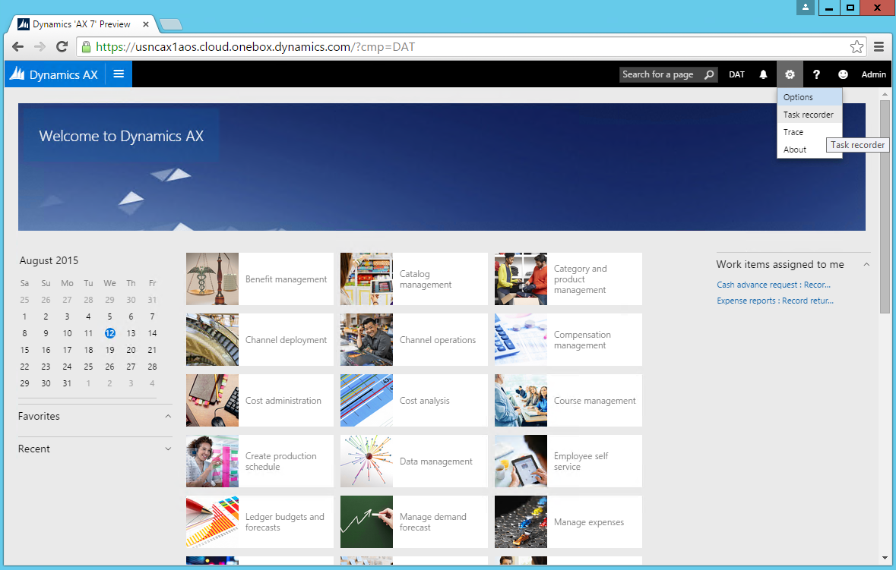
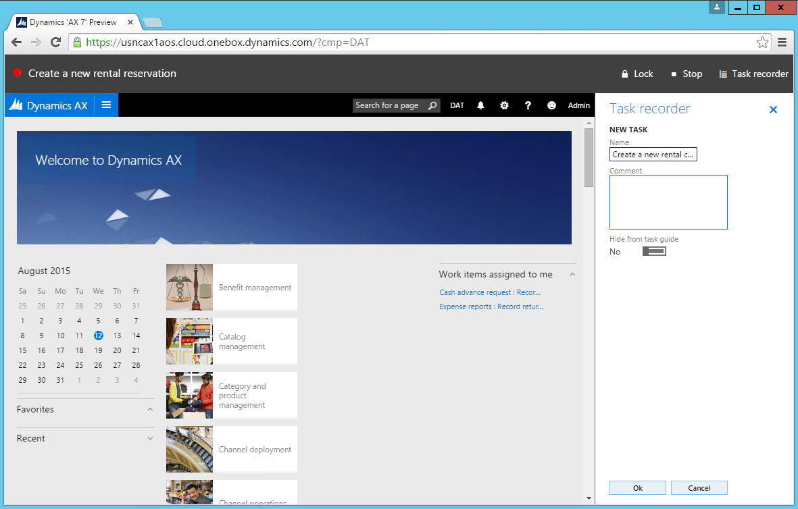
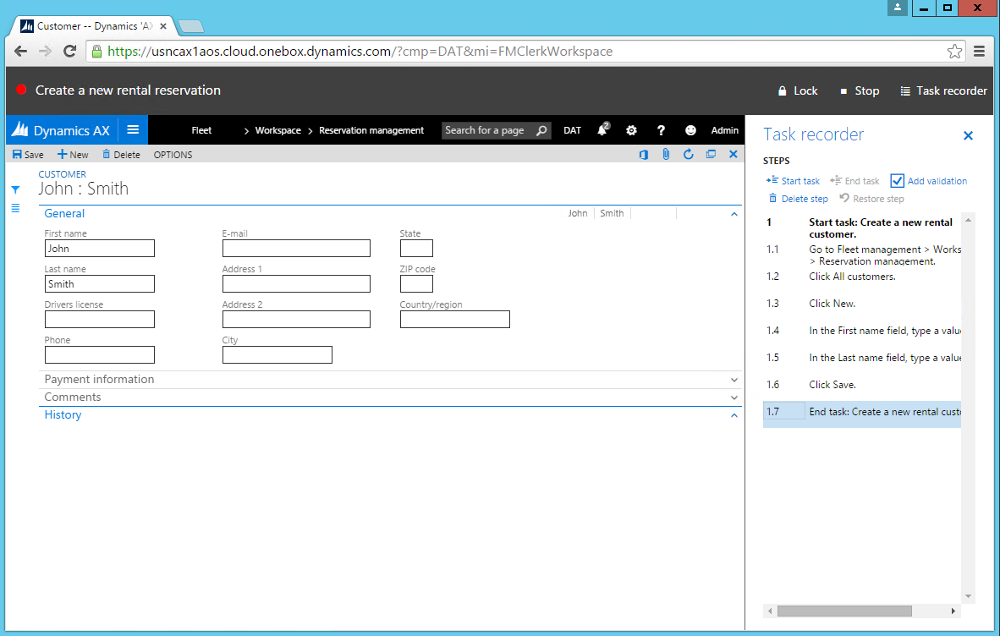
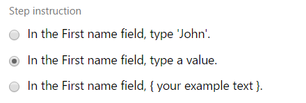
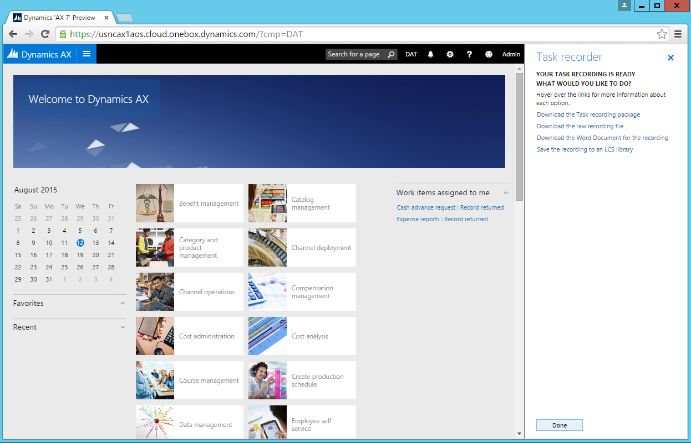
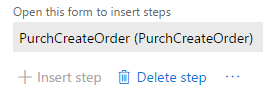

---
# required metadata

title: Task Recorder in Dynamics 365 for Operations | Microsoft Docs
description: This article describes the how to use Task Recorder to record Microsoft Dynamics 365 for Operations client functions.
author: jasongre
manager: AnnBe
ms.date: 04/04/2017
ms.topic: article
ms.prod: 
ms.service: Dynamics365Operations
ms.technology: 

# optional metadata

keywords: SysTaskRecorderPane
# ROBOTS: 
audience: Developer
# ms.devlang: 
ms.reviewer: josaw1

# ms.tgt_pltfrm: 
ms.custom: 24271
ms.assetid: bbb6914b-91bc-4477-9d5a-bb48d339882f
ms.search.region: Global
# ms.industry: 
ms.author: jasongre

---

# Task Recorder in Dynamics 365 for Operations

This article describes the how to use Task Recorder to record Microsoft Dynamics 365 for Operations client functions.

Overview
========

### The new Task Recorder

For the release of Dynamics 365 for Operations, Task Recorder has been re-built from the ground up with a focus on high-responsiveness, a flexible extensibility API, and seamless integrations with consumers of business process recordings. We're carrying forward Task Recorder integration with the Lifecycle Services BPM tool (<https://bpm.lcs.dynamics.com>), so that users can continue to produce rich business process diagrams from recordings for analyzing and designing their applications. We're also introducing the ability for Task Recorder to auto-generate application verification tests from business process recordings, as well as playback previously recorded processes. These new features also come with new gestures that allow users to take full advantage of the powerful new Task Recorder. If you're reading this tutorial for the first time and wish to practice the topics as they're discussed, note that arabic and Roman numerals indicate actionable steps that you should take. Alphabetical entries are used to indicate paragraphs with helpful details about using Task Recorder.

### Architecture

Task Recorder is able to record user actions in the client with exact fidelity. This is achieved by instrumenting each control to notify Task Recorder about the execution of a user action. The control notifies Task Recorder that an event has occurred and passes along all pertinent information about the corresponding user action in real-time. From this information, Task Recorder is able to capture the type of user action (such as a button click, value entry, navigation, etc.) and any data related to the user action (such as input data value and type, form context, record context, etc.). Task Recorder persists the information with enough detail to ensure that a playback of the recording can execute the recorded actions exactly as they were executed by the user.

### Basic configuration

Task Recorder comes pre-installed with Dynamics 365 for Operations and users are able to begin recording business processes immediately after opening the client for the first time. Task Recorder supports Microsoft Edge, Internet Explorer 11, and the latest version of Google Chrome.

## Create a recording
The following steps show the process for creating a new recording using Task Recorder.

1.  Open the client and log in. It's a good practice to refresh the browser before each new recording. This creates a new user session and restarts Task Recorder, providing the most stable recording experience.
2.  Select the company that you want to use while recording. **Note**: If this is your first time using Task Recorder, you can follow along as this tutorial creates a sample recording based on a Fleet Management business process. You will need to load the Fleet demo data to follow along:
    1.  Go to **Dashboard &gt; Fleet Management &gt; Fleet setup**.
    2.  Click **Load demo data**.
    3.  When the data is finished loading, click **Close**.
    4.  Go back to the **Dashboard** by clicking the Dynamics logo in the upper-right corner.

3.  Go to **Navigation Pane &gt; Task Recorder**.
****
4.  The **Task Recorder Pane** opens. The user may click the "**X**" in the upper-right corner to close the **Task Recorder Pane** before beginning a new recording. The pane can be reopened by following the previous steps.

5.  Click **Create** to create a new recording
6.  Enter a name for the recording and click **Start**. Recording begins the moment **Start** is clicked. If you're following along and need inspiration for a name, use "Create a new rental reservation."
 
**Note**: During recording, clicking the "**X**" in the upper-right corner will hide the pane without stopping the recording. The pane can be re-opened by clicking the **Task recorder** menu button that appears at the top of the screen. This icon only appears while recording is in progress. 

7.  The **Task Recorder Pane** enters **Recording Mode.** The pane now shows information and controls related to the process of recording. For more information about how to use the buttons shown, see the [section on using the controls](#recording-controls).

Now you're ready to record a business process using Task Recorder. If you're following this guide as a first time user, you may complete the following Fleet Management scenario for the sake of example. Otherwise, you may complete your own application scenario.

## Record a Fleet Management scenario
1.  In the **Task Recorder Pane**, click **Start task**.
2.  Set the **Name** to "Create a new rental customer". Leave the **Comment** blank.
3.  Click **OK**. 

4.  The task is added to the **Steps list**. 
****
5.  Go to **Dashboard &gt; Fleet Management &gt; Reservation Management**.
6.  Go to **All customers** under the **Summary** tab.
7.  In the Action Pane, click (**+**) **New**.
8.  Enter a first and last name for the customer.
9.  Click **Save**.
10. In the **Task Recorder Pane**, click **End task**. 
****
11. Return to the **Reservation Management** workspace by clicking the browser back button twice.
12. In the **Task Recorder Pane**, click **Start task**. Name the task "Rent a vehicle to the new customer." Click **Start**.
13. Click (**+**) **Rental** under **Summary**.
14. Under **Information**, select a 1975 Litware McKinley as the vehicle.
15. Under **Information**, set the customer to the one just created.
16. Expand the **Discounts** section.
17. Click **Add** under **Discounts** and add the Frequent Customer discount. Click **OK**.
18. In the Action Pane, click **Start Rental**.
19. Set the return date to some date in the future.
20. Click **OK**.
21. In the **Task Recorder Pane**, click **End task**.
22. In the **Task Recorder Pane**, click **Stop**.

Congratulations! You have created your first Task recording. You can proceed to [download the recording, or publish it to LCS](#download-options).

## Recording controls
### Stop

**Stop** is used to end the recording session. Ending the recording session isn't reversible, so the user should be sure that the recording is complete before clicking **Stop**. Clicking **Stop** will take the user to the download options screen.

### Start/End Task

**Start/End Task** enables a user to specify the beginning and ending of a set of grouped steps. Click the **Start Task** button to add a "Start Task" step to the end of the current list of recorded steps. Then perform the steps that you want to include in the task. After you've performed (and thus recorded) the steps in the task, click the **End Task** button to add an "End Task" step to the end of the current list of recorded steps.

**Note**: You must start your tasks before performing/recording the steps that you want to include in the task. You must End the task after you have performed/recorded all of the steps that you want to include in the task.

**Tasks** are purely an organization tool, and consumers of business process recording can interpret the Task groupings in useful ways. Tasks can be nested within other Tasks, providing the flexibility to organize very long and complex business processes. 

### Delete/Restore Step

**Delete/Restore Step** enables a user to remove steps from the recording, or undo the removal of a step from the recording. You must first select the step in the Steps list that you want to delete/restore, and then click the **Delete/Restore Step** button.

**Note**: The behavior of the **Delete** button changes when in **Maintenance mode.** When deleting a pending/un-executed step in **Maintenance mode**, the step cannot be restored after playback has progressed past the point at which it would have executed the Deleted step. For example, you load a recording that contains 3 steps in Maintenance mode. Before starting playback, you delete step 2. You can restore step 2, as long as playback has not executed step 3. After you start playback, and playback has "skipped' step 2 (because you deleted it) and executed step 3, you will not be able to restore step 2. This is because step 2 was not executed and thus not recorded, and it cannot be retroactively added back into the recording at its previous position. 

### Add validation

**Add validation** enables a developer to add a placeholder step to the end of the current list of recorded steps. This placeholder step does not appear when viewing the Task guide, and this placeholder step is not executed when maintaining a recording. The placeholder step is only used by the X++ code generator which allows creating an X++ test from a Task recording. When generating the X++ test, the code generator will automatically add a method stub to the generated code, which the developer can add X++ code into. The code generator will also call this method, and thus execute the developers code, when the generated test is run. The method will be called according to the order in which it was added to the recording.

## Adding annotations
An **annotation** is any additional information that is associated with a step in a Task recording. Annotations contain information that is in addition to the information that is automatically recorded by Task Recorder.

### Step Instruction

The **Step Instruction** is the primary text that is displayed for this step in the Task guide. There are usually 2-3 alternative options for step instructions, and they appear in the following order when editing the annotation.

 

This image shows the annotation options for changing the step instruction.
-   ***Preferred value instruction*** This type of instruction will direct the user to enter the same data that was used when the step was recorded. *Example*: In the First name field, enter 'John'.
-   ***Example value label*** This type of instruction will direct the user to enter their own data, indicating that the data that was used when the step was recorded was only *Example* data.
    -   *Example*: In the First name field, enter a value.

    If the user clicks the "See more" button when on this step of the Task guide, they will be able to see the data that was used when the step was recorded. This recorded data value will be labeled as an *Example* data value. **Note**: Steps which are not related to fields, such as clicking buttons, opening forms, or selecting records from a lookup, do not have *Example value label* as an option when annotating.
-   ***User-supplied value label*** This step instruction contains placeholder text, which the author can fill in with their own text. For steps which have an ***Example value label*** option, the placeholder allows substituting the text which normally specifies the data to enter. This is useful for scenarios where neither the ***Preferred value label*** nor the ***Example value label*** sufficiently express the data that should be used for this step.
    -   *Example label*: In the First name field, *{your example text}*.
    -   *Example label after supplying the placeholder text*: In the First name field, *enter the customer's name*.

    For steps which do not have an ***Example value label *** option, the placeholder allows substituting all of the label text. Steps associated with buttons, for example, do not have ***Example value labels***, so you may replace the entire label text with your own text.
    -   *Example label before replacement*: Click Post.
    -   *Example label after replacement*: To post the order, click Post.

### Titles and notes

Titles and notes provide places for user-specified text to be associated with a step in a Task guide.
-   **Title** The **Title** lets you specify the text that appears above the **Step Instruction** for this step in the Task guide. The **Title** is a good place to put text that you want the user to read before the complete the action that is indicated by the **Step Instruction**.
-   **Note** You can use a **Note** to specify text that appears in the expandable section of the pop-up for this step in the Task guide. The note is a good place to put optional reading material or other information that may be useful to the user, but is not required for them to read in order to complete the action that is indicated by the **Step Instruction**.

## Hide from Task guide

The **Hide** option allows the author to prevent certain steps from appearing in the Task guide. This is useful for hiding steps which are necessary for the Task recording to execute in Maintenance mode but should not be seen by the end-user. An example of such steps are copy steps, system-generated steps, and data clean-up steps. Hiding a task will result in all of the steps that are recorded within that task to also be hidden.

## Recording gestures

The basic recording capability allows a user to record an end-to-end business process in Dynamics 365 for Operations using Task Recorder without adding overhead to the process. In some circumstances, more advanced recording features can be leveraged to create even richer business process recordings. Each of the following gestures are triggered by right-clicking on a control in the client that supports the gesture. Each gesture results in a step being added to the list of steps for the recording. If the gesture is not supported for a particular control, then the gesture will not appear in the right-click menu.
### Copy

This right-click gesture allows copying a control to the Task Recorder “clipboard”. The control may then be used later as part of a **Paste** or **Validate** gesture.

### Paste

This right-click gesture allows the pasting a value from a previously copied control. The Task Recorder paste function operates just like the paste function that users may be familiar with, and it has an additional benefit when used during recordings. During playback of a recording, Task Recorder will also re-play the **Copy** and **Paste** commands that were recorded. During playback, if the copied control has a different value than it had during recording, then Task Recorder will use the current value when pasting, rather than use the value the copied control had during recording. This is useful in scenarios were the copied control has a value that can change between environments (such as recIDs, number sequences, etc.).

There’s an additional benefit from using **Copy** and **Paste** when generating test code. For any control whose value is set via the **Paste** action, Task Recorder does not need to create a parameterized input variable for that control’s value, because it is set based on another control’s value. This can be very useful in scenarios where an entity is created, such as a Customer, and an identifier for the Customer is frequently entered during the recording. Instead of needing to manually re-enter the Customer name or ID throughout the scenario, and causing Task Recorder to generate a parameterized input variable for each entry, the user can instead repeatedly **Paste** the Customer name/ID after copying it once and Task Recorder will generate a single parameterized input variable to represent the Customer name/ID. This feature can make changing the input data for a generated test much easier.

###  Validate

This right-click gesture allows the user to insert a step that validates the value of the right-clicked control. **Validate** always uses equality to validate the control value. *Validations are not currently executed during recording playback*, they are executed only when running the generated test code. There are two kinds of validations available:

-   **Current value validation** will capture the right-clicked control’s value at the time of recording and use this value to generate an assertion in the test code. In the list of validation options in the right-click menu, Current Value is always the first.
-   **Reference value validation** will use the value of a previously copied control when generating an assertion in the test code. This allows creating assertions that are resilient to changes in the data, since the value is not hardcoded into the test code. In the list of validation options in the right-click menu, Reference value validation follows the format \[AOT name of copied control: current copied value\].

### Add info step

This right-click gesture allows the user to insert a step and supply their own text for the step. This feature is primarily useful for creating Task guides. An **Informational Step** is a Task guide step where the instruction text for the step are user-specified. **Info steps** are useful for describing actions that are a part of the scenario but must take place outside of the Dynamics 365 for Operations system, such as searching for an item inventory or checking an email for information.

The user can specify where an **Info step** should appear in the Task guide. The **Info step** can either point to a control on a form, if the step is associated with the control, or the **Info step** can appear in the upper-right of the form, if the step is external to the Dynamics 365 for Operations system and the step is an explanation that applies to the entire form.

**Note:** Because **Info steps** are manually specified steps, and are not automatically recorded by Task Recorder when the user takes an action on a control, the **Info step** does not have the capability to automatically progress when a user completes the step in the Task guide. Because the **Info step** is not associated with taking an action in the Dynamics 365 for Operations system, there is no action for the Task guide to detect that the user has completed in order to automatically progress to the next step.

## Download options
After clicking **Stop**, several options are shown for downloading files related to the completed recording. Click **Download recording**, and save the Task recording package to your desktop. We'll use this file later.

### Download the Task recording package

You should download the Task recording package after you finish your recording. The Task recording package can be used to play a Task guide, maintain the recording, or edit the recording's annotations.

### Download the raw recording file

The raw recording file is useful for developer scenarios, such as test code generation.

### Download BPM package

The Microsoft Word document for your recording contains the recorded steps as well as any screenshots that were captured.

### Save the recording to an LCS library

Saving your recording to an LCS library will publish the BPM diagram for the recording on the specified business process. If the selected LCS library is set as an AX Help library, then you will be able to find the Task guide for this recording by searching the AX Help menu.

## Maintain a recording
The **Maintain** functionality of Task Recorder can automatically execute the steps of an existing recording, using the forms and values that were originally recorded. The Maintenance mode can be used to update an existing recording after making a change to the underlying application that alters the business process steps that are required for the scenario. It's important to remember that Task Recorder is simultaneously re-recording the steps and playing them back when in Maintenance mode. When Maintenance is complete a new recording is produced, which contains any steps from the existing recorded that were executed, as well as any new steps which were manually performed by the user. Any steps that are not executed, whether by the user or automatically by Task recorder, are not included in this new recording. When in Maintenance mode, additional controls are added to the Task Recorder Pane. To maintain an existing recording:
1.  Refresh the browser tab. ****Note**: It is a good practice to refresh the browser before each new recording. **Note**: Remember Maintenance also creates a new recording.
2.  Open the **Task Recorder Pane**.
3.  Click **Maintain a recording**.
4.  Click **It is in a file I can upload** to load a recording from a previously downloaded Task Recorder package (.axtr).
    -   If you're reading this guide for the first time and following along, choose the “Create a new rental reservation” file that you downloaded previously.

5.  Click **Start** and Task Recorder begins recording in Maintenance mode.

## Maintenance controls
### Step

**Step** will execute the next step in the recording. Before a step is executed it does not have a step number shown next to its description. After the step is executed, the step number is shown next to the description. **Step** is useful for having greater control of the playback speed when you want to analyze the effects of a single step. It is important to know that a side effect of clicking **Step** is that any open lookups, drop dialogs or Action Pane tabs may be dismissed, since clicking Step removes the focus from these elements. For these situations we suggest using **Play** instead of **Step** to ensure that the element is not dismissed due to clicking Step.

### Play

**Play** will begin sequential execution of the remaining steps in the recording, until Playback is paused, or all steps have been executed. While playing, the **Play** button will become a **Pause** button that can be used to pause playback. This pause button is not to be confused with the pause button under the **Recording** section which controls whether actions are being recorded. The state of recording is independent from the state of playback, and the respective pause buttons function independently of each other. If playback is unable to successfully execute a step for any reason, such as not being able to find a button that has been renamed, Task Recorder will skip that step and playback will automatically pause. This provides the user an opportunity to replace the obsolete step by completing the new steps in the client. Task Recorder will record the new steps and ignore the step that was skipped. The user can then click **Play** to continue playback for the remaining steps. Once the recording is complete, the user can download the updated recording which will contain all of the steps of the original recording, omitting any skipped steps, and including any new steps.

To **Skip** a step or *remove* a step from a recording, start Playback up until the step that you want to skip, **Pause the Recording**, **Step** over the step you want to skip, **Continue Recording** and then **Continue Playback**. Because recording was paused while the step was executed, the step will not be included in the new recording.

### Play until

**Play until** behaves similarly to **Play**, but allows you to play only a sub-set of the steps, rather than all of the steps. Simply select the step in the list that you want the playback to stop at, and then click **Play until. **Task recorder will begin executing the steps in the list, and it will stop when it has executed the step that you selected.

## New editing features that simplify maintenance
These features are only available in Dynamics AX platform update 2 or later. You can find these features on the **Settings &gt; Task recorder &gt; Edit recording** menu. With these recently added features, you can:
-   Insert steps without re-recording the entire file.
-   Move steps under a sub-task without re-recording the entire file.
-   Collapse Recording name and description fields.

### Insert steps without re-recording the entire file

You can now add a step anywhere in a task guide without playing back or re-recording the entire file.
 1.  Select the step after which you want the new step to be inserted. Make sure the step is highlighted.

In order for task recorder to insert a step, you must have the correct page open. The correct page is the page on which the new step occurs. Task recorder has a mechanism that determines what the active page is, and will disable the functionality if the correct page isn’t open. 

When you are on the correct page, **Insert step** becomes available.

2.  Click **Insert step**.

When you click **Insert step**, Task recorder switches to record mode. Any action taken in the UI will now be recorded and added in-place as steps.
3.  Click **Stop**.

You can repeat the process, adding as many steps or moving as many sub-tasks as needed (see below for sub-tasks).
4.  When you are done editing the task guide, click **Done editing**, and then choose one of the options to save or publish the task guide.

### Move steps under a sub-task without re-recording the entire file

You can move steps under a sub-task without playing back or re-recording the entire file. You can also move the sub-task step or the end sub-task step if you want to group an existing block of steps.
1.  Select the step or sub-task step that you want to move. Make sure that the step is highlighted.
2.  Click **… &gt;** **Move step after**.

1.  Select the step or sub-task step that you want to move the step or sub-task step after. Task recorder will move the step.
2.  To move the end sub-task step, select it, click **… &gt;** **Move step after**, and then select the step after which you want the end sub-task step to be.

If you want the first step in the task guide to be within a sub-task, create a sub-task step as the second step, and then move the first step into it. You can add or move as many steps or sub-tasks as needed.
5.  When you are done editing the task guide, click **Done editing**, and then choose one of the options to save or publish the task guide.

### Collapse Recording name and description

You can expand and collapse the **Recording name** and **Recording description** fields. When these fields are collapsed, more steps will be visible in the Task recorder editing pane. 

## Advanced recording options

### Advanced grid row selection

In order for Task Recorder to reliably select the correct grid rows during test playback, it needs the user to explicitly define filtering criteria that produce only the intended records. Task Recorder can’t reliably use mechanisms like the grid row index or recID, as these can vary between environments and between test executions. While recording, after opening a form that contains a grid and selecting a record in the grid, the **Task Recorder Grid Row Selection Dialog** will appear. The dialog will look similar to the filter pane, and will be pre-populated with Task Recorder's "best guess" as to which filter criteria uniquely identify the row that you have selected. After verifying Task Recorder's "best guess", press **Apply** to have Task Recorder remember the filter criteria and select the specified row in the grid. There are some cases in which Task Recorder will fail to find filter criteria that uniquely identifies the row you've clicked. When these situations occur, the list of filters will be empty when the dialog appears. The user can manually define filters that uniquely identify the row, or the user can choose to have row selection recorded based on the row’s index in the grid.

### Rollback changes to business data

The **Rollback changes to business data** option will revert any business data that is created during recording when the recording is completed. This option is primarily for enabling developer scenarios related to creating Task recordings to be used as tests. The **Rollback** mechanism will only rollback records that are created during the recording session. It will not rollback changes made to existing recordings, nor will it rollback deletions made to existing records. In addition, because of security concerns the **Rollback** mechanism is only available for use on non-production systems where the Test tools, including the Test models, have been installed.
### Playing a Task guide

A Task guide is an end-user focused experience that allows the user to follow a guided step-by-step set of instructions for how to complete a business scenario that is contained in a Task recording. The user is instructed to complete each step by way of a pop-up prompt, which will animate across the form and point to the UI element that the user should interact with, and also inform the user about how to interact with the element, such as by saying "Click here" or "In this field, enter data". Each step that the user is instructed to complete is based on the step that was originally recorded in the Task recording file that the Task guide is based off of. Since the Task recording file contains the data that describes the step that was originally recorded, the Task guide is able to automatically detect when the user has completed the step as expected. When the Task guide recognizes that the user has completed the step, the Task guide automatically progresses to the next step. **Note:** One of the ways the Task guide recognizes that a user has completed a step is by detecting when the value in a field has changed. While the Task guide does not require that specific values be set, it does require that the field value is changed in order to detect that the step was completed. In order to detect that the field value was changed, the user much first change the value and then press the Tab key or click in an area outside of the UI element. Only after pressing Tab or clicking outside of the UI element does the Dynamics 365 for Operations application recognize that the field value has been changed, and proceed to run any necessary application validation or business logic. The Task guide relies on the Dynamics 365 for Operations application to recognize that the field value has been changed before it can detect that the step was completed by the user.
### What can a Task guide allow a user to do?

When a user is completing a Task guide, the Dynamics 365 for Operations application behaves in the same manner,with the same data, security, and validation rules as it does when the user is not completing a Task guide. There is no difference of behavior in the Dynamics 365 for Operations application that would allow a user to take an action that they cannot otherwise take when they are not completing a Task guide. When a user is completing a Task guide:
-   Any data the user enters is subject to the same data validation rules as when not playing the Task guide.
-   Any data the user enters may be saved, and the user may modify data according to the same restrictions and rules as when not playing the Task guide.
-   Any security mechanisms the user encounters behave the same as when the user is not playing the Task guide.
-   Any forms or controls the user accesses are subject to the same security and access mechanisms as when the user is not playing the Task guide.

### The "On-rails" feature of Task guide

By default, when a user begins a Task guide, they are placed "on-rails". These "rails" prevent the user from *clicking* on elements other than the element the Task guide is pointing to. When the user tries to click on something outside of the UI element that the Task guide is pointing to, the Task guide pop-up will animate to let the user know that they cannot progress until they complete the current step of the Task guide. While a user is prohibited from *clicking* on other elements, the user is not prevented from tabbing through the other controls on the form, and the user is not prevented from using keyboard shortcuts. This is by design, as the "on-rails" feature is designed for and targeted at first-time users, who are expected to primarily use the mouse as they become familiar with the application. More advanced/experienced users are able to turn off the "on-rails" feature when they complete a Task guide. At any time during the Task guide, the "rails" can be taken off by clicking the "Unlock" button that appears in the Task recorder toolbar at the top of the page. You can also use this button to restore the "rails" at any point during the Task guide. The "on-rails" feature may be turned off automatically by the Task guide under certain circumstances. When the rails are off, the user is able to click on UI elements in the same manner as when the Task guide is not running. The "on-rails" feature may be turned off automatically in the following cases:
-   The user is being directed to navigate to form using the Navigation Menu or the Search bar
    -   Becaue the user is free to use either entry point, the Task guide does not point to a specific entry point, and does not prevent the user from use either entry point.
-   The Task guide enters an Error state (see below for a list of error states).
-   The Task guide is displaying an Informational Step.

### Error detection

An *error state* occurs when the Task guide is not able to point to the UI element that is associated with the current step because the UI element is not visible on the screen. When the Task guide detects that the current step requires the user to interact with a UI element that is not visible, then the Task guide pop-up will move the to upper-right side of the screen. These causes of an error state can be simplified into two categories.

#### The control is not visible on the form

*This error state usually occurs when the user has opened or closed  the incorrect tab page, FastTab, collapse-able section, FactBox, or pop-out menu.*

Because the UI element that is needed for the current step is somewhere on the current form, but it is not visible on the screen, the Task guide pop-up will simply move to the upper-right  side of the screen while displaying the same instruction that informs the user of the action they need to take.

Because the Task guide cannot locate the UI element on the screen, the user will need to manually identify what is hiding from the UI element. After the user has made the UI element visible on the screen, the Task guide pop-up will automatically recognize that the element is visible and it will re-locate so that it is again pointing at the now-visible UI element.

#### The control is not on the form

*This error state usually occurs when the user has gone to the wrong form, either by navigating to the wrong form, or by leaving the correct form.*

Because the UI element is not visible on the screen, the Task guide pop-up will move to the upper-right side of the screen. In addition, when the Task guide detects that the user is on the wrong from, the Task guide pop-up text will change to inform the user of the form they should navigate to.

In some cases, the Task guide pop-up will not mention the form by name. This is because the user may need to navigate to a dynamic form. A dynamic form is a form that is not modeled, frequently known as a runtime-generated form. These sorts of forms do not have a proper name. Some examples of runtime-generated forms include simple and custom lookups. The way for a user to navigate to a lookup form is to re-open the lookup.

### Next & Previous step

These buttons appear on the Task guide pop-up and allow a user to manually control the flow of the Task guide. When clicking the Next or Previous step, the Task guide will move to the next or previous step in the guide. The Task guide does not check whether the user has completed a step before going to the next or previous step. The Task guide also ***never*** automatically completes any step for the user, even when using the Next and Previous Step options. Using the Next and Previous step buttons can result in producing an error state, if the previous or next step refers to a UI element that is on the current form. When the user is completing an Informational Step, the only way to proceed is to use the Next step button. This is required because an Informational Step does not represent an action that was recorded on any UI element. Since no action was recorded in the Task recording, the Task guide does not have the information necessary to know what action to expect the user to complete.

### The "See More" button

Clicking this button will expand the Task guide pop-up to show additional information related to the step. The additional information is often optional reading material that is not required for the user to successfully complete the step. In the additional information, the user may see:
-   An **Example** value
    -   The Example value is the value that was originally used when the Task recording was created.
    -   Example values only appear for steps that use non-lookup fields. This includes text fields, number fields, date fields combo boxes, and check boxes.
-   A **Note**
    -   A Note may contain scenario-specific information that will help provide context to the user about the current step of the Task guide.

## Screenshot Extension setup

### Document generation setup (optional)

Task Recorder can take screenshots of the browser as a user records a business process. Task Recorder uses these screenshots to generate Microsoft Word documents after the user completes the recording. In order to have screenshots included in the generated document, a Google Chrome extension must be installed that enables Task Recorder to capture screenshots during recording. To install the extension:

1.  Open Google Chrome
2.  Go to **Menu &gt; More tools &gt; Extensions**. 

 

3.  Select the **Developer mode** box
4.  Click **Load unpacked extension**.
5.  Browse to the folder containing the Task Recorder extension, select the folder, and click **OK**. The extension is loaded. Ensure that the **Enabled** box is selected to turn the extension on.With a locally hosted developer machine, the extension should be located at &lt;local disk&gt;FMLabTaskRecorderScreenshot.Otherwise, you can download the FMLab folder which contains the extension from GitHub at<https://github.com/Microsoft/FMLab>.

6.  Restart Chrome.

Task Recorder will now take screenshots of the tab that has the client running. Task Recorder **does not** capture screenshots from other tabs or of the user's desktop.

## Test generation

After completing a business process recording using Task Recorder, a developer may import the recording file (.xml) into Visual Studio to create an X++ test. The Task Recorder Import Tool is able to generate a human-readable X++ test that translates any [Recording gestures](http://happydev/BabySteps/Pages/CTP6%20Platform%20HOLs%20and%20Docs/Task%20Recorder%20Guide%20-%20External.docx#_Recording_gestures), [Validations](http://happydev/BabySteps/Pages/CTP6%20Platform%20HOLs%20and%20Docs/Task%20Recorder%20Guide%20-%20External.docx#_Recording_controls) or [Tasks](http://happydev/BabySteps/Pages/CTP6%20Platform%20HOLs%20and%20Docs/Task%20Recorder%20Guide%20-%20External.docx#_Recording_controls) into the appropriate test code.

### Import a recorded test

1.  Open Visual Studio with the **Dynamics AX development tools**.
2.  **Go to Dynamics AX &gt; Addins &gt; Import Task recording**.
3.  In the **Import Task Recording** menu, use the **Browse** button to locate a previously downloaded recording file.
4.  Optionally, choose to have the generated test code be added to the startup project. This requires that a solution containing a Dynamics 365 for Operations project is set as the startup project. This will place the generated X++ test into the same model as the Dynamics 365 for Operations project.
5.  If creating a new project, select the Model for the project. The generated X++ test will be placed in this model. The model needs to have references to the TestEssentials model for the generated test to build successfully.
6.  Click **Import**.

7.  In the **New Project** dialog, provide a name for the Dynamics AX project.
8.  After the project is created, the user can open and inspect the generated code.
9.  To run the test, **BUILD** the Dynamics AX project.
10. Go to **Test &gt; Windows &gt;Test Explorer**.

## Work in progress
### Controls that are known to have incomplete support for Task Recorder

-   Table
-   Filter pane, which is the filter that pops out from the left side
    -   When adding filters to the filter pane, the steps are delayed. The steps do not get recorded until the user clicks "Apply" on the Filter pane.
-   Enhanced Previews
    -   No planned support for recording gestures inside of enhanced previews. While recording, enhanced previews will be disabled.
-   All extensible controls are unsupported (except Segmented Entry)
    -   Extensible control owners need to individually build support for Task Recorder.

### Controls that can be recorded, but have limited support for the Copy/Paste/Validate gestures

-   Date/Time
    -   Doesn’t support copy/pasting "Never" as a value.
-   Image
    -   No ability to copy/paste/validate an image value.
-   Filter pane
    -   Copy/Paste works, but the UI will not show the pasted data. You can proceed as if it pasted correctly.
-   Message box
    -   You cannot validate the text in the message box.

### Controls that are known to have incomplete support for being used in a Task guide

-    Filter, which is the Quick filter that appears above lists
    -   Does not support displaying a "generic value" during the Task guide. Currently displays the value that was used during recording.
-   Filter pane, which is the filter that pops out from the left side
    -   The Task guide does not point to the individual elements within the Filter pane that need to be clicked on.

