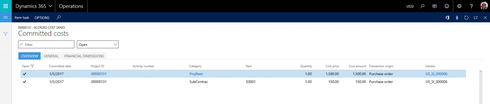

---
# required metadata

title: Project cost accrual on purchase receipts
description: This topic describes how accrued project costs from purchase receipts can be tracked in Microsoft Dynamics 365 for Operations. 
author: twheeloc
manager: AnnBe
ms.date: 04/04/2017
ms.topic: article
ms.prod: 
ms.service: Dynamics365Operations
ms.technology: 

# optional metadata

# ms.search.form: 
# ROBOTS: 
audience: Application User
# ms.devlang: 
# ms.reviewer: 2231
ms.search.scope: Operations, Core
# ms.tgt_pltfrm: 
ms.custom: 266984
ms.assetid: 61e7d2a3-5aab-4113-bccc-213f932885d2
ms.search.region: Global
# ms.search.industry: 
ms.author: sigitac
ms.search.validFrom: 2016-11-30
ms.dyn365.ops.version: Version 1611

---

# Project cost accrual on purchase receipts

This topic describes how accrued project costs from purchase receipts can be tracked in Microsoft Dynamics 365 for Operations. 

Invoices for a project often arrive later than the goods and services are delivered, which might have a significant impact on project key performance indicators (KPIs). It important to be able to track these transactions in both financial and project reports.

The following example scenario illustrates this. 

Contoso Consulting has started a new cloud deployment project. A purchase order is created to buy a computer for the project. The computer will cost $1500 and installation services will cost $150. The vendor has delivered and installed the computer, but the invoice has not yet reached Contoso Consulting. The project manager would like to see project cost accrual of $1650 before the invoice gets delivered. This cost should also be reflected in the company's month end financial statements. 

The accrued cost needs to be recorded on both the financial level and project level for reporting purposes. In Dynamics 365 for Operations, the financial update of the product receipt can be tracked for the item and procurement categories. 

For items, on the **Accounts payable parameters** page, select the **Post product receipts to ledger** option.
 

For procurement categories, on the **Category policy rule** page, select **Purchasing** policies, and then select **Accrue purchase expense on receipt** for each procurement category.
 

The **Purchase expenditure un-invoiced** and **Purchase accrual** accounts in **Posting setup** will be used when vouchers that are related to the product receipt are posted.
 

Using this same scenario, let's see how posting a product receipt will impact General ledger and Project information. 

**Step 1:** Create and confirm a new purchase order for the project to record the purchase of a computer for $1500 and installation services for $150.
 

When the purchase order is confirmed, transactions for the committed cost are created for the project. 
 

> [!NOTE]
> The transactions for the committed cost will have the **Transaction Origin** field set to **Purchase Order**. Creating and confirming a purchase order does not create transactions for a project. 

**Step 2:** Goods and services get delivered and a product receipt is registered. 

Posting a product receipt will generate and post a voucher to the ledger. The voucher will debit the purchase expenditure, un-invoiced account, and credit purchase accrual account. 

> [!NOTE]
> Posting a product receipt will use the posting setup for procurement categories and products, and not the posting setup for the project categories. In order to correctly reflect financial impact of purchase accruals, this setup needs to be aligned. 

It is possible to map procurement categories to project categories on the **Procurement category** page.

**Step 3:** Create a draft vendor invoice. 

In Dynamics 365 for Operations, posting a product receipt does not impact project information. As a workaround, you could generate a draft vendor invoice right after posting the purchase receipt. Go to the **Purchase Order** page &gt; **Invoice tab** &gt; **Generate** &gt; **Invoice**. This creates a pending invoice document that updates project information. 

Creating a draft vendor invoice will generate pending project transactions. 
 

In the **Committed cost** page, records created in step 1 will be closed and new records will be created to reflect cost commitment coming from the pending vendor invoice. The **Transaction origin** field for the committed cost will be set to **Vendor invoice**.

The vendor invoice will remain in a pending state until the actual vendor invoice arrives.

