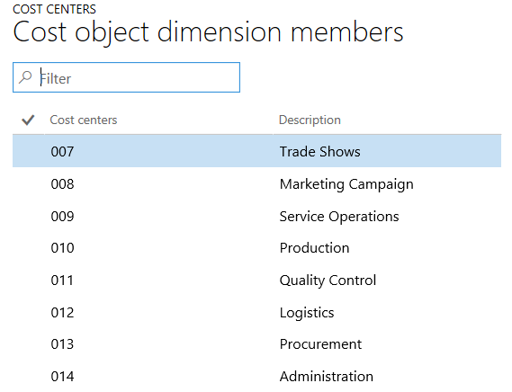

---
# required metadata

title: Allocation bases
description: Allocation bases are key components in Cost accounting and mostly used to allocate overhead costs. Every allocation base used is the basis for overhead costs being assigned to departments. 
author: YuyuScheller
manager: AnnBe
ms.date: 05/24/2017
ms.topic: article
ms.prod: 
ms.service: Dynamics365Operations
ms.technology: 

# optional metadata

ms.search.form: CAMDimensionMember
# ROBOTS: 
audience: Application User
# ms.devlang: 
# ms.reviewer: YuyuScheller
ms.search.scope: Operations, Core
# ms.tgt_pltfrm: 
ms.custom: 223174
ms.assetid: 
ms.search.region: global
ms.search.industry: Manufacturing
ms.author: YuyuScheller
ms.search.validFrom: 2016-11-30
ms.dyn365.ops.version: Version 1611

---

# Allocation bases 

[!include[banner](../includes/banner.md)]

An allocation base is the basis upon which Cost accounting allocates its overhead costs. An allocation base can be a quantity, for example, machine hours used, kilowatt hours consumed, or square footage occupied. Allocation bases are mostly used to assign overhead costs to produced inventory.

Here are a few examples of allocation bases:
-	An IT department allocates its expenses based on the number of personal computers used by each department.
-	A janitorial department allocates its expenses based on the square footage occupied by each department.
-	A human resources department allocate its expenses based on the number of employees working in each department.

# Typical allocation process 
The typical allocation process starts xxx  

There are three types of allocation bases in Cost accounting:
-	Predefined dimension member allocation bases
-	Hierarchy allocation bases
-	Formula allocation bases

## Predefined dimension member allocation bases

The predefined dimension member allocation bases are created automatically by the system when a dimension member is created. This applies to 
- Statistical dimension members 
- Cost element dimension members

[!NOTE] The predefined dimension member allocation bases that are based on a cost element dimension member only consider the values from the data source provider, for example, general ledger or budget.

### Example: Use a cost element dimension member as the allocation base
This example shows how to create a cost allocation rule to allocate the cost element 10002 Employee Insurance to the balance recorded on the cost element 10001 Salaries. The allocation rule is defined based on the ratio of each department salaries to total salaries. (Review needed!)

In the general ledger, the chart of account is defined as follows.

| Chart of account | Main account | Main account name |     Main account type    |
|------------------|--------------|-------------------|---------|
| Shared           | 10001        | Salaries          | Expense |
| Shared           | 10002        | Employee insurance    | Expense |

Define a cost element dimension and configure the data connector. After processing, the import job creates these entries in Cost accounting.

**Cost element dimension members**

|    Cost element dimension name    |    Cost element    |    Cost element name            |          Type     |
|-----------------------------------|---------------------|----------------------|---------------|
|    Cost elements                  |    10001            |    Salaries          |    Primary    |
|    Cost elements                  |    10002            |    Employee insurance    |    Primary    |

**Predefined dimension member allocation bases** 

|    Name     |    Description       |    Cost element dimension    |
|-------------|----------------------|------------------------------|
|    10001    |    Salaries          |    Cost elements             |
|    10002    |    Employee insurance    |    Cost elements             |

In the general ledger, the following entries have been posted.
-	The entries that show main account salaries come from the Payroll system and are posted by cost centers.
- The expense for employee insurance is manually posted on a default cost center.

|    Accounting date    |    Cost center     |    Main account            |    Amount in accounting currency    |                      |                |
|-----------------------|--------------------|----------------------------|-------------------------------------|----------------------|----------------|
|    03-01-2017         |    CC001           |    HR                      |    10001                            |    Salaries          |    2.000,00    |
|    03-01-2017         |    CC002           |    FI                      |    10001                            |    Salaries          |    5.000,00    |
|    03-01-2017         |    CC003           |    IT                      |    10001                            |    Salaries          |    3.000,00    |
|    03-01-2017         |    CC099           |    Default cost center     |    10002                            |    Employee insurance    |    1.000,00    |

After the general ledger source data processing is run, the following entries are created in Cost accounting.

**Cost entries**

|    Cost object    |    Cost element           |    Cost behavior    |    Amount            |    Accounting date    |
|-------------------|---------------------------|---------------------|----------------------|-----------------------|
|    CC001          |    HR                     |    10001            |    Salaries          |    Unclassified       |
|    CC002          |    FI                     |    10001            |    Salaries          |    Unclassified       |
|    CC003          |    IT                     |    10001            |    Salaries          |    Unclassified       |
|    CC099          |    Default cost center    |    10002            |    Employee insurance    |    Unclassified       |

In this simplified example, a cost allocation rule is created to allocate the cost element 10002 employee insurance relatively to the balance recorded on the cost element 10001 Salaries. 

**Cost distribution rule**

|    Cost object dimension hierarchy node    |    Cost element dimension hierarchy node    |    Cost behavior    |    Allocation base    |   |
|--------------------------------------------|---------------------------------------------|---------------------|-----------------------|---|
|    CC099                                   |    10002                                    |     Unclassified    |    10001              |   |

**Perform overhead calculation** 
After the cost element 10001 Salaries is applied as the allocation base, here is the result of the overhead calculation. 

|    Cost object    |    Magnitude    |    Allocation factor    |    Amount                     |              |
|-------------------|-----------------|-------------------------|-------------------------------|--------------|
|    CC001          |    HR           |    2000                 |    (2000/10000) * 1000.00     |    200,00    |
|    CC002          |    FI           |    5000                 |    (5000/10000) * 1000.00     |    500,00    |
|    CC003          |    IT           |    3000                 |    (3000/10000) * 1000.00     |    300.00    |

**Journal**

|    Journal    |    Journal type                             |    Fiscal calendar period    |  Year |   Period             |                                                                   Version                   |
|---------------|---------------------------------------------|------------------------------|---------------|----------------|---------------------------------------------------------------------------------|
|    00001      |    Cost distribution calculation journal    |    Fiscal                    |    2017       |    Period 1    |    Overhead calculation / 01-02-2017 11:51:00 PM /   Ledger /2017 / Period 1    |

**Cost object balance journal entries**

|    Accounting date    |    Cost object    | Cost object name           | Cost element | Cost element name    |  Cost behavior     |  Amount        |
|-----------------------|-------------------|----------------------------|--------------|----------------------|--------------------|----------------|
|    31-01-2017         |    CC099          |    Default cost center     |    10002     |    Employee insurance    |    Unclassified    |    1.000,00    |

**Cost entries**

|    Cost object    |    Cost element            |    Cost behavior    |    Amount            |    Accounting date    |                 |                  |
|-------------------|----------------------------|---------------------|----------------------|-----------------------|-----------------|------------------|
|    CC099          |    Default cost center     |    10002            |    Employee insurance    |    Unclassified       |    -1.000,00    |    31-01-2017    |
|    CC001          |    HR                      |    10002            |    Employee insurance    |    Unclassified       |    200,00       |    31-01-2017    |
|    CC002          |    FI                      |    10002            |    Employee insurance    |    Unclassified       |    500,00       |    31-01-2017    |
|    CC099          |    IT                      |    10002            |    Employee insurance    |    Unclassified       |    300,00       |    31-01-2017    |

## Hierarchy allocation bases

## Formula allocation bases

Cost objects are known as *cost object dimensions*. After you’ve decided which entity the cost object dimension should refer to, you must specify the individual dimension values or import them into Cost accounting from other source systems. These individual dimension values are known as *cost object dimension members*. For example, you want to use the financial dimension that is named Cost center as the cost object dimension. To see how costs flow to the individual cost centers, you must import the cost object dimension members. In this case, the cost object dimension members are the actual cost centers, such as Sales, Production, Administration, and Geographic locations. The following screenshot shows an example of Cost Centers as the cost object dimension with its actual cost centers as cost object dimension members. 

## Import cost object dimension members through data connectors
To make the import of cost object dimension members easier, you use data connectors to retrieve the values from the entities that you want to use as cost object dimensions. You can use either the pre-built data connectors or custom data connectors that you build.
