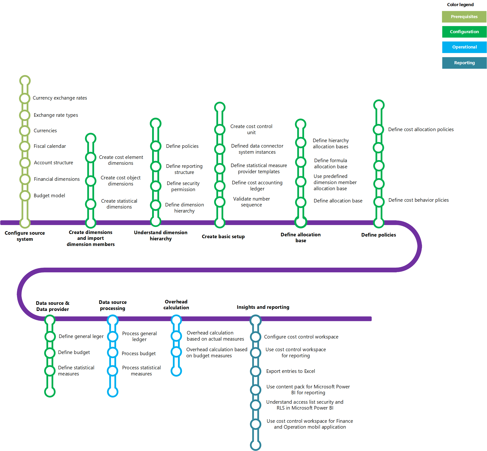

---
# required metadata

title: Cost accounting home page
description: This topic provides a list of the help topics and other resources that are available for Cost accounting.
author: YuyuScheller
manager: AnnBe
ms.date: 07/20/2017
ms.topic: article
ms.prod: 
ms.service: dynamics-ax-applications
ms.technology: 

# optional metadata

# ms.search.form: 
# ROBOTS: 
audience: Application User
# ms.devlang: 
# ms.reviewer: 121
ms.search.scope: Core, Operations, UnifiedOperations
# ms.tgt_pltfrm: 
ms.custom: 256254
ms.assetid: e1b0a6e3-0c72-4a7d-90e1-20f870c6dbad
ms.search.region: Global
# ms.search.industry: 
ms.author: yuyus
ms.search.validFrom: 2016-11-30
ms.dyn365.ops.version: Version 1611

---

# Cost accounting home page

[!include[banner](../includes/banner.md)]

The Cost accounting module allows you to do the following:

-   Define cost element dimensions, import cost element dimension members, and map cost element dimensions.
-   Define cost object dimensions and import cost object dimension members.
-   Define or import statistical dimensions.
-   Create statistical measure provider templates.
-   Create cost accounting ledgers.
-   Create cost control units.
-   Process general ledger entries.
-   Process budget entries.
-   Create and apply cost behavior policies.
-   Trace costs.
-   Define dimension hierarchies.
-   Create statements that can be viewed in the workspace.
-   Create reports by using Excel.

The following learning map shows the major concepts and tasks with connecting lines between related tasks that describe the nature of the cost accounting module.

