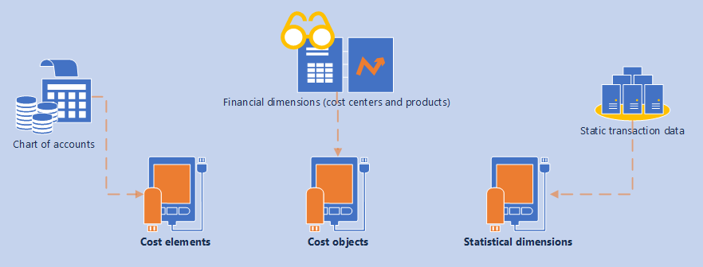

---
# required metadata

title: Create dimensions and import dimension members
description: Cost accounting is an independent module that requires master data from other modules.
author: YuyuScheller
manager: AnnBe
ms.date: 09/20/2017
ms.topic: article
ms.prod: 
ms.service: dynamics-ax-applications
ms.technology: 

# optional metadata

# ms.search.form: 
# ROBOTS: 
audience: Application User
# ms.devlang: 
ms.reviewer: YuyuScheller
ms.search.scope: Core, Operations, UnifiedOperations
# ms.tgt_pltfrm: 
ms.custom: 256254
ms.assetid: e1b0a6e3-0c72-4a7d-90e1-20f870c6dbad
ms.search.region: Global
# ms.search.industry: 
ms.author: yuyus
ms.search.validFrom: 2016-11-30
ms.dyn365.ops.version: Version 1611

---

# Create dimensions and import dimension members

[!include[banner](../includes/banner.md)]

Cost accounting is an independent module that requires data from other modules. Master data is categorized into 

-  Cost elements
-  Cost objects
-  Statistical dimensions

A **Cost element** corresponds to a cost-relevant item in the chart of accounts. A **Cost object** corresponds to any type of financial dimensions, such as products, cost centers, projects, and so on that you want to estimate, allocate costs to, or measure directly. A statistical dimension and its members are used to register non-monetary entries. Statistical dimension members can be used as allocation base in cost distribution and allocation 

The following diagram illustrates the dimensions in Cost accounting.

After the master data is imported into Cost accounting, you can use it to build various perspectives that provide insights to managers at all levels of the organization. By default, the imported cost elements are assigned the **Primary** type. Cost elements that are created manually are assigned the **Secondary** type. Secondary cost elements can be used to define the cost roll-up rules that are used when you perform cost allocation.

