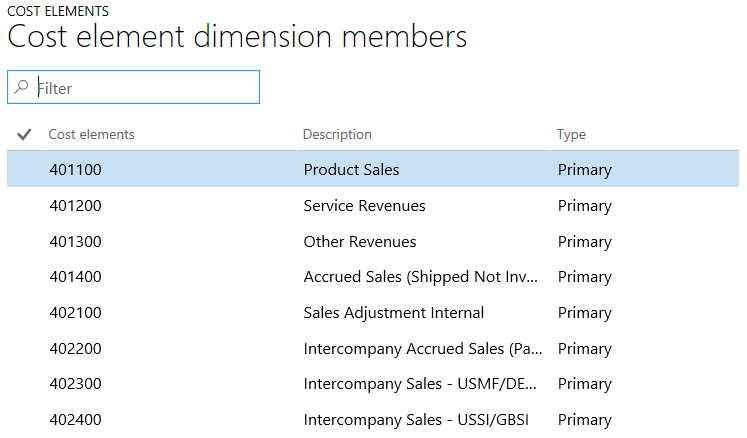

---
# required metadata

title: Cost element dimensions
description: As one of the core pillars in Cost accounting, cost element dimensions are used to categorize and track where costs flow to. 
author: YuyuScheller
manager: AnnBe
ms date: 2017-04-04
ms.topic: article
ms.prod: 
ms.service: Dynamics365Operations
ms.technology: 

# optional metadata

ms.search.form: CAMDimension
# ROBOTS: 
audience: Application User
# ms.devlang: 
# ms.reviewer: 121
ms.search.scope: Operations, Core
# ms.tgt_pltfrm: 
ms.custom: 223204
ms.assetid: 1eda0e62-760b-4737-9dfd-3c3c38d80c1a
ms.search.region: global
# ms.search.industry: 
ms.author: yuyus
ms.search.validFrom: 2016-11-30
ms.dyn365.ops.version: Version 1611

---

# Cost element dimensions

As one of the core pillars in Cost accounting, cost element dimensions are used to categorize and track where costs flow to. 

A cost element corresponds to a cost-relevant item in the chart of accounts. Basically, it can be any type of element at the lowest level in a business where costs can flow to. Cost elements as a concept range from ledger accounts to all cost-relevant resources. Currently, Cost accounting supports ledger accounts.

## Two types of cost elements
There are two types of cost elements: primary cost elements and secondary cost elements. The following table describes the difference between the two types.

<table>
<colgroup>
<col width="50%" />
<col width="50%" />
</colgroup>
<tbody>
<tr class="odd">
<td><strong>Primary cost elements</strong></td>
<td><strong>Secondary cost elements</strong></td>
</tr>
<tr class="even">
<td>The primary cost elements represent the flow of costs from financial accounting to cost accounting. The cost element structure corresponds to the profit and loss account structure in the general ledger, where a cost element can correspond to a main account. Not all main accounts may necessarily be represented as cost elements depending on the business needs. Examples of primary cost elements include:
<ul>
<li>Costs of goods sold (COGs)</li>
<li>Indirect material costs</li>
<li>Personnel costs</li>
<li>Energy costs</li>
</ul></td>
<td>The secondary cost elements represent the flow of costs internally because these costs are created and used only in Cost accounting. They are used to secure that the source of costs can be traced. These cost elements are used in cost allocations and overhead calculations. Examples of secondary cost elements include:
<ul>
<li>Production costs</li>
<li>Production, material, and marketing overheads</li>
</ul></td>
</tr>
</tbody>
</table>

## Cost element dimensions and cost element dimension members
Cost elements are referred to as *cost element dimensions* . The individual dimension values are called *cost element dimension members*. For example, you have a US chart of accounts structure (COA) that is the base for your statutory reporting. This COA is used as the cost element dimension. The accounts, which are primary cost elements, are represented as the cost element dimension members in Cost accounting. The following screenshot shows an example of Main Accounts as the cost element dimension with its actual main accounts as the cost element dimension members. 

## Import cost element dimension members through data connectors
To ease the setup of cost element dimension members in Cost accounting, you can use data connectors that are either pre-built or your custom build to retrieve the primary cost elements from one or more source systems.

## Implementation considerations
As cost elements represent the lowest level of cost details, you should make sure that all the cost elements required to make the managerial reporting are included when you implement the cost elements structure. It can be a challenge to find an appropriate number of cost elements for cost control. Having thousands of cost elements can make it difficult to control each cost element. As an alternative, you can group cost elements and manage cost control at an aggregated level.

