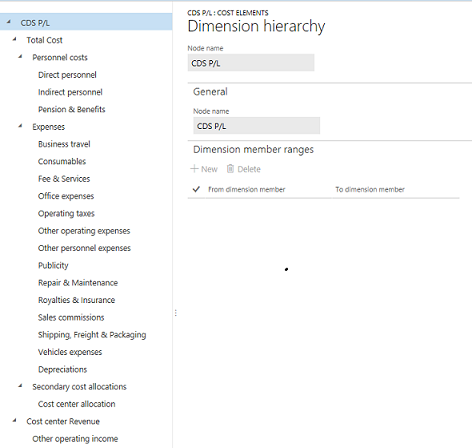

---
# required metadata

title: Dimension hierarchy
description: This topic provides information about dimension hierarchies. You use a dimension hierarchy to define the reporting structure, cost policies, and security setup in Cost accounting.  
author: YuyuScheller
manager: AnnBe
ms.date: 06/16/2017
ms.topic: article
ms.prod: 
ms.service: Dynamics365Operations
ms.technology: 

# optional metadata

ms.search.form: CAMDimensionHierarchy,
# ROBOTS: 
audience: Application User
# ms.devlang: 
# ms.reviewer: YuyuScheller
ms.search.scope:  AX 7.0.0, Operations, Core
# ms.tgt_pltfrm: 
ms.custom: 
ms.assetid: 
ms.search.region: global
ms.search.industry: Manufacturing
ms.author: YuyuScheller
ms.search.validFrom: 2016-11-30
ms.dyn365.ops.version: Version 1611

---

# Dimension hierarchy

[!include[banner](../includes/banner.md)]

This topic provides information about dimension hierarchies. You use a dimension hierarchy to define the reporting structure, cost policies, and security setup in Cost accounting.  

## Overview

Dimension hierarchies are used in various places in Cost accounting. A dimension hierarchy lets you define the following information:

-  The reporting structure that fits into the organization's requirements
-  Cost policies
-  The security setup

Here is an example of a dimension hierarchy.

A dimension hierarchy can be created for the following types of dimensions:

-  Cost element dimensions
-  Cost object dimensions
-  Statistical dimensions

> [!NOTE]
> - You can create multiple dimension hierarchies for the same dimension if different perspectives are required.
> - A dimension hierarchy can be associated with only one dimension.
> - A dimension hierarchy can have unlimited levels in its structure. All the levels will be available in the **Cost control** workspace. When you use Microsoft Excel or Microsoft Power BI for reporting purposes, only the first 15 levels of the dimension hierarchy are exported. This limitation exists because both Excel and Power BI require a fixed schema.
> - A dimension hierarchy isn't date-effective. Therefore, any change to a dimension hierarchy is immediately saved to the record, and you can't compare the before date and after date.

## Dimension hierarchy type

When you create a new dimension hierarchy, you must select a hierarchy type. Go to **Cost accounting** > **Dimensions** > **Dimension hierarchies**. Click **New**, and select a dimension hierarchy type. You can select either **Dimension categorization hierarchy** or **Dimension classification hierarchy**.

### Dimension categorization hierarchy

The **Dimension categorization hierarchy** type is used for reporting purposes. It supports only the cost element dimensions. When you select this type, the following rules apply:

-  A dimension member can be associated more than one time in the hierarchy structure.
-  You can put a cost element dimension member in different nodes by assigning a cost behavior to the leaf node.

### Dimension classification hierarchy

The **Dimension classification hierarchy** type is used to define rules and for reporting purposes. It supports all dimensions, such as cost objects, cost elements, and statistical dimensions. When you select this type, a dimension member can be associated only one time in the hierarchy structure.

## Create and maintain a dimension hierarchy

A dimension hierarchy is created as a tree structure that has node and leaf node relationships.

-  A node can have 1:_n_ subnodes.
-  A node can’t have both subnodes and leaf nodes assigned to it.
-  A leaf node can be assigned only at the lowest level in the hierarchy.

### Example

A small company has the following organization structure, where Finance and Human resources are departments under Admin, and Assembly and Packaging are departments under Production.

A cost object dimension represents all the cost centers in the organization.

- Cost object dimension
    - Cost centers

The cost object dimension that represents all the cost centers can be set up as shown here.

| Cost centers | Description |
|--------------|-------------|
| CC001        | HR          |
| CC002        | Finance     |
| CC003        | Tax         |
| CC007        | AR/AP       |
| CC005        | Assembly    |
| CC006        | Packaging   |

A cost element dimension represents all the cost elements in the organization.

- Cost element dimension
    - Cost elements

The cost element dimension that represents all the cost elements can be set up as shown here.

| Cost elements | Description |
|---------------|-------------|
| 10001         | Electricity |
| 10010         | Cleaning    |
| 10011         | Heating     |
| 40001         | COGS        |

A dimension hierarchy that meets the organizational reporting requirements can be set up as shown here.

**Dimension hierarchy details**

| Dimension hierarchy name | Dimension    | Dimension hierarchy type name      | Access list hierarchy |
|--------------------------|--------------|------------------------------------|-----------------------|
| Organization             | Cost centers | Dimension classification hierarchy | No                    |

The dimension hierarchy for reporting can be set up as shown here.

|                   | Dimension member ranges   |                         |
|-------------------|---------------------------|-------------------------|
| **Nodes**         | **From dimension member** | **To dimension member** |
| Organization      |                           |                         |
| &nbsp;&nbsp;Admin         |                           |                         |
|&nbsp;&nbsp;&nbsp;&nbsp;Finance   | CC002                     | CC003                   |
|                   | CC007                     | CC007                   |
| &nbsp;&nbsp;&nbsp;&nbsp;HR        | CC001                     | CC001                   |
| &nbsp;&nbsp;Production    |                           |                         |
| &nbsp;&nbsp;&nbsp;&nbsp;Packaging | CC005                     | CC005                   |
| &nbsp;&nbsp;&nbsp;&nbsp;Assembly  | CC006                     | CC006                   |

A dimension hierarchy that meets the policy requirement can be set up as shown here.

**Dimension hierarchy details**

| Dimension hierarchy name | Dimension     | Dimension hierarchy type name      |
|--------------------------|---------------|------------------------------------|
| Cost behavior            | Cost elements | Dimension classification hierarchy |

The dimension hierarchy for the policy can be set up as shown here.

|                   | Dimension member ranges   |                         |
|-------------------|---------------------------|-------------------------|
| **Nodes**         | **From dimension member** | **To dimension member** |
| Cost behavior     |                           |                         |
| &nbsp;&nbsp;Fixed cost    | 10001                     | 10011                   |
|&nbsp;&nbsp;Variable cost | 40001                     | 40010                   |

> [!NOTE]
> Under **Dimension member ranges**, a node can contain 1:_n_ dimension member ranges. You can insert dimension member IDs that don’t yet exist as dimension members. This approach makes the hierarchy resilient for the future.  

### Copy a hierarchy

You can copy a current dimension hierarchy as the starting point for a new dimension hierarchy. This approach can be useful if you want to compare the previous dimension hierarchy to the new dimension hierarchy.

### Rearrange nodes in a hierarchy

You can move a node up and down within its current level in the structure. In this way, you can rearrange the order of nodes for reporting in the **Cost control** workspace.

You move a node to a new location in the hierarchy by selecting the target node. There are two ways to move a node:

- **Move below** – Move the selected node from its current position in the hierarchy, and insert it **under** the selected target node.
- **Move after** – Move the selected node from its current position in the hierarchy, and insert it **after** the selected target node at its level of the hierarchy.

> [!NOTE] 
> The order of the nodes isn't maintained when you export data to Excel or Power BI, because those tools use an alphanumeric sort order by default. You should manually rearrange the order.

## Define dimension hierarchies for reporting

Dimension hierarchies are important for reporting. They let you define the specific structure that fits into the individual organization. The aggregations that are done at the node level of the dimension hierarchy let stakeholders at any level of the organization see data at any level.

Dimension hierarchies are available in the following reporting tools. This approach helps guarantee consistency in the reporting structure.

- **Cost control** workspace (Client):

    - Controlled by configuration.

- **Cost control** workspace (Mobile application):

    - Controlled by configuration.

- Excel

    - Provides the option to select specific dimension hierarchies per export definition:

        - One cost element dimension hierarchy (mandatory)
        - One cost object dimension hierarchy (optional)
        - One statistical dimension hierarchy (optional)

- Power BI:

    - All dimension hierarchies are available.
    
If you create reports by using Excel or Power BI, only the first 15 levels of the dimension hierarchies are exported. This limitation exists because a fixed schema is required in Excel and Power BI. If a hierarchy has more than 15 levels, the additional levels won't be exported. The normalized table contains a record for each dimension member in the hierarchy. Therefore, automated aggregation occurs. This behavior helps guarantee that the balances at any of the 15 available levels in the hierarchy are still correct.

The following example shows what a dimension hierarchy might look like in the reporting structure.

| Cost object dimension hierarchy – Level 1 | Cost object dimension hierarchy – Level 2 | Cost object dimension hierarchy – Level 3 | Cost object dimension hierarchy – Level 4 | Cost object dimension hierarchy – Level 15 |
|-------------------------------------------|-------------------------------------------|-------------------------------------------|-------------------------------------------|--------------------------------------------|
| Organization                              | Admin                                     | Finance                                   | CC002                                     |                                            |
| Organization                              | Admin                                     | Finance                                   | CC003                                     |                                            |
| Organization                              | Admin                                     | Finance                                   | CC007                                     |                                            |
| Organization                              | Admin                                     | HR                                        | CC001                                     |                                            |
| Organization                              | Production                                | Packaging                                 | CC005                                     |                                            |
| Organization                              | Production                                | Assembly                                  | CC006                                     |                                            |

### Update the dimension hierarchies that are used for reporting 

Over time, the dimension hierarchies that are used in the previously mentioned reporting tools will have to be updated. You can update dimension hierarchies by refreshing the client.

- **Cost control** workspace (Client)
- **Cost control** workspace (Mobile application)

Updates to dimension hierarchies are picked up every 24 hours by a pre-cached job. After the exported data is updated, the updated dimension hierarchies are available in the following tools:

- Excel
- Power BI

> [!NOTE] 
> To manually trigger an update of the dimension hierarchy cache, you can create a new export to Excel for the dimension hierarchy or hierarchies that must be updated.

## Define dimension hierarchies for cost policies

Cost accounting consists of multiple policies where detailed rules are defined. You must define one or more dimension hierarchies for the following policies:

- Cost behavior
- Cost distribution
- Cost allocation
- Cost rollup

Dimension hierarchies make it easy to create rules. To avoid having to create rules for every dimension member, you can take advantage of the aggregations of dimension members that are provided by dimension hierarchy levels. If you have overlapping rules, you must define specific rules that the system will consider when it does the overhead calculation.

### Example: Define a cost behavior policy

A new cost behavior policy is created, and appropriate dimension hierarchies are assigned to the policy, as shown here.

**Cost behavior policy**

| Policy name   | Cost element dimension hierarchy | Cost object dimension hierarchy | Accounting currency |
|---------------|----------------------------------|---------------------------------|---------------------|
| Cost behavior | Cost behavior                    | Organization                    | USD                 |

**Rules**

| Cost element dimension hierarchy node | Cost object dimension hierarchy node | Fixed percentage | Fixed amount | Valid from | Valid to |
|---------------------------------------|--------------------------------------|------------------|--------------|------------|----------|
| Fixed cost                            | Organization                         | 100.00           | 0.00         | 1/1/2017   | Never    |
| 10001                                 | Organization                         | 0.00             | 150.00       | 1/1/2017   | Never    |
| 10001 (\*)                             | Finance                              |                  | 50.00        | 1/1/2017   | Never    |
| Cost behavior or Variable cost (\*\*)   | Organization                         | 0.00             | 0.00         | 1/1/2017   | Never    |

\* The variable cost node isn't required. If a cost isn't classified as a fixed cost, it must be a variable cost.

\*\* A detailed rule is created for the combination of cost element member 10001 and all cost object members that are aggregated under the Finance hierarchy level (CC002, CC003, CC007).

The preceding rules show the flexibility that dimension hierarchies provide. By defining high-level rules, you can help minimize maintenance. You can then define detailed rules to fit into a specific business objective.

If the dimension hierarchies that are used in rules are updated, the system automatically brings the updates forward.

If a level of granularity in the rules is no longer required, the rule can be expired.

For example, a specific cost behavior rule for the Finance cost object dimension hierarchy node is no longer required. In this case, click **Expire rule** to expire the rule.

| Cost element dimension hierarchy node | Cost object dimension hierarchy node | Fixed percentage | Fixed amount | Valid from | Valid to  |
|---------------------------------------|--------------------------------------|------------------|--------------|------------|-----------|
| Fixed cost                            | Organization                         | 100,00           | 0,00         | 1/1/2017   | Never     |
| 10001                                 | Organization                         | 0,00             | 150,00       | 1/1/2017   | Never     |
| 10001                                 | Finance                              |                  | 50,00        | 1/1/2017   | 20/1/2017 |
| Cost behavior or Variable cost        | Organization                         | 0,00             | 0,00         | 1/1/2017   | Never     |

Any overhead calculation that is run after January 20, 2017, no longer considers this rule.

> [!NOTE] 
> The **Valid from** and **Valid to** fields are date-effective and time-effective. You can expire the rule and run a new overhead calculation on the same day.

## Define dimension hierarchies for security setup

Cost accounting data should be made available to all managers who are responsible for a reporting unit. In Cost accounting terminology, a reporting unit is represented as a cost object or a set of cost objects.

Potentially, all managers will be able to access highly sensitive business data, such revenues and margins. Therefore, it's important that you set up security, so that managers see only the data that is relevant to them. To help control data security, you define dimension hierarchies.

- The use of dimension hierarchies applies only when the dimension value that is selected in the dimension hierarchy reference is a cost object dimension.
- Only one dimension hierarchy can be enabled per cost object dimension in the access list hierarchy.

**Dimension hierarchy details**

| Dimension hierarchy name | Dimension    | Dimension hierarchy type name      | Access list hierarchy |
|--------------------------|--------------|------------------------------------|-----------------------|
| Organization             | Cost centers | Dimension classification hierarchy | **Yes**               |

A new **Users** FastTab is available in the hierarchy designer. Here, you can insert one or more user IDs at each node in the hierarchy.

|                 | Users            | Dimension member ranges   |                         |
|-----------------|------------------|---------------------------|-------------------------|
| **Nodes**       | **User ID**      | **From dimension member** | **To dimension member** |
| Organization    | Benjamin, Claire |                           |                         |
| &nbsp;&nbsp;Admin         | April            |                           |                         |
| &nbsp;&nbsp;&nbsp;&nbsp;Finance   | Alicia           | CC002                     | CC003                   |
|                 |                  | CC007                     | CC007                   |
| &nbsp;&nbsp;&nbsp;&nbsp;HR        | Arnie            | CC001                     | CC001                   |
| &nbsp;&nbsp;Production    | David            |                           |                         |
| &nbsp;&nbsp;&nbsp;&nbsp;Packaging | Ellen            | CC005                     | CC005                   |
| &nbsp;&nbsp;&nbsp;&nbsp;Assembly  | Chris            | CC006                     | CC006                   |

> [!NOTE] 
> Cost accountants should be assigned to the top level of the hierarchy, so that they can see all entries in Cost accounting.

To enable the access list hierarchy and its security settings, go to **Cost accounting** > **Setup** > **Parameters** > **General**. Select the **Enable view access for cost object dimension members** parameter.

The settings for the access list hierarchy are used to control the data that is shown in the following areas:

- **Cost control** workspace (Client):

    - Data in forms that are used to drill through scenarios

- **Cost control** workspace (Mobile application):

    - Balances in cards

- Power BI:

    - Data that is shown in Power BI visualizations
    - Data Power BI visualizations that are embedded in the Microsoft Dynamics 365 for Finance and Operations, Enterprise edition client

> [!NOTE] 
> - Before the access list hierarchy can affect data in Power BI, access list hierarchy and row-level security in Power BI must be paired. For more information, see [Set up security for Cost accounting content pack](/dynamics365/operations/dev-itpro/analytics/setup-security-cost-accounting-content-pack).
> - The access list hierarchy doesn't help secure the export of data to Excel. Therefore, that reporting tool should be used only by cost accountants and managers who must have full access to view the data.
