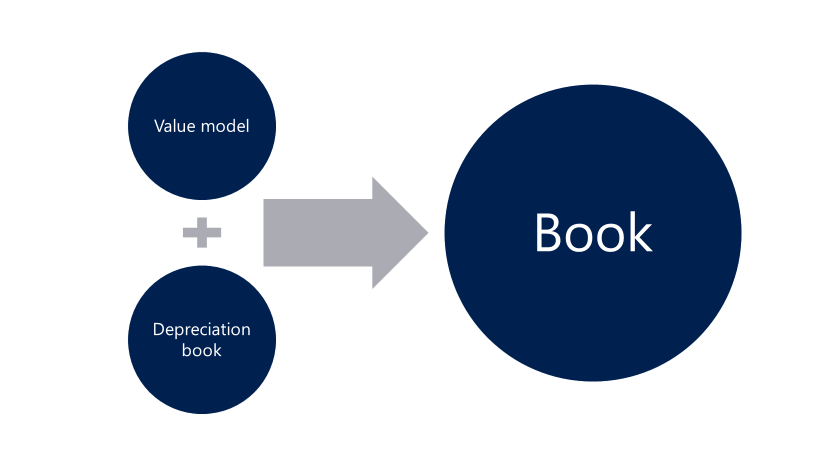

---
# required metadata

title: Fixed asset value model and depreciation book merge
description: In previous releases, there were two valuation concepts for fixed assets -  value models and depreciation books. In the Microsoft Dynamics 365 for Operations 1611 release, the value model functionality and depreciation book functionality have been merged into a single concept that is known as a book.
author: twheeloc
manager: AnnBe
ms.date: 04/04/2017
ms.topic: article
ms.prod: 
ms.service: Dynamics365Operations
ms.technology: 

# optional metadata

# ms.search.form: 
# ROBOTS: 
audience: Application User
# ms.devlang: 
# ms.reviewer: 101
ms.search.scope: Operations, Core
# ms.tgt_pltfrm: 
ms.custom: 221564
ms.assetid: 7c68eb7c-8b1a-4dd9-afb8-04b4040e305e
ms.search.region: Global
# ms.search.industry: 
ms.author: saraschi
ms.search.validFrom: 2016-11-30
ms.dyn365.ops.version: Version 1611

---

# Fixed asset value model and depreciation book merge

[!include[banner](../includes/banner.md)]

In previous releases, there were two valuation concepts for fixed assets -  value models and depreciation books. In the Microsoft Dynamics 365 for Operations 1611 release, the value model functionality and depreciation book functionality have been merged into a single concept that is known as a book.

The new book functionality is based on earlier value model functionality but also includes all functionality that was previously provided only in depreciation books.  Because of this merge, you can now use a single set of pages, inquiries, and reports for all your fixed asset processes. The tables in this topic describe the earlier functionality for depreciation books and value models, together with the new functionality for books.

## Setup
By default, books post to both the general ledger (GL) and the fixed asset subledger. Books have a new **Post to general ledger** option that lets you disable posting to the GL and post only to the fixed asset subledger. This functionality resembles the earlier posting behavior for depreciation books. The journal names setup has a new posting layer that is named None. This posting layer was added specifically for fixed asset transactions. To post transactions for books that don't post to the GL, you must use a journal name that has the posting layer set to **None**.

|                                                  |                                 |                                 |                                                         |
|--------------------------------------------------|---------------------------------|---------------------------------|---------------------------------------------------------|
|                                                  | Depreciation book               | Value model                     | Book (New)                                              |
| Post to the GL                                   | Never                           | Always                          | Option to post to the GL                                |
| Posting layers                                   | Not applicable                  | 3: Current, Operations, and Tax | 11: Current, Operations, Tax, 7 custom layers, and None |
| Journal names                                    | Depreciation book journal names | GL - Journal names              | GL - Journal names                                      |
| Derived books                                    | Not allowed                     | Allowed                         | Allowed                                                 |
| Depreciation profile override at the asset level | Allowed                         | Not allowed                     | Allowed                                                 |

## Processes
Processes now use a common page. Some processes are allowed only if the **Post to general ledger** option is set to **No** in the book setup.

|                                |                           |                     |                                          |
|--------------------------------|---------------------------|---------------------|------------------------------------------|
|                                | Depreciation book         | Value model         | Book (New)                               |
| Transaction entry              | Depreciation book journal | Fixed asset journal | Fixed asset journal                      |
| Bonus depreciation             | Allowed                   | Not Allowed         | Allowed                                  |
| Delete historical transactions | Allowed                   | Not Allowed         | Allowed, unless you're posting to the GL |
| Mass update                    | Allowed                   | Not Allowed         | Allowed, unless you're posting to the GL |

## Inquiries and reports
Inquiries and reports support all books. Reports that aren't included in the following table previously supported both depreciation books and value models, and will now continue to support all book types. The **Posting layer** field has also been added to reports, so that you can more easily identify the transaction postings.

|                                       |                                |                          |                          |
|---------------------------------------|--------------------------------|--------------------------|--------------------------|
|                                       | Depreciation book              | Value model              | Book (New)               |
| Inquiries                             | Depreciation book transactions | Fixed asset transactions | Fixed asset transactions |
| Fixed asset statement                 | Not allowed                    | Allowed                  | Allowed                  |
| Fixed asset basis                     | Allowed                        | Not allowed              | Allowed                  |
| Fixed asset mid-quarter applicability | Allowed                        | Not allowed              | Allowed                  |

## Upgrade
The upgrade process will move your existing setup and all your existing transactions to the new book structure. Value models will remain as they currently are, as a book that posts to the general ledger. However, depreciation books will be moved to a book that has the **Post to general ledger** option set to **No**. Depreciation book journal names will be moved to a general ledger journal name that has the posting layer set to **None**.

