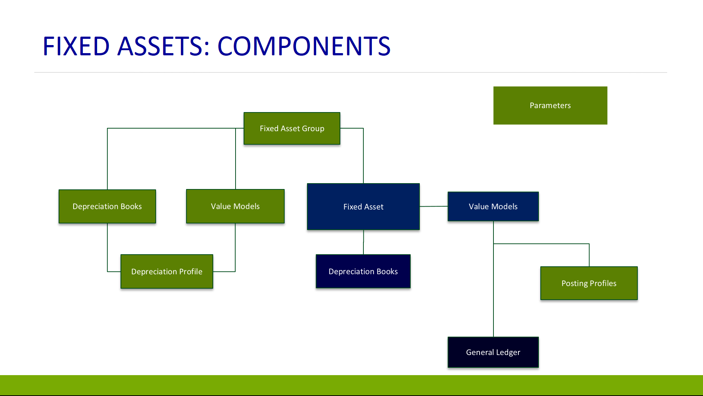

---
# required metadata

title: Set up fixed assets | Microsoft Docs
description: This topic provides an overview of Fixed assets module setup.
author: twheeloc
manager: AnnBe
ms.date: 2015-12-02 22:55:03
ms.topic: article
ms.prod: 
ms.service: Dynamics365Operations
ms.technology: 

# optional metadata

# keywords: 
# ROBOTS: 
audience: Application User
# ms.devlang: 
ms.reviewer: twheeloc
ms.suite: Released- Dynamics AX 7.0.0
# ms.tgt_pltfrm: 
ms.custom: 13771
ms.assetid: a2db91f5-72c8-4ef7-92c4-dd26942bed35
ms.region: Global
# ms.industry: 
ms.author: saraschi

---

# Set up fixed assets

This topic provides an overview of Fixed assets module setup.

Overview
--------

Parameters control general behavior within the Fixed assets module. Fixed asset groups are a way of grouping your assets, and defaulting attributes to each asset assigned to the group. Depreciation books and value models track the financial value of a fixed asset over time, using depreciation configuration defined in the depreciation profile. Both can be assigned to Fixed asset groups, which will then default to the fixed asset when it is created within the group. The biggest difference between value models and depreciation books is that value models post to the General ledger while depreciation books do not. The ledger accounts are defined by value model in the posting profile. The following illustration provides an overview of how the different components of fixed assets are integrated. 

## Depreciation profiles
Depreciation profiles should be set up first. The depreciation profile is where you configure how the value of an asset is depreciated over time.  You will need to define the method of depreciation, the depreciation year (calendar year or fiscal year), and the frequency of depreciation.

## Depreciation books
After depreciation profiles are set up, you need to create the necessary depreciation books and value models for your assets. Every depreciation book and value model will track an independent financial lifecycle of an asset. Because depreciation books do not post to general ledger, they are typically used to track asset values for tax reporting purposes. The depreciation option must be selected in order to calculate depreciation on the assets by default. If the depreciation option is not selected for an asset, then the depreciation proposal will skip these assets. This is where the primary depreciation profile is assigned, as well as an alternative or switchover depreciation profile, if it is applicable.

## Value models
Value models should be set up next. Value model setup is very similar to depreciation book setup, but has additional fields related to general ledger posting. At this time you can also able to set up derived value models and derived depreciation books for a value model. The specified derived transactions will be posted as an exact copy of the primary transaction against the derived books.

## Fixed asset posting profiles
After value models have been set up, the posting profile can be created. The posting profile must be defined by value model, but can also be defined at an even more granular level, such as value model and fixed asset group combination or even for an individual fixed asset. The ledger accounts defined will be the default for your fixed asset transactions. You need to define the ledger accounts to be used during the disposal processes, both disposal sales and disposal scraps. At the time of disposal, the previously posted fixed asset transactions will be reversed out of the original accounts and move the net amount to the appropriate account for gain and loss for asset disposal. You need to set up accounts for each type of transaction that you use in your business in order to properly reverse out the transactions. The main account should be the original account that you set on the posting profile for that transaction type, and the offset account should be your gain and loss for disposal account. The exception is the net book value – both the main and the offset accounts should be set to the gain and loss for disposal account.

## Fixed asset groups
Fixed asset group is the only required field when creating a fixed asset, and it will default a number of different informational fields to the asset.  The fixed asset group is Value models and depreciation groups are set up to default for each asset assigned to the group.  At this point, additional attributes can be set for the value models and depreciation books that are specific to that group of assets, such as Service life and Depreciation convention. This is also where Special depreciation allowances, or bonus depreciation, can be defined for a specific fixed asset group/depreciation book combination.  A priority must be assigned to the special depreciation allowance to specify the order in which allowances should be calculated when there are multiple assigned to a depreciation book.

## Fixed asset parameters
The last step is to update fixed asset parameters. Capitalization threshold will determine what assets will be depreciated. If a purchase is selected as a fixed asset but does not meet the capitalization threshold, it will still be created or updated as a fixed asset, but the **Depreciation** check box will be clear. This means that the asset will not be depreciated automatically as part of the depreciation proposals. One important option is **Automatic creation of depreciation adjustments with disposal parameter**. This functionality will automatically adjust the asset depreciation based on the depreciation settings at the time of the asset disposal. There is also an option to deduct cash discounts from your acquisition amount when acquiring fixed assets using a vendor invoice. In the Purchase orders section, you can configure how you want your assets to be created as part of the purchasing process. The first field is **Allow asset acquisition from Purchasing**. If selected, the asset acquisition happens at the time when the invoice is posted. If it is clear, you can still put a fixed asset on a PO and invoice, but the acquisition will not be posted – this would need to be done as a separate step from the fixed asset journal.** Create asset during product receipt or invoice posting** will allow you to create a new asset on the fly – so it does not need to be set up as a fixed asset before the transaction. The last option to **Check for fixed assets creation during line entry** is applicable to purchase requisitions only. Reason codes can be configured to be required for changes to a fixed asset or for specific fixed asset transactions. Finally, number sequences are defined for the Fixed assets module on the **Number sequences** tab. The Fixed asset number sequence can be overridden by the Fixed asset group number sequence if it has been specified.  

