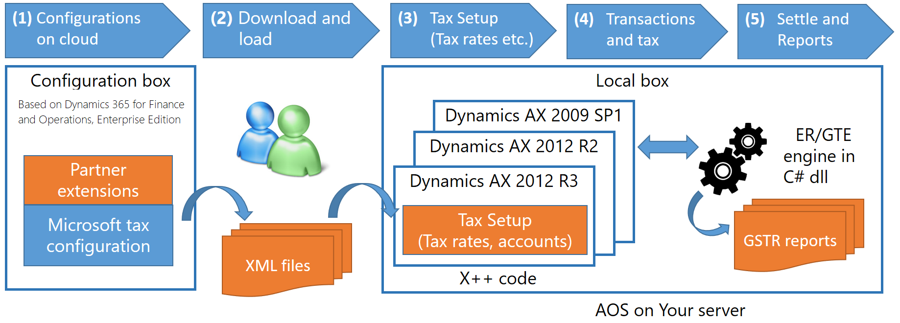

---
# required metadata

title: India GST | Microsoft Docs
description: This article describes how Microsoft Dynamics 365 for Finance and Operations, Enterprise Edition can be used to create India GST configurations for some Microsoft Dynamics AX versions. 
author: ShylaThompson
manager: AnnBe
ms.date: 0000-00-00 00:00:00
ms.topic: article
ms.prod: 
ms.service: Dynamics365Operations
ms.technology: 

# optional metadata

# keywords: 
# ROBOTS: 
# audience: 
# ms.devlang: 
ms.reviewer: ShylaThompson
# ms.suite: 
# ms.tgt_pltfrm: 
ms.custom: 1587884
ms.assetid: d3ccc142-0027-4675-9a7c-84dab4f2e6f7
ms.region: Global
# ms.industry: 
ms.author: ShylaThompson

---

# Create configurations for India GST

To help you be compliant with India GST regulations if you are using various Microsoft Dynamics AX versions, you can leverage the Generic Tax Engine (GTE) in Dynamics 365 for Finance and Operations, Enterprise Edition. The following diagram summarizes the GST solution process and the rest of this article provides more information about each step in the process. 

## Step 1: Create configurations

Step 1 is to have the configurations ready. **Configuration** refers to the set of data that defines the tax rules such as when a particular tax should be applied (Tax applicability), how it should be calculated (Tax calculation), how to account it for (Posting and Accounting), and how to accumulate the input tax credit and tax liabilities (Credit pool); or the activities of defining it. The configuration is done using GTE in a trial environment of Dynamics 365 for Finance and Operations, Enterprise Edition. When Microsoft releases a configuration, you can choose to use it out of the box, or you can extend it. 

## Step 2: Download and load the configurations

Step 2 is to download the GST configurations from Dynamics 365 for Finance and Operations, Enterprise Edition and then load them into  Microsoft Dynamics AX. The configuration can be downloaded as xml file. The configuration that Microsoft releases will contain 3 files. If partner has extension, it can be more files. Then the users needs to load the configuration files in their local box of Dynamics AX 2012 or Dynamics AX 2009.

## Step 3: Set up tax information

Step 3 is to set up the tax information, such as tax rates and main accounts. The main difference between configuration and setup is the access to customer specific master data. When it requires the access to customer specific master data, the user needs to provide the setup in the tax setup. For example, the exact value of tax rate, the exact account number of tax recoverable posting etc. These data are required to run the GTE runtime to apply, calculate, post and account for taxes. Set off rules are to be determined here also, for rule-based tax settlement.

## Step 4: Enter transactions with tax

Step 4 is to enter transactions and GTE will process taxes according to configuration and setup. It is important to notice that GTE does not use the traditional mechanism to determine tax, which is the combination of sales tax group and item sales tax group. GTE implements a rule based configurable engine for the tax applicability. Refer to the configuration part for more details on what is tax applicability and how to configure it.

## Step 5: Settle taxes and generate reports

Step 5 is to settle the tax recoverable and tax payable to calculate the final tax payment amount. The settlement engine support rule based settlement, which can set off the recoverable and payable across different tax types and tax components. With the settlement results, it is possible to generate required reports. In India GST context, the return reports are called GSTRs (GST-R1, GST-R2 etc). We are leveraging Generic Electronic Reporting (GER) for the reporting strategy. The GER contents are available at: [Electronic reporting overview](https://authoring.help.dynamics.com/en/?post_type=incsub_wiki&p=285041)

