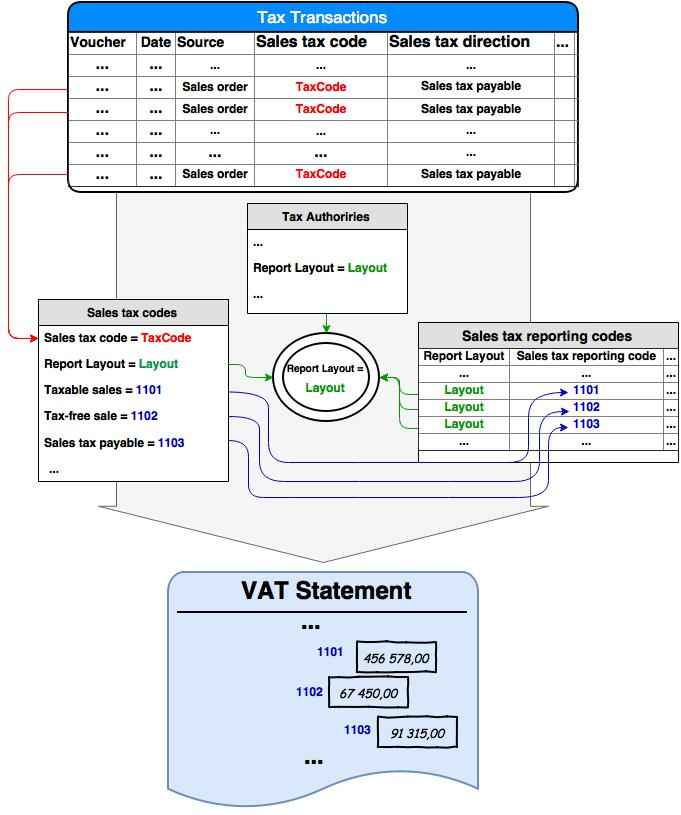

---
# required metadata

title: VAT reporting for Europe
description: This topic provides general information about setting up and generating the value-added tax (VAT) statement for some European countries.
author: ShylaThompson
manager: AnnBe
ms.date: 2017-04-04
ms.topic: article
ms.prod: 
ms.service: Dynamics365Operations
ms.technology: 

# optional metadata

ms.search.form: TaxAuthority, TaxReportCollection, TaxTable
# ROBOTS: 
audience: Application User
# ms.devlang: 
# ms.reviewer: 81
ms.search.scope: Operations, Core
# ms.tgt_pltfrm: 
ms.custom: 266844
ms.assetid: 06798e29-6140-489e-9b4e-66b45b26be2b
ms.search.region: Austria, Belgium, Czech Republic, Estonia, Finland, Germany, Latvia, Lithuania, Netherlands, Sweden
# ms.search.industry: 
ms.author: v-elgolu
ms.search.validFrom: 2016-11-30
ms.dyn365.ops.version: Version 1611

---

# VAT reporting for Europe

This topic provides general information about setting up and generating the value-added tax (VAT) statement for some European countries.

This topic provides a generic approach to setting up and generating the VAT statement. This approach is common for users in legal entities in the following countries/regions:

-   Austria
-   Belgium
-   Czech Republic
-   Estonia
-   Finland
-   Germany
-   Latvia
-   Lithuania
-   Netherlands
-   Sweden

## VAT statement overview
The VAT statement is based on tax transactions’ amounts. The process of generating a VAT statement is part of the Sales tax payment process, which is implemented through the Settle and post sales tax function. This function calculates the sales tax that is due for a given period. The settlement calculation includes the posted sales tax for the selected settlement period for the tax transactions. The process for calculating data for a VAT statement is based on the relationship between sales tax codes and sales tax reporting codes, where sales tax reporting codes match the VAT statements boxes (or tags in XML). For each sales tax code, sales tax reporting codes should be set up for each type of transaction, such as taxable sales, taxable purchases, taxable import. These type of transactions are described in the Sales tax codes for VAT reporting section later in this topic.

For each sales tax reporting code, a specific report layout should be determined. At the same time, sales tax codes are linked to a specific sales tax authority through sales tax settlement periods. For every sales tax authority, a report layout should be determined. Thus, only sales tax reporting codes with the same report layout that is set up for a sales tax authority in sales tax settlement periods for the sales tax code can be selected in the report setup of the sales tax code. A sales tax transaction generated upon posting an order or a journal, contains a sales tax code, sales tax source, sales tax direction, and transaction amounts (tax base amount and tax amount in accounting currency, sales-tax currency, and transaction currency). Based on the combination of tax transaction attributes, transaction amounts compose total amounts for sales tax reporting codes specified for sales tax codes. The following illustration shows the data relationship.

## VAT statement setup
To generate a VAT statement you must set up the following.

### Sales tax authorities for VAT reporting

<!---For general information about setting up a sales tax authority, see [Set up sales tax authorities](http://ax.help.dynamics.com/en/wiki/set-up-sales-tax-authorities/). -->
Before you can set up sales tax reporting codes, you must select the correct report layout for the sales tax authority. On the **Sales tax authorities** page, in the **General** section, select a **Report layout**. This layout will be used when you set up sales tax reporting codes.

### Sales tax reporting codes

Sales tax reporting codes are box codes in the VAT statement or tag names in XML format. These codes are used to aggregate and prepare amounts for the report. When you configure the electronic reporting format of the VAT statement, the names of the result amounts will be used. You can create and maintain sales tax reporting codes on the **Sales tax reporting codes** page. You must assign each code a report layout. After you create the sales tax reporting codes, you can choose the codes in the **Report setup** section on the **Sales tax codes** page. <!---For more information, see [Set up sales tax reporting codes](http://ax.help.dynamics.com/en/wiki/set-up-sales-tax-reporting-codes/) and [Sales tax reporting codes page (Field descriptions)](http://ax.help.dynamics.com/en/wiki/sales-tax-reporting-codes-page-field-descriptions/).-->

### Sales tax codes for VAT reporting

<!---For general information about setting up sales tax codes, see [Set up sales tax codes](http://ax.help.dynamics.com/en/wiki/set-up-sales-tax-codes/).--> Base amounts and tax amounts of sales tax transactions can be aggregated on reporting codes in the VAT statement (XML tags or declaration boxes). You can set this up by associating sales tax reporting codes for different transaction types for sales tax codes on the **Sales tax codes** page. The following table describes the transaction types in the report setup for sales tax codes. The calculation includes transactions for all types of sources except sales tax.

<table>
<colgroup>
<col width="50%" />
<col width="50%" />
</colgroup>
<tbody>
<tr class="odd">
<td><strong>Transaction type</strong></td>
<td><strong>Description of transactions and amounts to be counted on the transaction type</strong></td>
</tr>
<tr class="even">
<td><strong>Taxable Sales</strong></td>
<td>Sum of <strong>Tax base amounts</strong> of tax transactions which satisfy the following conditions:
<ul>
<li>Transaction date is in the selected period/</li>
<li>The sale is domestic (<strong>Tax direction</strong> is <strong>Sales tax payable</strong>).</li>
<li>The transaction <strong>Tax base amount</strong> or <strong>Tax amount</strong> &lt; 0.</li>
</ul></td>
</tr>
<tr class="odd">
<td><strong>Tax-free sales</strong></td>
<td>Sum of <strong>Tax base amounts</strong> of tax transactions which satisfy the following conditions:
<ul>
<li>Transaction date is in the selected period.</li>
<li>The sale is export (<strong>Tax direction</strong> is <strong>Tax-free sale</strong>).</li>
<li>The transaction <strong>Tax base amount</strong> or <strong>Tax amount</strong> &lt; 0.</li>
</ul></td>
</tr>
<tr class="even">
<td><strong>Sales tax payable</strong></td>
<td>Sum of <strong>Tax amounts</strong> of the tax transactions which satisfy the following conditions:
<ul>
<li>Transaction date is in the selected period.</li>
<li>The sale is domestic (<strong>Tax direction</strong> is <strong>Sales tax payable</strong>).</li>
<li>The transaction <strong>Tax base amount</strong> or <strong>Tax amount</strong> &lt; 0.</li>
</ul></td>
</tr>
<tr class="odd">
<td><strong>Taxable sales credit note</strong></td>
<td>Sum of <strong>Tax base amounts</strong> of the tax transactions which satisfy the following conditions:
<ul>
<li>Transaction date is in the selected period.</li>
<li>The sale is domestic (<strong>Tax direction</strong> is <strong>Sales tax payable</strong>).</li>
<li>The transaction <strong>Tax base amount</strong> or <strong>Tax amount</strong> &gt; 0.</li>
</ul></td>
</tr>
<tr class="even">
<td><strong>Fax exempt sales credit note</strong></td>
<td>Sum of <strong>Tax base amounts</strong> of the tax transactions which satisfy the following conditions:
<ul>
<li>Transaction date is in the selected period.</li>
<li>The sale is export (<strong>Tax direction</strong> is <strong>Tax-free sale</strong>).</li>
<li>The transaction <strong>Tax base amount</strong> or <strong>Tax amount</strong> &gt; 0.</li>
</ul></td>
</tr>
<tr class="odd">
<td><strong>Sales tax on sales credit note</strong></td>
<td>Sum of <strong>Tax amounts</strong> of the tax transactions which satisfy the following conditions:
<ul>
<li>Transaction date is in the selected period.</li>
<li>The sale is domestic (<strong>Tax direction</strong> is <strong>Sales tax payable</strong>).</li>
<li>The transaction <strong>Tax base amount</strong> or <strong>Tax amount</strong> &gt; 0.</li>
</ul></td>
</tr>
<tr class="even">
<td><strong>Taxable purchases</strong></td>
<td>Sum of <strong>Tax base amounts</strong> of the tax transactions which satisfy the following conditions:
<ul>
<li>Transaction date is in the selected period.</li>
<li>The purchase is domestic (<strong>Tax direction</strong> is <strong>Sales tax receivable</strong>).</li>
<li>The transaction <strong>Tax base amount</strong> or <strong>Tax amount</strong> &gt; 0.</li>
</ul></td>
</tr>
<tr class="odd">
<td><strong>Tax-free purchase</strong></td>
<td>Sum of <strong>Tax base amounts</strong> of the tax transactions which satisfy the following conditions:
<ul>
<li>Transaction date is in the selected period.</li>
<li>The purchase is import (<strong>Tax direction</strong> is <strong>Tax-free purchase</strong>).</li>
<li>The transaction <strong>Tax base amount</strong> or <strong>Tax amount</strong> &gt; 0.</li>
</ul></td>
</tr>
<tr class="even">
<td><strong>Sales tax receivable</strong></td>
<td>Sum of <strong>Tax amounts</strong> of the tax transactions which satisfy the following conditions:
<ul>
<li>Transaction date is in the selected period.</li>
<li>The purchase is domestic (<strong>Tax direction</strong> is <strong>Sales tax receivable</strong>).</li>
<li>The transaction <strong>Tax base amount</strong> or <strong>Tax amount</strong> &gt; 0.</li>
</ul></td>
</tr>
<tr class="odd">
<td><strong>Taxable purchase credit note</strong></td>
<td>Sum of <strong>Tax base amounts</strong> of the tax transactions which satisfy the following conditions:
<ul>
<li>Transaction date is in the selected period.</li>
<li>The purchase is domestic (<strong>Tax direction</strong> is <strong>Sales tax receivable</strong>).</li>
<li>The transaction <strong>Tax base amount</strong> or <strong>Tax amount</strong> &lt; 0.</li>
</ul></td>
</tr>
<tr class="even">
<td><strong>Tax exempt purchase credit note</strong></td>
<td>Sum of <strong>Tax base amounts</strong> of the tax transactions which satisfy the following conditions:
<ul>
<li>Transaction date is in the selected period.</li>
<li>The purchase is import (<strong>Tax direction</strong> is <strong>Tax-free purchase</strong>).</li>
<li>The transaction <strong>Tax base amount</strong> or <strong>Tax amount</strong> &lt; 0.</li>
</ul></td>
</tr>
<tr class="odd">
<td><strong>Sales tax on purchase credit note</strong></td>
<td>Sum of <strong>Tax amounts</strong> of the tax transactions which satisfy the following conditions:
<ul>
<li>Transaction date is in the selected period.</li>
<li>The purchase is domestic (<strong>Tax direction</strong> is <strong>Sales tax receivable</strong>).</li>
<li>The transaction <strong>Tax base amount</strong> or <strong>Tax amount</strong> &lt; 0.</li>
</ul></td>
</tr>
<tr class="even">
<td><strong>Taxable import</strong></td>
<td>Sum of <strong>Tax base amounts</strong> of the tax transactions which satisfy the following conditions:
<ul>
<li>Transaction date is in the selected period.</li>
<li><strong>Tax direction</strong> is <strong>Use tax</strong></li>
<li>The transaction <strong>Tax base amount</strong> or <strong>Tax amount</strong> &gt; 0.</li>
</ul></td>
</tr>
<tr class="odd">
<td><strong>Offset taxable import</strong></td>
<td>Reversed sum of <strong>Tax base amounts</strong> of the tax transactions which satisfy the following conditions:
<ul>
<li>Transaction date is in the selected period.</li>
<li><strong>Tax direction</strong> is <strong>Use tax</strong>.</li>
<li>The transaction <strong>Tax base amount</strong> or <strong>Tax amount</strong> &gt; 0.</li>
</ul></td>
</tr>
<tr class="even">
<td><strong>Taxable import credit note</strong></td>
<td>Sum of <strong>Tax base amounts</strong> of the tax transactions which satisfy the following conditions:
<ul>
<li>Transaction date is in the selected period.</li>
e<li><strong>Tax direction</strong> is <strong>Use tax</strong>.</li>
<li>The transaction <strong>Tax base amount</strong> or <strong>Tax amount</strong> &lt; 0.</li>
</ul></td>
</tr>
<tr class="odd">
<td><strong>Offset taxable import credit note</strong></td>
<td>Reversed sum of <strong>Tax base amounts</strong> of the tax transactions which satisfy the following conditions:
<ul>
<li>Transaction date is in the selected period.</li>
<li>Tax direction is <strong>Use tax</strong>.</li>
d<li>The transaction <strong>Tax base amount</strong> or <strong>Tax amount</strong> &lt; 0.</li>
</ul></td>
</tr>
<tr class="even">
<td><strong>Use tax</strong></td>
<td>Sum of <strong>Tax amounts</strong> of the tax transactions which satisfy the following conditions:
<ul>
<li>Transaction date is in the selected period.</li>
<li><strong>Tax direction</strong> is <strong>Use tax</strong>.</li>
<li>The transaction <strong>Tax base amount</strong> or <strong>Tax amount</strong> &gt; 0.</li>
</ul></td>
</tr>
<tr class="odd">
<td><strong>Offset use tax</strong></td>
<td>Reversed sum of <strong>Tax amounts</strong> of the tax transactions which satisfy the following conditions:
<ul>
<li>Transaction date is in the selected period.</li>
<li><strong>Tax direction</strong> is <strong>Use tax</strong>.</li>
<li>The transaction <strong>Tax base amount</strong> or <strong>Tax amount</strong> &gt; 0.</li>
</ul></td>
</tr>
</tbody>
</table>

> [!NOTE]
> For the table above, it is assumed that the following criteria are met: 
> -   The tax base amount is a transaction amount from the **Origin in Accounting currency** field.
> -   The tax amount is a transition amount from the **Actual sales tax amount in Accounting currency** field.

### Configure the ER model and format for the report

You can use Electronic Reporting (ER) to configure statements and report, and to export data different electronic formats without changing X++ code. For additional information:

-   [Electronic reporting overview](/dynamics365/operations/dev-itpro/analytics/general-electronic-reporting)
-   [Download Electronic reporting configurations from Lifecycle Services](/dynamics365/operations/dev-itpro/analytics/download-electronic-reporting-configuration-lcs)
-   [Localization requirements – Create a GER configuration](/dynamics365/operations/dev-itpro/analytics/electronic-reporting-configuration)

## Countryspecific resources for VAT statements
The VAT statement for each country must meet the requirements of the country’s legislation. There are predefined general models and formats of VAT statements for the countries listed in the following table.

| Country        | Additional information                                                          |
|----------------|---------------------------------------------------------------------------------|
| Austria        |  [VAT statement details for Austria](emea-aut-vat-statement-details.md)         |
| Belgium        |                                                                                 |
| Czech Republic |  [VAT statement details for Czech Republic](emea-cze-vat-statement-details.md)   |
| Estonia        |  [VAT statement details for Estonia](emea-est-vat-statement-details.md) |
| Finland        |                                                                                 |
| Germany        |                                                                                 |
| Italy          | [VAT statement details for Italy](emea-ita-vat-statements-details.md)            |
| Latvia         | [VAT statement details for Latvia](emea-lva-vat-statement-details.md)           |
| Lithuania      | [VAT statement details for Lithuania](emea-ltu-vat-statement-details.md)         |
| Netherlands    |                                                                                 |
| Sweden         |                                                                                 |

