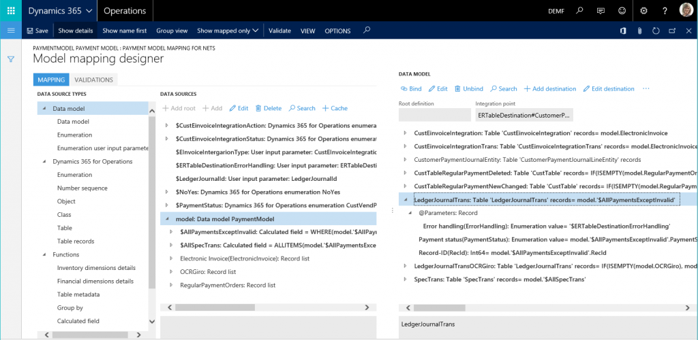

---
# required metadata

title: Electronic reporting overview
description: This topic provides an overview of the Electronic reporting (ER) tool. It includes information about key concepts, the scenarios that ER supports, and a list of formats that have been designed and released as part of the solution.
author: kfend
manager: AnnBe
ms.date: 2016-12-14 17 - 34 - 32
ms.topic: article
ms.prod: 
ms.service: Dynamics365Operations
ms.technology: 

# optional metadata

ms.search.form: ERWorkspace
# ROBOTS: 
audience: Application User, Developer, IT Pro
# ms.devlang: 
ms.reviewer: annbe
ms.search.scope: AX 7.0.0, Operations
# ms.tgt_pltfrm: 
ms.custom: 58941
ms.assetid: 5b9577ab-b795-428e-832f-f2d42866dc60
ms.search.region: global
# ms.search.industry: 
ms.author: nselin
ms.dyn365.ops.intro: 01-02-2016
ms.dyn365.ops.version: AX 7.0.0

---

# Electronic reporting overview

This topic provides an overview of the Electronic reporting (ER) tool. It includes information about key concepts, the scenarios that ER supports, and a list of formats that have been designed and released as part of the solution.

Electronic reporting (ER) is a tool that you can use to configure formats for both incoming and outgoing electronic documents in accordance with the legal requirements of various countries/regions. ER lets you manage these formats during their lifecycle. For example, you can adopt new regulatory requirements, and generate business documents in the required format to electronically exchange information with government bodies, banks, and other parties. The ER engine is targeted at business users instead of developers. Because you configure formats instead of code, the processes for creating and adjusting formats for electronic documents are faster and easier. ER currently supports the TEXT, XML, Microsoft Word document, and OPENXML worksheet formats. However, an extension interface provides support for additional formats.

## Capabilities
The ER engine has the following capabilities:

-   It represents a single shared tool for electronic reporting in different domains and replaces more than 20 different engines that do some type of electronic reporting for Microsoft Dynamics 365 for Operations.
-   It makes a report’s format insulated from the current Dynamics 365 for Operations implementation. In other words, the format is applicable for different versions of Dynamics 365 for Operations.
-   It supports the creation of a custom format that is based on an original format. It also includes capabilities for automatically upgrading the customized format when the original format is changed because of localization/customization requirements.
-   It becomes the primary standard tool to support localization requirements in electronic reporting, both for Microsoft and for Microsoft partners.
-   It supports the ability to distribute formats to partners and customers through Microsoft Dynamics Lifecycle Services (LCS).

## Key concepts
### Components

ER supports two types of components: *data model components* and *format components*.

#### Data model components

A data model component is an abstract representation of a data structure. It's used to describe a specific business domain area with enough detail to satisfy the reporting requirements for that domain. A data model component consists of the following parts:

-   A data model, as a set of domain-specific business entities and a hierarchically structured definition of relations between those entities.
-   A model mapping that links selected Dynamics 365 for Operations data sources to individual elements of a data model that specifies, at run time, the data flow and rules of business data population to a data model component.

A business entity of a data model is represented as a container (record). Business entity properties are represented as data items (fields). Each data item has a unique name, label, description, and value. The value of each data item can be designed so that it's recognized as a string, integer, real, date, enumeration, Boolean, and so on. Additionally, it can be another record or records list. A single data model component can contain several hierarchies of domain-specific business entities. It can also contain model mappings that support a report-specific data flow at run time. The hierarchies are differentiated by a single record that has been selected as a root for model mapping. For example, the data model of the payment domain area might support the following mappings:

-   Company &gt; Vendor &gt; Payment transactions of the AP domain
-   Customer &gt; Company &gt; Payment transactions of the AR domain

Note that business entities such as company and payment transactions are designed one time. Different mappings then reuse them. A model mapping that supports outgoing electronic documents has the following capabilities:

-   It can use different Dynamics 365 for Operations data types as data sources for a data model. For example, it can use tables, data entities, methods, or enums.
-   It supports user input parameters that can be defined as data sources for a data model when some data must be specified at run time.
-   It supports the transformation of Dynamics 365 for Operations data into required groups. It also lets you filter, sort, and sum data, and append logical calculated fields that are designed through formulas that resemble Microsoft Excel formulas, as shown in the following illustration. For more information, see [Formula designer in Electronic reporting](general-electronic-reporting-formula-designer.md). 

A model mapping that supports incoming electronic documents has the following capabilities:

-   It can use different Dynamics 365 for Operations updatable data elements as targets. These data elements include tables, data entities, and views. The data can be updated by using the data from incoming electronic documents. Multiple targets can be used in a single model mapping.
-   It supports user input parameters that can be defined as data sources for a data model when some data must be specified at run time.

A data model component is designed for each business domain that should be used as a unified data source for reporting that isolates reporting from the physical implementation of Dynamics 365 for Operations data sources. It represents domain-specific business concepts and functionalities in a form that makes a reporting format's initial design and further maintenance more efficient.

#### Format components for outgoing electronic documents

A format component is the scheme of the reporting output that will be generated at run time. A scheme consists of the following elements:

-   A format that defines the structure and content of the outgoing electronic document that is generated at run time.
-   Data sources, as a set of user input parameters and a domain-specific data model that uses a selected model mapping.
-   A format mapping, as a set of bindings of format data sources that have individual elements of a format that specify, at run time, the data flow and rules for format output generation.
-   A format validation, as a set of configurable rules that control report generation at run time, depending on the running context. For example, there might be a rule that stops output generation of a vendor’s payments and throws an exception when specific attributes of the selected vendor are missing, such as the bank account number.

A format component supports the following functions:

-   Creation of reporting output as individual files in various formats, such as text, XML, Microsoft Word document, or worksheet.
-   Creation of multiple files separately and encapsulation of those files into zip files.

A format component lets you attach specific files that can be used in the reporting output:

-   Excel workbooks that contain a worksheet that can be used as a template for output in the OPENXML worksheet format
-   Word files that contain a document that can be used as a template for output in the Microsoft Word document format
-   Other files that can be incorporated into the format’s output as predefined files

The following illustration shows how the data flows for these formats.  To run a single ER format configuration and generate an outgoing electronic document, you must identify the mapping of the format configuration.

#### Format components for incoming electronic documents

A format component is the scheme of the incoming document that is imported at run time. A scheme consists of the following elements:

-   A format that defines the structure and content of the incoming electronic document that contains data that is imported at run time. A format component is used to parse an incoming document in various formats, such as text and XML.
-   A format mapping that binds individual format elements to elements of a domain-specific data model. At run time, the elements in the data model specify the data flow and the rules for importing data from an incoming document, and then store the data in a data model.
-   A format validation, as a set of configurable rules that control data import at run time, depending on the running context. For example, there might be a rule that stops data import of a bank statement that has a vendor’s payments and throws an exception when a specific vendor’s attributes are missing, such as the vendor identification code.

The following illustration shows how the data flows for these formats.  To run a single ER format configuration to import data from an incoming electronic document, you must identify the desired mapping of a format configuration, and also the integration point of a model mapping. You can use the same model mapping and destinations together with different formats for different type of incoming documents.

#### Component versioning

Versioning is supported for ER components. The following workflow is provided to manage changes in ER components:

1.  The version that is originally created is marked as a **Draft** version. This version can be edited and is available for test runs.
2.  The **Draft** version can be converted to a **Completed** version. This version can be used in local reporting processes.
3.  The **Completed** version can be converted to a **Shared** version. This version is published on LCS and can be used in global reporting processes.
4.  The **Shared** version can be converted to a **Discontinued** version. This version can then be deleted.

Versions that have either **Completed** or **Shared** status are available for other data interchange. The following actions can be performed on a component that has these statuses:

-   The component can be serialized in XML format and exported from Dynamics 365 for Operations as a file in XML format.
-   The component can be reserialized from an XML file and imported into Dynamics 365 for Operations as a new version of an ER component.

#### Component date effectivity

ER component versions are date-effective. You can set the **Effective from** date for an ER component to specify the date that the component becomes effective for reporting processes. The Dynamics 365 for Operations session date is used to define whether a component is valid for execution. If more than one version is valid for a particular date, the latest version is used for reporting processes.

#### Component access

Access to ER format components depends on the setting for the ISO country/region code. When this setting is blank for a selected version of a format configuration, a format component can be accessed from any Dynamics 365 for Operations company at run time. When this setting contains ISO country/region codes, a format component is available only from Dynamics 365 for Operations companies that have a primary address that is defined for one of a format component's ISO country/region codes. Different versions of a data format component can have different settings for ISO country/region codes.

#### Configuration

An ER configuration is the wrapper of a particular ER component. That component can be either a data model component or a format component. A configuration can include different versions of an ER component. Each configuration is marked as owned by a specific configuration provider. The **Draft** version of a component of a configuration can be edited when the owner of the configuration has been selected as an active provider in the ER settings in Dynamics 365 for Operations. Each model configuration contains a data model component. A new format configuration can be derived from a specific data model configuration. In the configuration tree, the format configuration that is created appears as a child of the original data model configuration. The format configuration that is created contains a format component. The data model component of the original model configuration is automatically inserted into the format component of the child format configuration as a default data source. An ER configuration is shared for Dynamics 365 for Operations companies.

#### Provider

The ER provider is the party identifier that is used to indicate the author (owner) of each ER configuration. ER lets you manage the list of configuration providers. Format configurations that are released for electronic documents as part of the Dynamics 365 for Operations solution are marked as owned by the **Microsoft** configuration provider. To learn how to register a new ER provider, play the **ER Create a configuration provider and mark it as active** task guide (part of the **7.5.4.3 Acquire/Develop IT service/solution components (10677)** business process).

#### Repository

An ER repository stores ER configurations. Two types of ER repositories are currently supported: **Operations resources** repositories and **LCS project** repositories. An **Operations resources** repository provides access to the list of configurations that Microsoft, as an ER configuration provider, releases as part of the Dynamics 365 for Operations solution. Those configurations can be imported into the current Dynamics 365 for Operations instance and used for electronic reporting. They can also be used for additional localizations and customizations. An **LCS project** repository provides access to the list of configurations of a specific LCS project (LCS project assets library) that was selected at the repository registration stage. ER lets you upload shared configurations from the current Dynamics 365 for Operations instance to a specific **LCS project** repository. You can also import configurations from an **LCS project** repository into the current Dynamics 365 for Operations instance. Required **LCS project** repositories can be registered individually for each configuration provider of the current Dynamics 365 for Operations instance. Each repository can be dedicated to a specific configuration provider.

## Supported scenarios
### Building a data model

ER provides a model designer that you can use to build a data model for a specific business domain. All domain-specific business entities, and the relations among them, can be presented in a data model as a hierarchical structure. The following illustration shows an example of this type of data model (the payment domain data model).  To become familiar with the details of this scenario, play the **ER Design domain specific data model** task guide (part of the **7.5.4.3 Acquire/Develop IT service/solution components (10677)** business process).

### Translating data model content

Data model content (labels and descriptions) can be translated into other languages that Dynamics 365 for Operations supports. You might want to translate data model content for the following reasons:

-   At design time, to make the content more intelligible to format designers who speak other languages, and who will use the data model to do data mapping of format components.
-   At run time, to make the content more user-friendly by presenting prompts and help for run-time parameters, and configured validation messages (errors and warnings), in the language that the currently signed-in user of Dynamics 365 for Operations prefers.

The following illustrations show an example where data model content is translated from English to Japanese.  

### Configuring data model mappings for outgoing documents

ER provides a model mapping designer that lets users map data models that they have designed to specific Dynamics 365 for Operations data sources. Based on the mapping, the Dynamics 365 for Operations data will be imported at run time from selected data sources into the data model. The data model is then used as an abstract data source of ER formats that generate outgoing electronic documents. The following illustration shows an example of this type of data model mapping (the **SEPA Credit Transfer** model mapping of the payment domain data model).  To become familiar with the details of this scenario, play the **ER Define model mapping and select data sources** and **ER Map data model to selected data sources** task guides (part of the **7.5.4.3 Acquire/Develop IT service/solution components (10677)** business process).

### Configuring data model mappings for incoming documents

ER provides a model mapping designer that lets users map data models that they have designed to specific destinations. For example, data models can be mapped to the Dynamics 365 for Operations updatable data components (tables, data entities, and views). Based on the mapping, the Dynamics 365 for Operations data will be updated at run time by using the data from the data model. As abstract storage of the ER format, the data model is filled with data that is imported from an incoming electronic document. The following illustration shows an example of this type of data model mapping. In this example, the **Import mapping for NETS** model mapping of the payment domain data model is used to support the import of bank statements in the NETS bank format for Norway. 

### Storing a designed model component as a model configuration

ER can store a designed data model, together with associated data mappings, as a model configuration of the current Dynamics 365 for Operations instance. The following illustration shows an example of this type of data model configuration (the payment model configuration).  To become familiar with the details of this scenario, play the **ER Map data model to selected data sources** task guide (part of the **7.5.4.3 Acquire/Develop IT service/solution components (10677)** business process).

### Building a format that uses a data model as a base

ER supports a format designer that you can use to build the format of an electronic document for a selected business domain by selecting the model component as a base. The same ER format designer lets you map a format that you create to a selected domain’s data model mapping as a data source. The following illustration shows an example of this type of format (the format configuration that supports the BACS payment format for the United Kingdom).  To become familiar with the details of this scenario, play the **ER Design domain specific format** task guide (part of the **7.5.4.3 Acquire/Develop IT service/solution components (10677)** business process).

### Building a configuration to generate electronic documents in OPENXML worksheet format

The ER format designer can be used to build an electronic document in OPENXML worksheet format. The following illustration shows an example of this type of format (a format configuration that generates an OPENXML worksheet that contains details of a selected payment journal).  To become familiar with the details of this scenario, play the **ER Design a configuration for generating reports in OPENXML format** task guide (part of the **7.5.4.3 Acquire/Develop IT service/solution components (10677)** business process). As part of the task guide step for importing a template, use the [Template of Payment Report (SampleVendPaymWsReport.xlsx)](./media/samplevendpaymwsreport.xlsx) Excel file as a template.

### Building a configuration to generate electronic documents in a Word document format

The ER format designer can be used to build an electronic document in a Word document format. The following illustration shows an example of this type of format. Note that this format reuses the existing ER configuration that was originally designed to generate the report output in OPENXML format.  To become familiar with the details of this scenario, play the **ER Design a configuration for generating reports in Microsoft WORD format** task guide (part of the **7.5.4.3 Acquire/Develop IT service/solution components (10677)** business process). As part of the task guide step for importing a template, use the following Word files as templates for the ER format:

-   [Template of Payment Report (SampleVendPaymDocReport.docx)](./media/samplevendpaymdocreport.docx)
-   [Bounded template of Payment Report (SampleVendPaymDocReportBounded.docx)](./media/samplevendpaymdocreportbounded.docx)

### Building a configuration to import data from incoming electronic documents

The ER format designer can be used to describe an electronic document that is planned for data import in either XML or text format. The designed format is used to parse an incoming document. The ER format mapping designer can be used to define the binding of the elements of the designed format to the data model. The following illustrations show an example of this type of format and format mapping. In this example, NETS bank statements that include vendor payment details in text format are imported.   To become familiar with the details of this scenario, play the **Create required ER configurations to import data from an external file** task guide (part of the **7.5.4.3 Acquire/Develop IT service/solution components (10677)** business process). Use the following files to play this guide:

-   [ER data model configuration](./media/1099model.xml) (1099model.xml)
-   [ER format configuration](./media/1099format.xml) (1099format.xml)
-   [Sample of the incoming document in XML format](./media/1099entries.xml) (1099entries.xml)
-   [Sample of the workbook to manage data of incoming document](./media/1099entries.xlsx) (1099entries.xlsx)

### Storing a designed format component in a format configuration

ER can store a designed format, together with the configured data mappings, as a format configuration of the current Dynamics 365 for Operations instance. The preceding illustration shows an example of this type of format configuration (**BACS (UK)**, which is a child of the **Payment model** configuration). To become familiar with the details of this scenario, play the **ER Design domain specific format** task guide (part of the **7.5.4.3 Acquire/Develop IT service/solution components (10677)** business process).

### Configuring Dynamics 365 for Operations to begin to use a created format internally

Dynamics 365 for Operations can be configured to use a created format to generate electronic reports. The reference to the created format configuration should be defined in the settings of a specific domain. For example, to use an ER format configuration for electronic vendor payments in BACS format, the format configuration should be referenced in specific methods of payment, as shown in the following illustrations.   To become familiar with the details of this scenario, play the **ER Generate electronic documents for payments using a format configuration** task guide (part of the **7.5.4.5 Test IT service/solution (10679)** business process).

## Handling ER components
### Publishing an ER component in LCS to offer it externally (localization)

The owner of a component (model or format) that has been created can use ER to publish the completed version of the component to LCS. A repository of the **LCS project** type for the current ER configuration provider is required. When the status of the completed version of a component is changed from **Completed** to **Shared**, that version is published in LCS. When a component has been published to LCS, the owner of that component becomes a provider of the service to support the component. For example, a format component is designed to generate an electronic document that is legally required in accordance with a localization scenario. In this case, it's assumed that the format will be kept compliant with legislative changes, and that the provider will issue new versions of the component whenever new legislative requirements arise. To become familiar with the details of this scenario, play the **ER Upload a configuration into Lifecycle Services** task guide (part of the **7.5.4.3 Acquire/Develop IT service/solution components (10677)** business process).

### Importing an ER component from LCS to use it internally

ER lets you import ER components from LCS to the current Dynamics 365 for Operations instance. A repository of the **LCS project** type is required. When an ER component has been imported from LCS to the current Dynamics 365 for Operations instance, the owner of the instance becomes a consumer of the service that is provided by the owner (author) of the imported component. For example, a format component is designed to generate a specific electronic document from Dynamics 365 for Operations in a country/region-specific format (localization scenario). In this case, it's assumed that the service consumer will be able to obtain any updates that are made to that format, to keep it compliant with legislative requirements. To become familiar with the details of this scenario, play the **ER Import a configuration from Lifecycle Services** task guide (part of the **7.5.4.3 Acquire/Develop IT service/solution components (10677)** business process).

### Building a format selecting another format as a base (customization)

ER lets you create (derive) a new component from the current version of a component (base) that was imported from LCS. For example, a user wants to derive a new format to implement some special requirements for an electronic document, such as an additional field or an extensive description, to support a customization scenario. To become familiar with the details of this scenario, play the **ER Upgrade your format by adopting of new base version of that format** task guide (part of the **7.5.5.3 Acquire/Develop changes IT service/solution component (10683)** business process).

### Upgrading a format selecting a new version of base format (rebase)

ER lets you automatically adopt the changes of the latest version of the base component in the current draft version of the derived component. This process is known as *rebasing*. For example, a new regulatory change that has been introduced in the latest version of the format that was imported from LCS can be automatically merged into the customized version of this format of the electronic document. Any changes that can’t be automatically merged are considered conflicts. The designer tool for the appropriate component presents these conflicts for manual resolution. To become familiar with the details of this scenario, play the **ER Upgrade your format by adopting of new base version of that format** task guide (part of the **7.5.5.3 Acquire/Develop changes IT service/solution component (10683)** business process).

## ER configurations that are delivered in the Dynamics 365 for Operations solution
| Domain-specific data model configurations: Title | Domain                | Data model–dependent format configurations: Title | Description                                                        |
|--------------------------------------------------|-----------------------|---------------------------------------------------|--------------------------------------------------------------------|
| Audit file model                                 | Financial audit       |                                                   |                                                                    |
|                                                  |                       | Audit file (NL)                                   | Audit file format for Netherlands                                  |
| BAS model                                        | Tax reporting         |                                                   |                                                                    |
|                                                  |                       | BAS (AU)                                          | BAS format for Australia                                           |
| Construction industry scheme model               | Tax reporting         |                                                   |                                                                    |
|                                                  |                       | CIS Monthly return (UK)                           | CIS monthly return format for the United Kingdom                   |
| Collection letter model                          | Electronic invoicing  |                                                   |                                                                    |
|                                                  |                       | OIOUBL Collection Letter (DK)                     | OIOUBL collection letter format for Denmark                        |
| Electronic ledger accounting model (MX)          | Tax reporting         |                                                   |                                                                    |
|                                                  |                       | Auxiliary Ledger XML (MX)                         | Auxiliary ledger transactions per account report format for Mexico |
|                                                  |                       | Chart of Account XML (MX)                         | Chart of account report format for Mexico                          |
|                                                  |                       | Journals XML (MX)                                 | Journal transactions report format for Mexico                      |
|                                                  |                       | Trial Balance XML (MX)                            | Trial balance report format for Mexico                             |
| Elster model                                     | Tax reporting         |                                                   |                                                                    |
|                                                  |                       | Elster (DE)                                       | Elster format for Germany                                          |
| EU Sales list model                              | Trade reporting       |                                                   |                                                                    |
|                                                  |                       | EU Sales list (DE)                                | EU Sales list TXT format for Germany                               |
|                                                  |                       | EU Sales list (DK)                                | EU Sales list TXT format for Denmark                               |
|                                                  |                       | EU Sales list (FR)                                | EU Sales list XML format for France                                |
|                                                  |                       | EU Sales list (NL)                                | EU Sales list XML format for Netherlands                           |
|                                                  |                       | EU Sales list TXT (UK)                            | EU Sales list TXT format for the United Kingdom                    |
|                                                  |                       | EU Sales list XML (UK)                            | EU Sales list XML format for the United Kingdom                    |
|                                                  |                       | EU Sales list by columns report                   | EU Sales list by columns report                                    |
|                                                  |                       | EU Sales list by rows report                      | EU Sales list by rows report                                       |
| FEC accounting model (FR)                        | Tax reporting         |                                                   |                                                                    |
|                                                  |                       | FEC Accounting data XML (FR)                      | FEC accounting data export XML format for France                   |
| German audit file                                | Financial audit       |                                                   |                                                                    |
|                                                  |                       | German audit file output                          | Audit file output for Germany and Austria                          |
| Intrastat model                                  | Trade reporting       |                                                   |                                                                    |
|                                                  |                       | Intrastat (DE)                                    | Intrastat format for Germany                                       |
|                                                  |                       | Intrastat (DK)                                    | Intrastat format for Denmark                                       |
|                                                  |                       | Intrastat INTRACOM (FR)                           | Intrastat INTRACOM format for France                               |
|                                                  |                       | Intrastat SAISUNIC (FR)                           | Intrastat SAISUNIC format for France                               |
|                                                  |                       | Intrastat (NL)                                    | Intrastat format for the Netherlands                               |
|                                                  |                       | Intrastat (UK)                                    | Intrastat format for the United Kingdom                            |
|                                                  |                       | Intrastat report                                  | Intrastat Excel control report                                     |
| Customer invoice model                           | Electronic invoicing  |                                                   |                                                                    |
|                                                  |                       | OIOUBL Project credit note (DK)                   | OIOUBL Project credit note format for Denmark                      |
|                                                  |                       | OIOUBL Project invoice (DK)                       | OIOUBL Project invoice format for Denmark                          |
|                                                  |                       | OIOUBL Sales credit note (DK)                     | OIOUBL Sales credit note format for Denmark                        |
|                                                  |                       | OIOUBL Sales invoice (DK)                         | OIOUBL Sales invoice format for Denmark                            |
| OB declaration model                             | Tax reporting         |                                                   |                                                                    |
|                                                  |                       | OB declaration (NL)                               | OB declaration format for the Netherlands                          |
| Payment model                                    | Payments              |                                                   |                                                                    |
|                                                  |                       | Betalingsservice (DK)                             | Betalingsservice payment format for Denmark                        |
|                                                  |                       | Bill of exchange remittance (FR)                  | Bill of exchange remittance format for France                      |
|                                                  |                       | BTL91 (NL)                                        | BTL91 vendor payment format for the Netherlands                    |
|                                                  |                       | CFONB Prelevements (FR)                           | CFONB direct debit payment format for France                       |
|                                                  |                       | CFONB Virements (FR)                              | CFONB domestic vendor payment format for France                    |
|                                                  |                       | Nordea Vendor (DK)                                | Nordea corporate netbank vendor payment format for Denmark         |
|                                                  |                       | ANZ Direct Credit Service (AU)                    | Format for ANZ Direct Credit Service for Australia                 |
|                                                  |                       | CBA Direct Credit Service (AU)                    | Format for CBA Direct Credit Service for Australia                 |
|                                                  |                       | NAB Direct Credit Service (AU)                    | Format for NAB Direct Credit Service for Australia                 |
|                                                  |                       | STG Direct Credit Service (AU)                    | Format for STG Direct Credit Service for Australia                 |
|                                                  |                       | WBC Direct Entry System (AU)                      | Format for WBC Direct Entry System for Australia                   |
|                                                  |                       | DirectLink (NZ)                                   | Format for DirectLink for New Zealand                              |
|                                                  |                       | JBA Payment file (JP)                             | JBA Payment format for Japan                                       |
|                                                  |                       | ISO20022 Credit transfer                          | SEPA Credit transfer format for Europe                             |
|                                                  |                       | ISO20022 Credit transfer (FR)                     | SEPA Credit transfer format for France                             |
|                                                  |                       | ISO20022 Credit transfer (DE)                     | SEPA Credit transfer format for Germany                            |
|                                                  |                       | ISO20022 Credit transfer (NL)                     | SEPA Credit transfer format for the Netherlands                    |
|                                                  |                       | ISO20022 Direct debit                             | SEPA Direct debit format for Europe                                |
|                                                  |                       | ISO20022 Direct debit (FR)                        | SEPA Direct debit format for France                                |
|                                                  |                       | ISO20022 Direct debit (DE)                        | SEPA Direct debit format for Germany                               |
|                                                  |                       | ISO20022 Direct debit (NL)                        | SEPA Direct debit format for the Netherlands                       |
|                                                  |                       | BACS (UK)                                         | BACS vendor payment format for the United Kingdom                  |
| Reverse charge                                   | Tax reporting         |                                                   |                                                                    |
|                                                  |                       | Reverse charge sales list                         | Reverse charge sales list format                                   |
| Dutch XBRL integration model                     | XBRL reporting        |                                                   |                                                                    |
|                                                  |                       | Semansys XBRL (NL)                                | Semansys XBRL export format for the Netherlands                    |
| GAF model (MY)                                   | Financial audit       |                                                   |                                                                    |
|                                                  |                       | GAF file (MY)                                     | Format of GAF for Malaysia                                         |
| Vendor aging report (CN)                         | Vendors data analysis |                                                   |                                                                    |
|                                                  |                       | Vendor aging report format (CN)                   | Vendor aging report format for China                               |
| Vendor invoice declaration model                 | Vendors data analysis |                                                   |                                                                    |
|                                                  |                       | Vendor invoice declaration (IS)                   | Vendor invoice declaration format for Iceland                      |
|                                                  |                       | Vendor invoice declaration report (IS)            | Vendor invoice declaration report for Iceland                      |

See also
--------

[Localization requirements – Create an Electronic reporting configuration](localization-requirements-electronic-reporting-configuration.md)

[Manage the Electronic reporting configuration lifecycle](general-electronic-reporting-manage-configuration-lifecycle.md)

