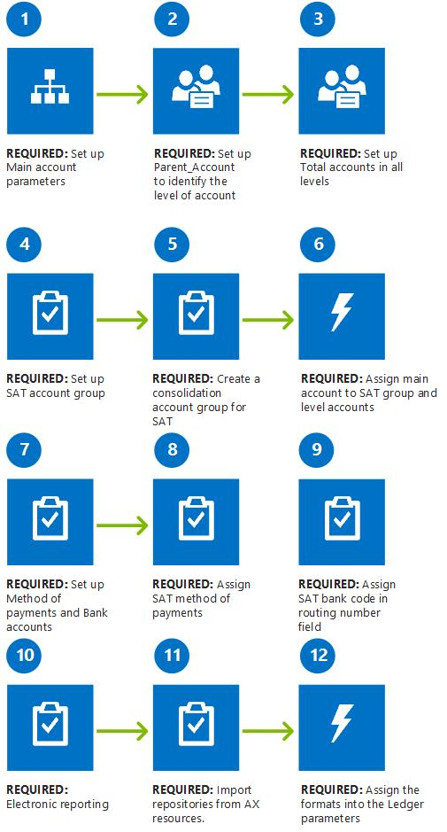

---
# required metadata

title: Electronic ledger accounting statements
description: This article explains how to set up and generate the general ledger XML files version 1.1 that all companies in Mexico are required to report to the Mexican tax authorities (SAT) on a monthly basis.
author: ShylaThompson
manager: AnnBe
ms.date: 2015-09-10 21 - 09 - 19
ms.topic: article
ms.prod: 
ms.service: Dynamics365Operations
ms.technology: 

# optional metadata

ms.search.form: ERSolutionTable, LedgerConsolidateAccountGroup, LedgerJournalTable, LedgerJournalTransVendInvoice, LedgerParameters, MainAccount, MainAccountConsolidateAccount, VendEditInvoice, VendPaymMode, VendTransInvoicePool
# ROBOTS: 
audience: Application User
# ms.devlang: 
ms.reviewer: ShylaThompson
ms.search.scope: AX 7.0.0, Operations
# ms.tgt_pltfrm: 
ms.custom: 3701
ms.assetid: d1335f02-ac8e-4399-8691-e94ac95b2ab9
ms.search.region: Mexico
# ms.search.industry: 
ms.author: sndray
ms.dyn365.intro: Feb-16
ms.dyn365.version: AX 7.0.0

---

# Electronic ledger accounting statements

This article explains how to set up and generate the general ledger XML files version 1.1 that all companies in Mexico are required to report to the Mexican tax authorities (SAT) on a monthly basis.

All companies in Mexico are required to report ledger accounting statements to the Mexican tax authorities (Servicio de Administración Tributaria \[SAT\]) every month. Annex 24 of Miscellaneous Tax Resolution for 2015 requires that you submit general ledger XML files version 1.1. You can generate the following XML files per company:

-   Chart of account
-   Monthly Trial Balance
-   Journal transactions, together with the related subledger transactions (Comprobante Fiscal Digital a través de Internet \[CFDI\], Comprobante Fiscal Digital \[CFD\], and other operations)
-   Auxiliary ledger account

This functionality is available only when the country/region of the company is defined as MEX. **Note:** The government also requires an additional auxiliary XML file (folios) that details all fiscal documents (CFDI, CFD, and others). This file isn't included in the current feature, because this information is included in the Journal transactions XML file, as specified in Chapter 2.8, section 2.8.1.3 of the Miscellaneous Tax Resolution for 2015 (Second section) of December 30, 2014. For more information, see <http://www.sat.gob.mx/fichas_tematicas/buzon_tributario/Documents/extracto_reglas.pdf>.

## Prerequisites
The following illustration shows the prerequisites that must be in place before you start to generate the XML files that SAT requires. Parameters determine how the data will be exposed in the XML files, and all of them are required. Missing parameters can cause inconsistencies or incorrect validations in the government validation tool. 

### Chart of accounts

Per government requirements, the Chart of account XML file must include specific information that you must configure in advance to prevent inconsistencies when the XML file is generated and validated. Set the following parameters to configure this information:

-   **Parent main account:** The **&lt;SubCtaDe&gt;** tag in the XML file is used to specify the account of the previous level. In this case, we use a **Parent account** country/region field in the configuration of the chart of accounts.
-   **Account level:** The **&lt;Nivel&gt;** tag in the XML file is used to specify the level of the government account group. We localized the functionality of the **Consolidation account group** field under **Additional consolidation accounts** to specify the level of the government account group.
-   **Debit and Credit indicator:** The **&lt;Natur&gt;** tag in the XML file is used to specify the debit and credit indicator of the main account. The following rules have been defined:
    -   **D-Debit**
        -   Main Account type = Cost, Asset
        -   Main Account type:  If Profit & Loss and DB/CR proposal = Debit
        -   Main Account type: If Balance and DB/CR proposal = Debit
        -   Main Account type: If Profit & Loss and DB/CR proposal = Blank
        -   Main Account type: If Balance and DB/CR proposal = Blank
    -    **A-Credit**
        -   Account type : Revenue, Liability
        -   Account type AX: If Profit & Loss and DB/CR proposal = Credit
        -   Account type AX: If Balance and DB/CR proposal = Credit
-   **Totals amount in all levels:** Configure the **Totals** value in the chart of accounts to enable generation of a Monthly Trial Balance XML file that includes the related totals amounts in all levels of the hierarchy.

### SAT account group

The Chart of account XML file includes a **&lt;CodAgrup&gt;** tag that is used to specify the related government account group for the reported account. The government has published a table on the government portal. To meet this requirement, you must use the Consolidation account groups functionality, which lets you configure the mapping between your company chart of account and the government account group. Then, when you generate the report, you will be asked to indicate which consolidated account group is used to specify the government grouping.

### Payment methods

In specific situations, the government might request that you deliver a Journal transaction XML file that details all accounting transactions and the document that originated them. When these transactions are related to vendors payments, you must specify the type of payment in the **&lt;OtrMetododePago&gt;** node and the **&lt;MetPagPol&gt;** attribute by using a specific table that is published by the government. Click **Accounts payable** &gt; **Payment setup** &gt; **Methods of payment**, and assign the SAT payment method to the company's method of payment.

### Bank transactions

The Journal transaction XML file must include all bank transfer transactions that are posted to the general ledger where some additional information is required in a specific node **&lt;Transferencias&gt;** and their attributes **&lt;BancoOriNal&gt;** and **&lt;BancoDestNal&gt;** is required to inform the government bank code. Click **Cash and bank management** &gt; **Bank accounts**, and use the **Routing number** field to set up this information.

### Invoice identification

The Journal transaction XML file also requires that you identify the invoice number when an invoice is issued and received. Per Mexican legislation, this invoice number can be represented in various ways, depending on how the invoice was delivered:

-   Regular invoice (non-electronic). You must include the **Series** and **Invoice number**.
-   CFD: You must include the **UUID** of an electronic invoice CFD.
-   CFDI:  You must include the **UUID** of an electronic invoice CFD.

Users can now include this information in transactions that are generated from the following areas:

-   Purchase invoice
-   Vendor invoice (non–purchase order)
-   Invoice register
-   Invoice journal
-   Invoice approval
-   Invoice pool

### Electronic reporting

This feature is based on Electronic reporting configuration (ER), where each XML file format is defined by using the model and format designer for electronic reporting. Use the **AX resources** repository configuration type to import these configurations into the current company and enable the generation of XML files. Click **Organization administration** &gt; **Workspaces** &gt; **Electronic reporting** &gt; **Repositories**.

You must upload the following repository models and formats:

1.  Electronic ledger accounting model MX
2.  Auxiliary Ledger XML MX (format)
3.  Chart of Account XML MX (format)
4.  Journal XML MX (format)
5.  Trial Balance XML MX (format)

After the repository is available in your environment, you must identify these formats in the general ledger parameters. Click **General ledger** &gt; **Ledger setup** &gt; **General ledger** **parameters**, and then, in the **Electronic reporting mapping** field group, select the format to use to generate the XML files.

## Generate electronic ledger accounting files
Click **General ledger** &gt; **Inquire and reports** &gt; **Ledger reports** &gt; **Electronic ledger accounting statement** to generate the required XML files and download them to your environment. The following table describes the parameters that you must set.

<table>
<colgroup>
<col width="50%" />
<col width="50%" />
</colgroup>
<tbody>
<tr class="odd">
<td><strong>SAT consolidation account group</strong></td>
<td>Select the consolidation account group that you previously configured to identify the SAT account group.</td>
</tr>
<tr class="even">
<td><strong>Period</strong></td>
<td>Select the period for the report. The selected date will include all general ledger transactions for the selected month.</td>
</tr>
<tr class="odd">
<td><strong>Closing transactions</strong></td>
<td>This slider indicates if the closing transactions should be included as transactions in the Monthly Trial Balance XML file. Switch this slider to <strong>No</strong> to exclude closing transactions from the Monthly Trial balance XML file.</td>
</tr>
<tr class="even">
<td><strong>Trial Balance</strong></td>
<td>Select this check box to generate the Chart of account and Monthly Trial Balance XML files for the specified period.</td>
</tr>
<tr class="odd">
<td><strong>Delivery type</strong></td>
<td>Specify the type of delivery:
<ul>
<li>Normal</li>
<li>Complementary</li>
</ul></td>
</tr>
<tr class="even">
<td><strong>Update date</strong></td>
<td>Specify the updated date of a complementary delivery.</td>
</tr>
<tr class="odd">
<td><strong>Ledger entries</strong></td>
<td>This slider indicates if the Journal transaction XML file is generated for the specified period.</td>
</tr>
<tr class="even">
<td><strong>Auxiliary ledger</strong></td>
<td>This slider indicates if the Auxiliary ledger XML file is generated for the specified period.</td>
</tr>
<tr class="odd">
<td><strong>Request type</strong></td>
<td>Select this option to identify the type of request when the <strong>Ledger entries</strong> or <strong>Auxiliary ledger</strong> slider is set to <strong>Yes</strong>.</td>
</tr>
<tr class="even">
<td><strong>Order number</strong></td>
<td>Enter the order number that was assigned by the government tax authority, if the request type is <strong>Control</strong> or <strong>Compulsive control</strong>.</td>
</tr>
<tr class="odd">
<td><strong>Process Number</strong></td>
<td>Enter the process number that was assigned by the government tax authority, if the request type is <strong>Return</strong> or <strong>Compensation</strong>.</td>
</tr>
</tbody>
</table>

