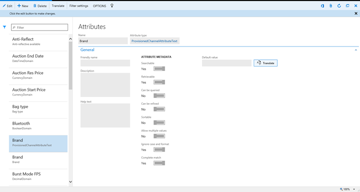
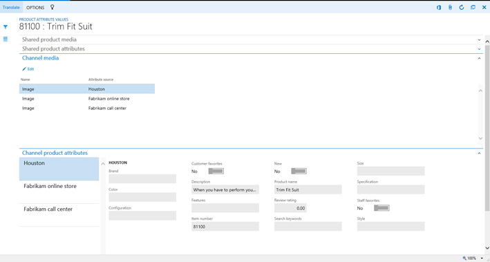
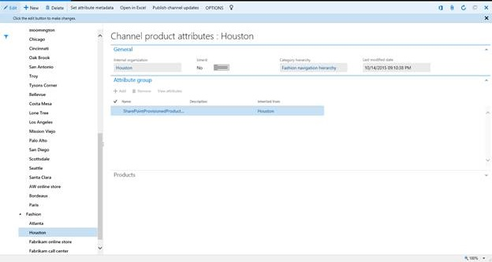

---
# required metadata

title: Create and manage attributes
description: This article describes attributes in Microsoft Dynamics 365 for Operations. Attributes let you describe a product and its characteristics through user-defined fields.
author: josaw1
manager: AnnBe
ms.date: 04/04/2017
ms.topic: article
ms.prod: 
ms.service: Dynamics365Operations
ms.technology: 

# optional metadata

# ms.search.form: 
# ROBOTS: 
audience: Application User
# ms.devlang: 
ms.reviewer: annbe
ms.search.scope: AX 7.0.0, Operations, Core
# ms.tgt_pltfrm: 
ms.custom: 16461
ms.assetid: 2b85491c-f830-4e79-a2cb-681b7ced6988
ms.search.region: global
ms.search.industry: Retail
ms.author: prabhup
ms.search.validFrom: 2016-02-28
ms.dyn365.ops.version: AX 7.0.0

---

# Create and manage attributes

This article describes attributes in Microsoft Dynamics 365 for Operations. Attributes let you describe a product and its characteristics through user-defined fields.

Attributes let you describe a product and its characteristics through user-defined fields. For example, you can specify the product's memory size and hard disk capacity, and indicate whether the product is Energy star–compliant. Attributes can be associated with various retail entities, such as product categories and retail channels, and default values can be set for them. Products inherit their attributes and the default values for those attributes when they are associated with product categories or retail channels. The default values can be overridden at the level of the individual product, at the retail channel level, or in a retail catalog.

#### Examples

| Category   | Attribute                | Permissible values          | Default value |
|------------|--------------------------|-----------------------------|---------------|
| TV & Video | Brand                    | Any valid Brand value       | None          |
| TV         | Screen Size              | 20″–80″                     | None          |
| TV         | Vertical Resolution      | 480i, 720p, 1080i, or 1080p | 1080p         |
| TV         | Screen Refresh Rate      | 60hz, 120hz, or 240hz       | 60hz          |
| TV         | HDMI Inputs              | 0–10                        | 3             |
| TV         | DVI Inputs               | 0–10                        | 1             |
| TV         | Composite Inputs         | 0–10                        | 2             |
| TV         | Component Inputs         | 0–10                        | 1             |
| LCD        | 3D Ready                 | Yes or No                   | Yes           |
| LCD        | 3D Enabled               | Yes or No                   | No            |
| Plasma     | Operating Temp From      | 32–110 degrees              | 32            |
| Plasma     | Operating Temp To        | 32–110 degrees              | 100           |
| Projection | Projection Tube Warranty | 6, 12, or 18 months         | 12            |
| Projection | # of Projection Tubes    | 1–5                         | 3             |

## Attribute type
   
  
Attributes are based on attribute types. Attribute types identify the type of data that can be entered for a specific attribute. Currently, Microsoft Dynamics 365 for Operations supports the following attribute types:

-   **Currency** – This attribute type supports currency values. It can be bounded (that is, it can support a value range), or it can be left open.
-   **DateTime** – This attribute type supports date and time values. It can be bounded (that is, it can support a value range), or it can be left open.
-   **Decimal** – This attribute type supports numerical values that include decimal places. It also supports units of measure. It can be bounded (that is, it can support a value range), or it can be left open.
-   **Integer** – This attribute type supports numerical values. It also supports units of measure. It can be bounded (that is, it can support a value range), or it can be left open.
-   **Text** – This attribute type supports text values. It also supports a predefined set of possible values (enumeration).
-   **Boolean** – This attribute type supports binary values (**true**/**false**).
-   **Reference**.

## Attribute
   In addition to the name, friendly name, description, and Help text, one or more of the following types of information can be captured for an attribute:

-   Default value
-   Attribute metadata, such as metadata that indicates whether the attribute can be searched, refined, or sorted

## Attribute group
   After attributes have been defined, they can be grouped into attribute groups. Attribute groups provide groupings of individual attributes, and can be assigned to retail categories or retail channels.

## Assigning attribute groups to retail categories
   One or more attribute groups can be associated with category nodes in the retail product category hierarchy. When products have been categorized, they inherit the attributes that are included in the attribute groups.

## Assigning attribute groups to retail stores
   One or more attribute groups can be associated with one or more retail stores in the retail stores hierarchy. When products have been enriched for specific retail stores, they inherit the attributes that are included in the attribute groups.

## Overriding attribute values
### At the product level

   The default values of attributes can be overridden at the product level (that is, for individual products).

### In a retail catalog

   The default values of attributes can be overridden for individual products in specific catalogs that are targeted for specific retail channels.

### At the retail channel level

   The default values of attributes can be overridden for individual products in specific catalogs that are targeted for specific retail channels.

