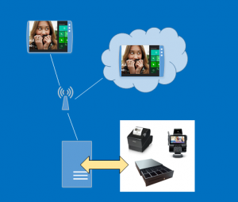

---
# required metadata

title: Define and maintain channel clients, registers, and hardware stations
description: This topic covers how to connect peripherals to your Retail POS.
author: josaw1
manager: AnnBe
ms.date: 04/04/2017
ms.topic: article
ms.prod: 
ms.service: Dynamics365Operations
ms.technology: 

# optional metadata

# ms.search.form: 
# ROBOTS: 
audience: Application User
# ms.devlang: 
# ms.reviewer: 41
ms.search.scope: AX 7.0.0, Operations, Core
# ms.tgt_pltfrm: 
ms.custom: 92383
ms.assetid: 83f31ea6-f0a2-4501-9d4d-a37b6eec2599
ms.search.region: global
ms.search.industry: Retail
ms.author: rubendel
ms.search.validFrom: 2016-02-28
ms.dyn365.ops.version: AX 7.0.0

---

# Define and maintain channel clients, registers, and hardware stations

[!include[banner](includes/banner.md)]

This topic covers how to connect peripherals to your Retail POS.

**Note:** For specific installation instructions, see [Retail hardware station configuration and installation](retail-hardware-station-configuration-installation.md) and [Retail Modern POS self-service download/installation, and device activation of Modern POS and Cloud POS](retail-modern-pos-device-activation.md).

## Key components
Several components are used to define the relationships among a store, the point-of-sale (POS) registers or channels within the store, and the retail peripherals that those registers or channels use to process transactions. This section describes each component and explains how it should be used in a retail store deployment.

### POS registers

Navigation: Click **Retail and commerce** &gt; **Channel setup** &gt; **POS setup** &gt; **Registers**. The POS register is an entity that is used to define the characteristics of a specific instance of the POS. These characteristics include the hardware profile or setup for retail peripherals that will be used at the register, the store that the register is mapped to, and the visual experience for the user who logs on to that register.

### Devices

Navigation: Click **Retail and commerce** &gt; **Channel setup** &gt; **POS setup** &gt; **Devices**. A device is an entity that represents a physical instance of a device that is mapped to a POS register. When a device is created, it's mapped to a POS register. The device entity tracks information about when a POS register is activated, the type of client that is being used, and the application package that has been deployed to a specific device. Devices can be of two types: **Retail modern POS** (MPOS) or **Retail Cloud POS** (Cloud POS).

#### MPOS

MPOS is a POS client application that is installed on Windows 8.1 or a later PC-based operating system. If the **Retail modern POS** application type is mapped to a device, the download package can be specified for a particular device. The download package can be customized to include different versions of the installation package. The ability to deploy different packages provides flexibility in cases where different POS registers might need different integrations. MPOS is deployed together with a built-in hardware station.

#### Cloud POS

Cloud POS is a browser-based POS. Because it runs in the browser, Cloud POS doesn't require Windows 8.1 or a later PC-based operating system. If the **Retail Cloud POS** application type is mapped to a specific device in the back office, that device can be used through the browser with no need to download or install a package. Cloud POS requires a hardware station to use hardware beyond keyboard wedge based bar code scanning.

### Hardware profile

Navigation: Click **Commerce** &gt; **Channel setup** &gt; **POS setup** &gt; **POS profiles** &gt; **Hardware profiles**. A hardware profile identifies the hardware that is connected to a POS register or a hardware station. The hardware profile is also used to specify the payment processor parameters that should be used during communication with the payment software development kit (SDK). (The payment SDK is deployed as part of the hardware station.)

### Hardware station

Navigation: Click **Retail and commerce** &gt; **Channels** &gt; **Retail stores** &gt; **All retail stores**. Select a store, and then click the **Hardware stations** FastTab. A hardware station is an instance of business logic that drives POS peripherals. A hardware station is automatically installed together with MPOS. Alternatively, the hardware station can be installed as a stand-alone component, and then accessed by MPOS or Cloud POS through a web service. The hardware station must be defined at the channel level.

### Hardware station profile

Navigation: Click **Commerce** &gt; **Channel setup** &gt; **POS setup** &gt; **POS profiles** &gt; **Hardware station profiles**. Whereas the hardware station itself is specified at the channel level includes instance-specific information, such as the URL for the hardware station, the hardware station profile includes information that can be static or shared across multiple hardware stations. The static information includes the port that should be used, the hardware station package, and the hardware profile. The static information also includes a description of the type of hardware station that is being deployed, such as **Checkout** or **Returns**, depending on the hardware that is required for each specific hardware station.

## Scenarios
### MPOS with connected peripheral devices

 

To connect MPOS to POS peripherals in a traditional, fixed POS scenario, first navigate to the register itself, and assign a hardware profile to it. You can find the POS registers at **Retail and commerce** &gt; **Channel setup** &gt; **POS setup** &gt; **Registers**. After you've assigned the hardware profile, sync changes to the channel database by using the “Registers” distribution schedule. You can find the distribution schedules at **Retail and commerce** &gt; **Retail IT** &gt; **Distribution schedule**. Next, set up a "local" hardware station on the channel. Click **Retail and commerce** &gt; **Channels** &gt; **Retail stores** &gt; **All retail stores**, and select a store. Then, on the **Hardware stations** FastTab, click **Add** to add a hardware station. Enter a description, enter **localhost** as the host name, and then sync the changes to the channel by using the “Channel configuration” distribution schedule. You can find the distribution schedules at **Retail and commerce** &gt; **Retail IT** &gt; **Distribution schedule**. Finally, in MPOS, use the **Select hardware station** operation to select the **localhost** hardware station. Set the hardware station to **Active**. The hardware profile that is used in this scenario should come from the POS register itself. A hardware station profile isn't required for this scenario. **Note:** Some hardware profile changes, such as changes to cash drawers, require that a new shift be opened after the changes have been synced to the channel. **Note:** Cloud POS must use the stand-alone hardware station to communicate with retail peripherals.

### MPOS or Cloud POS with a stand-alone hardware station

In this scenario, a stand-alone hardware station is shared among MPOS and Cloud POS clients. This scenario requires that you create a hardware station profile to specify the download package, port, and hardware profile that the hardware station uses. You can find the hardware station profile at **Retail and commerce** &gt; **Channel setup** &gt; **POS setup** &gt; **POS profiles** &gt; **Hardware station profiles**. After you've created the hardware station profile, navigate to the specific retail channel (**Retail and commerce** &gt; **Channels** &gt; **Retail stores** &gt; **All retail stores**), and add a new hardware station. Map this new hardware station to the hardware station profile that was previously created. Next, provide a description that will help the cashier identify the hardware station. In the **Host name** field, enter the host machine URL in the following format: **https://&lt;MachineName:Port&gt;/HardwareStation**. (Replace **&lt;MachineName:Port&gt;** with the actual machine name of the hardware station and the port that is specified in the hardware station profile.) For a stand-alone hardware station, you should also specify the electronic funds transfer (EFT) terminal ID. This value identifies the EFT terminal that is connected to the hardware station when the payment connector communicates with the payment provider. Next, from the actual hardware station machine, navigate to the channel, and select the hardware station. Then click **Download**, and install the hardware station. Next, from MPOS or Cloud POS, use the **Select hardware station** operation to select the hardware station that was previously installed. Select **Pair** to establish a secure relationship between the POS and the hardware station. This step must be completed once for every combination of a POS and a hardware station. After the hardware station is paired, the same operation is used to make the hardware station active while it's used. For this scenario, the hardware profile should be assigned to the hardware station profile rather than the register itself. If for some reason a hardware station does not have a hardware profile directly assigned, then the hardware profile assigned to the register is used

## Client maintenance
### Registers

POS registers are managed primarily through the registers themselves, and also through the profiles that are assigned to registers. Attributes that are specific to an individual register are managed at the register level. These attributes include the store where the register is used, the register number, the description, and the EFT terminal ID that is specific to the register itself.

### POS profiles

You can find the POS profiles at **Retail and commerce** &gt; **Channel setup** &gt; **POS setup** &gt; **POS profiles**. It's useful to manage many aspects of a register through profiles, because the profiles can be shared among many registers. Profiles can be mapped either to an individual register or, if a profile is effective on a store-wide basis, to the retail store. The following sections describe the POS profiles and how they are used.

#### Offline profile

The offline profile is set at the store level. It's used to specify the upload settings for transactions that are performed on a POS register while that register isn't connected to the channel database.

#### Functionality profile

The functionality profile is set at the store level. It's used to specify store-wide settings about the functions that can be performed at the POS. The following capabilities are managed through the functionality profile. These capabilities are arranged by FastTab.

-   **General** FastTab:
    -   International Organization for Standardization (ISO).
    -   Create a customer in offline mode.
    -   Email receipt profile.
    -   Central staff logon authentication.
-   **Functions** FastTab:
    -   Management of logon and extended logon.
    -   Financial and currency-related aspects of the POS, such as the ability to key in prices and whether decimals are required for minor currency.
    -   Enabling time registration through the POS.
    -   How products and payments appear in the POS and on receipts.
    -   End-of-day management.
    -   Channel database transaction retention parameters.
    -   How customers are looked up and created from the POS.
    -   How discounts are calculated.
-   **Amount** FastTab:
    -   Maximum and minimum prices that are allowed.
    -   Discount application and calculation.
-   **Info codes** FastTab:
    -   All aspects of how info codes are managed at the POS. For details, see [Info codes](info-codes-retail.md).
-   **Receipt numbering** FastTab:
    -   Specify receipt numbering masks, which might include segments for the store number, terminal number, constants, and whether sales, returns, sales orders, and quotations are printed in separate sequences, or whether they all following the same sequence.

#### Receipt profiles

Receipts profiles are assigned to printers within the hardware profile. They are used to specify the receipt types that are printed at a specific printer. The profiles include settings for the receipt formats, and settings that determine whether the receipt is always printed, or whether the cashier is prompted to decide whether the receipt must be printed. Different printers might also use different receipt profiles. For example, printer 1 is a standard thermal receipt printer, and therefore has smaller receipt formats. However, printer 2 is a full-size receipt printer that is used to print only customer order receipts, which require more space.

#### Hardware profiles

Hardware profiles are explained as a component for client setup earlier in this article. Hardware profiles are assigned directly to the POS register or to a hardware station profile. They are used to specify the types of devices a specific POS register or hardware station uses. Hardware profiles are also used to specify the EFT settings that are used to communicate with the payment SDK.

#### Visual profiles

Visual profiles are assigned at the register level. They are used to specify the theme for a specific register. The profiles include settings for the type of application that is used (MPOS or Cloud POS), the accent color and theme, the font scheme, the logon background, and the POS background.

### Custom fields

You can create custom fields to add fields that aren’t provided out of the box to the POS. For more information about how to use custom fields, see the [Working with custom fields blog post](https://blogs.msdn.microsoft.com/axsupport/2012/08/06/ax-for-retail-2012-working-with-custom-fields/).

### Language text

You can override default strings in the POS by using language text entries. To override a string in the POS, add a new language text line. Then specify an ID, the default string that should be overridden, and the text that should be shown at the POS instead of the default string.

### Hardware station profiles

Hardware station profiles are explained earlier in this article. They are used to assign non-instance-specific information to hardware stations.

### Channel reports configuration

You set up the reports that are available at the retail channel on the **Retail channel reports configuration** page. You can create new reports by providing the XML definition of the report and assigning the report to a specific permission group at the POS.

### Devices

Devices are explained earlier in this article. They are used to manage the activation of a specific POS register. Devices are also used to specify the application that is used for a specific register and the installation package that should be used to install the MPOS client. Here are the device activation states:

-   **Pending** – The device is ready to be activated.
-   **Activated** – The device has been activated.
-   **Deactivated** – The device has been deactivated either in the back office or through the POS.
-   **Disabled** – The device has been disabled.

Additional activation-related information includes the worker who changed the activation status for the device, a time stamp for the activation, and whether the device configuration has been validated.

### Client data synchronization

All changes to a POS client, except changes in the device activation status, must be synced to the channel database to take effect. To sync changes to the channel database, navigate to **Retail and commerce** &gt; **Retail IT** &gt; **Distribution schedule**, and run the required distribution schedule. For client changes, you should run the “Registers” and “Channel configuration” distribution schedules.

