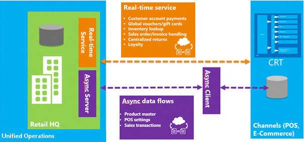
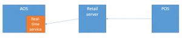

---
# required metadata

title: Define retail channel communications (Commerce Data Exchange)
description: This article provides an overview of Commerce Data Exchange and its components. It explains the part that each component plays in the transfer of data between Microsoft Dynamics 365 for Operations and retail channels.
author: josaw1
manager: AnnBe
ms.date: 2015-12-13 04 - 13 - 38
ms.topic: article
ms.prod: 
ms.service: Dynamics365Operations
ms.technology: 

# optional metadata

# ms.search.form: 
# ROBOTS: 
audience: Application User
# ms.devlang: 
# ms.reviewer: 41
ms.search.scope: AX 7.0.0, Operations, Core
# ms.tgt_pltfrm: 
ms.custom: 27021
ms.assetid: 179b1629-ac90-4cfb-b46a-5bda56c4f451
ms.search.region: global
ms.search.industry: Retail
ms.author: josaw
ms.search.validFrom: 2016-02-28
ms.dyn365.ops.version: AX 7.0.0

---

# Define retail channel communications (Commerce Data Exchange)

This article provides an overview of Commerce Data Exchange and its components. It explains the part that each component plays in the transfer of data between Microsoft Dynamics 365 for Operations and retail channels.

Overview
--------

Commerce Data Exchange is a system that transfers data between Dynamics 365 for Operations and retail channels, such as online stores or brick-and-mortar stores. The database that stores data for a retail channel is separate from the Dynamics 365 for Operations database. The channel database holds only the data that is required for retail transactions. Master data is configured in Dynamics 365 for Operations and distributed to channels. Transactional data is created in the point of sale (POS) system or the online store, and then uploaded to Dynamics 365 for Operations. Data distribution is asynchronous. In other words, the process of gathering and packaging data at the source occurs separately from the process of receiving and applying data at the destination. For some scenarios, such as price and inventory lookups, data must be retrieved in real time. To support these scenarios, Commerce Data Exchange also includes a service that enables real-time communication between Dynamics 365 for Operations and a channel.   

## Async Service
Microsoft SQL Server change tracking on the Dynamics 365 for Operations database is used to determine the data changes that must be sent to channels. Based on a distribution schedule, Dynamics 365 for Operations packages that data and saves it to central storage (Azure blob storage). A separate batch process uses the Commerce Data Exchange: Async Client library to insert this data package into the channel database. 

### Retail scheduler

Scheduler jobs are the mechanism for distributing data to and from locations. Jobs are made up of subjobs, which specify the tables and table fields that contain the data to distribute. Dynamics 365 for Operations includes predefined scheduler jobs and subjobs that meet the replication requirements of most organizations. The following types of predefined jobs are created:

-   **Download jobs** – Download jobs send data that has changed from Dynamics 365 for Operations to channel databases. Modifications to records are tracked through SQL Server change tracking.
-   **Upload jobs (P jobs)** – Upload jobs pull sales transactions from a channel into the Dynamics 365 for Operations database. P jobs upload data incrementally. When a P job runs, the Async Client library checks the replication counter for records that have already been received from a location. A record is uploaded only if its replication counter is more than the largest value that is found. P jobs don't update data that was previously uploaded.

The distribution schedule is used to run the data transfer, either manually or by scheduling a batch job in Dynamics 365 for Operations. A distribution schedule can contain one or more channel data groups, and one or more scheduler jobs.

## Realtime Service
Commerce Data Exchange: Real-time Service is an integrated service that provides real-time communication between Dynamics 365 for Operations and retail channels. Real-time Service enables individual POS computers and online stores to retrieve specific data from Dynamics 365 for Operations in real time. Although most key operations can be performed in the local channel database, the following scenarios require direct access to the data that is stored in Dynamics 365 for Operations:

-   Issuing and redeeming gift cards.
-   Redeeming loyalty points.
-   Issuing and redeeming credit memos.
-   Creating and updating customer records.
-   Creating, updating, and completing sales orders.
-   Receiving inventory against a purchase order or transfer order.
-   Performing inventory counts.
-   Retrieving sales transactions across stores and completing return transactions.

 A predefined Real-time Service profile is created.

