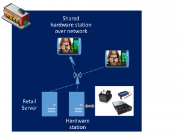
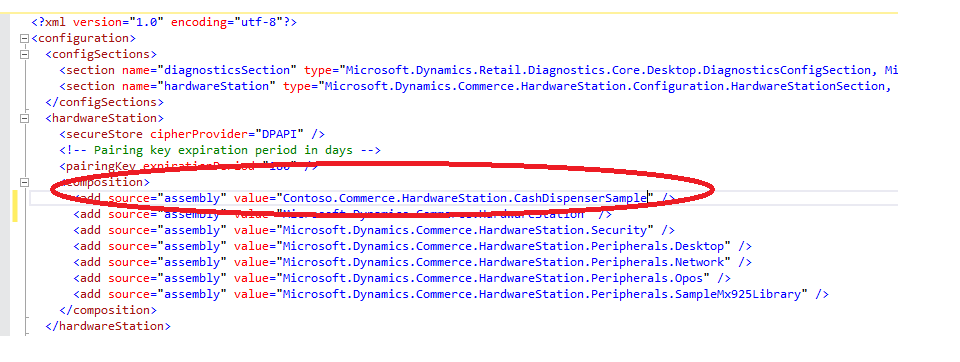

---
# required metadata

title: Hardware Station extensibility
description: This topic explains how to extend Hardware Station to add support for new devices and new device types for existing devices.
author: RobinARH
manager: AnnBe
ms date: 2017-04-04
ms.topic: article
ms.prod: 
ms.service: Dynamics365Operations
ms.technology: 

# optional metadata

# ms.search.form: 
# ROBOTS: 
audience: Developer
# ms.devlang: 
# ms.reviewer: robinr
ms.search.scope: AX 7.0.0, Operations
# ms.tgt_pltfrm: 
ms.custom: 17971
ms.assetid: 256f7f2b-c419-442f-b195-0c6a299a056e
ms.search.region: Global
# ms.search.industry: 
ms.author: sijoshi
ms.search.validFrom: 2016-02-28
ms.dyn365.ops.version: AX 7.0.0

---

# Hardware Station extensibility

This topic explains how to extend Hardware Station to add support for new devices and new device types for existing devices.

Retail Hardware Station overview
--------------------------------

Retail Hardware Station is used by Retail Modern POS and Cloud POS to connect to retail hardware peripherals such as printers, cash drawers, scanners, and payment terminals. 

## Retail Hardware Station setup
Before you start, use the information in [Retail hardware station configuration and installation](..\retail-hardware-station-configuration-installation.md) to install Hardware Station, and to get a feel of what hardware is and how it's installed.

## Retail Hardware Station architecture
Hardware Station exposes Web API for Hardware Station application programming interfaces (APIs). Hardware Station can be extended either by implementing a new controller for a new device (for example, a cash dispenser) or by overriding an existing controller for an existing device type (for example, a new Audio Jack magnetic stripe reader (MSR) implementation).

## Retail Hardware Station extensibility scenarios
Extensibility in Hardware Station is achieved by using [Managed Extensibility Framework (MEF)](https://msdn.microsoft.com/en-us/library/dd460648(v=vs.110).aspx), which is supported by .NET. **Extensibility guideline:** Always write your extension in your own extension assembly. That way, you're writing a true extension, and upgrades will be much easier. There are two basic scenarios for extension:

-   **Adding a new device** – The out-of-box Hardware Station doesn't already support the device (for example, a cash dispenser). Therefore, you must add support for the new device in Hardware Station.
-   **Adding a new device type for an existing device** – The out-of-box Hardware Station implementation already supports the device (for example, an MSR), but you must add support for a specific device type (for example, an Audio Jack MSR implementation).

### Scenario 1: Adding a new device

For this scenario, we will add support for a cash dispenser device in Hardware Station. In our example, we will create a fake cash dispenser that dispenses cash in the Notepad file. However, this example will help you understand the end-to-end extensibility of Hardware Station.

-   The Retail software development kit (SDK) has a cash dispenser sample. See RetailSdk\\SampleExtensions\\HardwareStation.
-   In this case, we must add a new Web API controller and helper properties/methods.
-   The new **CashDispender** controller must extend **ApiController** and **IHardwareStationController**.
-   The **Export** attribute string here specifies the device that this controller is used for: \[Export("CASHDISPENSER", typeof(IHardwareStationController))\]

<!-- -->

    namespace Contoso
    {
        namespace Commerce.HardwareStation.CashDispenserSample
        {
            using System;
            using System.Composition;
            using System.Web.Http;
            using Microsoft.Dynamics.Commerce.HardwareStation;
            using Microsoft.Dynamics.Retail.Diagnostics;
            /// 

            /// Cash dispenser web API controller class.
            /// 

            [Export("CASHDISPENSER", typeof(IHardwareStationController))]
            public class CashDispenserController : ApiController, IHardwareStationController
            { 
                // Add your controller code here
            }

### Scenario 2: Adding a new device type for an existing device

For this scenario, we will add support for a new device type for an existing device (an Audio Jack MSR implementation).

-   The **Export** attribute string specifies the device that this controller is used for: \[Export("MSR", typeof(IHardwareStationController))\]
-   Because there will be multiple controllers for MSRs, Hardware Station uses the configuration file to determine which implementation to use at run time. For more information, see the "Retail Hardware Station extensibility configuration" section later in this article.

<!-- -->

    namespace Contoso
    {
        namespace Commerce.HardwareStation.RamblerService
        {
            using System;
            using System.Composition;
            using System.Threading.Tasks;
            using System.Web.Http;
            using System.Web.Http.Controllers;
            using Microsoft.Dynamics.Commerce.HardwareStation;
            using Microsoft.Dynamics.Commerce.HardwareStation.DataEntity;
            using Microsoft.Dynamics.Commerce.HardwareStation.Models;
            using Microsoft.Dynamics.Retail.Diagnostics;
            /// 

            /// MSR device web API controller class.
            /// 

            [Export("MSR", typeof(IHardwareStationController))]
            [Authorize]
            public class AudioJackMSRController : ApiController, IHardwareStationController
            {
                // Add controller implementation here
            }

## Retail Hardware Station extensibility configuration
### Configuration for IIS-hosted Hardware Station

Before Hardware Station can consume your extension, the **composition** section in the Hardware Station Web.config file must be updated so that it includes an entry for your extension. The order of the composition targets in the configuration file determines precedence. 

### Configuration for local IPC-based Hardware Station

Before local Hardware Station can consume your extension, the **composition** section in the Modern POS DLLHost.exe.config file (C:\\Program Files (x86)\\Microsoft Dynamics AX\\70\\Retail Modern POS\\ClientBroker) must be updated so that it includes an entry for your extension. The order of the composition targets in the configuration file determines precedence.

[

