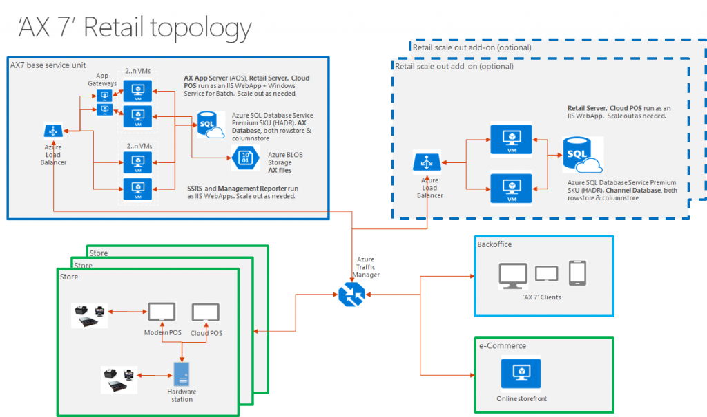
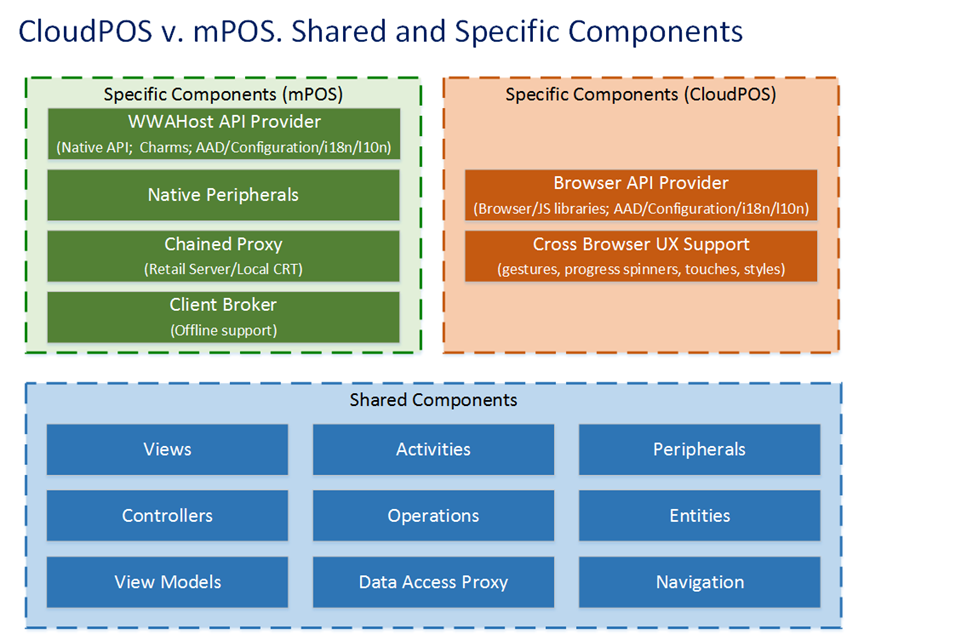

---
# required metadata

title: Retail Modern POS architecture
description: This wiki describes the POS topology.
author: robinr
manager: AnnBe
ms.date: 04/04/2017
ms.topic: article
ms.prod: 
ms.service: Dynamics365Operations
ms.technology: 

# optional metadata

# ms.search.form: 
# ROBOTS: 
audience: Developer
# ms.devlang: 
ms.reviewer: robinr
ms.search.scope: AX 7.0.0, Operations
# ms.tgt_pltfrm: 
ms.custom: 83892
ms.assetid: 210953fb-4d5a-49e6-b4db-6f31b3472789
ms.search.region: Global
# ms.search.industry: 
ms.author: meeram
ms.search.validFrom: 2016-02-28
ms.dyn365.ops.version: AX 7.0.0

---

# Retail Modern POS architecture

This wiki describes the POS topology.

Retail Modern POS topology
--------------------------

Users of Retail Modern Point of Sale (POS) can perform various retail tasks on supported laptops, tablets, and phones. These tasks include processing sales transactions, viewing customer orders, managing daily operations and inventory, and viewing role-based reports. Both Retail POS and Cloud POS are available in Dynamics AX.  The Cloud POS is a hosted version of the POS app. Both the POS clients don't perform business functions or data processing. All business functions are provided by Microsoft Dynamics AX Retail Server. Retail Modern POS and Cloud POS clients can communicate with Retail Servers that are deployed in the cloud. Retail Modern POS client can also communicate with peripheral devices, such as cash drawers, credit card readers, and printers, by using Microsoft Dynamics AX Hardware Station. Hardware Station must be deployed in your store, and all Retail Modern POS clients can connect to the same Hardware Station. The following diagram shows the high-level topology. 

## Retail Modern POS architecture
The view, view-controller, and devices layers depend on the operating system (for example, Windows RT) that you plan to deploy Retail Modern POS on. The other layers are independent of the operating system. These layers use TypeScript classes and modules to implement Retail Modern POS functionality such as workflows and entities. The following diagram shows the Retail Modern POS technical architecture. 

## Cloud POS and Retail Modern POS architecture
Cloud POS is a hosted version of Retail Modern POS, and varies only in the way that it is rendered on specific devices or in specific browsers. Additionally, Retail Modern POS supports offline mode and therefore a local CRT. Other native peripheral support is also specific to Retail Modern POS. 

