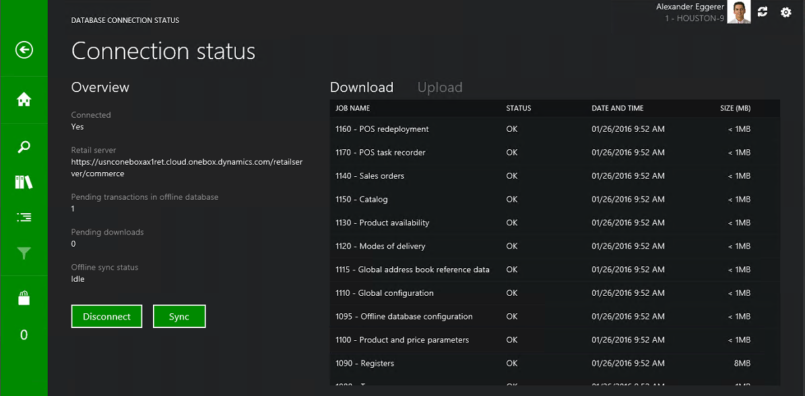

---
# required metadata

title: Retail Modern POS in offline mode
description: This article explains how to use Retail Modern POS devices in offline mode if the Retail Server is unavailable.
author: robinr
manager: AnnBe
ms.date: 04/04/2017
ms.topic: article
ms.prod: 
ms.service: Dynamics365Operations
ms.technology: 

# optional metadata

# ms.search.form: 
# ROBOTS: 
audience: Developer
# ms.devlang: 
ms.reviewer: robinr
ms.search.scope: AX 7.0.0, Operations
# ms.tgt_pltfrm: 
ms.custom: 31441
ms.assetid: 219f93a3-6321-46e9-b989-f97072af0bb3
ms.search.region: Global
# ms.search.industry: 
ms.author: meeram
ms.search.validFrom: 2016-02-28
ms.dyn365.ops.version: AX 7.0.0

---

# Retail Modern POS in offline mode

[!include[banner](../includes/banner.md)]

This article explains how to use Retail Modern POS devices in offline mode if the Retail Server is unavailable.

A Retail Modern POS device will go offline if the Retail Server is unavailable. When the connection with the Retail Server is lost, the point of sale (POS) automatically switches to the offline database. If a data request doesn't succeed within the time-out interval that is configured in the offline profile, Retail Modern POS automatically switches to the offline database and continues the sales transaction. Retail Modern POS will try to reconnect to the Retail Server after the reconnect attempt interval that is configured in the offline profile. This reconnect attempt will occur only at the beginning of a transaction.

## Determine the connection mode of Retail Modern POS
The status header of Retail Modern POS indicates the current connection status. 

 

The **Connection status** page in Retail Modern POS shows the status of the last attempt to synchronize with the offline database. 

## Create a button to manually switch between online and offline modes
You can add a button to Retail Modern POS to manually switch between online and offline modes. Create a button for **POS operation 917 – Database connection status**. Use the button as a toggle to connect or disconnect.

## Operations that can be completed when the channel database is offline
You can complete the following operations when the channel database is offline. **Note:** If any functionality requires Commerce Data Exchange: Real-time Service, you receive an error message that states that the operation isn't supported. **Tip:** Reports and other operations will act only on the data that is available in the offline database.

| Operation ID | Description                         |
|--------------|-------------------------------------|
| 100          | Product sale                        |
| 101          | Price check                         |
| 102          | Void product                        |
| 103          | Product comment                     |
| 104          | Price override                      |
| 105          | Set quantity                        |
| 106          | Clear quantity                      |
| 108          | Product search                      |
| 109          | Return product                      |
| 115          | Show journal                        |
| 117          | Add loyalty card                    |
| 123          | Change unit of measure              |
| 128          | Override transaction tax from list  |
| 130          | Override line product tax from list |
| 132          | Deposit override                    |
| 134          | Add affiliation                     |
| 135          | Add affiliation from list           |
| 200          | Pay cash                            |
| 202          | Pay customer account                |
| 203          | Pay currency                        |
| 206          | Pay cash quick                      |
| 211          | Void payment                        |
| 214          | Pay gift card                       |
| 300          | Line discount amount                |
| 301          | Line discount percent               |
| 302          | Total discount amount               |
| 303          | Total discount percent              |
| 500          | Void transaction                    |
| 501          | Transaction comment                 |
| 503          | Suspend transaction                 |
| 512          | Issue gift card                     |
| 515          | Recall order                        |
| 519          | Add to gift card                    |
| 520          | Gift card balance                   |
| 602          | Customer search                     |
| 603          | Customer clear                      |
| 612          | Customer add                        |
| 622          | Search                              |
| 623          | Edit customer                       |
| 701          | Log off                             |
| 703          | Lock register                       |
| 801          | Inventory lookup                    |
| 802          | Stock count                         |
| 917          | Database connection status          |
| 920          | Time clock                          |
| 921          | View time clock entries             |
| 922          | View product details                |
| 1003         | View reports                        |
| 1052         | Tender declaration                  |
| 1200         | Declare start amount                |
| 1201         | Float entry                         |
| 1210         | Tender removal                      |
| 1211         | Safe drop                           |
| 1212         | Bank drop                           |

## Operations that can’t be completed when the channel database is offline
You can’t complete the following operations when the channel database is offline.

| Operation ID | Description       |
|--------------|-------------------|
| 207          | Pay loyalty card  |
| 707          | Activate device   |
| 708          | Inactivate device |
| 1053         | Blind close shift |
| 1054         | Suspend shift     |
| 1055         | Close shift       |
| 1056         | Print X           |
| 1057         | Reprint Z         |

