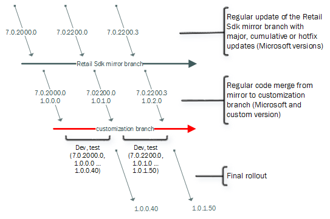

---
# required metadata

title: Retail SDK overview
description: This article provides general information about the Retail SDK. The Retail SDK includes code, code samples, templates, and tools that you can use to customize retail functionality.
author: RobinARH
manager: AnnBe
ms.date: 2015-12-04 20 - 44 - 33
ms.topic: article
ms.prod: 
ms.service: Dynamics365Operations
ms.technology: 

# optional metadata

# ms.search.form: 
# ROBOTS: 
audience: Developer
# ms.devlang: 
# ms.reviewer: 61
ms.search.scope: AX 7.0.0, Operations
# ms.tgt_pltfrm: 
ms.custom: 17771
ms.assetid: c54d34a5-32e2-4d0d-a1c2-4a9940d95ade
ms.search.region: Global
# ms.search.industry: 
ms.author: sijoshi
ms.search.validFrom: 2016-02-28
ms.dyn365.ops.version: AX 7.0.0

---

# Retail SDK overview

This article provides general information about the Retail SDK. The Retail SDK includes code, code samples, templates, and tools that you can use to customize retail functionality.

Overview
--------

The Retail software development kit (SDK) includes code, code samples, templates, and tools that you can use to customize retail functionality. The SDK supports rapid development, full MSBuild integration, package generation, and code separation.

### Download the Retail SDK

The Retail SDK is available in Microsoft Dynamics 365 for Operations development environments, and in hotfix packages in a Retail SDK folder. For more information see:

-   [Access Microsoft Dynamics 365 for Operations Development Instances](access-instances.md). If you get the SDK from a development instance, it is immediately ready for configuration and use.
-   [Install Retail hotfixes.](install-retail-hotfix.md) If you get the SDK from a hotfix, it is included in the hotfix package as a zipped folder. Retail hotfixes are cumulative and includes all other fixes.

We recommend that you put the SDK in a source control system such as Visual Studio Online.

### Rapid development

The main focus of the Retail SDK is to help you write customizations efficiently and correctly. The SDK lets you run applications directly in a single-computer demo environment by using the F5 functionality (run and debug) in Microsoft Visual Studio. All the required “deployment chores” are done for you. Therefore, you don't have to copy any files.

### Full MSBuild integration

The Retail SDK is a build system. A simple MSBuild command from the root of the SDK builds everything. This behavior eliminates guesswork about how and where to build from, and guarantees consistency and reproducibility. Therefore, the Retail SDK can easily be used together with any application lifecycle management (ALM) system, even Microsoft Visual Studio Online. This integration includes automation of the build.

### Creation of final update packages, and better and explicit control over the customization

The Retail SDK includes tools that generate new packages that include everything that is required in order to deploy a service. For example, if the commerce runtime is extended with a new custom service dynamic-link library (DLL), the SDK automatically includes the new DLL in all appropriate packages (RetailServer and MPOSOffline). Or, if the database is extended, the upgrade script is automatically included in both RetailServer and MPOSOffline packages, because these are the packages that must (potentially) run the channel database update. Files that are shared exist only one time in the SDK. The packaging projects are set up in such a way that they pull in the right files for the package. Therefore, you edit a commerceruntime.config file in only one place. The same applies for deployment-related script files, even though these files rarely require customization.

### Better code separation

Whenever the Retail SDK must be updated, a potential code merge is required. This requirement applies if existing code was changed. Some new features in the implementation of Microsoft Dynamics 365 for Operations for Retail and in the folder structure of the SDK help provide better separation of customization code from sample code. Therefore, these features eliminate much of this issue. You can expect more improvements in this area in the future.

### Real-world implementation samples

In addition to the source code of some of the Retail implementations, the Retail SDK includes sample code that illustrates how certain scenarios should be implemented.

## Retail SDK deep dive
### Prerequisites

-   To **code** or **build** your customization, you must have the following tools:
    -   Microsoft Visual Studio 2015 with Typescript 1.5 (an LCS developer topology is acceptable)
    -   ASP.NET MVC 4.0 (an LCS developer topology acceptable) (required only by StoreFront)
    -   A minimum of 150 MB of available disk space (an LCS developer topology is acceptable)

    This list of requirement is very short and lets developers to be productive on simple laptops. There is no longer a prerequisite for a validation utility.
-   To **run** your customization, the normal prerequisites to run Retail apply. We recommend that you run the customizations on a single-box developer topology (either LCS cloud-hosted or downloaded) during development.

### Retail SDK contents

The following folders and files are part of the Retail SDK at the top level. 

<table>
<colgroup>
<col width="50%" />
<col width="50%" />
</colgroup>
<thead>
<tr class="header">
<th>Folder/file</th>
<th>Description</th>
</tr>
</thead>
<tbody>
<tr class="odd">
<td>Assets</td>
<td>Contains shared items such as scripts and configuration files (commerceRuntime.config, dllhost.exe.config, and so on). The configuration files should be customized and edited in this location. The projects that use them will pick them up appropriately.</td>
</tr>
<tr class="even">
<td>BuildTools</td>
<td>Contains anything that is related to the MSBuild and global configurations. Customization.settings is the main file that is used to set up the build system. The following list shows the items that this file controls and that customizers will likely change:
<ul>
<li>Prefix for all built assemblies (AssemblyNamePrefix)</li>
<li>Assembly version for all binaries (CustomAssemblyVersion)</li>
<li>File version for all binaries (CustomVersion)</li>
<li>Name of the customization (CustomName)</li>
<li>Description of the customization (CustomDescription)</li>
<li>Publisher (CustomPublisher)</li>
<li>Code signing (SignAssembly, AssemblyOriginatorKeyFile)</li>
<li>Modern POS certificate path (ModernPOSPackageCertificateKeyFile)</li>
<li>Files that are related to the customization (RetailServerLibraryPathForProxyGeneration, ISV_*)</li>
</ul></td>
</tr>
<tr class="odd">
<td>CommerceRuntime</td>
<td>Contains a Visual Studio solution file (CommerceRuntime.sln) and related C# projects (CommerceRuntime, PricingEngine).</td>
</tr>
<tr class="even">
<td>Database</td>
<td>Contains shared database scripts. The full script CommerceRuntimeScripts_Create.sql is used only to create a new base database. The Upgrade folder includes incremental scripts from both Microsoft and the customizer. The existence of the database or the version in the database during a deployment controls which full or incremental scripts will be run. Only scripts that haven't been run before will be run.</td>
</tr>
<tr class="odd">
<td>HardwareStation</td>
<td>Contains a Visual Studio solution file (HardwareStation.sln) and related C# projects (HardwareStation libraries and Webhost).</td>
</tr>
<tr class="even">
<td>OnlineStore</td>
<td>Contains a Visual Studio solution file (OnlineStore.sln) and related C# projects (Ecommerce SDK).</td>
</tr>
<tr class="odd">
<td>Packages</td>
<td>Contains multiple projects for package creation. These packages are used to deploy via LCS. These packages also include the final web.config files.</td>
</tr>
<tr class="even">
<td>Payments</td>
<td>Contains a Visual Studio solution file (PaymentSDK.sln) and related C# projects (PaymentSDK connectors, samples and functional test).</td>
</tr>
<tr class="odd">
<td>POS</td>
<td>Contains files for POS:
<ul>
<li>CloudPos.sln</li>
<li>ModernPos.sln</li>
<li>Folder Core – Low-level shared POS code</li>
<li>Folder ViewModels – Shared POS view models</li>
<li>Folder SharedApp – Shared POS views</li>
<li>Folder App – Modern POS–specific views and other items</li>
<li>Folder Web – Cloud POS–specific views and other items</li>
</ul></td>
</tr>
<tr class="even">
<td>Proxies</td>
<td>Contains two Visual Studio projects that are referenced by others. These projects contain interfaces and generated code that serves as a proxy client of Retail Server. Proxies.Retail.TypeScript is the TypeScript proxy, and RetailProxy is the C# proxy. They are used by Modern POS/Cloud POS and the ECommerce SDK.</td>
</tr>
<tr class="odd">
<td>References</td>
<td>The single place where all binaries live. The location is used to resolve any project’s binary references. The list of files includes external non-Retail binaries and also Microsoft Retail binaries. Additionally, this directory serves as the global drop location for any binaries that are built from the Retail SDK.</td>
</tr>
<tr class="even">
<td>SampleExtensions</td>
<td>Contains sample extensions.</td>
</tr>
<tr class="odd">
<td>dirs.proj</td>
<td>The top-level MSBuild file that directs the build order.</td>
</tr>
<tr class="even">
<td>Microsoft-version.txt</td>
<td>A file that includes the Microsoft version of the Retail SDK. Don't edit this file.</td>
</tr>
</tbody>
</table>

The C\# source code in the SDK uses the Contoso namespace. Therefore, it's easier to distinguish Microsoft types and your own types, because Microsoft uses Microsoft.Dynamics. If you're referencing a type from the Microsoft binary, reference it by using Microsoft.Dynamics. That way, you'll know that it's not from the Retail SDK but from a referenced binary. 

### Dependencies, build order, and full build

The following illustration shows a high-level logical dependency tree within the Retail SDK. It doesn't show the references to all Microsoft files or assets. To see these, look at the Visual Studio project and solution files in more detail.  Note the following important points:

-   The RetailServer API is consumed by a few projects by means of automatically generated client proxy code. This behavior allows for more rapid development, and reduces opportunities for errors and bugs. By default, the Retail SDK uses the official Microsoft DLL to generate the client code. Customizers can switch to their own DLL (in Customization.settings) and therefore automatically generate the proxy code for their customized RetailServer API. After switching the DLL, a developer might have to change some implementations inside the RetailProxy project. The reason is that Modern POS in offline mode must communicate directly with the commerce runtime, and that code must be implemented. However, no guesswork is required. The C\# compiler will force it.
-   The packaging projects generate the deployment packages in the way that LCS expects them. By default, these project will ship only the Microsoft assets (non-customized) and the proxy DLLs. Anything else that should be included must be explicitly named in Customization.settings. This behavior is by design. It reduces the deployed custom code and allows for binary patches. For example, a customization adds a new CommerceRuntime service and a new RetailServer controller. In this case, two new DLLs are registered for inclusion in the packages and are automatically included in all relevant places. The packages will **not** have all recompiled binaries from the SDK.
-   There is no single Visual Studio solution that includes all projects. Because there are few couplings between the various Visual Studio projects, you can open multiple projects or solutions side by side, and can compile the appropriate project after a change.
-   Even if you didn't customize every component, the easiest way to get the final deployment packages is by building the whole Retail SDK. To do this, open an **MSBuild Command Prompt for VS2015** window, and enter **msbuild** (or **msbuild /p:Configuration=Release** for a non-debug version). 

This command will build all projects. This approach also provides a great way to verify that there are no implementation or code bugs. If there are any bugs, the build will fail, and the Command Prompt window will show what failed (this output resembles what Visual Studio would show).  For detailed help for MSBuild, see [https://msdn.microsoft.com/en-us/library/0k6kkbsd.aspx](https://msdn.microsoft.com/en-us/library/0k6kkbsd.aspx). The binaries that the build creates are automatically copied to the SDK’s References folder. The References folder also includes all the other binaries. Notice that no DLLs are overwritten, because they are all prefixed with a name (in this case, "Contoso") that you can define in Customization.settings. 

### Minimal required configuration

Do you just want to quickly build the Retail SDK, or to run POS in the debugger on a demo machine? For Modern POS only, you must create an app package signing certificate in order to build correctly. Alternatively, you can use Cloud POS. Follow the instructions at [https://msdn.microsoft.com/en-us/library/windows/desktop/jj835832(v=vs.85).aspx](https://msdn.microsoft.com/en-us/library/windows/desktop/jj835832(v=vs.85).aspx) to create a PFX file. Then copy the PFX file to the BuildTools folder, and update the BuildTools\\Customization.settings file with the correct name (ModernPOSPackageCertificateKeyFile). At this point you have everything that you require in order to build individual solutions, projects, or the whole Retail SDK (by using MSBuild).

### Normal configuration/code signing

BuildTools\\Customization.settings holds most of the configuration values for the SDK. The highlighted items in the following illustration are the global values. These values control how built binaries, components, and packages are named, versioned, and code-signed.  It's good practice to sign your assemblies with a strong name, even though this isn't required. To learn how to create your own key file if you don't already have one, see [https://msdn.microsoft.com/en-us/library/6f05ezxy(v=vs.110).aspx](https://msdn.microsoft.com/en-us/library/6f05ezxy(v=vs.110).aspx). To build correctly, you must create an app package signing certificate. Follow these instructions at [https://msdn.microsoft.com/en-us/library/windows/desktop/jj835832(v=vs.85).aspx](https://msdn.microsoft.com/en-us/library/windows/desktop/jj835832(v=vs.85).aspx) to create a PFX file. Both the strong name key file and the app package signing certificate can be stored inside the BuildTools folder. The **RetailServerLibraryPathForProxyGeneration** property can be used to set a different RetailServer DLL for proxy generation. Customization.settings is also the place to define your new customization assets, such as binaries, configuration files, and SQL update scripts. After you specify your extensions, binaries, and assets here, the files will be added in the deployable package that is created. 

### Customizing the build

#### Adding new projects

It's easy to adding new projects to the Retail SDK’s build system. You can either clone one of the many existing projects or start a new project. You just have to make some adjustments in a text editor, as shown in the following illustration. The relative path of the **Import** elements should be adjusted, and the **AssemblyName** element should use the predefined **AssemblyNamePrefix** property. These adjustments are required in order to get versioning, code signing, uniform assembly naming, automatic dropping to the References folder, and other tasks for free. 

#### Changing the build order or adding to the build

The whole directory tree of the Retail SDK is built with the help of MSBuild traversal files (dirs.proj files). The following illustration shows the main traversal file of the Retail SDK. Similar files might also exist in subdirectories. Notice that Visual Studio solution files (.sln files) are very similar to traversal files. Both “direct” the MSBuild engine to process other build scripts.  After new code is added, most of it should be located in a new folder (for details, see "Best practices of code implementation"), and you must add it to the traversal structure by adding to one or multiple dirs.proj files. The Extensions folder appears highlighted on line 10 in the previous illustration. The quickest way to get started with a new dirs.proj file is to copy an existing file, correct the paths in the **Import** elements, and update the **ProjectFiles** elements in the **ItemGroup** element.

#### Build script customization

When you must implement new build steps, keep in mind that the existing scripts might be updated by a Retail SDK update later. Best practice is to minimize the editing of any file, or add new files instead. If you require new global MSBuild properties, BuildTools\\Microsoft.Dynamics.RetailSDK.Build.props is a good place to add them. Likewise, BuildTools\\Microsoft.Dynamics.RetailSDK.Build.targets can be used to add new build processing targets. If only one project requires special handling, it is better to explicitly make the change there. If you require new local MSBuild properties, add a new file that is named local.props in the same directory. Alternatively, add a local.targets file if you require local build processing targets.

### Developer productivity

As shown in the architecture diagram earlier in this article, several things depend on the RetailServer interface. It is likely that someone will change this interface. On a developer topology machine, someone might want to immediately try out a change. In this case, any CommerceRuntime and RetailServer extension DLLs must be copied into the bin folder of the locally installed RetailServer web application. A user can configure the Customization.setting file so that the DLLs are automatically copied into the bin folder of the local RetailServer web application whenever new versions of these files are built. 

### Application lifecycle management

A good ALM solution provides version control, builds, automated builds, planning tools, tracking tools, dashboards, customization, and more. For more information, see [https://msdn.microsoft.com/en-us/library/fda2bad5.aspx](https://msdn.microsoft.com/en-us/library/fda2bad5.aspx). The Retail SDK is organized in such a way that it aligns well with these capabilities. Visual Studio Online is a great tool and is recommended.

### Branching and versioning

To work efficiently in a team, or even just to be able to go back and look at some changes that were done in the past, you must have good branching strategy and versioning discipline. The following illustration shows a simple branching strategy that might work well for most teams. The version numbers are fictitious. 

#### Retail SDK mirror branch

A very important point to emphasize is that the non-customized Retail SDK should be stored in your source control. You don't have to store every version, but the versions that your team wants to snap to should be added (these versions might be cumulative updates or hotfixes). Only a simple merge of all changes (additions, changes, and deletions) should be done. No other development work should occur in this branch. The Retail SDK has its own version. All Retail binaries and packages that are included have the same version. The version can also be found in the root of the Retail SDK in a file that is named Microsoft-version.txt.

#### Customization branch

After development can start, a new branch should be started (customization branch). At the beginning of the initial branch-out, this branch will be an exact copy of the Retail SDK mirror branch. This is the branch for a team’s development. The version of the customization branch must be incremented at least every time that a build is created for testing, or it can even be incremented daily. The file version to increment is defined in Customization.setting file by using the **CustomVersion** property. If you update it and rebuild, all binaries, packages, manifest files are updated accordingly. Note that the **CustomAssemblyVersion** property should be updated only when the update isn't backward compatible and/or for major new releases. In other words, this update should very rarely. For example, Microsoft’s assembly version stayed the same for the multiple CTP releases for the current version of Microsoft Dynamics 365 for Operations. Because there are both Microsoft assets and your own changes in the same branch, the branch essentially has two file versions. The first version is the Microsoft version of the Retail SDK that the current branch is based on, and the second version is the version that is set by the **CustomVersion** property. In the previous illustration, the current file version of the customization branch is 1.0.2.\* (based on Microsoft version 7.0.2200.3). The file version of the first rolled-out release was 1.0.0.40 (based on 7.0.2000.0). When a testing phase is completed, and the final packages are being deployed with that version, it's important that you increment the version (or create a source control label).

