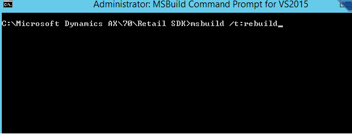
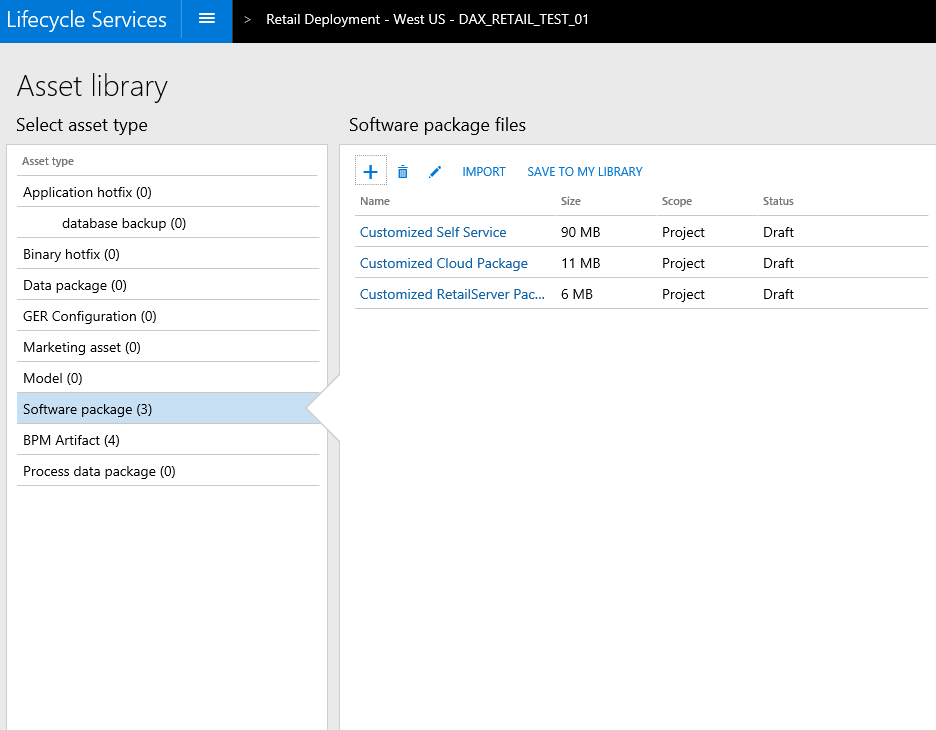

---
# required metadata

title: Retail SDK packaging
description: This topic explains how to create a deployable package for each of the following components of Microsoft Dynamics 365 for Operations - Retail.
author: RobinARH
manager: AnnBe
ms.date: 04/04/2017
ms.topic: article
ms.prod: 
ms.service: Dynamics365Operations
ms.technology: 

# optional metadata

# ms.search.form: 
# ROBOTS: 
audience: Developer
# ms.devlang: 
# ms.reviewer: 61
ms.search.scope: AX 7.0.0, Operations
# ms.tgt_pltfrm: 
ms.custom: 28021
ms.assetid: 0fa3c8e7-49e4-417d-afe9-fa2055f6546f
ms.search.region: Global
# ms.search.industry: 
ms.author: sijoshi
ms.search.validFrom: 2016-02-28
ms.dyn365.ops.version: AX 7.0.0

---

# Retail SDK packaging

[!include[banner](../../includes/banner.md)

This topic explains how to create a deployable package for each of the following components of Microsoft Dynamics 365 for Operations - Retail.

Prerequisites
-------------

For detailed information about how the Retail software development kit (SDK) is designed for customization and to generate customized deployable packages, see [Retail SDK overview](retail-sdk-overview.md). This topic explains how to create a deployable package for each of the following components of Microsoft Dynamics 365 for Operations - Retail:

-   Commerce runtime (CRT)
-   Retail Server
-   Modern POS
-   Cloud POS
-   Hardware station

The article then explains how to deploy these packages to either an existing Microsoft Dynamics Lifecycle Services (LCS) cloud-deployed environment or a new environment.

## Deployable packages
A deployable package is an asset that can be consumed by the LCS deployment service. A deployable package can also be consumed manually to service or install a customization. The Retail SDK generates the same package that is developed for Microsoft hotfixes or updates, so that there is just one way to install updates and customizations to the existing solution.

### Steps to create a deployable package

1.  Host the Retail SDK in Microsoft Visual Studio Online (VSO) or the source control system that your organization uses.
2.  Customize or add functionality to the Retail stack.
3.  Use the build tools to give an identity to the customized installation package, code-sign it, and specify the customized CRT assemblies, the customized Retail Server assemblies, the customized Hardware station assemblies, and the customized database scripts.
4.  After all the settings have been specified, run **msbuild /t:rebuild** on the root of the Retail SDK to generate all deployable packages.

## Retail SDK build tools – Customization settings
BuildTools\\Customization.settings is where most of the configuration values for the Retail SDK are set. These values control how built binaries, components, and packages are named, versioned, and code-signed. After you define this metadata, The Retail SDK build system uses it to give an identity to the assets, and to package the customization assets for all the Retail components.

-   **AssemblyNamePrefix **– Specify the prefix name for the assembly. When you build the Retail SDK, all the assemblies are prefixed with this name.
-   **CustomAssemblyVersion **– Specify the custom assembly version for all assemblies that are built by using the Retail SDK.
-   **CustomVersion **– Specify the custom file version for all assemblies that are built by using the Retail SDK.
-   **CustomName **– Specify the custom name for the assembly.
-   **CustomDescription **– Specify the description for the assembly.
-   **CustomDescription **– Specify the publisher for the assembly.
-   **CustomDescription **– Specify the copyright for the assembly.
-   **SignAssembly **– Specify **True** if you want to sign the assembly during the build.
-   **DelaySign **– Specify **True** if you want to delay signing of the assets during the build.
-   **AssemblyOriginatorKeyFile **– Specify the strong name key to use to sign the assembly.
-   **ModernPOSPackageCertificateKeyFile **– Specify the PFX file to use to sign Modern POS and Hardware station.
-   **RetailServerLibraryPathForProxyGeneration **– Specify the customized Retail Server assembly to use for proxy generation (both TypeScript and C\# proxy).
-   In the **ItemGroup** section:
    -   **ISV\_CommerceRuntime\_CustomizableFile **– Specify the customized CRT assembly. You can have multiple entries, one for each customized CRT assembly.
    -   **ISV\_RetailServer\_CustomizableFile **– Specify the customized Retail Server assembly. You can have multiple entries, one for each customized Retail Server assembly.
    -   **ISV\_HardwareStation\_CustomizableFile **– Specify the customized Hardware station assembly. You can have multiple entries, one for each customized Hardware station assembly.
    -   **ISV\_CustomDatabaseFile\_Upgrade\_Custom **– Specify the customized database scripts.

## Building a deployable package for each Retail component
### Build a deployable package

The Retail SDK fully supports msbuild. To build the Retail SDK, open a **MSBuild Command Prompt for VS2015** window as an administrator, and run **msbuild** (or, for a non-debug version, run **msbuild /p:Configuration=Release**). 

### Packages

After the build is completed, all deployable packages are generated in the Retail SDK/Packages folder. 

#### CRT package

By default, there is no separate package for CRT, because CRT isn't deployed individually. Instead, CRT assets are packaged together with other application components, such as Modern POS, Retail Server, and Microsoft Dynamics 365 for Operations HQ. In order for the Retail SDK build tools to package CRT in all the components where it's used, you must make the following configuration entries:

1.  **CRT extension assemblies** – These will be the new assemblies where you've written CRT extensions. Specify an entry for CRT extension assemblies in Retail SDK\\BuildTools\\Customization.settings. 
2.  **CRT commerceruntime.config file** – If you have a new CRT assembly, you must add it to the CRT configuration file so that the runtime can load it. Specify an entry for CRT extension assemblies in Retail SDK\\References\\commerceruntime.config. 

#### Database package

As a part of a customization, you might have to upgrade a channel database in addition to a Modern POS offline database. Currently, you use upgrade SQL scripts to upgrade the channel and Modern POS offline databases. You can write an upgrade SQL script and put it at Retail SDK\\Database\\Upgrade\\Custom, so that packaging tools can pick it up and include it in the deployable package for the correct components (Retail Server and Modern POS Offline).  You must also update Retail SDK\\BuildTools\\Customization.settings to instruct the build tools which files to package for the database. 

##### Deployment of database scripts

Database scripts are packaged together with the Retail Server and Modern POS Offline packages, and are run when Retail Server and Modern POS are installed. If there are multiple custom database scripts, they are run in alphabetical order. Therefore, if you want to run the scripts in a specific order, you must name them accordingly. The CRT.RETAILUPGRADEHISTORY table keeps track of which scripts are already applied to the database. Therefore, the next database upgrade will run only those upgrade scripts that don't have an entry in the CRT.RETAILUPGRADEHISTORY table.

#### Retail Server package

In order for the Retail SDK build tools to package Retail Server, you must make the following configuration entries:

1.  **Retail Server extension assemblies **– These will be the new assemblies where you've written Retail Server customizations. Specify an entry for CRT extension assemblies in Retail SDK\\BuildTools\\Customization.settings. 
2.  **Retail Server web.config file** – You must add an entry for Retail Server extension assemblies to the Retail Server web.config file, so that they are loaded and used. Specify an entry for Retail Server Extension assemblies in Retail SDK\\Packages\\RetailServer\\Code\\web.config. 

After you've specified these settings, you can run MSBuild on the root to build everything and generate deployable packages for all Retail components. The Retail Server deployable package will be generated at Retail SDK\\Packages\\RetailServer\\content.zip. This zip file contains everything that is required in order to deploy Retail Server. You can upload this zip file to LCS and then use it to deploy a new environment. For an existing environment, you currently have to manually copy the zip file, extract it, and then run **content.zip\\RetailServer\\Scripts\\Upgrade\\Core\\UpdateRetailServer.ps1** in admin mode in Microsoft Windows PowerShell. 

#### Cloud POS

When you run MSBuild on the root SDK folder, a CloudPOS package is created together with the other Retail components. The Cloud POS deployable package is generated at Retail SDK\\Packages\\CloudPos\\content.zip. This zip file contains everything that is required in order to deploy Cloud POS. You can upload this zip file to LCS and then use it to deploy a new environment. For an existing environment, you currently have to manually copy the zip file, extract it, and then run **content.zip\\RetailCloudPos\\Scripts\\Upgrade\\Core\\UpdateCloudPos.ps1** in admin mode in Windows PowerShell. 

#### Retail self-service packages

Both Modern POS and Hardware station are self-service components. To deploy self-service components, you upload them to the tenant-specific storage, so that they can appear for self-service in Dynamics 365 for Operations. When you run MSBuild on the root SDK folder, a RetailSelfService package is created together with the other Retail components. The RetailSelfService deployable package is generated at RetailSDK\\Packages\\RetailSelfService\\content.zip. This zip file contains everything that is required in order to deploy Retail self-service. You can upload this zip file to LCS and then use it to deploy a new environment. For an existing environment, you currently have to manually copy the zip file, extract it, and then run **content.zip\\RetailSelfService\\Scripts\\Upgrade\\UpdateRetailSelfService.ps1** in admin mode in Windows PowerShell.  After Retail self-service is updated, you can go to Dynamics 365 for Operations to verify that the new customized self-service packages are available.

##### Modern POS

Open the **All retail stores** page, and notice that the new customized Modern POS package is available for selection. 

##### Hardware station

Open the **Hardware station profiles** page, and notice that the customized hardware profile is available for selection 

## Creating a new environment by using customized packages
Before you can use LCS to deploy a new environment by using customized packages, you must first upload all the packages to the project's Asset library. These packages are software packages, and you will see options for Cloud POS, Retail Server, and Retail self-service.

### Step 1

In the Asset library for the project, upload the customized Retail Server, Retail self-service, and Cloud POS deployable packages to LCS.   

### Step 2

Request a new LCS topology by going to the **Environments** section and requesting a new environment.   

