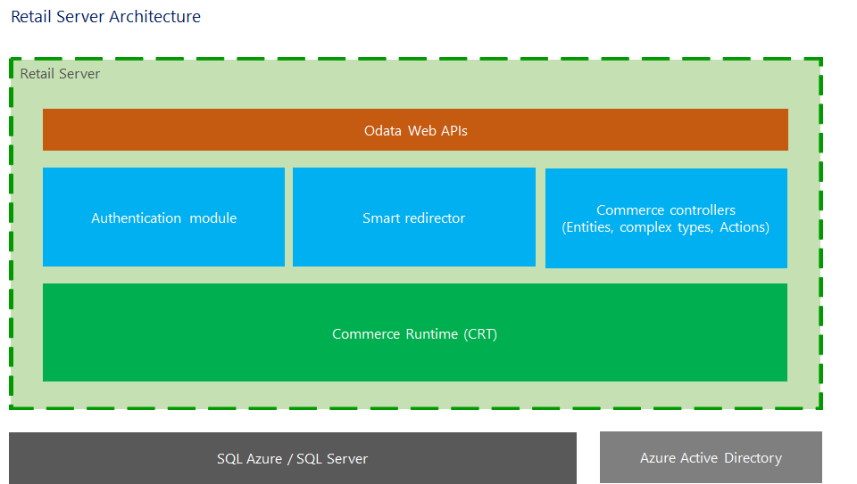

---
# required metadata

title: Retail Server architecture
description: This article describes the architecture of Retail Server. Retail Server provides stateless services and business logic for Retail Modern Point of Sale (POS) and E-Commerce clients.
author: robinr
manager: AnnBe
ms.date: 04/04/2017
ms.topic: article
ms.prod: 
ms.service: Dynamics365Operations
ms.technology: 

# optional metadata

# ms.search.form: 
# ROBOTS: 
audience: Developer, IT Pro
# ms.devlang: 
# ms.reviewer: robinr
ms.search.scope: AX 7.0.0, Operations
# ms.tgt_pltfrm: 
ms.custom: 31521
ms.assetid: 3a169648-592b-4616-9834-598c0244a852
ms.search.region: Global
# ms.search.industry: 
ms.author: meeram
ms.search.validFrom: 2016-02-28
ms.dyn365.ops.version: AX 7.0.0

---

# Retail Server architecture

This article describes the architecture of Retail Server. Retail Server provides stateless services and business logic for Retail Modern Point of Sale (POS) and E-Commerce clients.

Retail Server architecture
--------------------------

The commerce runtime is wrapped in a Retail Server layer. Retail Server uses a web API and OData to support thin clients both in the store and online on tablets and phones. The commerce runtime communicates with Retail Headquarters through Commerce Data Exchange services. The following diagram shows the architecture of Retail Server. 

 

Retail Server uses the following concepts.

<table>
<thead>
<tr class="header">
<th>Concept</th>
<th>Description</th>
</tr>
</thead>
<tbody>
<tr class="odd">
<td>Entity type</td>
<td>An entity type is an entity that has a life cycle that you want to monitor. Each entity type has a key. An example of an entity type is <strong>Customer</strong>.</td>
</tr>
<tr class="even">
<td>Complex type</td>
<td>A complex type is an OData concept that is designed to prevent duplication by grouping specific related properties. These related properties can be reused in multiple entities. For example, <strong>Customer</strong> is an entity type that has a customer address. This customer address is a wrapper that contains an address line, city, state, and ZIP/postal code. Therefore, <strong>Customer address</strong> is a complex type that can be reused by other entity types. For example, the <strong>Order</strong> entity type requires the same address information that is associated with the <strong>Customer</strong> entity type and therefore reuses the <strong>Customer address</strong> complex type.</td>
</tr>
<tr class="odd">
<td>Controller</td>
<td>A controller is a mapping for an entity type that controls create, read, update, and delete (CRUD) behaviors and actions for the entity type. A controller is provided for each commerce entity. You can customize the following controllers:
<ul>
<li>Carts</li>
<li>Catalogs</li>
<li>Categories</li>
<li>Commerce</li>
<li>Commerce Lists</li>
<li>Composite Key Entity</li>
<li>Controller Assembly Resolver</li>
<li>Customers</li>
<li>Employees</li>
<li>Non-Bindable Action</li>
<li>Org Units</li>
<li>Picking Lists</li>
<li>Products</li>
<li>Purchase Orders</li>
<li>Sales Orders</li>
<li>Shifts</li>
<li>Stock Counts Journals</li>
<li>Transfer Orders</li>
</ul></td>
</tr>
<tr class="even">
<td>Metadata</td>
<td>Metadata defines the contract between the client and the server.</td>
</tr>
</tbody>
</table>

You can create your own entity type or complex type, extend an existing controller, add a new controller, and customize the metadata. If you customize the commerce runtime, you must also customize various components in Retail Server to expose those changes to your Retail Modern POS clients.

