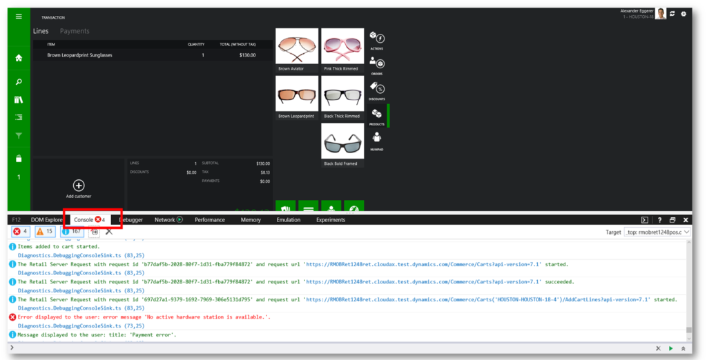
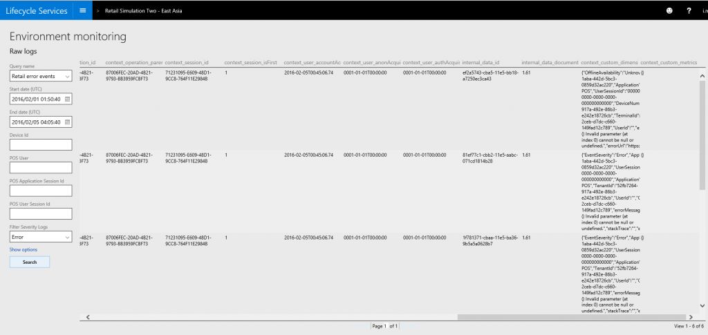

---
# required metadata

title: Retail component events for diagnostics and troubleshooting
description: To enable diagnostics and troubleshooting, all Retail components, which include clients such as the Retail Modern POS and server components such as Retail Server, log their events locally to Event Viewer (or to the browser developer tools console, in case of Retail Cloud POS). This article explains where to find events from Retail-specific components.
author: MargoC
manager: AnnBe
ms.date: 2016-05-12 22 - 11 - 53
ms.topic: article
ms.prod: 
ms.service: Dynamics365Operations
ms.technology: 

# optional metadata

# ms.search.form: 
# ROBOTS: 
audience: IT Pro
# ms.devlang: 
# ms.reviewer: 11
ms.search.scope: AX 7.0.0, Operations
# ms.tgt_pltfrm: 
ms.custom: 85493
ms.assetid: a22c9493-c000-4514-bb0d-b3cc674439d9
ms.search.region: Global
ms.search.industry: Retail
ms.author: aamiral
ms.dyn365.ops.intro: 01-02-2016
ms.dyn365.ops.version: AX 7.0.0

---

# Retail component events for diagnostics and troubleshooting

To enable diagnostics and troubleshooting, all Retail components, which include clients such as the Retail Modern POS and server components such as Retail Server, log their events locally to Event Viewer (or to the browser developer tools console, in case of Retail Cloud POS). This article explains where to find events from Retail-specific components.

Viewing events in Event Viewer
------------------------------

You can use Event Viewer to view events for Microsoft Dynamics 365 for Operations components that are installed on computers that run Microsoft Windows, if you have physical access to the computer where the events are logged. For more information about Event Viewer, see [Event Viewer](https://technet.microsoft.com/en-us/library/4229f239-16a6-4ecd-b3cf-aec03dc08cd5) on TechNet. You can also use Event Viewer to view events remotely from computers that you have access to. For more information about how to use Event Viewer to view events remotely, see [Work with Event Logs on a Remote Computer](https://technet.microsoft.com/en-us/library/cc766438.aspx) on TechNet. Typically, Event Viewer is used for troubleshooting in the following use cases:

-   Development on a developer topology or on a downloadable virtual hard disk (VHD) that provides access to Event Viewer
-   Client components, when you're running a conference room pilot and have access to Event Viewer for that computer

However, for most other cases, and especially when you don't have access to Event Viewer for the computer, you can use Log Search on Microsoft Dynamics Lifecycle Services (LCS). Log Search is discussed later in this article. This section applies to the following components:

-   Retail Server
-   Retail Modern POS
-   Retail Hardware Station

### Find Retail-specific events in Event Viewer

To start Event Viewer on a computer, right-click the **Start** button, and then click **Event Viewer**.  All Retail-specific event logs can be found under the following path in Event Viewer: Application and Services Logs\\Microsoft\\Dynamics We provide the following Retail-specific event logs:

-   **Commerce-RetailServer** – This log contains events that are logged by the Retail Server components.
-   **Commerce-ModernPos** – This log contains events that are logged by Retail Modern POS. These events include events from the TypeScript and C\# (CRT) layer.
-   **Commerce-LoggingProvider** – This log contains events that are logged by all other Retail components that aren't included in the list earlier in this article.

### Enable debug event logs

Currently, some of the events that are logged by various Retail components are sent to debug event logs. These events are verbose events that are logged at very high rates and are useful only for detailed debugging scenarios. Follow this step to enable the debug event logs in Event Viewer.

-   Right-click a debug log, and then click **Enable Log**.

## Viewing events by using the (F12) browser developer tools console
Because Retail Cloud POS is a browser-based component, you can use the browser developer tools console to view events for it. For information about the Microsoft browser developer tools console, see [Using the Console to view errors and debug](https://msdn.microsoft.com/en-us/library/dn255006(v=vs.85).aspx) on MSDN. To use the browser developer tools for Retail Cloud POS, you must use a supported browser version.

### View events in the browser developer tools console

1.  Start Internet Explorer or Microsoft Edge, and go to Retail Cloud POS.
2.  Press F12, and then click the **Console** tab.
3.  As you perform operations on Retail Cloud POS, events are logged in the console. You can filter by event severity to view events that have different severity levels.

## Correlating events
This sections explains how to correlate events from various Retail components.

### Data flow between a POS client and Retail Server

The diagram that follows shows the data flow between a point of sale (POS) client and the Retail Server.

#### POS client startup

When a user starts a POS client, a new AppSessionID is generated. The AppSessionID is used to log every event that is instrumented in the POS client. All events that are logged to Event Viewer and App Insights have this ID.

#### User sign-in

When a user signs in to a POS client, a new UserSessionID is generated. The UserSessionID is used to log every event that is instrumented in the POS client. All user events that are logged to Event Viewer have this ID. This ID is maintained for as long as the user is signed in. When the current user signs out and a new user sign in, a new UserSessionID is generated.

#### POS client calls to Retail Server

Whenever a POS client makes a call to the Retail Server, the AppSessionID and UserSessionID are sent as headers. The Retail Server then logs an event for the incoming request (Event ID 5000). This event includes those two IDs and also an ActivityID. The ActivityID is then also used for all related Retail Server events. The AppSessionID, UserSessionID, and ActivityID are available in the event log where Retail Server is hosted. They are also available in LCS Log Search.

#### Request activity on Retail Server

Every event that is logged as part of a Retail Server request has the same ActivityID as the initial event that was logged for the initial incoming request event (Event ID 5000). These events are available in both Event Viewer and LCS Log Search. 

### Finding Retail Modern POS events in Event Viewer

Every event that is logged by Retail Modern POS includes the following data points:

-   **AppSessionID** – A unique ID that is generated when the app is first started. It's included with every event that is logged from Retail Modern POS.
-   **UserSessionID** – A unique ID that is generated when a user signs in to Retail Modern POS. It's included with every event that is logged from Retail Modern POS, for as long as the user remains signed in. When a new user signs in, a new UserSessionID is created.

You can find the AppSessionID and UserSessionID values on the **Details** tab in Event Viewer on the machine where Retail Modern POS is installed. 

### Finding incoming Retail Server request events in Event Viewer

To correlate data for incoming Retail Server requests in Event Viewer, you must first enable the **Analytic** channel. To enable the Analytic channel, follow these steps.

1.  In Event Viewer, in the left pane, select **Commerce-RetailServer**.
2.  Click **View** &gt; **Enable Analytic and Debug log**. A new node for the Analytic channel appears under the **Commerce-RetailServer** logging provider.
3.  Right-click the **Analytic** node, and then click **Enable log**.

In Event Viewer, all incoming Retail Server requests are logged to the Analytic channel of the Commerce-RetailServer source as event 5000. These events also have the AppSessionID and UserSessionID that were described earlier. Every event also has a unique ActivityID that is instrumented for every logged event for the same Retail Server request.

## Using LCS Log Search
LCS Log Search lets you view data from all Dynamics 365 for Operations components from a single portal. You can access events from both cloud-hosted components (such as Retail Server) and in-store components (such as Retail Modern POS and Retail Hardware Station). Event data from all cloud-hosted and in-store components flows to LCS Log Search, where it's indexed and made searchable. Data is typically available within 5 minutes after it's logged. For POS clients and Retail Hardware Station, all events are locally queued in persistent storage and then uploaded in batches after the queue is filled. This behavior enables network traffic to be optimized. It also enables events to be saved even when there is no Internet connectivity. After connectivity is restored, all pending events are uploaded. LCS Log Search is available for the HA production topology. It can be used for the following Retail components:

-   Retail Modern POS
-   Retail Cloud POS
-   Retail Hardware Station
-   Retail Server

LCS Log Search does **not** include logs from the following Retail components:

-   Retail layout designer
-   Retail receipt designer
-   Self-service installer for Retail Modern POS
-   Self-service installer for Retail Hardware Station

### Access LCS Log Search

To access LCS Log Search, follow these steps.

1.  Go to [Lifecycle Services](https://lcs.dynamics.com/).
2.  Sign in by using the credentials that are associated with your project.
3.  On the project page, select the correct project.
4.  On the **Project details** page, select the correct environment.
5.  On the **Environment details** page, click **Environment Monitoring**.
6.  On the **Environment monitoring** page, click **View raw logs**.
7.  On the **Log Search** page, select one of the following queries:
    -   **Retail error events** query, which includes events from Retail Modern POS, Retail Cloud POS, and Retail Hardware Station
    -   **All logs** query, which includes data from Retail Server, Commerce Data Exchange, and Commerce Data Exchange: Real-time Service

You can filter by the following criteria to refine your query:

-   Start and end dates and times (in Coordinated Universal Time \[UTC\])
-   Device ID
-   POS user
-   POS application session ID
-   POS user session ID
-   Severity level

